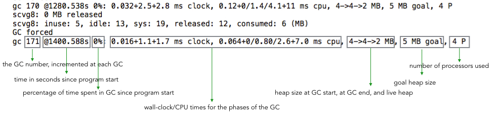

===tag=Golang
===description=golang性能分析实战
===pinned=true

# Golang性能分析实战

# 起因

<br/>

golang的分析工具包括

<br/>

runtim/pprof: 手动调用，一般在函数入口中

<br/>

net/http/pprof: 用于web系统中，不过只是对runtime/pprof的简单调用

<br/>

另外gin-contrib提供了对net/http/pprof的封装，能够在gin中使用，支持浏览器打开

<br/>

web系统使用流程就是，在web界面或者浏览器，选择监控的类型，这个时候再启动接口调用，pprof就能够进行当前的状态分析，一般是每10ms检查cpu寄存器等相关信息然后生成检查数据，最后通过图表工具查看

<br/>

但是在我进行接口检查的时候，发现profile所显示的时间明显小于接口调用的时间，后来分析发现profile中，只能够分析cpu的耗时，无法计算io情况(因为io不会占用cpu)，然而我分析的接口就是会调用外部的接口，导致最后计算的耗时时间不准确

<br/>

最后通过手动time.Since(start)的方式定位到了耗时最久的接口，并采取缓存策略优化了这部分代码

<br/>

## pprof监控内容

<br/>

|allocs|内存分配情况的采样信息|
|--|--|
|blocks|阻塞操作情况的采样信息|
|cmdline|程序启动命令参数|
|goroutine|所有协程的堆栈信息|
|heap|堆上的内存分配情况|
|mutex|锁竞争情况的采样信息|
|profile|cpu占用情况的采样信息|
|threadcreate|系统线程创建情况的采样信息|
|trace|程序运行跟踪信息|

<br/>

# 排查CPU占用过高

top命令确认

`go tool pprof http://localhost:6060/debug/pprof/profile`

进入交互使用top查看CPU占用较高的调用

top

使用list 名字 查看调用的具体位置

list Eat

如果安装了graphviz工具，使用web命令之后能够在web界面上看到调用链路图

brew install graphviz


修复问题代码继续后面的操作

# 排查内存占用过高

修复代码中的死循环，再次使用top会发现CPU占用率下来了

`go tool pprof http://localhost:6060/debug/pprof/heap`

再次使用top、list定位到问题代码

```bash
Total: 1.50GB
ROUTINE ======================== github.com/wolfogre/go-pprof-practice/animal/muridae/mouse.(*Mouse).Steal in /Users/dengronghui/Documents/Apps/public/handbook/Golang/go-pprof-practice-master/animal/muridae/mouse/mouse.go
    1.50GB     1.50GB (flat, cum) 99.90% of Total
         .          .     45:
         .          .     46:func (m *Mouse) Steal() {
         .          .     47:	log.Println(m.Name(), "steal")
         .          .     48:	max := constant.Gi
         .          .     49:	for len(m.buffer)*constant.Mi < max {
    1.50GB     1.50GB     50:		m.buffer = append(m.buffer, [constant.Mi]byte{})
         .          .     51:	}
         .          .     52:}
```

同样可以使用web可视化展示

## 排查频繁内存回收

获取程序运行时的GC日志

```bash
gc 1 @0.003s 7%: 0.022+2.1+0.002 ms clock, 0.18+1.1/1.9/3.0+0.019 ms cpu, 4->4->3 MB, 5 MB goal, 8 P
gc 2 @0.018s 3%: 0.009+1.8+0.001 ms clock, 0.073+0.096/2.2/0.16+0.013 ms cpu, 7->7->6 MB, 8 MB goal, 8 P
gc 3 @0.089s 0%: 0.022+0.92+0.013 ms clock, 0.17+0.095/1.0/0.75+0.10 ms cpu, 16->16->14 MB, 17 MB goal, 8 P
gc 4 @0.489s 0%: 0.023+1.5+0.014 ms clock, 0.18+0/2.4/1.1+0.11 ms cpu, 29->29->15 MB, 30 MB goal, 8 P
gc 1 @0.003s 1%: 0.013+0.55+0.002 ms clock, 0.013+0.22/0.17/0+0.002 ms cpu, 16->16->0 MB, 17 MB goal, 1 P
gc 2 @3.020s 0%: 0.070+0.56+0.002 ms clock, 0.070+0.17/0.20/0+0.002 ms cpu, 16->16->0 MB, 17 MB goal, 1 P
gc 3 @6.027s 0%: 0.15+0.98+0.003 ms clock, 0.15+0.36/0.36/0+0.003 ms cpu, 16->16->0 MB, 17 MB goal, 1 P
gc 4 @9.034s 0%: 0.10+0.63+0.002 ms clock, 0.10+0.16/0.23/0+0.002 ms cpu, 16->16->0 MB, 17 MB goal, 1 P
gc 5 @12.040s 0%: 0.070+0.53+0.002 ms clock, 0.070+0.23/0.19/0+0.002 ms cpu, 16->16->0 MB, 17 MB goal, 1 P
gc 6 @15.047s 0%: 0.11+0.66+0.002 ms clock, 0.11+0.23/0.27/0+0.002 ms cpu, 16->16->0 MB, 17 MB goal, 1 P
```



每次gc都从16MB释放到0MB，说明程序在不断的声明然后释放内存

接下来使用 pprof 排查时，我们在乎的不是什么地方在占用大量内存，而是什么地方在不停地申请内

`go tool pprof http://localhost:6060/debug/pprof/allocs`

## 排查协程泄漏

`go tool pprof http://localhost:6060/debug/pprof/goroutine`

同样使用top、list、web即可定位到

## 排查锁的争用

`go tool pprof http://localhost:6060/debug/pprof/mutex`

# Jaeger

<br/>

发现pprof并不能记录整个调度链路的运行情况，尝试寻找现有的解决方法，发现了链路追踪的工具，核心原理就是部署单独的链路收集程序，在各个调用的执行前执行后的指标传给jaeger，这样这个工具就能够构建出整个的调用链条。特别的，在grpc等接口调用时，只需要几行代码就能完成接入。

<br/>

但是，这种额外的收集组件对于单体的小型应用并不友好。因此尝试实现一个通用的单体应用内的调用链记录，目标就是接入方便，记录无感(另外，tracingid也要无感)，这样才能方便接入

<br/>

# LocalTracing

<br/>

暂时取这个名字 local - tracing，单体应用的tracing记录，完成调用链的整个过程。

<br/>

借鉴flask中的context模式，不过golang中得用协程id作为localcontext(因为不同的协程可能会绑定到相同的线程中)。在使用记录函数的时候使用代理模式拿取当前的context，并对调用函数进行时间耗时记录。

<br/>

另外，在提供一个http界面，展示整个的调用链条以及耗时