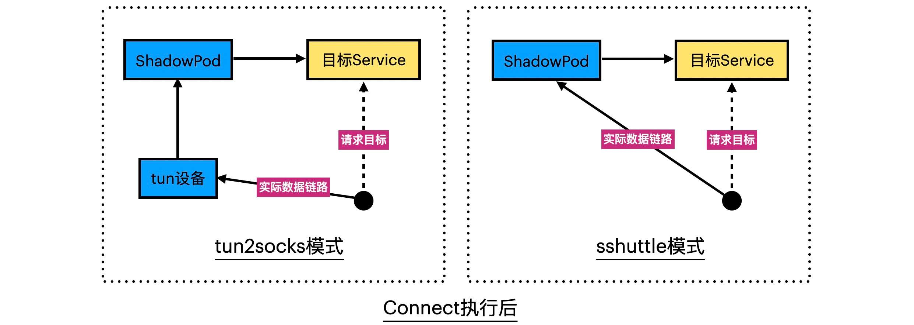

===tag=云原生
===description=k8s环境中本地开发工具

# ktconnect

使得本地能够直接访问集群内的环境，而不需要手动去集群中配置各个服务的服务类型暴露端口

 

首先需要从集群中下载kubeconfig配置文件，ktconnect通过--kubecofig指定配置文件来管理集群

 

主要的命令包括

 

1. connect：使本地能够直接访问集群
2. exchange: 使用本地服务替换集群中的Service实例
3. mesh: 将指定服务的部分流量重定向到本地
4. preview: 将本地服务添加到Kubernetes集群
5. recover: 立即恢复指定服务被exchange或mesh命令重定向的流量
6. clean: 清理集群里已超期的KT代理容器

 

## connect

 

让本地能够直接访问集群

 

`sudo ktctl --kubeconfig [kubeconfig] connect --dnsMode localDNS`

 

mode工作模式有两种(除非由于特定原因无法使用默认的tun2socks模式或需要排除某些IP段的路由，否则不建议修改此参数。)

1. Tun2Socks: 在使用时会
   1. 在集群中创建shadowpod:，提供SSH和DNS服务,利用portforward将ssh端口映射出去
   2. 在本地创建socks5代理服务(代理到shadowpod的)，监听本地2223端口(可通过--proxyPort修改)
   3. 在本地创建tun设备虚拟网卡，将发送到该设备的流量通过代理发送到shadowpod
   4. 配置本地路由表修改本地dns配置，属于集群的ip段的都会发送到虚拟设备中，然后ktconnect提供的临时DNS服务可以用来解析
2. Sshuttle：这个不会创建本地tun和socks5代理服务（不依赖于虚拟网卡以及代理协议，想要实现路由的解析以及流量的控制，由于没有tun设备可作为路由表目标，Sshuttle模式利用iptables/ipfwadm/nftables工具（Linux系统）或pfctl工具（MacOS系统）来实现让目的地址是集群资源IP的请求发往代理服务。所以暂不支持windows），而是利用一个Sshuttle脚本直接将本地请求通过SSH协议发送给运行在Shadow Pod上的接收脚本，通过后者代理访问集群里的服务。

 

dnsMode有三种：

1. localDNS模式将在本地启动一个临时的域名解析服务，它既能解析集群的服务域名，也能解析本地环境的其他内/外网域名； 
2. podDNS模式仅能解析集群的服务域名， 
3. hosts模式用于限定本地只允许访问指定Namespace的服务域名，可通过hosts:<namespaces>格式指定可访问的Namespace列表，逗号分隔，如--dnsMode hosts:default,dev,test，默认只能访问Shadow Pod所在Namespace的服务。