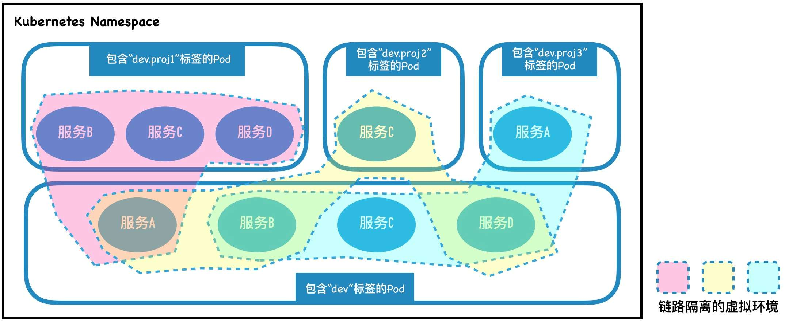

===tag=云原生
===description=k8s环境中本地开发工具

# ktenv

<br/>

ktenv，基于ServiceMesh的微服务环境复用工具,通过识别Pod上的虚拟环境标签，KtEnv能够自动将测试环境网络动态隔离成多个虚拟隔离域，同时以简单规则在隔离域间局部复用Pod实例，从而达到只需很少资源成本即可创建大量不同微服务版本组合的独立测试环境的目的。

<br/>

路由规则: 如果请求是来自一个带有环境标签的服务实例，它会优先寻找跟它具有相同环境标签的实例，如果没有，则会寻找它上一级的环境标签，直至到达顶级的默认服务实例。

<br/>

在使用的时候如果需要将某个服务暴露给其他某个人"联调"，只需要加上相应的标签即可

<br/>



## 部署

<br/>

依赖于istio(这里不展开)

<br/>

**Operator CRD和Admission Webhook**

<br/>

从 发布页面 下载最新的部署文件包，并解压。

<br/>

将目录中的CRD和Webhook组件添加到Kubernetes（其中Webhook组件携带了默认的自签名秘钥，可参考Webhook配置文档替换）。

<br/>

```
wget https://github.com/alibaba/virtual-environment/releases/download/v0.6.0/kt-virtual-environment-v0.6.0.zip
unzip kt-virtual-environment-v0.6.0.zip
cd v0.6.0/
kubectl apply -f global/ktenv_crd.yaml
kubectl apply -f global/ktenv_webhook.yaml
```

<br/>

**operator**

Operator是由CRD组件定义的虚拟环境管理器实例，需要在每个使用虚拟环境的Namespace里单独部署。同时为了让Webhook组件对目标Namespace起作用，还应该为其添加值为enabled的environment-tag-injection标签。

以使用default Namespace为例，通过以下命令完成部署。

```
kubectl apply -n default -f ktenv_operator.yaml
kubectl label namespace default environment-tag-injection=enabled
// 如果集群开启了RBAC，还需要部署相应的Role和ServiceAccount。
kubectl apply -n default -f ktenv_service_account.yaml
```

## 使用

<br/>

参考: 

- https://alibaba.github.io/virtual-environment/#/zh-cn/doc/typical-scenario
- https://alibaba.github.io/virtual-environment/#/zh-cn/doc/quickstart

<br/>

### 配置虚拟环境

<br/>

虚拟环境实例通过VirtualEnvironment类型的Kubernetes资源定义。其内容结构示例如下：

```yaml
apiVersion: env.alibaba.com/v1alpha2
kind: VirtualEnvironment
metadata:
  name: example-virtualenv
spec:
  envHeader:
    name: X-Virtual-Env // 用于透传虚拟环境名的HTTP头名称（虽然有默认值，建议显性设置）
    autoInject: true // 是否为没有虚拟环境HTTP头记录的请求自动注入HTTP头（建议开启）
    aliases: // 添加额外的备选透传HTTP头（通常不需要此配置）
      - name: ALTERNATIVE-NAME // 透传虚拟环境名的HTTP头名称
        pattern: ".*;VirtualEnv=(@);.*" // 使用正则表达式匹配HTTP头内容的环境名称，若为空则表示使用完整匹配
        placeholder: "(@)" // 正则表达式中的环境名占位符
  envLabel:
    name: virtual-env // pod上标记虚拟环境名用的标签名称（除非确实必要，建议保留默认值）
    splitter: . // 虚拟环境名中用于划分环境默认路由层级的字符（只能是单个字符）
    defaultSubset: dev // 请求未匹配到任何存在的虚拟环境时，进行兜底虚拟环境名（默认为随机路由）
```

<br/>

### 配置webhook

<br/>

全局的Admission Webhook组件，他的主要作用是将Pod上的"环境标签"信息通过环境变量注入到Sidecar容器里，便于Sidecar为出口流量的Header添加恰当的环境标签。倘若集群中无需使用流量自动染色功能（即创建VirtualEnvironment资源时，envHeader.autoInject值始终为false），则可以无需部署此组件。

<br/>

修改配置（可以直接修改ktenv_webhook.yaml文件并通过kubectl apply使之生效；或直接通过kubectl edit命令修改kt-virtual-environmentNamespace中名为webhook-server的Deployment对象完成配置的修改。）

<br/>

- envLabel: 需要与集群中存在的VirtualEnvironment资源的envLabel.name值匹配。倘若集群中含有多种不同envLabel.name取值的VirtualEnvironment资源，则应该将这些值全部列出来，用逗号“,”分隔。
- logLevel: 影响Webhook输出日志的密集程度，可选值error, info(默认值)，debug