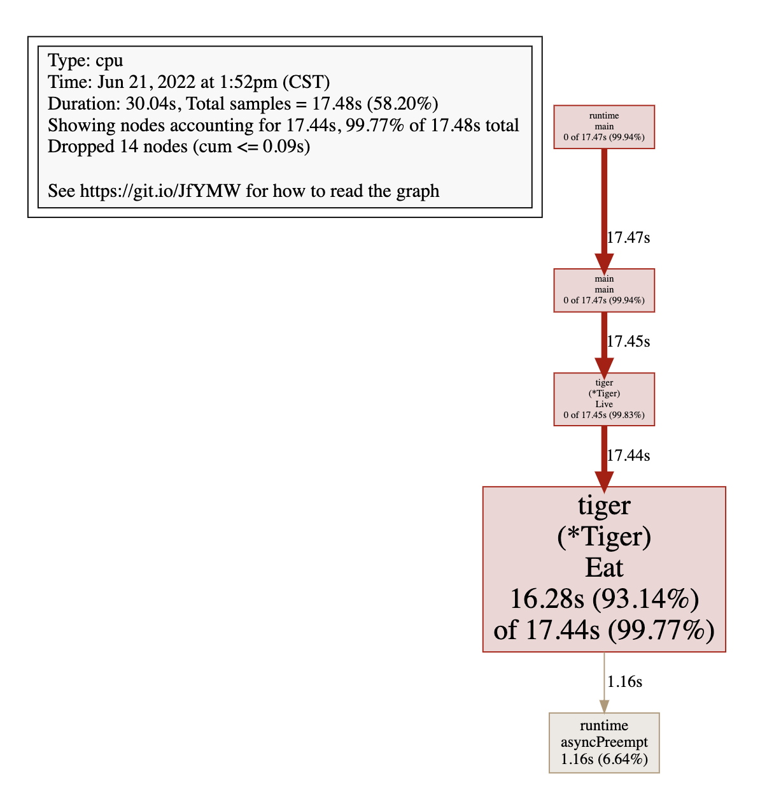

===tag=编程语言
===description=golang工程化所用到的工具概览
===pinned=false
===create=2022-07-03

# fmt

代码风格格式化 gofmt、go fmt标准工具

# vet

捕捉可能出现的错误 标准工具 一般来说编辑器例如vscode都已经集成了这些功能，所以不需要单独检测

`go vet -all`

vet一般是检查

```go
package main 
import "fmt" 

// Prints out "Super Mario 3" 
func main() { 
	game_version :=3 
	fmt.Printf("Super Mario %s\n",game_version) 
	// ./main.go:6:2: Printf format %s has arg 3 of wrong type int
}
```

# lint

代码静态检查

golint、golangci-lint

## golangci-lint

> 参考: https://golangci-lint.run/usage/configuration/

`golangci-lint run`

`.golangci.yaml`配置lint选项

### 配置项

run

```yaml
run:
  concurrency: 4
  timeout: 5m
  issues-exit-code: 2
  tests: false
  build-tags:
    - mytag
  skip-dirs:
    - src/external_libs
    - autogenerated_by_my_lib
  skip-dirs-use-default: false
  skip-files:
    - ".*\\.my\\.go$"
    - lib/bad.go
  modules-download-mode: readonly # readonly|vendor|mod
  allow-parallel-runners: false # If false (default) - golangci-lint acquires file lock on start.
  go: '1.18'
```

output

```yaml
output:
  format: json # colored-line-number|line-number|json|tab|checkstyle|code-climate|junit-xml|github-actions
  print-issued-lines: false
  print-linter-name: false
  uniq-by-line: false
  path-prefix: ""
  sort-results: false
```

linters

```yaml
linters:
  disable-all: true # Default: false
  # Enable specific linter
  # https://golangci-lint.run/usage/linters/#enabled-by-default
  enable:
    - asasalint
    - asciicheck
    - bidichk
    - bodyclose
    - containedctx
    - contextcheck
    - cyclop
    - deadcode
    - decorder
    - depguard
    - dogsled
    - dupl
    - dupword
    - durationcheck
    - errcheck
    - errchkjson
    - errname
    - errorlint
    - execinquery
    - exhaustive
    - exhaustivestruct
    - exhaustruct
    - exportloopref
    - forbidigo
    - forcetypeassert
    - funlen
    - gci
    - gochecknoglobals
    - gochecknoinits
    - gocognit
    - goconst
    - gocritic
    - gocyclo
    - godot
    - godox
    - goerr113
    - gofmt
    - gofumpt
    - goheader
    - goimports
    - golint
    - gomnd
    - gomoddirectives
    - gomodguard
    - goprintffuncname
    - gosec
    - gosimple
    - govet
    - grouper
    - ifshort
    - importas
    - ineffassign
    - interfacebloat
    - interfacer
    - ireturn
    - lll
    - loggercheck
    - maintidx
    - makezero
    - maligned
    - misspell
    - nakedret
    - nestif
    - nilerr
    - nilnil
    - nlreturn
    - noctx
    - nolintlint
    - nonamedreturns
    - nosnakecase
    - nosprintfhostport
    - paralleltest
    - prealloc
    - predeclared
    - promlinter
    - reassign
    - revive
    - rowserrcheck
    - scopelint
    - sqlclosecheck
    - staticcheck
    - structcheck
    - stylecheck
    - tagliatelle
    - tenv
    - testableexamples
    - testpackage
    - thelper
    - tparallel
    - typecheck
    - unconvert
    - unparam
    - unused
    - usestdlibvars
    - varcheck
    - varnamelen
    - wastedassign
    - whitespace
    - wrapcheck
    - wsl
  enable-all: true  # Default: false
  disable:
    - # 同enable项一样
  # Enable presets.
  # https://golangci-lint.run/usage/linters
  presets:
    - bugs
    - comment
    - complexity
    - error
    - format
    - import
    - metalinter
    - module
    - performance
    - sql
    - style
    - test
    - unused
  # Run only fast linters from enabled linters set (first run won't be fast)
  # Default: false
  fast: true
```

issues

```yaml
issues:
  exclude:
    - abcdef
  # Excluding configuration per-path, per-linter, per-text and per-source
  exclude-rules:
    # Exclude some linters from running on tests files.
    - path: _test\.go
      linters:
        - gocyclo
        - errcheck
        - dupl
        - gosec
    # Exclude known linters from partially hard-vendored code,
    # which is impossible to exclude via `nolint` comments.
    # `/` will be replaced by current OS file path separator to properly work on Windows.
    - path: internal/hmac/
      text: "weak cryptographic primitive"
      linters:
        - gosec
    # Exclude some `staticcheck` messages.
    - linters:
        - staticcheck
      text: "SA9003:"
    # Exclude `lll` issues for long lines with `go:generate`.
    - linters:
        - lll
      source: "^//go:generate "
  exclude-use-default: false
  exclude-case-sensitive: false
  # The list of ids of default excludes to include or disable.
  # https://golangci-lint.run/usage/false-positives/#default-exclusions
  # Default: []
  include:
    - EXC0001
    - EXC0002
    - EXC0003
    - EXC0004
    - EXC0005
    - EXC0006
    - EXC0007
    - EXC0008
    - EXC0009
    - EXC0010
    - EXC0011
    - EXC0012
    - EXC0013
    - EXC0014
    - EXC0015
  # Maximum issues count per one linter.
  # Set to 0 to disable.
  # Default: 50
  max-issues-per-linter: 0
  # Maximum count of issues with the same text.
  # Set to 0 to disable.
  # Default: 3
  max-same-issues: 0
  # Show only new issues: if there are unstaged changes or untracked files,
  # only those changes are analyzed, else only changes in HEAD~ are analyzed.
  # It's a super-useful option for integration of golangci-lint into existing large codebase.
  # It's not practical to fix all existing issues at the moment of integration:
  # much better don't allow issues in new code.
  #
  # Default: false.
  new: true
  # Show only new issues created after git revision `REV`.
  new-from-rev: HEAD
  # Show only new issues created in git patch with set file path.
  new-from-patch: path/to/patch/file
  # Fix found issues (if it's supported by the linter).
  fix: true
```

severity

```yaml
severity:
  default-severity: error
  case-sensitive: true
  rules:
    - linters:
        - dupl
      severity: info
```

# 单元测试

在单元测试领域，关于如何替换掉外部依赖，主要有两种技术，分别是 mock 和 stub：mock 通过接口可以动态调整外部依赖的返回值，而 stub 只能在运行时静态调整外部依赖的返回值

> 使用这些都是就是为了替换外部依赖时候使用的，只是为了单元测试覆盖率变高一点😹

```bash
github.com/stretchr/testify/assert

github.com/smartystreets/goconvey/convey

github.com/golang/mock/gomock
```

`go install github.com/golang/mock/mockgen@latest`

## gotest

官方内置的工具

- 性能测试

`go test -bench`

定义Bench开头的测试函数

- 覆盖率

`go test -cover`

- 竞态检查

`go test -race`用于检查代码中是否存在并发安全问题


## testify

- assert
- require(与assert一样，不过异常会退出)
- mock

> 在要编写一个从一个站点拉取用户列表信息的程序，拉取完成之后程序显示和分析。如果每次都去访问网络会带来极大的不确定性，甚至每次返回不同的列表，这就给测试带来了极大的困难。我们可以使用 Mock 技术。

但是问题在于如果直接使用新的接口进行了替换，那么会导致有些代码分支进入不到，覆盖率降低

- suite

## gomock
`go mock`

```bash
go get -u github.com/golang/mock/gomock go get -u github.com/golang/mock/mockgen
```

要使用gomock的一个前提是模块之间务必通过接口进行依赖，而不是依赖具体实现，否则mock会非常困难。这个工具目前业界用的并不多，主要是局限性太大

在实际项目中，当需要进行单元测试时，往往会有很多的依赖项，有些依赖可能还没有办法直接进行创建，例如数据库连接，文件 I/O 等。此时通过使用 go mock 可以模拟依赖项，简化测试。

**桩**，或称桩代码，是指用来代替关联代码或者未实现代码的代码。如果函数 B 用 B1 来代替，那么，B 称为原函数，B1 称为桩函数。打桩就是编写或生成桩代码。

## gostub

`go get github.com/prashantv/gostub`

- 为一个全局变量打桩
- 为一个函数打桩
- 为一个过程打桩
- 由任意相同或不同的基本场景组合而成

```go
func TestStubMethod(t *testing.T) {
	var printStr = func(val string) string {
		return val
	}

	// 针对有参数有返回值的
	stubs := gostub.Stub(&printStr, func(val string) string {
		return "hello," + val
	})
	defer stubs.Reset()
	fmt.Println("After stub: ", printStr("hhhhh"))

	var printStr2 = func(val string) string {
		return val
	}
	// StubFunc 第一个参数必须是一个函数变量的指针，该指针指向的必须是一个函数变量，第二个参数为函数 mock 的返回值
	stubs2 := gostub.StubFunc(&printStr2, "ddddd,万生世代")
	defer stubs2.Reset()
	fmt.Println("After stub:", printStr2("lalala"))
}

```

## gomonkey

`github.com/agiledragon/gomonkey/v2`

1、它违反了开闭原则。
2、运行时必须关闭内连「go test -gcflags=all=-l」。
3、运行时需要很高的权限，并且不同的硬件需要不同的黑科技实现

1. 直接在方法级别上进行 mock  
（在运行时通过汇编语句重写可执行文件，将待打桩函数或方法的实现跳转到桩实现）  
在编译阶段直接替换掉真的函数代码部分  
2. 非线程安全，请勿用于并发测试

并且必须加上`"-gcflags=all=-l"`, 避免内联优化(短函数直接被合并不会单独作为一个函数)导致测试失败

```go
func DoSomething(name string, args ...string) (string, error) {
	return "", errors.New("TODO")
}

func TestExec(t *testing.T) {
	patches := gomonkey.NewPatches()
	defer patches.Reset()
	outputExpect := "xxx-vethName100-yyy"
	guard := patches.ApplyFunc(DoSomething, func(_ string, _ ...string) (string, error) {
		return outputExpect, nil
	})
	defer guard.Reset()
	output, err := DoSomething("asd", "1", "2", "3")
	assert.Nil(t, err)
	assert.Equal(t, outputExpect, output)
}
```
## http测试

在 web 项目中，大多接口是处理 http 请求（post、get 之类的），在测试环境中，是访问不到它发起的 get 请求的 url 的，此时就可以模拟 http 请求来写测试。可以利用官方自带的 http 包来进行模拟请求。

## sql测试

模拟任何实现了 sql/driver 接口的 db 驱动，无需关注 db 连接。

# 性能调优

使用go内置的工具pprof即可分析程序运行状态的整体情况

|allocs|内存分配情况的采样信息|
|--|--|
|blocks|阻塞操作情况的采样信息|
|cmdline|程序启动命令参数|
|goroutine|所有协程的堆栈信息|
|heap|堆上的内存分配情况|
|mutex|锁竞争情况的采样信息|
|profile|cpu占用情况的采样信息|
|threadcreate|系统线程创建情况的采样信息|
|trace|程序运行跟踪信息|

- runtim/pprof: 手动调用，一般在函数入口中
- net/http/pprof: 用于web系统中，不过只是对runtime/pprof的简单封装
- gin-contrib提供了对net/http/pprof的封装，能够在gin中使用

> 需要注意的是，profile所显示的时间明显小于接口调用的时间，是因为profile只能够分析cpu的耗时，无法计算io情况(因为io不会占用cpu)

```bash
# 下载cpu profile，默认从当前开始收集30s的cpu使用情况，需要等待30s
go tool pprof http://localhost:6060/debug/pprof/profile   # 30-second CPU profile
go tool pprof http://localhost:6060/debug/pprof/profile?seconds=120     # wait 120s

# 下载heap profile
go tool pprof http://localhost:6060/debug/pprof/heap      # heap profile

# 下载goroutine profile
go tool pprof http://localhost:6060/debug/pprof/goroutine # goroutine profile

# 下载block profile
go tool pprof http://localhost:6060/debug/pprof/block     # goroutine blocking profile

# 下载mutex profile
go tool pprof http://localhost:6060/debug/pprof/mutex
```

## trace

trace工具，用于查看整个周期内发生的事件，指定的Goroutines何时执行、执行 了多长时间、什么时候陷入了堵塞、什么时候解除了堵塞、GC如何影 响单个Goroutine的执行、STW中断花费的时间是否太长等 。

- 协程的创建、开始和结束
- 协程的堵塞-系统调用、通道、锁
- 网络I/O相关事件
- 系统调用事件
- 垃圾回收相关事件

```go
import "runtime/trace"

trace.Start(f)

defer trace.Stop()

// or use net/pprof
// curl -o trace.out http.../debug/pprof/trace?second=20

// 然后使用go tool trace trace.out进行分析
```

在trace的初始阶段需要首先STW，然后获取协程的快照、状态、栈帧信息，然后开启GC重新启动所有协程。go源码中对于关键事件都加了判断是否开启了trace，开启后，触发这些事件时都会写入。

关键的事件包括协程的生命周期、协程堵塞、网络I/O、系统 调用、垃圾回收等，根据事件的不同，可能保存和此事件相关的不同 数量的参数及栈追踪数据。每个逻辑处理器P都有一个缓存 (p.tracebuf)，用于存储已经被序列化为字节的事件(Event) 。每个p的tracebuf都有限度，超过之后会转移到全局链表。

trace工具会新开一个协程专门用于读取全局trace上的信息， 此时全局的事件对象已经是序列化之后的字节数组，直接添加到文件 中即可。另外，访问全局trace缓存需要加锁，当没有可以访问的对象 时，读取协程会陷入休眠状态 。

当指定的事件到期后结束trace任务程序再次进入STW，刷新逻辑处理器P上的tracebuf缓存


## pyroscope

基于pprof数据的可视化工具，提供上报和拉取两种模式

支持多种语言

可以将各个服务的运行数据集中起来，更利于管理

不过只能获取到当前时间点的内存分配情况、当前使用的内存情况，以及CPU耗时等

~另外，除了无法对协程数、mutex等进行分析~, 又错怪了😹，pyroscope支持的分析维度包括(cpu、inuse_objects、alloc_objects、inuse_space，alloc_space, goroutines、mutex_duration、block_count、block_duration，这里面除了pprof，应该还用了trace包里面的数据)

~绘制的时间曲线没有具体的数值，也无法查看具体时间点下的数据情况~(错怪了，时间区间选择可以用鼠标滑动选择，无法点击某个特定的柱形结构)


## 排查CPU占用过高

top命令确认

`go tool pprof http://localhost:6060/debug/pprof/profile`

进入交互使用top查看CPU占用较高的调用

top

使用list 名字 查看调用的具体位置

list Eat

如果安装了graphviz工具，使用web命令之后能够在web界面上看到调用链路图

brew install graphviz



修复问题代码继续后面的操作

## 排查内存占用过高

修复代码中的死循环，再次使用top会发现CPU占用率下来了

`go tool pprof http://localhost:6060/debug/pprof/heap`

再次使用top、list定位到问题代码

```bash
Total: 1.50GB
ROUTINE ======================== github.com/wolfogre/go-pprof-practice/animal/muridae/mouse.(*Mouse).Steal in /Users/dengronghui/Documents/Apps/public/handbook/Golang/go-pprof-practice-master/animal/muridae/mouse/mouse.go
    1.50GB     1.50GB (flat, cum) 99.90% of Total
         .          .     45:
         .          .     46:func (m *Mouse) Steal() {
         .          .     47:	log.Println(m.Name(), "steal")
         .          .     48:	max := constant.Gi
         .          .     49:	for len(m.buffer)*constant.Mi < max {
    1.50GB     1.50GB     50:		m.buffer = append(m.buffer, [constant.Mi]byte{})
         .          .     51:	}
         .          .     52:}
```

同样可以使用web可视化展示

## 排查频繁内存回收

获取程序运行时的GC日志

```bash
gc 1 @0.003s 7%: 0.022+2.1+0.002 ms clock, 0.18+1.1/1.9/3.0+0.019 ms cpu, 4->4->3 MB, 5 MB goal, 8 P
gc 2 @0.018s 3%: 0.009+1.8+0.001 ms clock, 0.073+0.096/2.2/0.16+0.013 ms cpu, 7->7->6 MB, 8 MB goal, 8 P
gc 3 @0.089s 0%: 0.022+0.92+0.013 ms clock, 0.17+0.095/1.0/0.75+0.10 ms cpu, 16->16->14 MB, 17 MB goal, 8 P
gc 4 @0.489s 0%: 0.023+1.5+0.014 ms clock, 0.18+0/2.4/1.1+0.11 ms cpu, 29->29->15 MB, 30 MB goal, 8 P
gc 1 @0.003s 1%: 0.013+0.55+0.002 ms clock, 0.013+0.22/0.17/0+0.002 ms cpu, 16->16->0 MB, 17 MB goal, 1 P
gc 2 @3.020s 0%: 0.070+0.56+0.002 ms clock, 0.070+0.17/0.20/0+0.002 ms cpu, 16->16->0 MB, 17 MB goal, 1 P
gc 3 @6.027s 0%: 0.15+0.98+0.003 ms clock, 0.15+0.36/0.36/0+0.003 ms cpu, 16->16->0 MB, 17 MB goal, 1 P
gc 4 @9.034s 0%: 0.10+0.63+0.002 ms clock, 0.10+0.16/0.23/0+0.002 ms cpu, 16->16->0 MB, 17 MB goal, 1 P
gc 5 @12.040s 0%: 0.070+0.53+0.002 ms clock, 0.070+0.23/0.19/0+0.002 ms cpu, 16->16->0 MB, 17 MB goal, 1 P
gc 6 @15.047s 0%: 0.11+0.66+0.002 ms clock, 0.11+0.23/0.27/0+0.002 ms cpu, 16->16->0 MB, 17 MB goal, 1 P
```


每次gc都从16MB释放到0MB，说明程序在不断的声明然后释放内存

接下来使用 pprof 排查时，我们在乎的不是什么地方在占用大量内存，而是什么地方在不停地申请内

`go tool pprof http://localhost:6060/debug/pprof/allocs`

## 排查协程泄漏

`go tool pprof http://localhost:6060/debug/pprof/goroutine`

同样使用top、list、web即可定位到

## 排查锁的争用

`go tool pprof http://localhost:6060/debug/pprof/mutex`
