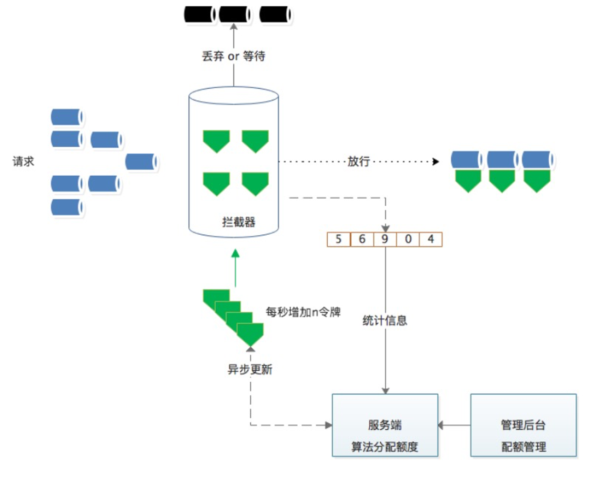

===tag=架构
===description=微服务系统设计的要点
===pinned=false
===create=2022-09-06

# 可用性设计

微服务架构采用粗粒度的进程间通信，引入了额外的复杂性和需要处理的新问题，如网络延迟、消息格式、负载均衡和容错，任何一个问题都不可忽略

> 在通信上，发送要保守，接收要宽容

## 隔离

对资源进行分割，避免故障传播

- 服务隔离: 动静分离、读写分离
- 轻重隔离: 核心、快慢、热点
- 物理隔离: 线程、进程、集群、机房

## 超时控制

尽可能让服务不堆积请求

服务提供者定义好 latency SLO，更新到 gRPC Proto 定义中，服务后续迭代，都应保证 SLO。

kit 基础库兜底默认超时，比如 100ms，进行配置防御保护，避免出现类似 60s 之类的超大超时策略。

配置中心公共模版，对于未配置的服务使用公共配置。

超时传递: 当上游服务已经超时返回 504，但下游服务仍然在执行，会导致浪费资源做无用功。超时传递指的是把当前服务的剩余 Quota 传递到下游服务中，继承超时策略，控制请求级别的全局超时控制。

## 负载保护

计算系统临近过载时的峰值吞吐作为限流的阈值来进行流量控制，达到系统保护。

## 限流

令牌桶、漏桶 针对单个节点，无法分布式限流

分布式限流

## 降级

通过降级回复来减少工作量，或者丢弃不重要的请求。而且需要了解哪些流量可以降级，并且有能力区分不同的请求。

1、哪些指标作为评估降级的决定性指标

2、当服务进入降级模式时，需要执行什么动作

## 重试

当请求返回错误（例: 配额不足、超时、内部错误等），对于 backend 部分节点过载的情况下，倾向于立刻重试，但是需要留意重试带来的流量放大:

只应该在失败的这层进行重试，当重试仍然失败，全局约定错误码“过载，无须重试”，避免级联重试。

## 负载均衡

均衡的流量分发。

可靠的识别异常节点。

scale-out，增加同质节点扩容。

减少错误，提高可用性。

# 微服务基础设施

## 日志

## 链路追踪

- 无处不在的部署
- 持续的监控
- 低消耗
- 应用级的透明
- 延展性
- 低延迟

为每个请求都生成一个全局唯一的 traceid，端到端透传到上下游所有节点，每一层生成一个 spanid，通过traceid 将不同系统孤立的调用日志和异常信息串联一起，通过 spanid 和 level 表达节点的父子关系。

## 监控

涉及到 net、cache、db、rpc 等资源类型的基础库，首先监控维度4个黄金指标：
- 延迟（耗时，需要区分正常还是异常）
- 流量（需要覆盖来源，即：caller）
- 错误（覆盖错误码或者 HTTP Status Code）
- 饱和度（服务容量有多“满”）

系统层面：
- CPU，Memory，IO，Network，TCP/IP 状态等，FD（等其他），Kernel：Context Switch
- Runtime：各类 GC、Mem 内部状态等
