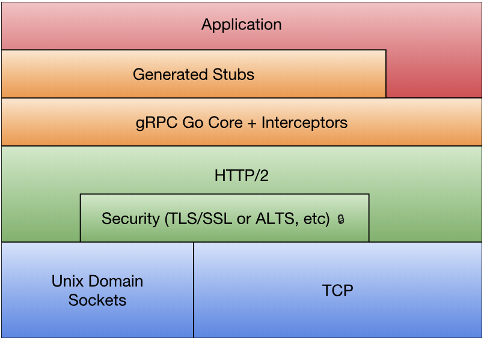

===tag=架构
===description=grpc介绍以及使用
===pinned=false

# 集群角色

gRPC 是建立在 HTTP/2 版本之上，如果 HTTP 不是 HTTP/2 协议则必然无法提供 gRPC 支持。同时，每个 gRPC 调用请求的 Content-Type 类型会被标注为 "application/grpc" 类型。

gRPC 服务一般用于集群内部通信，如果需要对外暴露服务一般会提供等价的 REST 接口。通过 REST 接口比较方便前端 JavaScript 和后端交互。开源社区中的 grpc-gateway 项目就实现了将 gRPC 服务转为 REST 服务的能力。

```bash
go install github.com/grpc-ecosystem/grpc-gateway/protoc-gen-grpc-gateway@latest

protoc -I/usr/local/include -I. \
    -I$GOPATH/src \
    -I$GOPATH/src/github.com/grpc-ecosystem/grpc-gateway/third_party/googleapis \
    --grpc-gateway_out=. --go_out=plugins=grpc:.\
    hello.proto
```

通过在 Protobuf 文件中添加路由相关的元信息，通过自定义的代码插件生成路由相关的处理代码，最终将 REST 请求转给更后端的 gRPC 服务处理。

```proto
syntax = "proto3";

package main;

import "google/api/annotations.proto";

message StringMessage {
  string value = 1;
}

service RestService {
	rpc Get(StringMessage) returns (StringMessage) {
		option (google.api.http) = {
			get: "/get/{value}"
		};
	}
	rpc Post(StringMessage) returns (StringMessage) {
		option (google.api.http) = {
			post: "/post"
			body: "*"
		};
	}
}
```

生成好代码后使用如下

```go
func main() {
    ctx := context.Background()
    ctx, cancel := context.WithCancel(ctx)
    defer cancel()

    mux := runtime.NewServeMux()

    err := RegisterRestServiceHandlerFromEndpoint(
        ctx, mux, "localhost:5000",
        []grpc.DialOption{grpc.WithInsecure()},
    )
    if err != nil {
        log.Fatal(err)
    }

    http.ListenAndServe(":8080", mux)
}
```

另外，最新的 Nginx 对 gRPC 提供了深度支持。可以通过 Nginx 将后端多个 gRPC 服务聚合到一个 Nginx 服务。同时 Nginx 也提供了为同一种 gRPC 服务注册多个后端的功能，这样可以轻松实现 gRPC 负载均衡的支持。

gRPC 构建在 HTTP/2 协议之上，因此我们可以将 gRPC 服务和普通的 Web 服务架设在同一个端口之上。

因为 gRPC 服务已经实现了 ServeHTTP 方法，可以直接作为 Web 路由处理对象。如果将 gRPC 和 Web 服务放在一起，会导致 gRPC 和 Web 路径的冲突，在处理时我们需要区分两类服务。

```go
func main() {
    ...

    http.ListenAndServeTLS(port, "server.crt", "server.key",
        http.HandlerFunc(func(w http.ResponseWriter, r *http.Request) {
            if r.ProtoMajor != 2 {
                mux.ServeHTTP(w, r)
                return
            }
            if strings.Contains(
                r.Header.Get("Content-Type"), "application/grpc",
            ) {
                grpcServer.ServeHTTP(w, r) // gRPC Server
                return
            }

            mux.ServeHTTP(w, r)
            return
        }),
    )
}
```

对于没有启动 TLS 协议的服务则需要对 HTTP/2 特性做适当的调整

```go
func main() {
    mux := http.NewServeMux()

    h2Handler := h2c.NewHandler(mux, &http2.Server{})
    server = &http.Server{Addr: ":3999", Handler: h2Handler}
    server.ListenAndServe()
}

// or
func main() {
    mux := http.NewServeMux()
    mux.HandleFunc("/", func(w http.ResponseWriter, req *http.Request) {
        fmt.Fprintln(w, "hello")
    })

    http.ListenAndServeTLS(port, "server.crt", "server.key",
        http.HandlerFunc(func(w http.ResponseWriter, r *http.Request) {
            mux.ServeHTTP(w, r)
            return
        }),
    )
}

// or 单独启用
func main() {
    creds, err := credentials.NewServerTLSFromFile("server.crt", "server.key")
    if err != nil {
        log.Fatal(err)
    }

    grpcServer := grpc.NewServer(grpc.Creds(creds))

    ...
}
```

# 核心功能

基于http2，因此提供了数据流功能、tls安全认证等

HTTP2 是一个全双工的流式协议, 服务端也可以主动 ping 客户端, 且服务端还会有一些检测连接可用性和控制客户端 ping 包频率的配置。gRPC 就是采用 HTTP2 来作为其基础通信模式的，所以默认的 gRPC 客户端都是长连接。

## 数据流



```proto
service HelloService {
	rpc Hello (String) returns (String);

	rpc Channel (stream String) returns (stream String);
}
```

`stream`就是开启消息流的关键字，生成代码的接口类型如下

```go
type name_ChannelServer interface {
    Send(*String) error
    Recv() (*String, error)
    grpc.ServerStream
}
```

用户使用时就是通过这两个方法来传输数据

由于数据流的特性，使得grpc可以用来实现发布订阅模式

## 证书

客户端在连接服务器中通过 grpc.WithInsecure() 选项跳过了对服务器证书的验证。没有启用证书的 gRPC 服务在和客户端进行的是明文通讯，信息面临被任何第三方监听的风险。为了保障 gRPC 通信不被第三方监听篡改或伪造，我们可以对服务器启动 TLS 加密特性。

自签证书, 生成`server.key`, `server.crt`, `client.key`, `client.crt`四个文件(crt结尾的是证书文件，其中存放着公钥，key结尾则是私钥文件)

```bash
$ openssl genrsa -out server.key 2048
$ openssl req -new -x509 -days 3650 \
    -subj "/C=GB/L=China/O=grpc-server/CN=server.grpc.io" \
    -key server.key -out server.crt

$ openssl genrsa -out client.key 2048
$ openssl req -new -x509 -days 3650 \
    -subj "/C=GB/L=China/O=grpc-client/CN=client.grpc.io" \
    -key client.key -out client.crt
```

```go
// 服务端
func main() {
    creds, err := credentials.NewServerTLSFromFile("server.crt", "server.key")
    if err != nil {
        log.Fatal(err)
    }

    server := grpc.NewServer(grpc.Creds(creds))
    ...
}

// 客户端
func main() {
    creds, err := credentials.NewClientTLSFromFile(
        "server.crt", "server.grpc.io",
    )
    if err != nil {
        log.Fatal(err)
    }

    conn, err := grpc.Dial("localhost:5000",
        grpc.WithTransportCredentials(creds),
    )
    if err != nil {
        log.Fatal(err)
    }
    defer conn.Close()

    ...
}
```

第一个参数是服务器的证书文件，第二个参数是签发证书的服务器的名字。然后通过 grpc.WithTransportCredentials(creds) 将证书对象转为参数选项传人 grpc.Dial 函数。这种方式，需要提前将服务器的证书告知客户端，这样客户端在连接服务器时才能进行对服务器证书认证。

为了避免传输过程中导致证书被篡改，需要使用安全可靠的根证书分别对服务器和客户端的证书进行签名。这样客户端或服务器在收到对方的证书后可以通过根证书进行验证证书的有效性(计算签名然后和根证书上的相互匹配)。

```bash
# 根证书生成
$ openssl genrsa -out ca.key 2048
$ openssl req -new -x509 -days 3650 \
    -subj "/C=GB/L=China/O=gobook/CN=github.com" \
    -key ca.key -out ca.crt

# 服务端证书进行签名
$ openssl req -new \
    -subj "/C=GB/L=China/O=server/CN=server.io" \
    -key server.key \
    -out server.csr
$ openssl x509 -req -sha256 \
    -CA ca.crt -CAkey ca.key -CAcreateserial -days 3650 \
    -in server.csr \
    -out server.crt
```

签名的过程中引入了一个新的以. csr 为后缀名的文件，它表示证书签名请求文件。在证书签名完成之后可以删除. csr 文件。

这样客户端就可以不再依赖服务器端证书文件，客户端通过引入一个 CA 根证书和服务器的名字来实现对服务器进行验证。客户端在连接服务器时会首先请求服务器的证书，然后使用 CA 根证书对收到的服务器端证书进行验证。

> 双向认证同理

```go
func main() {
    certificate, err := tls.LoadX509KeyPair("server.crt", "server.key")
    if err != nil {
        log.Fatal(err)
    }

    certPool := x509.NewCertPool()
    ca, err := ioutil.ReadFile("ca.crt")
    if err != nil {
        log.Fatal(err)
    }
    if ok := certPool.AppendCertsFromPEM(ca); !ok {
        log.Fatal("failed to append certs")
    }

    creds := credentials.NewTLS(&tls.Config{
        Certificates: []tls.Certificate{certificate},
        ClientAuth:   tls.RequireAndVerifyClientCert, // NOTE: this is optional!
        ClientCAs:    certPool,
    })

    server := grpc.NewServer(grpc.Creds(creds))
    ...
}
```

## 服务token

用于具体服务方法的认证

示例

```go
type Authentication struct {
    User     string
    Password string
}

func (a *Authentication) GetRequestMetadata(context.Context, ...string) (
    map[string]string, error,
) {
    return map[string]string{"user":a.User, "password": a.Password}, nil
}
func (a *Authentication) RequireTransportSecurity() bool {
    return false
}


func main() {
    auth := Authentication{
        User:    "gopher",
        Password: "password",
    }

    conn, err := grpc.Dial("localhost"+port, grpc.WithInsecure(), grpc.WithPerRPCCredentials(&auth))
    if err != nil {
        log.Fatal(err)
    }
    defer conn.Close()

    ...
}
```

然后在每个方法中使用

```go
type grpcServer struct {auth *Authentication}

func (p *grpcServer) SomeMethod(
    ctx context.Context, in *HelloRequest,
) (*HelloReply, error) {
    if err := p.auth.Auth(ctx); err != nil {
        return nil, err
    }

    return &HelloReply{Message: "Hello" + in.Name}, nil
}

func (a *Authentication) Auth(ctx context.Context) error {
    md, ok := metadata.FromIncomingContext(ctx)
    if !ok {
        return fmt.Errorf("missing credentials")
    }

    var appid string
    var appkey string

    if val, ok := md["user"]; ok { appid = val[0] }
    if val, ok := md["password"]; ok { appkey = val[0] }

    if appid != a.User || appkey != a.Password {
        return grpc.Errorf(codes.Unauthenticated, "invalid token")
    }

    return nil
}
```

# 长连接

需要客户端和服务端保持持久的长连接，即无论服务端、客户端异常断开或重启，长连接都要具备重试保活（当然前提是两方重启都成功）的需求。

在 gRPC 中，默认情况下对于已经建立的长连接，服务端异常重启之后，客户端一般会收到如下错误：

> rpc error: code = Unavailable desc = transport is closing

主要处理方法是

- 重试：在客户端调用失败时，选择以指数退避（Exponential Backoff ）来优雅进行重试
- 增加 keepalive 的保活策略
- 增加重连（auto reconnect）策略

> [服务端示例](https://github.com/grpc/grpc-go/blob/master/examples/features/keepalive/server/main.go)
> [客户端示例](https://github.com/grpc/grpc-go/blob/master/examples/features/keepalive/client/main.go)

HTTP2 使用 GOAWAY 帧信号来控制连接关闭，GOAWAY 用于启动连接关闭或发出严重错误状态信号。
GOAWAY 语义为允许端点正常停止接受新的流，同时仍然完成对先前建立的流的处理，当 client 收到这个包之后就会主动关闭连接。下次需要发送数据时，就会重新建立连接。GOAWAY 是实现 grpc.gracefulStop 机制的重要保证。


`gRPC 客户端提供 keepalive 配置`


- Time：如果没有 activity， 则每隔 10s 发送一个 ping 包
- Timeout： 如果 ping ack 1s 之内未返回则认为连接已断开
- PermitWithoutStream：如果没有 active 的 stream， 是否允许发送 ping


`gRPC 服务端提供 keepalive 配置`


- keepalive.EnforcementPolicy：
    - MinTime：如果客户端两次 ping 的间隔小于 5s，则关闭连接
    - PermitWithoutStream： 即使没有 active stream, 也允许 ping
- keepalive.ServerParameters：
    - MaxConnectionIdle：如果一个 client 空闲超过 15s, 发送一个 GOAWAY, 为了防止同一时间发送大量 GOAWAY, 会在 15s 时间间隔上下浮动 15*10%, 即 15+1.5 或者 15-1.5
    - MaxConnectionAge：如果任意连接存活时间超过 30s, 发送一个 GOAWAY
    - MaxConnectionAgeGrace：在强制关闭连接之间, 允许有 5s 的时间完成 pending 的 rpc 请求
    - Time： 如果一个 client 空闲超过 5s, 则发送一个 ping 请求
    - Timeout： 如果 ping 请求 1s 内未收到回复, 则认为该连接已断开

服务端处理客户端的 ping 包的 response 的逻辑在 handlePing 方法 中。
handlePing 方法会判断是否违反两条 policy, 如果违反则将 pingStrikes++, 当违反次数大于 maxPingStrikes(2) 时, 打印一条错误日志并且发送一个 goAway 包，断开这个连接