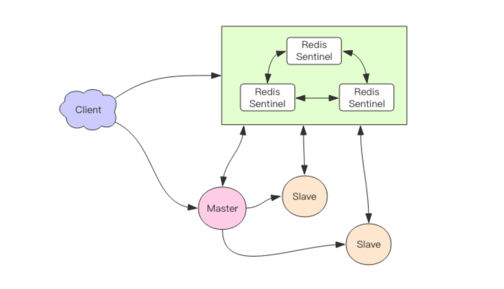

===tag=架构
===description=redis的集群搭建以及注意事项
===pinned=false

> 主从同步 -> 哨兵机制 -> cluster集群 -> cluster+主从+哨兵(数据分片保证性能, 同时保证每个分片有多个实例保证可用性，别用哨兵进行自动主从切换)

# 哨兵机制

通过哨兵自动发现主节点挂掉，自动进行主从切换

它负责持续监控主从节点的健康，当主节点挂掉时，自动选择一个最优的从节点切换为 主节点。客户端来连接集群时，会首先连接 sentinel，通过 sentinel 来查询主节点的地址， 然后再去连接主节点进行数据交互。当主节点发生故障时，客户端会重新向 sentinel 要地 址，sentinel 会将最新的主节点地址告诉客户端。如此应用程序将无需重启即可自动完成节 点切换。

Redis 主从采用异步复制，意味着当主节点挂掉时，从节点可能没有收到全部的同步消 息，这部分未同步的消息就丢失了。如果主从延迟特别大，那么丢失的数据就可能会特别 多。Sentinel 无法保证消息完全不丢失，但是也尽可能保证消息少丢失。它有两个选项`min-slaves-to-write`(至少有n个从节点在进行正常复制，否则就停止对外写服务，丧失可用性), `min-slaves-max-lag`(设置秒数，如果超时那么这个从节点就不正常)可以 限制主从延迟过大。

sentinel 的默认端口是 26379，不同于 Redis 的默认端口 6379，通过 sentinel 对象的 discover_xxx 方法可以发现主从地址，主地址只有一个，从地址可以有多个。

通过 xxx_for 方法可以从连接池中拿出一个连接来使用，因为从地址有多个，redis 客户端对从地址采用轮询方案，也就是 RoundRobin 轮着来。

sentinel 进行主从切换时，客户端如何知道地址变更了，连接池建立新连接时，会去查询主库地址，然后跟内存中的主库地址进行比对，如果变更了，就断开所有连接，重新使用新地址建立新连接。如果是旧的主库挂掉了，那么所有正在使用的连接都会被关闭，然后在重连时就会用上新地址。

对于sentinel主动切换主从的情况，主库没有挂掉也就是原来的连接不会断开，这时候需要捕获一个特殊异常ReadOnlyError，之前的主库被降级到从库，所有的修改性的指令都会抛出 ReadonlyError。 如果没有修改性指令，虽然连接不会得到切换，但是数据不会被破坏，所以即使不切换也没 关系。客户端收到异常之后就知道需要进行重连了

# 分片

在大数据高并发场景下，单个 Redis 实例往往会显得捉襟见肘。首先体现在内存上，单 个 Redis 的内存不宜过大，内存太大会导致 rdb 文件过大，进一步导致主从同步时全量同 步时间过长，在实例重启恢复时也会消耗很长的数据加载时间，特别是在云环境下，单个实 例内存往往都是受限的。其次体现在 CPU 的利用率上，单个 Redis 实例只能利用单个核 心，这单个核心要完成海量数据的存取和管理工作压力会非常大。

## Codis

> 缺点，不能rename，不再支持事务，这只是整理下来看看别人怎么设计的，现在redis的集群还是用官方实现最靠谱

Codis 使用 Go 语言开发，它是一个代理中间件，它和 Redis 一样也使用 Redis 协议 对外提供服务，当客户端向 Codis 发送指令时，Codis 负责将指令转发到后面的 Redis 实例 来执行，并将返回结果再转回给客户端。Codis 上挂接的所有 Redis 实例构成一个 Redis 集群，当集群空间不足时，可以通过动 态增加 Redis 实例来实现扩容需求。客户端操纵 Codis 同操纵 Redis 几乎没有区别，还是可以使用相同的客户端 SDK，不 需要任何变化。

如果 Codis 的槽位映射关系只存储在内存里，那么不同的 Codis 实例之间的槽位关系 就无法得到同步。所以 Codis 还需要一个分布式配置存储数据库专门用来持久化槽位关系。 Codis 开始使用 ZooKeeper，后来连 etcd 也一块支持了。

在新旧数据迁移的时候，Codis 无法判定迁移过程中的 key 究竟在哪个实例中，当 Codis 接收到位于正在迁移槽位中的 key 后，会立即强制对当前的单个 key 进行
迁移，迁移完成后，再将请求转发到新的 Redis 实例。
slot_index = crc32(command.key) % 1024

## Cluster

官方实现，去中心化

每个节点负责整个集群的一部分数据，每个节点负责的数据多少可能不一样。这三个节点相 互连接组成一个对等的集群，它们之间通过一种特殊的二进制协议相互交互集群信息。

> Cluster 不支持事务，Cluster 的 mget 方法相 比 Redis 要慢很多，被拆分成了多个 get 指令，Cluster 的 rename 方法不再是原子的，它 需要将数据从原节点转移到目标节点。

Redis 集群是一个由多个主从节点群组成的分布式服务器群，它具有复制、高可用和分片特性。Redis 集群不需要 Sentinel 哨兵。也能完成节点移除和故障转移的功能。需要将每个节点设置成集群模式，这种集群模式没有中心节点，可水平扩展

### 节点管理

因为 Redis Cluster 是去中心化的，一个节点认为某个节点失联了并不代表所有的节点都 认为它失联了。所以集群还得经过一次协商的过程，只有当大多数节点都认定了某个节点失 联了，集群才认为该节点需要进行主从切换来容错。

Redis 集群节点采用 Gossip 协议来广播自己的状态以及自己对整个集群认知的改变。比 如一个节点发现某个节点失联了 (PFail)，它会将这条信息向整个集群广播，其它节点也就可 以收到这点失联信息。如果一个节点收到了某个节点失联的数量 (PFail Count) 已经达到了集 群的大多数，就可以标记该节点为确定下线状态 (Fail)，然后向整个集群广播，强迫其它节 点也接收该节点已经下线的事实，并立即对该失联节点进行主从切换。

### 数据分布

Redis Cluster 将所有数据划分为 16384 的 slots，它比 Codis 的 1024 个槽划分的更为 精细，每个节点负责其中一部分槽位。槽位的信息存储于每个节点中，它不像 Codis，它不 需要另外的分布式存储来存储节点槽位信息。

当 Redis Cluster 的客户端来连接集群时，它也会得到一份集群的槽位配置信息。这样当 客户端要查找某个 key 时，可以直接定位到目标节点。

Cluster 默认会对 key 值使用 crc32 算法进行 hash 得到一个整数值，然后用这个整数 值对 16384 进行取模来得到具体槽位。Cluster 还允许用户强制某个 key 挂在特定槽位上，通过在 key 字符串里面嵌入 tag 标 记，这就可以强制 key 所挂在的槽位等于 tag 所在的槽位。

当客户端向一个错误的节点发出了指令，该节点会发现指令的 key 所在的槽位并不归自 己管理，这时它会向客户端发送一个特殊的跳转指令携带目标操作的节点地址，告诉客户端 去连这个节点去获取数据。`MOVED 3999 127.0.0.1:6381`。客户端收到 MOVED 指令后，要立即纠正本地的槽位映射表。后续所有 key 将使用新 的槽位映射表。

Redis Cluster 提供了工具 redis-trib 可以让运维人员手动调整槽位的分配情况，

Redis 迁移的单位是槽，Redis 一个槽一个槽进行迁移，当一个槽正在迁移时，这个槽就 处于中间过渡状态。这个槽在原节点的状态为 migrating，在目标节点的状态为 importing，表 示数据正在从源流向目标。
迁移工具 redis-trib 首先会在源和目标节点设置好中间过渡状态，然后一次性获取源节 点槽位的所有 key 列表(keysinslot 指令，可以部分获取)，再挨个 key 进行迁移。每个 key 的迁移过程是以原节点作为目标节点的「客户端」，原节点对当前的 key 执行 dump 指令得 到序列化内容，然后通过「客户端」向目标节点发送指令 restore 携带序列化的内容作为参 数，目标节点再进行反序列化就可以将内容恢复到目标节点的内存中，然后返回「客户端」 OK，原节点「客户端」收到后再把当前节点的 key 删除掉就完成了单个 key 迁移的整个过 程。如果迁移过程中突然出现网络故障，整个 slot 的迁移只进行了一半。这时两个节点依旧 处于中间过渡状态。待下次迁移工具重新连上时，会提示用户继续进行迁移。

这里的迁移过程是同步的，在目标节点执行 restore 指令到原节点删除 key 之间，原 节点的主线程会处于阻塞状态，直到 key 被成功删除。

`查询流程`

首先新旧两个节点对应的槽位都存在部分 key 数据。客户端先尝试访问旧节点，如果对 应的数据还在旧节点里面，那么旧节点正常处理。如果对应的数据不在旧节点里面，那么有 两种可能，要么该数据在新节点里，要么根本就不存在。旧节点不知道是哪种情况，所以它 会向客户端返回一个-ASK targetNodeAddr 的重定向指令。客户端收到这个重定向指令后，先 去目标节点执行一个不带任何参数的 asking 指令，然后在目标节点再重新执行原先的操作指 令。

为什么需要执行一个不带参数的 asking 指令呢?

因为在迁移没有完成之前，按理说这个槽位还是不归新节点管理的，如果这个时候向目 标节点发送该槽位的指令，节点是不认的，它会向客户端返回一个-MOVED 重定向指令告诉 它去源节点去执行。如此就会形成 重定向循环。asking 指令的目标就是打开目标节点的选 项，告诉它下一条指令不能不理，而要当成自己的槽位来处理。

### 基本使用

- 容错: `cluster-require-full-coverage`可以允许部分节点故障，其他节点还可以继续提供对外访问
- 网络抖动: `cluster-node-timeout`表示当某个节点持 续 timeout 的时间失联时，才可以认定该节点出现故障，需要进行主从切换。`cluster-slave-validity-factor`作为倍乘系数来放大这个超时时间(为0就无法抗拒网络抖动)