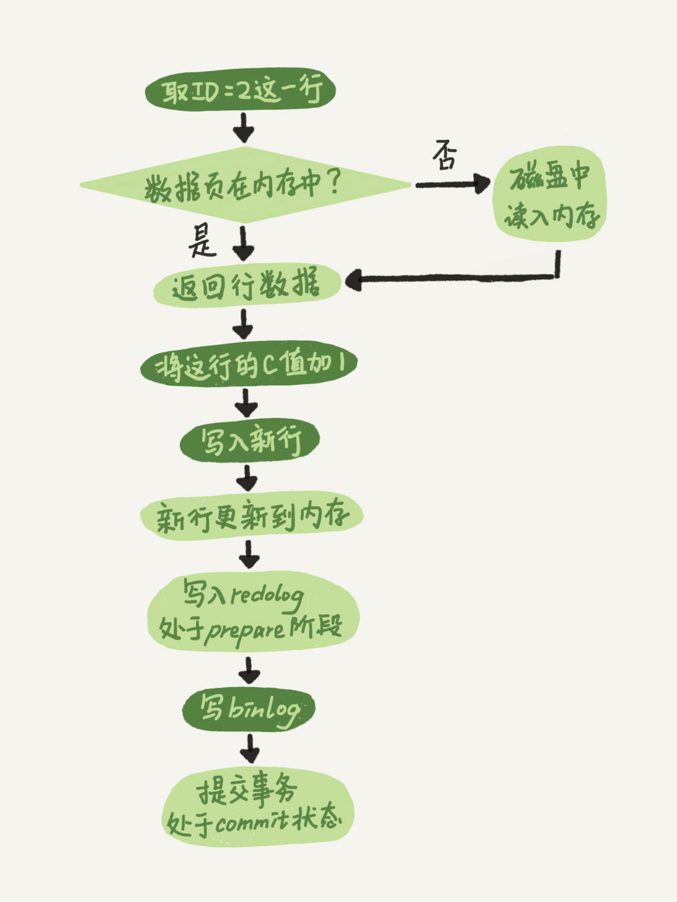
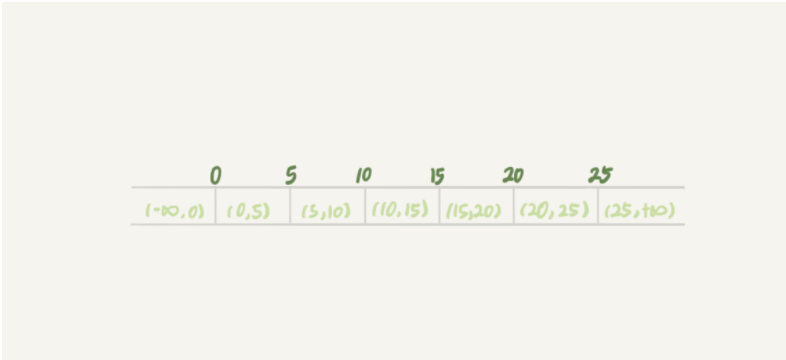

===tag=中间件
===description=数据库设计，MySQL原理
===pinned=false

如果要考虑设计一个软件，行式数据库，提供数据写入，数据读出，并且并发安全需要如何设计

# 数据读出

使用一个字符串表达式，表达你对数据库的操作，例如什么表，什么字段，什么函数，什么筛选语句、联表查询等

相当于小的编译器，对这个表达式词法、语法分析，然后读出内容返回出去

## 索引

> 加快数据的查询效率

### 数据结构

设计索引加快查询，那么使用什么样的数据结构

哈希表这种结构适用于只有等值查询的场景，比如Memcached及其他一些NoSQL引擎。

有序数组索引使用二分复杂度在O(logn), 但是只适用于静态存储引擎，不适合修改

自平衡二叉搜索树，O(logn), 插入数据时要让二叉搜索树自平衡才能保证查询效率，更新的时间复杂度也是O(logn), 但是树的高度太高，树高20。一次查询可能需要访问20个数据块。

为了让一个查询尽量少地读磁盘，就必须让查询过程访问尽量少的数据块。那么，我们就不应该使用二叉树，而是要使用“N叉”树。这里，“N叉”树中的“N”取决于数据块的大小。

以InnoDB的一个整数字段索引为例，这个N差不多是1200。这棵树高是4的时候，就可以存1200的3次方个值，这已经17亿了。考虑到树根的数据块总是在内存中的，一个10亿行的表上一个整数字段的索引，查找一个值最多只需要访问3次磁盘。其实，树的第二层也有很大概率在内存中，那么访问磁盘的平均次数就更少了。

### 底层原理

普通索引和唯一索引应该怎么选择

唯一索引相较于普通索引是在更新的时候需要先将数据读入到change buffer中判断是否冲突，这会导致一定的命中率问题

- 覆盖索引: 在这个查询里面，索引k已经“覆盖了”我们的查询需求,由于覆盖索引可以减少树的搜索次数，显著提升查询性能，所以使用覆盖索引是一个常用的性能优化手段。
- 最左前缀原则: B+树这种索引结构，可以利用索引的“最左前缀”，来定位记录。
- 索引下推: 可以在索引遍历过程中，对索引中包含的字段先做判断，直接过滤掉不满足条件的记录，减少回表次数。

- 怎么给字符串加索引

### 索引选择

一张表有多个索引，也就是说在查询数据的时候，优化器会选择一个它觉得最优的索引树来进行选择

扫描行数、临时表、是否排序都是需要考虑的因素

## 各类语句原理


### join原理

> straight_join让MySQL使用固定的连接方式执行查询, 直接使用join会根据情况进行优化

`NLJ`

`select * from t1 straight_join t2 on (t1.a=t2.a);`

从表t1中读入一行数据 R；从数据行R中，取出a字段到表t2里去查找；取出表t2中满足条件的行，跟R组成一行，作为结果集的一部分；重复执行步骤1到3，直到表t1的末尾循环结束。

嵌套查询类似，并且可以用上被驱动表的索引，所以我们称之为“Index Nested-Loop Join”，简称NLJ。

一般让小表做驱动表，在可以使用被驱动表的索引的情况下，性能比强行拆成多个单表执行SQL语句的性能要好

`BNL`

Block Nested-Loop Join

> 如果在mysql没有优化的情况下，不能走被驱动表的索引的话，被驱动表也是全表扫描(总扫描次数就是`n*m`了, 比两个表分开扫描和组合的`n+m`慢太多了)

mysql会对不能走索引的情况进行优化，

把表t1的数据读入线程内存join_buffer中，由于我们这个语句中写的是select *，因此是把整个表t1放入了内存；扫描表t2，把表t2中的每一行取出来，跟join_buffer中的数据做对比，满足join条件的，作为结果集的一部分返回。

在这个过程中，对表t1和t2都做了一次全表扫描，因此总的扫描行数是1100。由于join_buffer是以无序数组的方式组织的，因此对表t2中的每一行，都要做100次判断，总共需要在内存中做的判断次数是：100*1000=10万次。虽然时间复杂度是一样的，但是比起不优化的情况，这里是在内存上进行的，会好很多。这时候选择大表还是小表做驱动表，执行耗时是一样的。

是表t1是一个大表，join_buffer(join_buffer_size设定的，默认值是256k)放不下, 那么就会分段放

如果一个使用BNL算法的join语句，多次扫描一个冷表，而且这个语句执行时间超过1秒，就会在再次扫描冷表的时候，把冷表的数据页移到LRU链表头部。如果这个冷表很大，就会出现另外一种情况：业务正常访问的数据页，没有机会进入young区域。大表join操作虽然对IO有影响，但是在语句执行结束后，对IO的影响也就结束了。但是，对Buffer Pool的影响就是持续性的，需要依靠后续的查询请求慢慢恢复内存命中率。

- 可能会多次扫描被驱动表，占用磁盘IO资源；
- 判断join条件需要执行M*N次对比（M、N分别是两张表的行数），如果是大表就会占用非常多的CPU资源；
- 可能会导致Buffer Pool的热数据被淘汰，影响内存命中率。

### join如何优化

`BKA`

BKA(Batched Key Access)优化,mysql5.6引入的，基于MRR(Multi-Range Read)优化思路

> 想要稳定地使用MRR优化的话，需要设置set optimizer_switch="mrr_cost_based=off"。（官方文档的说法，是现在的优化器策略，判断消耗的时候，会更倾向于不使用MRR，把mrr_cost_based设置为off，就是固定使用MRR了。）
>
> 使用BKA,执行SQL语句之前，先设置`set optimizer_switch='mrr=on,mrr_cost_based=off,batched_key_access=on';`

那怎么才能一次性地多传些值给表t2呢？方法就是，从表t1里一次性地多拿些行出来，一起传给表t2。把表t1的数据取出来一部分，先放到一个临时内存join_buffer

`BNL转BKA`

BNL的缺点上文也提出了，也可以考虑转为BKA。

把表t2中满足条件的数据放在临时表tmp_t中；为了让join使用BKA算法，给临时表tmp_t的字段b加上索引；让表t1和tmp_t做join操作。

```sql
create temporary table temp_t(id int primary key, a int, b int, index(b))engine=innodb;
insert into temp_t select * from t2 where b>=1 and b<=2000;
select * from t1 join temp_t on (t1.b=temp_t.b);
```

`部分计算移入业务层`

> 这个过程会比临时表方案的执行速度还要快一些

select * from t1;取得表t1的全部1000行数据，在业务端存入一个hash结构

select * from t2 where b>=1 and b<=2000; 获取表t2中满足条件的2000行数据。

把这2000行数据，一行一行地取到业务端，到hash结构的数据表中寻找匹配的数据。满足匹配的条件的这行数据，就作为结果集的一行。

### 获取总行数

MyISAM引擎把一个表的总行数存在了磁盘上，因此执行`count(*)`的时候会直接返回这个数(加了where条件除外)，效率很高；而InnoDB引擎就麻烦了，它执行`count(*)`的时候，需要把数据一行一行地从引擎里面读出来，然后累积计数。

> `count(*)`(专门优化不取值，只看有多少行数)、count(主键id)和count(1) 都表示返回满足条件的结果集的总行数；而count(字段），则表示返回满足条件的数据行里面，参数“字段”不为NULL的总个数。排序效率: `count(字段)<count(主键id)<count(1)≈count(*)`

由于多版本并发控制（MVCC）的原因，InnoDB表“应该返回多少行”也是不确定的。所以不能简单的用一个通用的总数作为返回值。另外`show table status`命令的`TABLE_ROWS`字段是一个估算值，误差在50%左右也不能作为结果使用

普通索引树比主键索引树小很多。对于`count(*)`这样的操作，遍历哪个索引树得到的结果逻辑上都是一样的。因此，MySQL优化器会找到最小的那棵树来遍历。在保证逻辑正确的前提下，尽量减少扫描的数据量，是数据库系统设计的通用法则之一。

对于需要经常显示总数的系统，最好的方法是自己引用缓存自己计数


### orderby的底层逻辑

对于排序字段，为了避免全表扫描，需要加上索引

对于排序这部分逻辑，取决于sort_buffer_size，就是MySQL为排序开辟的内存（sort_buffer）的大小。如果要排序的数据量小于sort_buffer_size，排序就在内存中完成。但如果排序数据量太大，内存放不下，则不得不利用磁盘临时文件辅助排序。外部排序一般使用归并排序算法, 分为多个子文件各自有序后再归并到一个文件中

但是如果要返回的字段太多，会导致内存中能够存入的数据变少，要分的文件变多，影响效率。MySQL的优化方式max_length_for_sort_data(控制用于排序的行数据的长度的一个参数。如果单行的长度超过这个值，MySQL就认为单行太大，要换一个算法。)是将只存入rowid和要排序的字段，处理完了之后再去把需要返回的字段查询出来

可以使用联合索引，比如你要按城市查询用户名，那么就建一个城市与用户名的组合索引，天然有序

### 如何正确的处理随机数据

`order by rand()`

如果使用rand，`select word from words order by rand() limit 3;`，那么既会将数据读到临时表又会创建排序表，效率很低，假设表中有10000的数据，要获取随机的三个，需要扫描20003行数据。

在创建临时表的时候除了记录rowid，还会记录一个随机值，用于后续排序使用

另外这里的排序由于只需要前三个，所以不会使用堆排序排序所有的，而是通过堆找出前三个就行


`随机排序方法1`

取得这个表的主键id的最大值M和最小值N;用随机函数生成一个最大值到最小值之间的数 `X = (M-N)*rand() + N`;取不小于X的第一个ID的行。

好处是扫描的行可以看做3行

不过因为ID中间可能有空洞，因此选择不同行的概率不一样，不是真正的随机。比如你有4个id，分别是1、2、4、5，如果按照上面的方法，那么取到 id=4的这一行的概率是取得其他行概率的两倍。如果这四行的id分别是1、2、40000、40001呢？这个算法基本就能当bug来看待了。

`随机排序方法2`

取得整个表的行数，并记为C。取得 Y = floor(C * rand())。 floor函数在这里的作用，就是取整数部分。再用limit Y,1 取得一行。

```sql
select count(*) into @C from t;
set @Y = floor(@C * rand());
set @sql = concat("select * from t limit ", @Y, ",1");
prepare stmt from @sql;
execute stmt;
DEALLOCATE prepare stmt;
```

解决了分布不均的问题，但是MySQL处理limit Y,1 的做法就是按顺序一个一个地读出来，丢掉前Y个，然后把下一个记录作为返回结果，因此这一步需要扫描Y+1行。再加上，第一步扫描的C行，总共需要扫描C+Y+1行，执行代价比随机算法1的代价要高。


# 数据写入

假设无并发问题情况下，我们将多行数据写入到数据库中，除了序列化与反序列化之外，需要考虑的就是如何在保证高响应的情况下保证数据的持久性

如果仅仅写在内存中，那么程序异常重启，数据肯定丢失了，如果所有的数据都去磁盘中找到数据然后更新写入磁盘，那么这个效率很明显的不行



mysql用redolog保证crash-safe，并且不需要频繁磁盘IO，而是由后台任务去刷新

另外server层的binlog(逻辑日志)由于和redolog是两个部分，所以采用二阶段提交保证事务正确

# 数据回退

其实就是原子性，多个表达式中，如果一个失败了，那么之前也要能够回退

通过事务来实现

数据的回退语句则是通过undolog记录

# 并发情况

## 原子性

现在出现了多个客户端(或者要开辟多个连接)共用一个数据库，要保证并发的安全，要让操作互相隔离来保证数据不被破坏

在mysql的实现中有不同的隔离级别，其中包含了对于其他事务数据可见性的限制

在默认的可重复读隔离级别下，实现机制是mvvc和undolog

mvcc，不同时刻启动的事务会有不同的read-view，即数据的某条记录会存在多个版本。如果最终执行完成后发现版本不一致会根据undolog进行回退，如果没有比这个回滚日志更早的read-view的时候，即这个日志不再需要，回滚日志会被删除。

## 事务

begin/start transaction 命令并不是一个事务的起点，在执行到它们之后的第一个操作InnoDB表的语句，事务才真正启动。如果你想要马上启动一个事务，可以使用start transaction with consistent snapshot 这个命令。

在MVCC中，如果你只读，那么确实能够在这个事务中不管其他事务如何处理数据你读到的都是你自己版本的(由当前数据和更高版本的回滚日志组合出来的)，但是更新数据不一样，更新数据都是先读后写的，而这个读，只能读当前的值，称为“当前读”（current read）。在select语句中如果加上`for update(写锁)`或者`lock in share mode(读锁)`也是当前读(当然了，这种当前读比回滚日志来得更快)

## 资源隔离

锁

根据加锁的范围，MySQL里面的锁大致可以分成全局锁、表级锁和行锁三类

MySQL里面表级别的锁有两种：一种是表锁，一种是元数据锁（meta data lock，MDL)。

`全局锁`

全局锁一般用在备份数据库的情况下，这时整个数据库处于只读状态，避免这时候的业务操作导致多个表之间有些数据是新的有些是旧的，无法保证原子性。当然如果基于MVCC是能拿到一致性视图的。官方自带的逻辑备份工具是mysqldump。当mysqldump使用参数–single-transaction的时候，导数据之前就会启动一个事务，来确保拿到一致性视图。而由于MVCC的支持，这个过程中数据是可以正常更新的。(如果有些引擎不支持事务例如MyISAM那么这种方法就不行，这就是为什么还是需要全局锁)

`表级锁`

分为表锁和元数据锁MDL

表锁，`lock tables ... read/write`, 对于InnoDB这种支持行锁的引擎，一般不使用lock tables命令来控制并发，毕竟锁住整个表的影响面还是太大。(MyISAM不支持行锁，只能使用表锁)

MDL，MDL不需要显式使用，在访问一个表的时候会被自动加上。当对一个表做增删改查操作的时候，加MDL读锁；当要对表做结构变更操作的时候，加MDL写锁。

事务中的MDL锁，在语句执行开始时申请，但是语句结束后并不会马上释放，而会等到整个事务提交后再释放。所以需要解决长事务，事务不提交就会一直占着MDL锁

> 在MySQL的information_schema 库的 innodb_trx 表中，你可以查到当前执行中的事务。如果你要做DDL变更的表刚好有长事务在执行，要考虑先暂停DDL，或者kill掉这个长事务。

`行锁`

行锁是由各个引擎自己实现的。比如事务A更新了一行，而这时候事务B也要更新同一行，则必须等事务A的操作完成后才能进行更新。

在InnoDB事务中，行锁是在需要的时候才加上的，但并不是不需要了就立刻释放，而是要等到事务结束时才释放。这个就是两阶段锁协议。根据两阶段锁协议，不论你怎样安排语句顺序，所有的操作需要的行锁都是在事务提交的时候才释放的，将发生冲突的行放在事务的最后能够减少锁等待的时间。(但是注意这个调换的顺序，不要造成循环等待，a、b两个互相等待，需要保证各自之间的顺序是对应的)

调整语句顺序并不能完全避免死锁。mysql自己处理死锁的机制就是超时或者主动去检测有没有其他线程在等待这个资源，发现死锁就主动回滚死锁链条中的某一个事务。

`间隙锁`

为了解决幻读问题，InnoDB只好引入新的锁，也就是间隙锁(Gap Lock)。当你执行 `select * from t where d=5 for update`的时候，就不止是给数据库中已有的6个记录加上了行锁，还同时加了7个间隙锁。这样就确保了无法再插入新的记录。



跟间隙锁存在冲突关系的，是“往这个间隙中插入一个记录”这个操作。间隙锁之间都不存在冲突关系。
# 存储引擎

- Memory引擎的场景以及优点

## InnoDB

### Change Buffer

当需要更新一个数据页时，如果数据页在内存中就直接更新，而如果这个数据页还没有在内存中的话，在不影响数据一致性的前提下，InooDB会将这些更新操作缓存在change buffer中，这样就不需要从磁盘中读入这个数据页了。在下次查询需要访问这个数据页的时候，将数据页读入内存，然后执行change buffer中与这个页有关的操作。通过这种方式就能保证这个数据逻辑的正确性。

另外，change buffer在内存中有拷贝，也会被写入到磁盘上。

因此，对于写多读少的业务来说，页面在写完以后马上被访问到的概率比较小，此时change buffer的使用效果最好。这种业务模型常见的就是账单类、日志类的系统。

反过来，假设一个业务的更新模式是写入之后马上会做查询，那么即使满足了条件，将更新先记录在change buffer，但之后由于马上要访问这个数据页，会立即触发merge过程。这样随机访问IO的次数不会减少，反而增加了change buffer的维护代价。所以，对于这种业务模式来说，change buffer反而起到了副作用

# 集群模式

## 如何保证主备一致

## 如何保证高可用

## 主库出问题了从库怎么办

