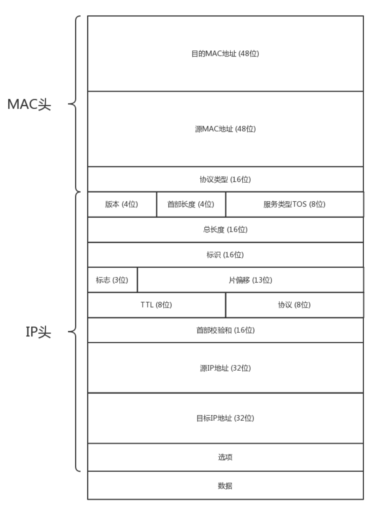
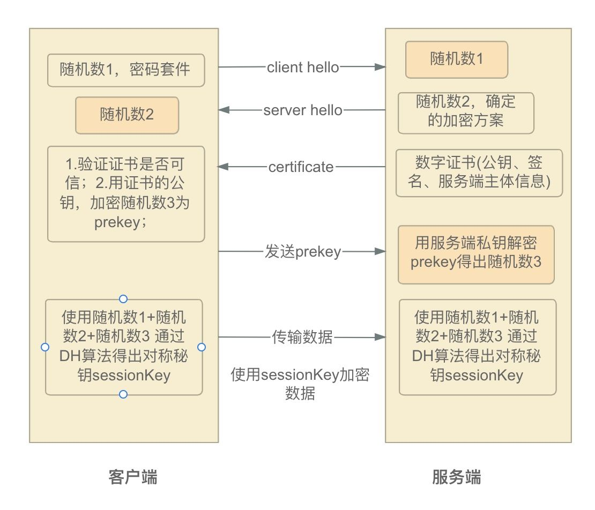
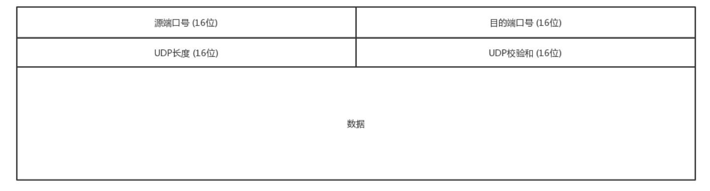
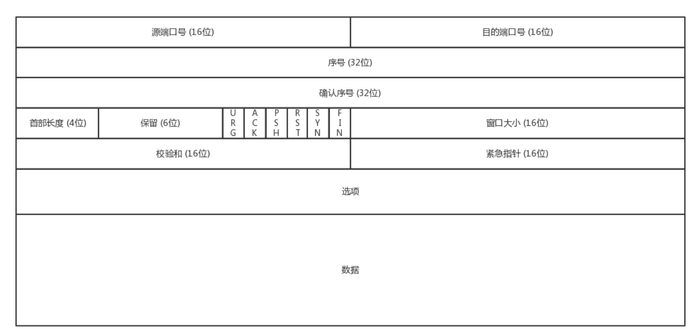

===tag=架构
===description=网络通信全流程
===pinned=false

# 简介

> 熟记MAC头和IP头细节，这些信息缺一不可，否则就不能发送

> 网络传输是以包为单位的，二层叫帧，网络层叫包，传输层叫段。我们笼统地称为包。包单独传输，自行选路，在不同的设备封装解封装，不保证到达。

传输层提供应用进程间的逻辑通信（通过端口号），即端到端的通信。而数据链路层负责相邻结点之间的通信，这个结点包括了交换机和路由器等数据通信设备，这些设备不能称为端系统。网络层负责主机到主机的逻辑通信

层间接口处提供服务的地方称为服务访问点SAP(Service Access Point)，每个服务访问点都有一个唯一的标识地址。相邻层在提供服务的过程中要传递信息，这些信息的单位在OSl模型中称为服务数据单元(Service Data Unit-SDU)。

主流的主机序都是小端字节序(数值位低的存在低地址位), 网络序采用大端字节序

`MAC帧`

它包括三部分：帧头(14字节)，数据部分，帧尾(FCS4字节，帧校验顺序)。其中，帧头和帧尾包含一些必要的控制信息，比如同步信息、地址信息、差错控制信息等。MAC层要求定界字符之后的内容要在64字节到1518个字节之间(即数据部分限制为48-1500)

`标志位与片偏移`

- 数据报片的标识字段用于标识是否是同一个包的
- 标志表示后面是否还有分片
- 片偏移即这一片在原始报文中的顺序

一个5960字节的数据报（其中20字节IP首部加上5940字节的IP有效载荷）到达一台路由器，并且必须被转发到一条MTU为1500字节的链路上，并且原始数据报附加的标识号为587，则需要分为5片，每一个分片的标识都为587，前四个的标志位为1

`校验和`

校验和的计算是计算所有整数的和，进位加在和的后面，将得到的值按位求反。

例如4个字节信息是0xEA697341，其校验和是A254

最低位：9+1 = A
第二低位：6+4 = A
第二高位：A+3 = D
最高位：E+7 = 15 (十六进制的 15，即十进制的 21)
由于最高位溢出了，所以为最低位 +1，即最低位为 A+1=B，则最高位为 5

接下来对每一位都按位取反：
最低位：~B(1011) = 4(0100)
第二低位：~A(1010) = 5(0101)
第二高位：~D(1101) = 2(0010)
最高位：~5(0101) = A(1010)

## 硬件

二层交换机则是仅在数据链路层工作，与mac地址相关，连接一个广播域

Web交换机为数据中心设备（包括Internet服务器、防火墙、高速缓冲服务器和网关等）提供管理、路由和负载均衡传输。不同于传统网络设备的是，传统网络设备注重高速完成单个帧和数据包的交换，而Web交换侧重于跟踪和处理Web会话。除了由传统第二/三层交换机所提供的连接和封包路由外，Web交换机还可提供传统局域网交换机和路由器所缺乏的完备策略，将局部和全球服务器负载均衡、存取控制、服务质量保证（QoS）以及带宽管理等管理能力结合起来。目前，Web交换机已由纯粹的传输层（第四层）设备发展到具有基于内容（第七层）的交换的智能。利用内容或用户分类进行Web请求重定向是Web服务器的一项功能。不过，Internet传输和商业的发展远远超过计算机处理能力的提高。把内容分类卸到Web交换机可平衡整个网站的基础设施。

### 常用命令

如果要设定一个到目的网络209.98.32.33的路由，其间要经过5个路由器网段，首先要经过本地网络上的一个路由器，其IP为202.96.123.5，子网掩码为255.255.255.224，那么你应该输入以下命令：

`route add 209.98.32.33 mask 255.255.255.224 202.96.123.5 metric 5`

## 各层协议

`网络层`

- ARP
- RARP
- IP
- ICMP: 请求报文和差错报文控制
- IGMP: 负责IP组播成员管理的协议
- IPsec

`数据链路层`

- CSMA/CD

`物理层`

曼彻斯特编码，一个同步时钟编码技术，常用于局域网传输。曼彻斯特编码将时钟和数据包含在数据流中，在传输代码信息的同时，也将时钟同步信号一起传输到对方，每位编码中有一跳变，不存在直流分量，因此具有自同步能力和良好的抗干扰性能。但每一个码元都被调成两个电平，所以数据传输速率只有调制速率的1/2。

波特率，可以通俗的理解为一个设备在一秒钟内发送（或接收）了多少码元的数据。发送方每秒发送9600码元，接收方每秒仅能接受4800码元，并非无法接收，只能收到部分数据

# 前置流程

用户端分为手机和电脑端，电脑端与互联网的接入有网线，或者wifi，手机端通过wifi或者sim卡

电脑端从下往上依次有(这里只是按层级大概列出来，实际上很多硬件可能已经升级，功能更融合了)，集线器(一层设备，用于扩大信号增加传输距离)，二层交换机(可以连接不同网段，会学习各个设备在那个网口下，这样不同网段的可以通过这个交换机获取到彼此的mac地址，从而构造请求发送出去)，三层交换机、路由器等负责nat，将内网的ip转成外网ip，或者流量进入时将外网ip转成内网ip

手机端的客户的手机开机以后，在附近寻找基站`eNodeB`，发送请求，申请上网。基站将请求发给`MME`，MME对手机进行认证和鉴权，还会请求HSS看有没有钱，看看是在哪里上网。认证后建立隧道，分为两段，从`eNodeB`到`SGW`, 从`SGW`到`PGW`, 在PGW之外就是外部互联网。PGW会为手机分配一个IP地址，手机上网都是带着这个IP地址的。

# IP地址获取

> IP地址与域名不一定是一一对应的。一个IP可以对应多个域名（虚拟主机），也可以一个域名对应多个ip（DNS方式的负载均衡）。

在手机运营商所在的互联网区域里，有一个本地的DNS，手机会向这个DNS请求解析DNS。当这个DNS本地有缓存，则直接返回；如果没有缓存，本地DNS才需要递归地从根DNS服务器，查到.com的顶级域名服务器，最终查到权威DNS服务器。

如果配置了GLSB全局负载均衡，可以告诉请求者让他去请求GLSB来解析这个域名，这时这个GLSB就可以通过自己的策略来实现负载均衡

GSLB通过查看请求它的本地DNS服务器所在的运营商和地址，就知道用户所在的运营商和地址，然后将距离用户位置比较近的Region里面，三个负载均衡SLB的公网IP地址，返回给本地DNS服务器。本地DNS解析器将结果缓存后，返回给客户端。

一般会把静态资源保存在两个地方，一个是接入层nginx后面的varnish缓存里面，一般是静态页面；对于比较大的、不经常更新的静态图片，会保存在对象存储里面。这两个地方的静态资源都会配置CDN，将资源下发到边缘节点。

配置了CDN之后，权威DNS服务器上，会为静态资源设置一个CNAME别名，指向另外一个域名 cdn.com ，返回给本地DNS服务器。

## IP协议

A、B、C三类IP地址的特征： 将IP地址写成32位二进制形式时，A类地址(私有地址范围10.0.0.0到10.255.255.255是私有地址)的第一位为0，B类地址(私有地址范围172.16.0.0-172.31.255.255)的前两位为10，C类地址(私有地址范围192.168.0.0-192.168.255.255)的前三位为110。 对应的子网掩码分别为：255.0.0.0，255.255.0.0，255.255.255.0

组播地址是分类编址的IPv4地址中的D类地址，又叫多播地址，他的前四位必须是1110，所以网络地址的取值范围是224~~239。

- 224.0.0.0～224.0.0.255为预留的组播地址（永久组地址），地址224.0.0.0保留不做分配，其它地址供路由协议使用
- 224.0.1.0～224.0.1.255是公用组播地址，可以用于Internet
- 224.0.2.0～238.255.255.255为用户可用的组播地址（临时组地址），全网范围内有效
- 239.0.0.0～239.255.255.255为本地管理组播地址，仅在特定的本地范围内有效

广播地址就是将除了网络号其他位都变成1

广播采用的方式是把报文传送到局域网内每个主机上，不管这个主机是否对报文感兴趣。这样做就会造成了带宽的浪费和主机的资源浪费。而组播有一套对组员和组之间关系维护的机制，可以明确的知道在某个子网中，是否有主机对这类组播报 文感兴趣，如果没有就不会把报文进行转发，并会通知上游路由器不要再转发这类报文到下游路由器上。

## IP分配

新加入的主机要通过DHCP服务器动态获取分配的ip。客户端发送discover(广播)，服务器回复offer(广播)，客户端发送request(广播)，服务器回复ack(广播)

新来的机器使用IP地址0.0.0.0(这个地址只能作为源ip不能作为目标ip)发送了一个广播包，目的IP地址为255.255.255.255。目的mac为广播mac`ff.ff.ff.ff.ff.ff`, 广播包封装了UDP，UDP封装了BOOTP。

只有MAC唯一，IP管理员才能知道这是一个新人，需要租给它一个IP地址，这个过程我们称为DHCP Offer。同时，DHCP Server为此客户保留为它提供的IP地址，从而不会为其他DHCP客户分配此IP地址。DHCP Server仍然使用广播地址作为目的地址，因为，此时请求分配IP的新人还没有自己的IP。

机器会选择其中一个DHCP Offer，一般是最先到达的那个，并且会向网络发送一个DHCP Request广播数据包，包中包含客户端的MAC地址、接受的租约中的IP地址、提供此租约的DHCP服务器地址等。此时，由于还没有得到DHCP Server的最后确认，客户端仍然使用0.0.0.0为源IP地址、255.255.255.255为目标地址进行广播。

当DHCP Server接收到客户机的DHCP request之后，会广播返回给客户机一个DHCP ACK消息包，表明已经接受客户机的选择，并将这一IP地址的合法租用信息和其他的配置信息都放入该广播包，发给客户机。

## HTTPDNS

> 对于手机App来说，可以绕过刚才的传统DNS解析机制，直接只要HTTPDNS服务，通过直接调用HTTPDNS服务器，得到这三个SLB的公网IP地址。

直接通过http服务告诉手机客户端应该选择哪个ip，使用sdk绕过传统DNS解析

# MAC地址获取

> 源mac、目的mac、源ip、目的ip缺一不可，当然这里的目的mac地址肯定不是服务端的mac地址，而是下一跳的

## ARP协议

在局域网环境中，通过arp协议获取ip对应的mac地址

CSMA/CD有两点。一是发送前先检测信道。空闲信道就立即发送，信道忙就随机推迟发送。二是边发送边检测信道，一发现碰撞就立即停止发送。因此偶尔发生碰撞并不会使局域网的运行效率降低很多。既然无线局域网不能使用碰撞检测，那么就应当尽量减少碰撞的发生。把CSMA/CD修改为CSMA/CA。802.11局域网在使用CSMA/CA的同时还使用停止等待协议。无线站点每通过无线局域网发送完一帧之后，要等待收到对方的确认帧后才能发送下一帧，这叫做链路确认。

在要出局域网的情况下，需要经过路由器，这个时候目标mac地址，就是路由器连接到局域网的那个网口的mac地址，然后构造请求之后发送过去，当路由器将这个信息转发出去，需要进行nat，将内部ip转为外部ip，并且修改目标mac为下一跳的mac地址(mac地址只在局域网中唯一，只在局域网中生效)

# 连接建立

> 现在是分组交换，以前还有虚电路连接，三个步骤是建立连接、传输数据、拆除连接

> 最终路径就是: 主机 -> 网关 -> 服务提供商 -> 路由器1...n -> 自治系统边界路由器 -> 进入自治系统 -> 路由器1...n -> 服务端网关 -> 公网ip转内网ip -> 具体的服务主机或者容器或者虚拟机

在这个例子中，TCP的连接是从手机上的App和负载均衡器SLB之间的。

对于TCP连接来讲，需要通过三次握手建立连接，为了维护这个连接，双方都需要在TCP层维护一个连接的状态机。

当TCP层的连接建立完毕之后，接下来轮到HTTPS层建立连接了，在HTTPS的交换过程中，TCP层始终处于ESTABLISHED。client-hello、server-hello、server-ca、premaster-key。在服务端发送证书过来时，客户端会从自己信任的CA仓库中，拿CA的证书里面的公钥去解密电商网站的证书。如果能够成功，则说明电商网站是可信的。这个过程中，你可能会不断往上追溯CA、CA的CA、CA的CA的CA，反正直到一个授信的CA，就可以了。

在TCP头里面，会有源端口号和目标端口号，目标端口号一般是服务端监听的端口号，源端口号在手机端，往往是随机分配一个端口号。这个端口号在客户端和服务端用于区分请求和返回，发给那个应用。

当一个手机上线的时候，PGW会给这个手机分配一个IP地址，这就是源地址，而目标地址则是云平台的负载均衡器的外网IP地址。

在IP层，客户端需要查看目标地址和自己是否是在同一个局域网，计算是否是同一个网段，往往需要通过CIDR子网掩码来计算。如果不是一个网段的则将其发送给默认的网关(DHCP配置ip的时候会一起配置默认网关)

知道了ip地址还不够，还需要知道mac地址(这样才能构建一个完整的数据包，否则是发不出去的)，通过ARP协议，来获取网关的MAC地址，然后将网关MAC作为目标MAC，自己的MAC作为源MAC，放入MAC头，发送出去。

对于手机来讲，默认的网关在PGW上，从手机到PGW有一条隧道，到了PGW才会把数据解包转发到外部网络

> 从内部网络到外部网络会改源ip，将内网ip改为外网ip

在PGW的隧道端点将包解出来，转发出去的时候，一般在PGW出外部网络的路由器上，会部署NAT服务，将手机的IP地址转换为公网IP地址，当请求返回的时候，再NAT回来。

- 源MAC：PGW出口的MAC => NAT网关的MAC
- 目标MAC：NAT网关的MAC => A2路由器的MAC
- 源IP：UE的IP地址 => UE的公网IP地址
- 目标IP：SLB的公网IP地址 => SLB的公网IP地址

出了NAT网关，就从核心网到达了互联网。在网络世界，每一个运营商的网络成为自治系统AS。每个自治系统都有边界路由器，通过它和外面的世界建立联系。

如何从出口的运营商到达云平台的边界路由器？在路由器之间需要通过BGP协议实现，BGP又分为两类，eBGP和iBGP。自治系统之间、边界路由器之间使用eBGP广播路由。通过运行iBGP，边界路由器将BGP学习到的路由导入到内部网络，使内部的路由器能够找到到达外网目的地最好的边界路由器。

> 只换目标MAC地址，不换ip

网站的SLB的公网IP地址早已经通过云平台的边界路由器，让全网都知道了。于是这个下单的网络包选择的下一跳是A2，也即将A2的MAC地址放在目标MAC地址中。到达A2之后，从路由表中找到下一跳是路由器C1，于是将目标MAC换成C1的MAC地址。到达C1之后，找到下一跳是C2，将目标MAC地址设置为C2的MAC。到达C2后，找到下一跳是云平台的边界路由器，于是将目标MAC设置为边界路由器的MAC地址。

在云平台的边界路由器，会将数据包转发进来，经过核心交换，汇聚交换，到达外网网关节点上的SLB的公网IP地址。

这么复杂的包转发过程，要保证数据不丢失，就需要利用到TCP的机制重新发送。TCP的滑动窗口协议，需要维护Sequence Number(连接一开始就会协商发送方和接收方的初始序列号)，看哪些包到了，哪些没到，哪些需要重传，传输的速度应该控制到多少

滑动窗口在接收方分为四个部分

- 已经接收，已经ACK，已经交给应用层的包；
- 已经接收，已经ACK，未发送给应用层；
- 已经接收，尚未发送ACK；
- 未接收，尚有空闲的缓存区域。

接收方的ack同样有丢失的风险，如果发送方超过一定的时间没有收到ACK，就会重新发送。只有TCP层ACK过的包，才会发给应用层，并且只会发送一份

包在tcp层组合完成之后才会交给应用层，这时候即使tcp重复发送接收端也不会重复接收因为窗口中只保存一份，当组合后交给应用层后就会清理窗口

## 动态路由

最小生成树协议，用来让路由器节点学习到要前往某个ip需要前往哪里

路由表中的规则包含: 目的网络、出口设备、下一跳mac地址

> 设置ip route add 10.176.48.0/20 via 10.173.32.1 dev eth0，就说明要去10.176.48.0/20这个目标网络，要从eth0端口出去，经过10.173.32.1。

动态路由算法分为距离矢量路由算法(基于Bellman-Ford)和链路状态路由算法(基于Dijkstra)

> RIP基于UDP协议，BGP基于TCP协议，OSPF基于IP

### RIP协议

RIP最大跳数为15，超过了表示不可达

### 基于链路状态路由算法的OSPF

OSPF（Open Shortest Path First，开放式最短路径优先）就是这样一个基于链路状态路由协议，广泛应用在数据中心中的协议。由于主要用在数据中心内部，用于路由决策，因而称为内部网关协议（Interior Gateway Protocol，简称IGP）。

内部网关协议的重点就是找到最短的路径。在一个组织内部，路径最短往往最优。当然有时候OSPF可以发现多个最短的路径，可以在这多个路径中进行负载均衡，这常常被称为等价路由。

互联网上的每个路由器周期性地向其他路由器广播自己与相邻路由器的连接关系，利用其他路由器的广播信息，互联网上的每个路由器都可以形成一张由点和线连接而成的抽象拓扑结构图；一旦得到了这张图，路由器就可以按照Dijkstra算法计算出以本地路由器为根的SPF树，通过这棵树路由器就可以生成自己的路由表。每个路由器都能在自己本地构建一个完整的图，然后针对这个图使用Dijkstra算法，找到两点之间的最短路径。

不像距离距离矢量路由协议那样，更新时发送整个路由表。链路状态路由协议只广播更新的或改变的网络拓扑，这使得更新信息更小，节省了带宽和CPU利用率。而且一旦一个路由器挂了，它的邻居都会广播这个消息，可以使得坏消息迅速收敛。

### 基于路径矢量路由协议算法的BGP

> 路径矢量路由协议（path-vector protocol）。它是距离矢量路由协议的升级版。在BGP里面，除了下一跳hop之外，还包括了自治系统AS的路径，从而可以避免坏消息传的慢的问题，也即上面所描述的，B知道C原来能够到达A，是因为通过自己，一旦自己都到达不了A了，就不用假设C还能到达A了。

外网的路由协议，也即国家之间的，又有所不同。我们称为外网路由协议（Border Gateway Protocol，简称BGP）。

**BGP又分为两类，eBGP和iBGP。**自治系统间，边界路由器之间使用eBGP广播路由。内部网络也需要访问其他的自治系统。边界路由器如何将BGP学习到的路由导入到内部网络呢？就是通过运行iBGP，使得内部的路由器能够找到到达外网目的地的最好的边界路由器。

# 路径校验

> 实际上如果一个网络不可达，是会更新给各个路由器的，不需要在手动去ping网络通不通，在实际的请求发送不会出现这一步，写出来只是为了扩充空白

ping是基于ICMP协议工作的。ICMP全称Internet Control Message Protocol，就是互联网控制报文协议，包括：查询报文类型和差错报文类型。

ping命令执行的时候，源主机首先会构建一个ICMP请求数据包，ICMP数据包内包含多个字段。最重要的是两个，第一个是类型字段，对于请求数据包而言该字段为 8；另外一个是顺序号，主要用于区分连续ping的时候发出的多个数据包。每发出一个请求数据包，顺序号会自动加1。为了能够计算往返时间RTT，它会在报文的数据部分插入发送时间。

ICMP差错报文的例子：终点不可达为3(网络不可达，找不到地方；主机不可达，找不到这个ip对应的主机；协议不可达；端口不可达；需要分片但是设置了不能分片)，源抑制为4(让源站放慢发送速度)，超时为11(超过网络包的生存时间还是没到)，重定向为5(也就是让下次发给另一个路由器)

Traceroute的第一个作用就是故意设置特殊的TTL(不断扩大TTL，就知道每一跳的具体路径，有的路由器压根不会回这个ICMP。这也是Traceroute一个公网的地址，看不到中间路由的原因。)，来追踪去往目的地时沿途经过的路由器。

怎么知道UDP有没有到达目的主机呢？Traceroute程序会发送一份UDP数据报给目的主机，但它会选择一个不可能的值作为UDP端口号（大于30000）。当该数据报到达时，将使目的主机的 UDP模块产生一份“端口不可达”错误ICMP报文。如果数据报没有到达，则可能是超时。

# 数据发送

以太网的帧开销是18字节，是“目的MAC（6）＋源MAC（6）＋Type（2）＋CRC（4）”。

- 以太网最小帧长为64字节，那么IP报文最小为46字节
- IP最大传输单元1500字节，实际上加上以太网帧的18字节，所以以太网帧最大长度为1518字节。

## HTTP

HTTP的报文大概分为三大部分。第一部分是请求行，第二部分是请求的首部，第三部分才是请求的正文实体。

HTTP协议是基于TCP协议的，所以它使用面向连接的方式发送请求，通过Stream二进制流的方式传给对方。在TCP层来看，是将其封装成一个报文段然后发送出去的

> 实际上传输层，如何控制数据报的内容发送，保证数据可靠应该包含在上一个连接建立的模块，这里只是提出了单独说一下各个传输层协议如何控制数据传输的

HTTP1.0定义了三种请求方法： GET, POST 和 HEAD方法。HTTP1.1新增了五种请求方法：OPTIONS, PUT, DELETE, TRACE 和 CONNECT 方法

通过设置mime类型，HTTP可以传输任意格式的数据，包括二进制文件

## HTTPS

非对称加密算法用于在握手过程中加密生成的密码

对称加密算法用于对真正传输的数据进行加密

HASH算法用于验证数据的完整性

数字证书

## UDP

UDP继承了IP的特性，基于数据报的，一个一个地发，一个一个地收,不保证不丢失，不保证按顺序到达。应用让发就发，不会有拥塞控制

场景: QUIC协议(http3)，流媒体，实时数据

## TCP

> 一个有状态服务,精确地记着发送了没有，接收到没有，发送到哪个了，应该接收哪个了，错一点儿都不行

TCP是面向字节流的。发送的时候发的是一个流，没头没尾。IP包可不是一个流，而是一个个的IP包。之所以变成了流，这也是TCP自己的状态维护做的事情

TCP是可以有拥塞控制的。它意识到包丢弃了或者网络的环境不好了，就会根据情况调整自己的行为，看看是不是发快了，要不要发慢点

TCP报文首部的数据偏移字段占4位，用于表示该报文的首部长度。以4字节为表示单位，故最大可表示4*15=60字节。固定部分为20字节，选项字段最大为40字节。

- 顺序问题 ，稳重不乱；发送的包和接收到的确认包都有序号
- 丢包问题，承诺靠谱；TCP层唯一能做的就是更加努力，不断重传，通过各种算法保证
- 连接维护，有始有终；例如SYN是发起一个连接，ACK是回复，RST是重新连接，FIN是结束连接等。TCP是面向连接的，因而双方要维护连接的状态，这些带状态位的包的发送，会引起双方的状态变更
- 流量控制，把握分寸；通信双方各声明一个窗口，标识自己当前能够的处理能力，别发送的太快或太慢
- 拥塞控制，知进知退；如果网络拥塞大量包丢失，就控制自己的发送速度, 慢开始，拥塞避免，快重传，快恢复

# 进入内部网络

> 会改目标ip，将slb公网ip转为私网ip

到了SLB的公网IP所在的公网网口。由于匹配上了MAC地址和IP地址，因而将网络包收了进来。

在虚拟网关节点的外网网口上，会有一个NAT规则，将公网IP地址转换为VPC里面的私网IP地址，这个私网IP地址就是SLB的HAProxy所在的虚拟机的私网IP地址。

当然为了承载比较大的吞吐量，虚拟网关节点会有多个，物理网络会将流量分发到不同的虚拟网关节点。同样HAProxy也会是一个大的集群，虚拟网关会选择某个负载均衡节点，将某个请求分发给它

当网络包里面的目标IP变成私有IP地址之后，虚拟路由会查找路由规则，将网络包从下方的私网网口发出来。这个时候包的格式为：

- 源MAC：网关MAC；
- 目标MAC：HAProxy虚拟机的MAC；
- 源IP：UE的公网IP；
- 目标IP：HAProxy虚拟机的私网IP。

在虚拟路由节点上，也会有OVS，将网络包封装在VXLAN隧道里面，VXLAN ID就是给你的租户创建VPC的时候分配的。

在物理机A上，OVS会将包从VXLAN隧道里面解出来，发给HAProxy(一个四层负载均衡，也即它只解析到TCP层,所以只能通过tcp层中的东西进行负载)所在的虚拟机。HAProxy所在的虚拟机发现MAC地址匹配，目标IP地址匹配，就根据TCP端口，将包发给HAProxy进程，因为HAProxy是在监听这个TCP端口的。因而HAProxy就是这个TCP连接的服务端，客户端是手机。对于TCP的连接状态、滑动窗口等，都是在HAProxy上维护的。

负载到下游服务的这个包发出去之后，还是会被物理机上的OVS放入VXLAN隧道里面，在物理机B上，OVS会将包从VXLAN隧道里面解出来，发给Controller层所在的虚拟机。

# 数据包进入主机的流程

- 首先拿下MAC头看看，是不是我的。如果是，则拿下IP头来。
- PREROUTING: 得到目标IP之后，就开始进行路由判断。
- INPUT: 如果发现IP是我的，包就应该是我的，就发给上面的传输层
- FORWARD: 如果发现IP不是我的，就需要转发出去。
- OUTPUT: 如果是我的，上层处理完毕完毕后，一般会返回一个处理结果，这个处理结果会发出去
- POSTROUTING: 无论是FORWARD还是OUTPUT，最后节点都是POSTROUTING

Netfilter。它可以在这些节点插入hook函数。这些函数可以截获数据包，对数据包进行干预。例如做一定的修改，然后决策是否接着交给TCP/IP协议栈处理；或者可以交回给协议栈，那就是ACCEPT；或者过滤掉，不再传输，就是DROP；还有就是QUEUE，发送给某个用户态进程处理。经常用在内部负载均衡，就是过来的数据一会儿传给目标地址1，一会儿传给目标地址2，而且目标地址的个数和权重都可能变。协议栈往往处理不了这么复杂的逻辑，需要写一个函数接管这个数据，实现自己的逻辑。Netfilter一个实现就是内核模块ip_tables。它在这五个节点上埋下函数，从而可以根据规则进行包的处理。按功能可分为四大类：连接跟踪（conntrack）、数据包的过滤（filter）、网络地址转换（nat）和数据包的修改（mangle）。其中连接跟踪是基础功能，被其他功能所依赖。其他三个可以实现包的过滤、修改和网络地址转换。

iptables用户态的程序, 对于内核的干预由表和链体现，iptables的表分为四种：raw–>mangle–>nat–>filter。这四个优先级依次降低，raw不常用，所以主要功能都在其他三种表里实现。每个表可以设置多个链。

filter表处理过滤功能，主要包含三个链：

- INPUT链：过滤所有目标地址是本机的数据包；
- FORWARD链：过滤所有路过本机的数据包；
- OUTPUT链：过滤所有由本机产生的数据包。

nat表主要是处理网络地址转换，可以进行Snat（改变数据包的源地址）、Dnat（改变数据包的目标地址），包含三个链：

- PREROUTING链：可以在数据包到达防火墙时改变目标地址；
- OUTPUT链：可以改变本地产生的数据包的目标地址；
- POSTROUTING链：在数据包离开防火墙时改变数据包的源地址。

mangle表主要是修改数据包，包含：

- PREROUTING链；
- INPUT链；
- FORWARD链；
- OUTPUT链；
- POSTROUTING链。

Controller层所在的虚拟机发现MAC地址匹配，目标IP地址匹配，就根据TCP端口，将包发给Controller层的进程，因为它在监听这个TCP端口。

应用层处理，如果是多服务则涉及到rpc的协议，二进制数据构造，传输，解析执行方法返回结果，同样需要ip以及mac相关的内容才能构造数据包

最后处理的结果再原路返回

# 处理完返回结果

当外部访问进来的时候，外网网口会通过Dnat规则将公网IP地址转换为私网IP地址，到达虚拟机，处理完返回结果，外网网口会通过Snat规则，将私网IP地址转换为那个分配给它的固定的公网IP地址。

类似的规则如下：

源地址转换(Snat)：iptables -t nat -A -s 私网IP -j Snat --to-source 外网IP

目的地址转换(Dnat)：iptables -t nat -A -PREROUTING -d 外网IP -j Dnat --to-destination 私网IP
