===tag=操作系统
===description=操作系统原理
===pinned=false

# 硬件设备

> 买回来了一堆设备，总需要知道为什么要买，这些设备分别起到什么作用，如何组装，底层的数据流程图是怎么样的

- 主板: 各个硬件的安置点
- DMA: DMA 是这样一种机制：要把外设的数据读入内存或把内存的数据传送到外设，原来都要通过 CPU 控制完成，但是这会占用 CPU，影响 CPU 处理其他事情，所以有了 DMA 模式。CPU 只需向 DMA 控制器下达指令，让 DMA 控制器来处理数据的传送，数据传送完毕再把信息反馈给 CPU，这样就可以解放 CPU。
- TLB: 快表，专门用来做地址映射的硬件设备。它不在内存中，可存储的数据比较少，但是比内存要快。
- CPU: 核心部件，进行运算
- 显卡: 图形功能，这样才能输出到显示器显示结果
- 内存: 运行过程中的执行数据，比直接从硬盘中读取更快
- 硬盘: 持久化的数据
- 输入输出设备: 输入设备例如鼠标键盘，使得计算机能够接收事件，输出设备(这里的输出设备特指人能直观看到的设备)例如显示器，接收了事件，电脑处理完成之后显示出来结果

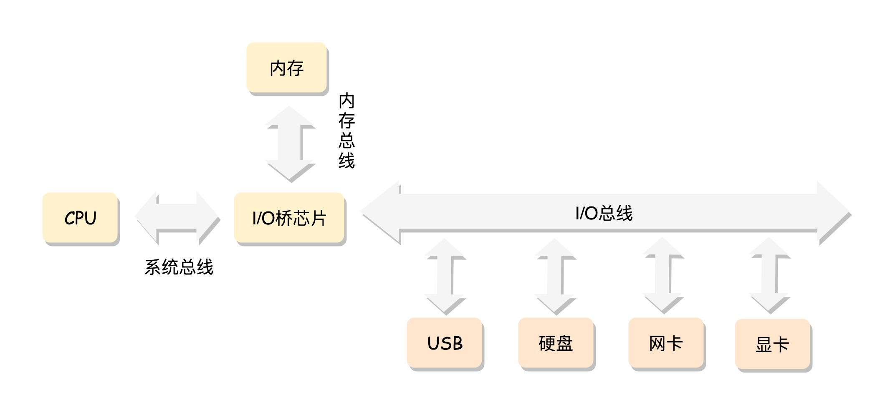

## CPU

核心部件

包含三个单元: 运算单元(只管算，例如做加法、做位移等等。但是，它不知道应该算哪些数据，运算结果应该放在哪里)、数据单元(数据单元包括 CPU 内部的缓存和寄存器组，空间很小，但是速度飞快，可以暂时存放数据和运算结果。避免每次从内存中现拿，太慢了)、控制单元(指挥到底做什么运算的地方,它可以获得下一条指令，然后执行这条指令。这个指令例如说会指导运算单元取出数据单元中的某几个数据，计算出个结果，然后放在数据单元的某个地方。)

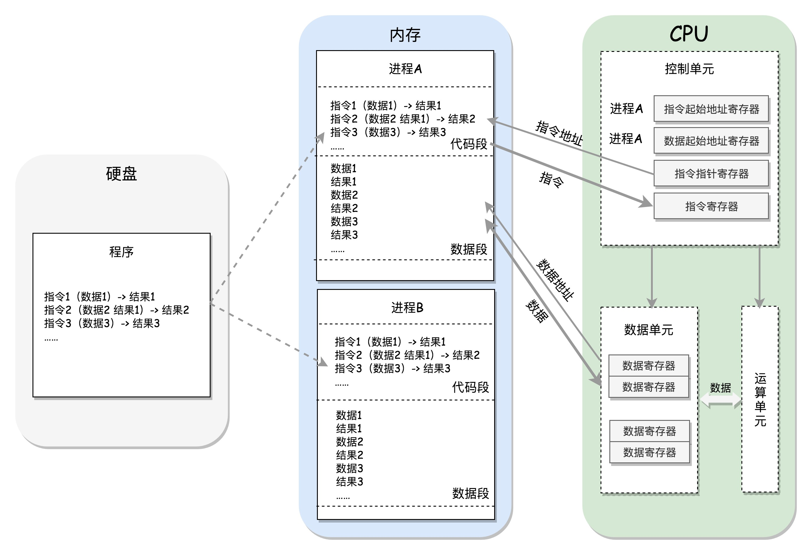

数据单元根据数据的地址，从数据段里读到数据寄存器里，就可以参与运算了。运算单元做完运算，产生的结果会暂存在数据单元的数据寄存器里。最终，会有指令将数据写回内存中的数据段。


CPU 里有两个寄存器，专门保存当前处理进程的代码段的起始地址，以及数据段的起始地址。这里面写的都是进程 A，那当前执行的就是进程 A 的指令，等切换成进程 B，就会执行 B 的指令了，这个过程叫作进程切换（Process Switch）。

`数据寄存器`

- AX: 乘、除运算，字的输入输出，中间结果的缓存
- AL: 字节的乘、除运算，字节的输入输出，十进制算术运算
- AH: 字节的乘、除运算，存放中断的功能号
- BX: 存储器指针
- CX: 串操作、循环控制的计数器
- CL: 移位操作的计数器
- DX: 字的乘、除运算，间接的输入输出

`变址寄存器`

- SI: 存储器指针、串指令中的源操作数指针
- DI: 存储器指针、串指令中的目的操作数指针
- BP: 存储器指针、存取堆栈的指针
- SP: 堆栈的栈顶指针

### 32位架构寄存器

- ESP（Extended Stack Pointer）是栈顶指针寄存器，入栈操作 Push 和出栈操作 Pop 指令，会自动调整 ESP 的值。
- EBP（Extended Base Pointer），是栈基地址指针寄存器，指向当前栈帧的最底部。
- EAX 寄存器

## 硬盘

硬盘中一般会有多个盘片组成，每个盘片包含两个面，每个盘面都对应地有一个读/写磁头。受到硬盘整体体积和生产成本的限制，盘片数量都受到限制，一般都在5片以内。盘片的编号自下向上从0开始

磁道是磁盘上一圈圈同心圆，每个盘面都被划分为数目相等的磁道，并从外缘的“0”开始编号，具有相同编号的磁道形成一个圆柱，称之为磁盘的柱面，每个磁道上一个弧段被称之为一个扇区。扇区是磁盘的最小组成单元，通常是512字节。

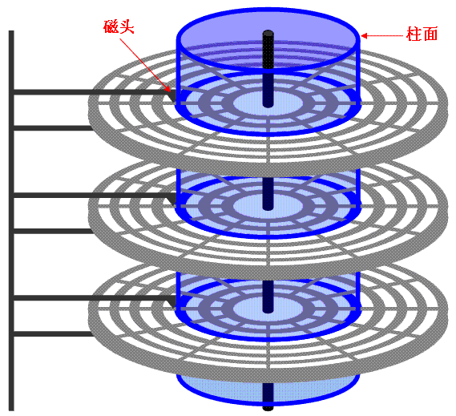

> 图中磁盘是一个 3个圆盘6个磁头，7个柱面（每个盘片7个磁道） 的磁盘，每条磁道有12个扇区，所以此磁盘的容量为：6 * 7 * 12 * 512 = 258048

在读取数据的时候，根据“柱面号”移动磁臂，让磁头指向指定柱面，激活指定盘面对应的磁头，磁盘旋转的过程中，指定的扇区会从磁头下面划过，这样就完成了对指定扇区的读/写。


## 总线

一个是地址数据，也就是我想拿内存中哪个位置的数据，这类总线叫地址总线（Address Bus）；另一类是真正的数据，这类总线叫数据总线（Data Bus）。

地址总线的位数，决定了能访问的地址范围到底有多广。例如只有两位，那 CPU 就只能认 00，01，10，11 四个位置，超过四个位置，就区分不出来了。位数越多，能够访问的位置就越多，能管理的内存的范围也就越广。

而数据总线的位数，决定了一次能拿多少个数据进来。例如只有两位，那 CPU 一次只能从内存拿两位数。要想拿八位，就要拿四次。位数越多，一次拿的数据就越多，访问速度也就越快。

CPU的架构，各个部件的功能

# 如何开机

> 设备买回来不是看的，我们需要使用一个方法使用人类能够理解的方式来运行设备

## 系统初始化的流程

### 实模式

`bios时期`

在主板上，有一个东西叫ROM（Read Only Memory，只读存储器）,上面固化了一些初始化程序BIOS(基本输入输出系统)

- 检查一下系统的硬件
- 要建立一个中断向量表和中断服务程序，因为现在你还要用键盘和鼠标，这些都要通过中断进行的。

`bootloader时期`

寻找操作系统，在 BIOS 的界面上。会有一个启动盘的选项。启动盘一般在第一个扇区，占 512 字节，而且以 0xAA55 结束。这是一个约定，当满足这个条件的时候，就说明这是一个启动盘，在 512 字节以内会启动相关的代码。（启动盘可以由Grub2放在这里）

grub2 第一个要安装的就是 boot.img。它由 boot.S 编译而成，一共 512 字节，正式安装到启动盘的第一个扇区。这个扇区通常称为MBR（Master Boot Record，主引导记录 / 扇区）。BIOS 完成任务后，会将 boot.img 从硬盘加载到内存中的 0x7c00 来运行。boot.img最重要的事就是加载grub2 的另一个镜像 core.img。

core.img 由 lzma_decompress.img、diskboot.img、kernel.img 和一系列的模块组成，功能比较丰富。

boot.img 先加载的是 core.img 的第一个扇区。如果从硬盘启动的话，这个扇区里面是 diskboot.img，对应的代码是 diskboot.S。

boot.img 将控制权交给 diskboot.img 后，diskboot.img 的任务就是将 core.img 的其他部分加载进来，先是解压缩程序 lzma_decompress.img，再往下是 kernel.img，最后是各个模块 module 对应的映像。这里需要注意，它不是 Linux 的内核，而是 grub 的内核。随着我们加载的东西越来越大，实模式这 1M 的地址空间实在放不下了，所以在真正的解压缩之前，lzma_decompress.img 做了一个重要的决定，就是调用 real_to_prot，切换到保护模式，这样就能在更大的寻址空间里面，加载更多的东西。

### 保护模式

第一项是启用分段，就是在内存里面建立段描述符表，将寄存器里面的段寄存器变成段选择子，指向某个段描述符，这样就能实现不同进程的切换了。

第二项是启动分页。能够管理的内存变大了，就需要将内存分成相等大小的块

kernel.img加载外城之后调用grub_main，获取操作系统列表，选择一个进入。装载指定的内核文件，并传递内核启动参数。取 Linux 内核镜像头部的一些数据结构，放到内存中的数据结构来，进行检查。如果检查通过，则会读取整个 Linux 内核镜像到内存。


输入输出设备，设备如何捕捉到你的操作，如何把数据转成人类能够理解的部分

### 内核初始化

进程调度器初始化，内存管理初始化，系统调用初始化

初始化一号进程(用户态程序根进程), 二号进程(内核态程序根进程)

目前主流的 Linux 发行版，无论是 RedHat 系的还是 Debian 系的，都会把 /sbin/init 作为符号链接指向 Systemd。Systemd 是目前最流行的 Linux init 进程，在它之前还有 SysVinit、UpStart 等 Linux init 进程。

systemd有日志记录系统。所有系统事件都将写入到日记中，因此，用户不再需要运行基于 syslog 的服务。日记本身是 systemd 管理的系统服务，全名为 systemd-journald.service。它会根据从内核、用户进程、标准输入和系统服务错误收到的日志记录信息，维护结构化的索引日记，并以此方式来收集和储存日志记录数据。systemd-journald 服务默认处于启用状态。

# 操作指南

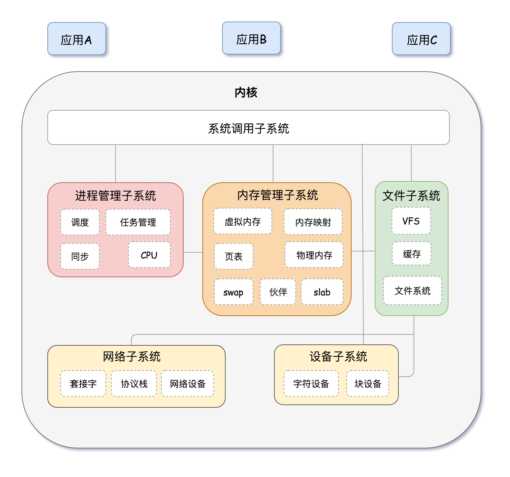

## 如何输入指令

程序IO方式，是采用busy-waiting的方式，即CPU会采用轮询的方式来询问数据-------效果最差

中断IO方式，是设备控制器当取出一个数据之后向CPU发送一个中断，然后CPU将数据从控制器中取到CPU寄存器，再然后转移到内存中。这种方式，CPU是以字节的方式来响应数据的。

DMA方式，是CPU通过向DMA控制器设定若干参数，然后DMA打开了一条内存到设备的通道，这样，设备（内存）中的数据可以不通过ＣＰＵl来进行数据交互。缺点是，DMA是多少设备就需要多少DMA，而且，DMA方式下，CPU的访问设备是以数据块为周期的。

IO通道有自己的指令，也可以执行指令。指令存储在内存。一条IO通道可以连接所有的设备控制器。然后CPU向IO通道发出指令，IO通道将会自动进行获取数据。

IO通道方式需要最少的CPU干预

## 要使用硬件设备应该如何操作

各种指令，系统调用

- mov: CPU内部寄存器之间的数据传送
- cbw: 把寄存器AL中的符号位扩展到寄存器AH
- cwd: 把寄存器AX中的符号扩展到寄存器DX
- call
- jmp
- int
- ret
- add: add OPRD1,OPRD2, 加法运算，把oprd2加到oprd1中
- inc: 加1
- sub: sub OPRD1,OPRD2, 减法运算，oprd1=oprd1-oprd2
- dec: 减1
- neg: 对操作数取补
- cmp: 执行OPRD1 - OPRD2，但运算结果不运送到OPRD1
- mul: 无符号乘法指令
- imul: 有符号乘法指令
- div: 无符号除法指令
- idiv: 有符号除法指令
- not
- and
- or
- xor
- test
- sal: 算术左移
- shl: 逻辑左移
- sar: 算术右移
- shr: 逻辑右移
- shr
- push
- pop

## 如何解析二进制程序执行相应操作

指令格式跟硬件相关，不同的CPU架构指令格式就不一样

操作系统层面区分二进制格式是通过二进制格式文件，Linux是ELF格式，Windows是PE格式，且这些格式会跟加载到内存时的分段相对应（倒不如说是根据这个格式加载的所以表现出同样的分段😹）

以ELF格式为例

- .text：放编译好的二进制可执行代码
- .data：已经初始化好的全局变量
- .rodata：只读数据，例如字符串常量、const 的变量
- .bss：未初始化全局变量，运行时会置 0
- .symtab：符号表，记录的则是函数和变量
- .strtab：字符串表、字符串常量和变量名

文件编译完成生成 so 文件和可执行文件，放在硬盘上。用户态的进程 A 执行 fork(所有的进程都是根用户态进程的子进程，都是fork出来的)，创建进程 B，在进程 B 的处理逻辑中，执行 exec 系列系统调用。这个系统调用会通过 load_elf_binary 方法，将刚才生成的可执行文件，加载到进程 B 的内存中执行。

## 描述一个处理任务

### 进程

使用fork创建进程(所有进程都是从1号直接或者间接fork出来的)

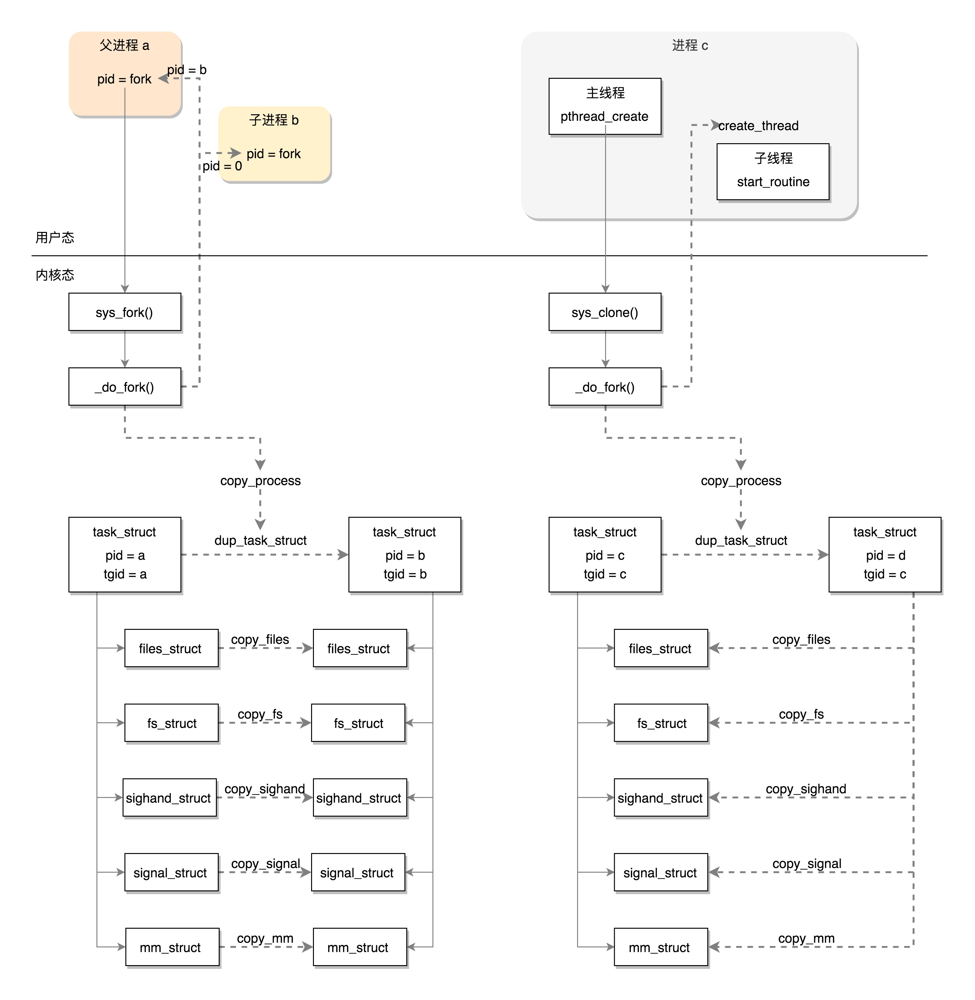

创建进程的话，调用的系统调用是 fork，在 copy_process 函数里面，会将五大结构 files_struct、fs_struct、sighand_struct、signal_struct、mm_struct 都复制一遍，从此父进程和子进程各用各的数据结构。而创建线程的话，调用的是系统调用 clone，在 copy_process 函数里面， 五大结构仅仅是引用计数加一，也即线程共享进程的数据结构。

### 进程结构

Linux 里面，无论是进程，还是线程，到了内核里面，我们统一都叫任务（Task），由一个统一的结构task_struct进行管理。

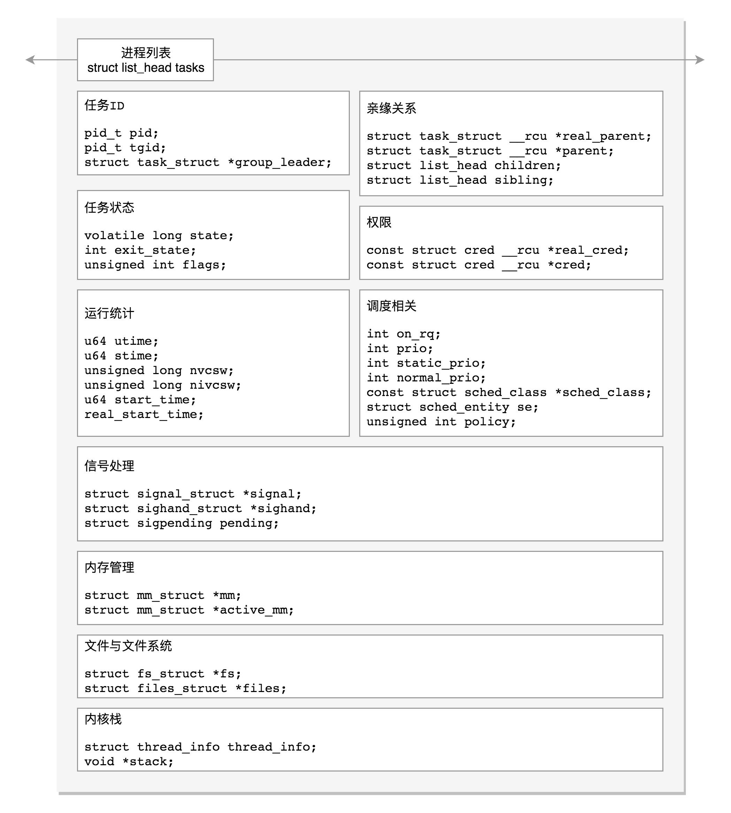

`任务ID`

- pid: 进程id
- tgid: 线程组id
- task_struct

任何一个进程，如果只有主线程，那 pid 是自己，tgid 是自己，group_leader 指向的还是自己。但是，如果一个进程创建了其他线程，那就会有所变化了。线程有自己的 pid，tgid 就是进程的主线程的 pid，group_leader 指向的就是进程的主线程。

可以通过tgid来判断tast_struct 代表的是一个进程还是代表一个线程了。

`任务状态`

state状态值

```c
/* Used in tsk->state: */
#define TASK_RUNNING                    0
#define TASK_INTERRUPTIBLE              1
#define TASK_UNINTERRUPTIBLE            2
#define __TASK_STOPPED                  4
#define __TASK_TRACED                   8
/* Used in tsk->exit_state: */
#define EXIT_DEAD                       16
#define EXIT_ZOMBIE                     32
#define EXIT_TRACE                      (EXIT_ZOMBIE | EXIT_DEAD)
/* Used in tsk->state again: */
#define TASK_DEAD                       64
#define TASK_WAKEKILL                   128
#define TASK_WAKING                     256
#define TASK_PARKED                     512
#define TASK_NOLOAD                     1024
#define TASK_NEW                        2048
#define TASK_STATE_MAX                  4096
```

- TASK_RUNNING 并不是说进程正在运行，而是表示进程在时刻准备运行的状态。当处于这个状态的进程获得时间片的时候，就是在运行中；如果没有获得时间片，就说明它被其他进程抢占了，在等待再次分配时间片。
- TASK_INTERRUPTIBLE，可中断的睡眠状态。这是一种浅睡眠的状态，也就是说，虽然在睡眠，等待 I/O 完成，但是这个时候一个信号来的时候，进程还是要被唤醒。
- TASK_UNINTERRUPTIBLE，不可中断的睡眠状态。一个危险的状态，这是一种深度睡眠状态，不可被信号唤醒，只能死等 I/O 操作完成。一旦 I/O 操作因为特殊原因不能完成，这个时候，谁也叫不醒这个进程了。
- TASK_KILLABLE，可以终止的新睡眠状态。进程处于这种状态中，它的运行原理类似 TASK_UNINTERRUPTIBLE，只不过可以响应致命信号。
- TASK_WAKEKILL 用于在接收到致命信号时唤醒进程，而 TASK_KILLABLE 相当于这两位都设置了。
- TASK_STOPPED 是在进程接收到 SIGSTOP、SIGTTIN、SIGTSTP 或者 SIGTTOU 信号之后进入该状态。
- TASK_TRACED 表示进程被 debugger 等进程监视，进程执行被调试程序所停止。当一个进程被另外的进程所监视，每一个信号都会让进程进入该状态。
- EXIT_ZOMBIE，进程结束时最先进入的状态，如果父进程没有使用wait等系统调用来获取终止信息，这个进程就会变成僵尸进程
- EXIT_DEAD 是进程的最终状态。

`调度相关信息`

包含了是否运行在优先队列，优先级，调度器类，调度实体，调度策略，可以使用哪些CPU

`信号处理`

这里定义了哪些信号被阻塞暂不处理（blocked），哪些信号尚等待处理（pending），哪些信号正在通过信号处理函数进行处理（sighand）。处理的结果可以是忽略，可以是结束进程等等。

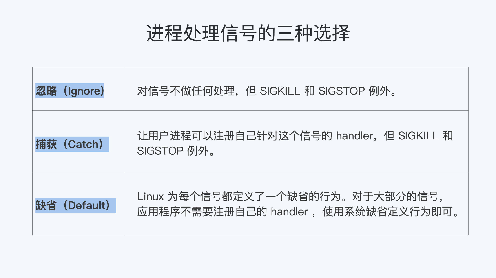

task_struct 里面有一个 struct sigpending pending,这个是本任务的

`struct signal_struct *signal`里面还有一个`struct sigpending shared_pending`, 这个是一个线程组共享的。

`运行统计信息`

用户态和内核态消耗的时间、上下文切换的次数等

```c
u64				utime;// 用户态消耗的 CPU 时间
u64				stime;// 内核态消耗的 CPU 时间
unsigned long			nvcsw;// 自愿 (voluntary) 上下文切换计数
unsigned long			nivcsw;// 非自愿 (involuntary) 上下文切换计数
u64				start_time;// 进程启动时间，不包含睡眠时间
u64				real_start_time;// 进程启动时间，包含睡眠时间
```

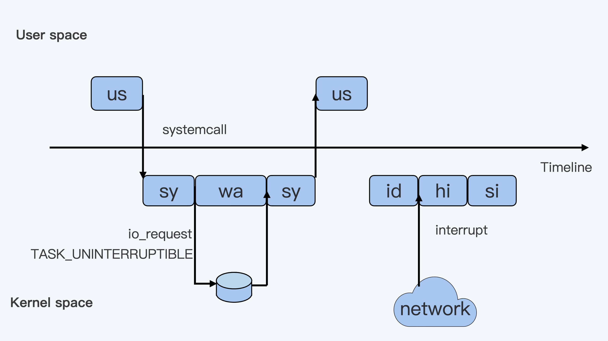

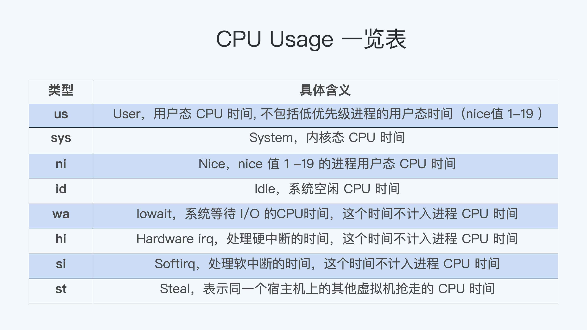

`进程亲缘关系`

- parent 指向其父进程。当它终止时，必须向它的父进程发送信号。
- children 表示链表的头部。链表中的所有元素都是它的子进程。
- sibling 用于把当前进程插入到兄弟链表中。

通常情况下，real_parent 和 parent 是一样的，但是也会有另外的情况存在。例如，bash 创建一个进程，那进程的 parent 和 real_parent 就都是 bash。如果在 bash 上使用 GDB 来 debug 一个进程，这个时候 GDB 是 real_parent，bash 是这个进程的 parent。

`内存管理`

每个进程都有自己独立的虚拟内存空间，这需要有一个数据结构来表示，就是 mm_struct。

`权限`

关于关于用户和用户所属的用户组信息

- uid/gid: 一般情况下，谁启动的进程，就是谁的 ID。但是权限审核的时候，往往不比较这两个，也就是说不大起作用。
- euid/egid: 当这个进程要操作消息队列、共享内存、信号量等对象的时候，其实就是在比较这个用户和组是否有权限。
- fsuid/fsgid: 对文件操作会审核的权限。
- suid/sgid: 在 Linux 里面，一个进程可以随时通过 setuid 设置用户 ID

`thread_info/*stack`

发生系统调用的时候，将用户态和内核态的执行串起来

### 创建进程

`初始化`

分配一个task_struct结构，创建内核栈，复制结构体信息，设置thread_info

将权限相关结构体指向父进程复制下并指向的

接下来是统计量，调度相关同理

然后是文件相关信息

> copy_files 主要用于复制一个进程打开的文件信息。这些信息用一个结构 files_struct 来维护，每个打开的文件都有一个文件描述符。在 copy_files 函数里面调用 dup_fd，在这里面会创建一个新的 files_struct，然后将所有的文件描述符数组 fdtable 拷贝一份。
>
> copy_fs 主要用于复制一个进程的目录信息。这些信息用一个结构 fs_struct 来维护。一个进程有自己的根目录和根文件系统 root，也有当前目录 pwd 和当前目录的文件系统，都在 fs_struct 里面维护。copy_fs 函数里面调用 copy_fs_struct，创建一个新的 fs_struct，并复制原来进程的 fs_struct。

- 复制一个进程打开的文件信息
- copy_fs 主要用于复制一个进程的目录信息
- 初始化与信号相关的变量。
- 复制进程内存空间
- 分配 pid，设置 tid，group_leader，并且建立进程之间的亲缘关系。

信号量相关

复制进程内存空间

分配 pid，设置 tid，group_leader，并且建立进程之间的亲缘关系。

`唤醒进程`

尝试看看能否抢占CPU进入运行状态

如果新创建的进程应该抢占父进程，从fork这个系统调用返回的时候，是抢占的一个好时机，如果父进程判断自己已经被设置为 TIF_NEED_RESCHED，就让子进程先跑，抢占自己。

## 创建线程

线程的创建总体分为三个部分，用户态线程创建、内核态线程创建、用户态执行线程

`用户态线程创建`

线程不是一个完全由内核实现的机制，它是由内核态和用户态合作完成的。

线程在内核态所依赖的数据结构和进程是一样的task_struct, 在用户态维护线程的结构是pthread

数据结构初始化完之后就是创建线程栈。

管理线程栈有两个，一个是 stack_used，也就是这个栈正被使用；另一个是 stack_cache

> stack_cache: 线程栈是在进程的堆里面创建的。如果一个进程不断地创建和删除线程，我们不可能不断地去申请和清除线程栈使用的内存块，这样就需要有一个缓存。会从已经有的缓存中，有没有已经能够满足条件的；

线程栈也是自顶向下生长的，在栈底的位置即地址最高位存放pthread 结构；

为了防止栈的访问越界，在栈的末尾会有一块空间 guardsize，一旦访问到这里就错误了


32位系统，线程的创建受到虚拟地址空间的限制，如果是64 位系统，用户态的虚拟空间大到有 128T，理论上不会受虚拟内存大小的限制，而会受系统的参数或性能限制。

-   **_/proc/sys/kernel/threads-max_**，表示系统支持的最大线程数，默认值是 `14553`（可以通过top -H查看）；
-   **_/proc/sys/kernel/pid_max_**，表示系统全局的 PID 号数值的限制，每一个进程或线程都有 ID，ID 的值超过这个数，进程或线程就会创建失败，默认值是 `32768`；
-   **_/proc/sys/vm/max_map_count_**，表示限制一个进程可以拥有的VMA(虚拟内存区域)的数量，默认值是 `65530`。


`内核态线程创建`

会复制task_struct, 不过其中的部分属性是会共享的

因为我们希望当 clone 这个系统调用成功的时候，除了内核里面有这个线程对应的 task_struct，当系统调用返回到用户态的时候，用户态的栈应该是线程的栈，栈顶指针应该指向线程的栈，指令指针应该指向线程将要执行的那个函数。

> 用户空间中的栈是主线程的函数调用栈，这里创建了新线程，从堆中或者缓存中获取到的新的调用栈，当返回的时候需要让栈顶和栈底指针指向这个新创建的位置而不是主线程的调用栈

`用户态执行线程`

回到用户态也不是直接运行我们指定的那个函数，而是一个通用的 start_thread，这是所有线程在用户态的统一入口

在用户的函数执行完毕之后，会释放这个线程相关的数据。例如，线程本地数据 thread_local variables，线程数目也减一。如果这是最后一个线程了，就直接退出进程

## 多任务如何调度

### 调度策略与调度类

```c
#define SCHED_NORMAL		0
#define SCHED_FIFO		1
#define SCHED_RR		2
#define SCHED_BATCH		3
#define SCHED_IDLE		5
#define SCHED_DEADLINE		6
```

调度策略和优先级配合使用，优先级其实就是一个数值，对于实时进程，优先级的范围是 0～99；对于普通进程，优先级的范围是 100～139。数值越小，优先级越高

对于实时进程和普通进程的调度策略是不一样的

SCHED_FIFO、SCHED_RR、SCHED_DEADLINE 是实时进程的调度策略。

对于普通进程的调度策略有，SCHED_NORMAL、SCHED_BATCH、SCHED_IDLE。

#### 完全公平算法

CFS 全称 Completely Fair Scheduling，叫完全公平调度

记录下进程的运行时间。CPU 会提供一个时钟，过一段时间就触发一个时钟中断。CFS 会为每一个进程安排一个虚拟运行时间 vruntime。如果一个进程在运行，随着时间的增长，也就是一个个 tick 的到来，进程的 vruntime 将不断增大。没有得到执行的进程 vruntime 不变。

CFS 需要一个数据结构来对 vruntime 进行排序，找出最小的那个。能够平衡查询和更新速度的是树，在这里使用的是红黑树。红黑树的节点包含了vruntime，称为调度实体

### 流程

在每个 CPU 上都有一个队列 rq，这个队列里面包含多个子队列，例如 rt_rq 和 cfs_rq，不同的队列有不同的实现方式，cfs_rq 就是用红黑树实现的。

当有一天，某个 CPU 需要找下一个任务执行的时候，会按照优先级依次调用调度类，不同的调度类操作不同的队列。当然 rt_sched_class 先被调用，它会在 rt_rq 上找下一个任务，只有找不到的时候，才轮到 fair_sched_class 被调用，它会在 cfs_rq 上找下一个任务。这样保证了实时任务的优先级永远大于普通任务。

#### 主动调度

主动调度，就是进程运行到一半，因为等待 I/O 等操作而主动让出 CPU。

在 __schedule 里面会做两件事情，第一是选取下一个进程，第二是进行上下文切换。而上下文切换又分用户态进程空间的切换和内核态的切换。

#### 抢占式调度

> 对于用户态的进程来讲，从系统调用中返回的那个时刻，是一个被抢占的时机。
>
> 对内核态的执行中，被抢占的时机一般发生在在 preempt_enable() 中。

一个进程执行时间太长了，是时候切换到另一个进程了或者说当一个进程被唤醒时(与主动调度中遇到IO事件让出CPU相对应)。这时候会发生抢占式调度

这个函数先取出当前cpu 的运行队列，然后得到这个队列上当前正在运行中的进程的 task_struct，调用这个 task_struct 的调度类的 task_tick 函数。

如果当前运行的进程是普通进程，调度类为 fair_sched_class，调用的处理时钟的函数为 task_tick_fair。

当发现当前进程应该被抢占，不能直接把它踢下来，而是把它标记为应该被抢占。用 resched_curr，它会调用 set_tsk_need_resched，标记进程应该被抢占，打上一个标签 TIF_NEED_RESCHED。

当唤醒一个进程的时候，如果被唤醒的进程优先级高于 CPU 上的当前进程，就会触发抢占。

### 上下文切换

> 一是切换进程空间，也即虚拟内存；二是切换寄存器和 CPU 上下文

将某个进程的 thread_struct 里面的寄存器的值，写入到 CPU 的 TR 指向的 tss_struct，对于 CPU 来讲，这就算是完成了切换。

- 内存管理上下文。 包括加载页表、刷出地址转换后备缓冲器，向内存管理单元提供新的信息。
- 页表切换，这就是重新装载全局页表，用于给进程安装一个新的虚拟地址空间。
- 由于进程的栈都在内核态，所以切换内核态堆栈上下文数据。
- 硬件上下文，主要部分就是进程和CPU的任务状态寄存器，就是TSS中的字段。在这里CPU为了减轻很多切换的工作，很多地方都是如果有必要，就切换，就是所谓的惰性原则。

`运行状态`

- 就绪->执行: 分配到CPU了
- 执行->就绪: CPU时间片用完了
- 执行->阻塞: 发生IO事件
- 阻塞->就绪: IO事件完成

## 死锁

多个任务并行容易产生临界区，如果加锁控制则有死锁的可能

- 互斥条件
- 请求保持
- 不可剥夺
- 循环等待

银行家算法是著名的死锁避免算法，避免死锁并不是事先采取某种限制措施破坏死锁的必要条件，而是再资源动态分配过程中，防止系统进入不安全状态，以避免发生死锁

## 进程间通信

> System V IPC 进程间通信机制体系

### 管道模型

瀑布流结构

分为匿名管道和命名管道， 效率比较低下，不适合进程间频繁的交换数据。

```bash
mkfifo hello # 创建一个命名管道

echo "hello world" > hello # 终端a, 阻塞

cat < hello # 终端b，读出数据
```

匿名管道，也是创建在文件系统上的，只不过是一种特殊的文件系统，创建一个特殊的文件，对应一个特殊的 inode, 本质上是内核中的一段缓存

创建的子进程会复制父进程的 struct files_struct，在这里面 fd 的数组会复制一份，但是 fd 指向的 struct file 对于同一个文件还是只有一份，这样就做到了，两个进程各有两个 fd 指向同一个 struct file 的模式，两个进程就可以通过各自的 fd 写入和读取同一个管道文件实现跨进程通信了。

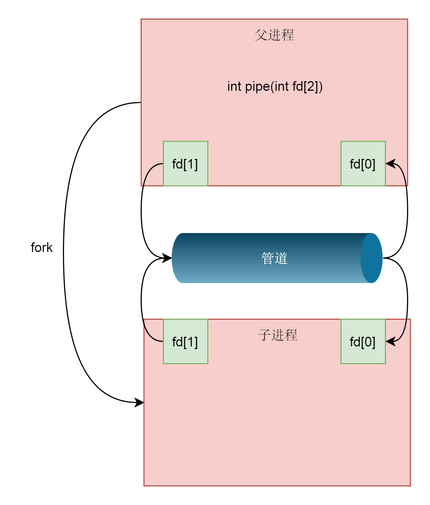

### 消息队列模型

发送数据时，会分成一个一个独立的数据单元，也就是消息体，每个消息体都是固定大小的存储块，在字节流上不连续。具体有哪些字段没有约束，发送方和消费方约定好即可

不过这种模型存在消息大小限制以及消息不及时的问题

```c
struct msg_buffer {
    long mtype;
    char mtext[1024];
};
```

### 共享内存模型

共享内存

信号量: 保护机制，使得同一个共享的资源，同时只能被一个进程访问

- 无论是共享内存还是信号量，创建与初始化都遵循同样流程，通过 ftok 得到 key，通过 xxxget 创建对象并生成 id；
- 生产者和消费者都通过 shmat 将共享内存映射到各自的内存空间，在不同的进程里面映射的位置不同；
- 为了访问共享内存，需要信号量进行保护，信号量需要通过 semctl 初始化为某个值；
- 接下来生产者和消费者要通过 semop(-1) 来竞争信号量，如果生产者抢到信号量则写入，然后通过 semop(+1) 释放信号量，如果消费者抢到信号量则读出，然后通过 semop(+1) 释放信号量；
- 共享内存使用完毕，可以通过 shmdt 来解除映射。

信号: 类似应急预案

## 信号

有时候，我们在终端输入某些组合键的时候，会给进程发送信号，例如，Ctrl+C 产生 SIGINT 信号，Ctrl+Z 产生 SIGTSTP 信号。

有的时候，硬件异常也会产生信号。比如，执行了除以 0 的指令，CPU 就会产生异常，然后把 SIGFPE 信号发送给进程。再如，进程访问了非法内存，内存管理模块就会产生异常，然后把信号 SIGSEGV 发送给进程。

> 中断要注册中断处理函数，但是中断处理函数是在内核驱动里面的，信号也要注册信号处理函数，信号处理函数是在用户态进程里面的。

中断和信号的严重程度不一样，信号影响的往往是某一个进程，处理慢了，甚至错了，也不过这个进程被干掉，而中断影响的是整个系统。一旦中断处理中有了 bug，可能整个 Linux 都挂了。

# 输入输出设备管理

> 输入字符设备，鼠标; 输出字符设备，打印机
>
> 块设备比字符设备复杂多了，涉及三个文件系统

- 用设备控制器屏蔽设备差异
- 用驱动程序屏蔽设备控制器差异
- 用文件系统接口屏蔽驱动程序的差异

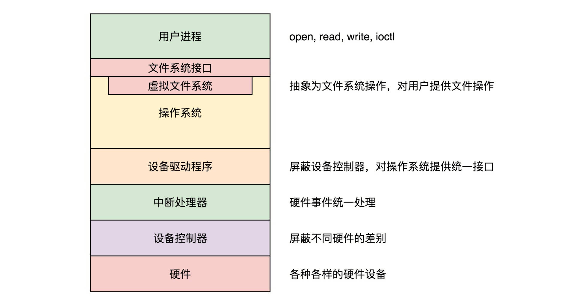

CPU 并不直接和设备打交道，它们中间有一个叫作设备控制器（Device Control Unit）的组件，例如硬盘有磁盘控制器、USB 有 USB 控制器、显示器有视频控制器等。

控制器其实有点儿像一台小电脑。它有它的芯片，类似小 CPU，执行自己的逻辑。它也有它的寄存器。这样 CPU 就可以通过写这些寄存器，对控制器下发指令，通过读这些寄存器，查看控制器对于设备的操作状态。

- 块设备将信息存储在固定大小的块中，每个块都有自己的地址。硬盘就是常见的块设备。
- 字符设备发送或接受的是字节流。而不用考虑任何块结构，没有办法寻址。鼠标就是常见的字符设备。

有了文件系统接口之后，我们不但可以通过文件系统的命令行操作设备，也可以通过程序，调用 read、write 函数，像读写文件一样操作设备。但是有些任务只使用读写很难完成，例如检查特定于设备的功能和属性，超出了通用文件系统的限制。所以，对于设备来讲，还有一种接口称为 ioctl，表示输入输出控制接口，是用于配置和修改特定设备属性的通用接口

在 Linux 上面，如果一个新的设备从来没有加载过驱动，也需要安装驱动。Linux 的驱动程序已经被写成和操作系统有标准接口的代码，可以看成一个标准的内核模块。在 Linux 里面，安装驱动程序，其实就是加载一个内核模块。我们可以用命令 lsmod，查看有没有加载过相应的内核模块。

```bash
lsmod

...

# 例如要加载 openvswitch 的驱动
insmod openvswitch.ko

# 绑定设备
mknod [filename] [type] [major] [minor]
```

其中 filename 就是 /dev 下面的设备名称，type 就是 c 为字符设备，b 为块设备，major 就是主设备号，minor 就是次设备号。一旦执行了这个命令，新创建的设备文件就和上面加载过的驱动关联起来，这个时候就可以通过操作设备文件来操作驱动程序，从而操作设备。

## 中断流程

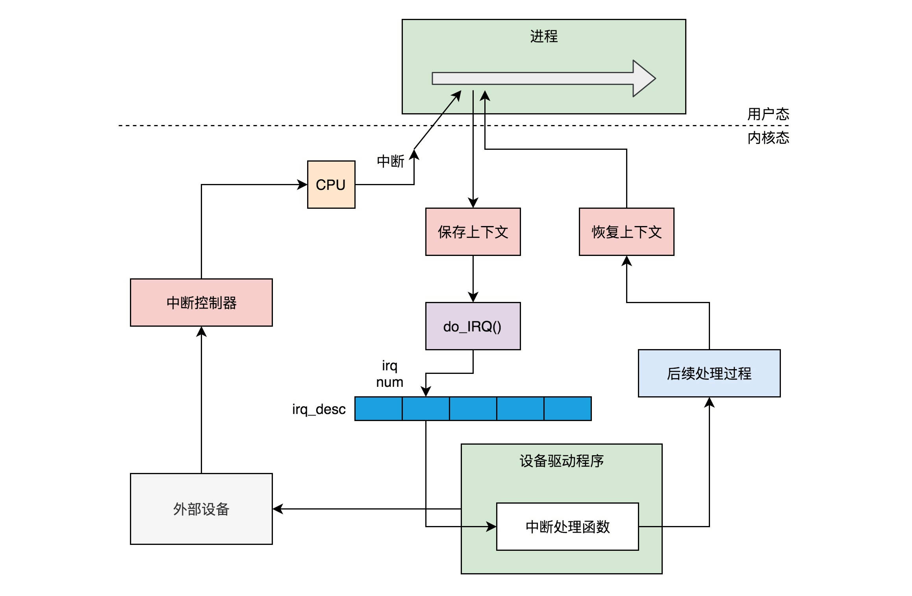

设备驱动程序在初始化的时候就会先注册一个该设备的中断处理函数

## 内存

从发出指令到读取物理内存的整个流程

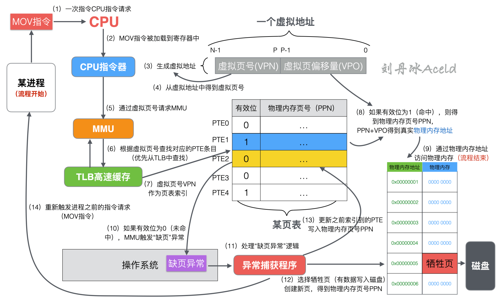

### 虚拟内存

主要在于物理地址的管理、虚拟地址的管理、物理地址与虚拟地址的映射

内存空间的分配与回收

- 分配结构: 登记内存使用情况，提供分配程序使用的表格与链表。
- 放置策略: 确定调入内存的程序和数据在内存中的位置。
- 交换策略: 确定进行内外存交换时哪些内存中的程序与数据应该被换出。
- 调入策略: 外存中的数据和程序在什么时间按什么控制方式进入内存。
- 回收策略: 回收时机——什么时间回收？回收空间管理——怎样管理回收的空间以方便再次使用？

cache与主存

> 全写法通常与非写分配法配合，写分配法和写回法配合

- 写命中
    - 全写法: 数据同时写入cache与主存，这样后续如果有覆盖cache可以直接覆盖
    - 写回法: 只写入cache，要被替换的时候才写回主存
- 写不命中
    - 写分配法: 加载主存中对应的块到cache中，然后更新这个块
    - 非写分配法: 只写入主存，不进行调块

内存分配策略

- 最佳适应：每次分配最小的内存，这种方法能使碎片尽量小；
- 最坏适应：每次分配最大的内存；
- 首次适应：地址由低到高，找出一个能满足要求的空闲分区给所需要的请求；
- 循环首次适应：首次适应的变种，分配内存时，从上次找到的空闲区的下一个空闲处开始查找，该算法可以使得内存中空闲区域分布的较均匀。

#### 段式管理

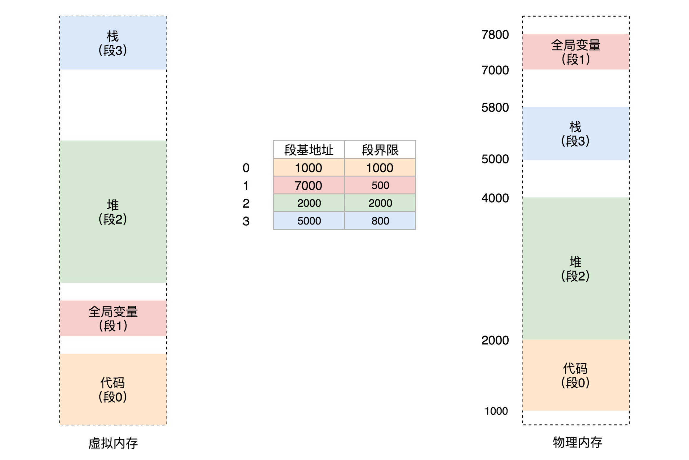

如果要访问段 2 中偏移量 600 的虚拟地址，我们可以计算出物理地址为，段 2 基地址 2000 + 偏移量 600 = 2600。

> 在 Linux 里面，段表全称段描述符表（segment descriptors），放在全局描述符表 GDT（Global Descriptor Table）里面。一个段表项由段基地址 base、段界限 limit，还有一些标识符组成。但是所有的段的起始地址都是一样的，都是 0。所以并没有使用到全部的分段功能。主要是做权限审核，linux更倾向于使用分页来做映射

#### 页式管理

- 存储分配表: 实现对空闲块管理
- 页表: 建立进程中的块（页）->  内存中的块（页框）的映射关系；

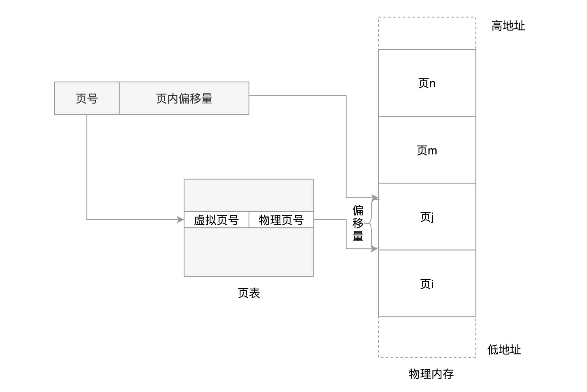

逻辑地址为3000表示为10进制数，化为二进制则是101110111000，页面大小1KB=1024Byte(2^10=1024)，需要后10位（1110111000）来表示页面大小，前两位二进制数10代表页号为2（十进制），通过页表(假设这里页号2对应块号2)知道块号（物理页框号）为1即二进制01，把块号01替换页号10得到物理地址二进制011110111000化为10进制为1976

把虚拟地址转换成物理地址，是硬件自动完成的。计算机硬件自动把地址空间的地址分为页号和页内相对地址，通过页号在页表找到内存中的对应块号，内存的物理地址用下面的公式计算得出:内存的物理地址=块号x每一页的字节数+页内偏移地址。

页表中所有页表项必须提前建好，并且要求是连续的。如果不连续，就没有办法通过虚拟地址里面的页号找到对应的页表项了。

通过为页表再创建页面(目录的效果), 能够表示更大的空间

#### 段页式管理

段页式存储管理方式即先将用户程序分成若干个段，并为每一个段赋予一个段名，每段可以独立地从“0”编制（段管虚拟），再把每个段分成大小相等的若干页（页管内存），把主存分成与页大小相同的块。

### 物理内存

`SMP模式`

SMP（Symmetric multiprocessing），多处理器模式，在这种模式下，CPU 也会有多个，在总线的一侧。所有的内存条组成一大片内存，在总线的另一侧，所有的 CPU 访问内存都要过总线。有一个显著的缺点，就是总线会成为瓶颈，因为数据都要走它。

`NUMA模式`

NUMA（Non-uniform memory access），非一致内存访问。在这种模式下，内存不是一整块。每个 CPU 都有自己的本地内存，CPU 访问本地内存不用过总线，因而速度要快很多，每个 CPU 和内存在一起，称为一个 NUMA 节点。但是，在本地内存不足的情况下，每个 CPU 都可以去另外的 NUMA 节点申请内存，这个时候访问延时就会比较长。

#### 页

组成物理内存的基本单位，页的数据结构 struct page

- 第一种模式，要用就用一整页。这一整页的内存，或者直接和虚拟地址空间建立映射关系，我们把这种称为匿名页（Anonymous Page）。或者用于关联一个文件，然后再和虚拟地址空间建立映射关系，这样的文件，我们称为内存映射文件（Memory-mapped File）。
- 第二种模式，仅需分配小块内存

Linux 系统采用了一种被称为slab allocator的技术，用于分配称为 slab 的一小块内存。它的基本原理是从内存管理模块申请一整块页，然后划分成多个小块的存储池，用复杂的队列来维护这些小块的状态（状态包括：被分配了 / 被放回池子 / 应该被回收）。

#### 页的分配

- 物理内存分 NUMA 节点，分别进行管理；
- 每个 NUMA 节点分成多个内存区域；
- 每个内存区域分成多个物理页面；
- 伙伴系统将多个连续的页面作为一个大的内存块分配给上层；
- kswapd 负责物理页面的换入换出；
- Slub Allocator 将从伙伴系统申请的大内存块切成小块，分配给其他系统。

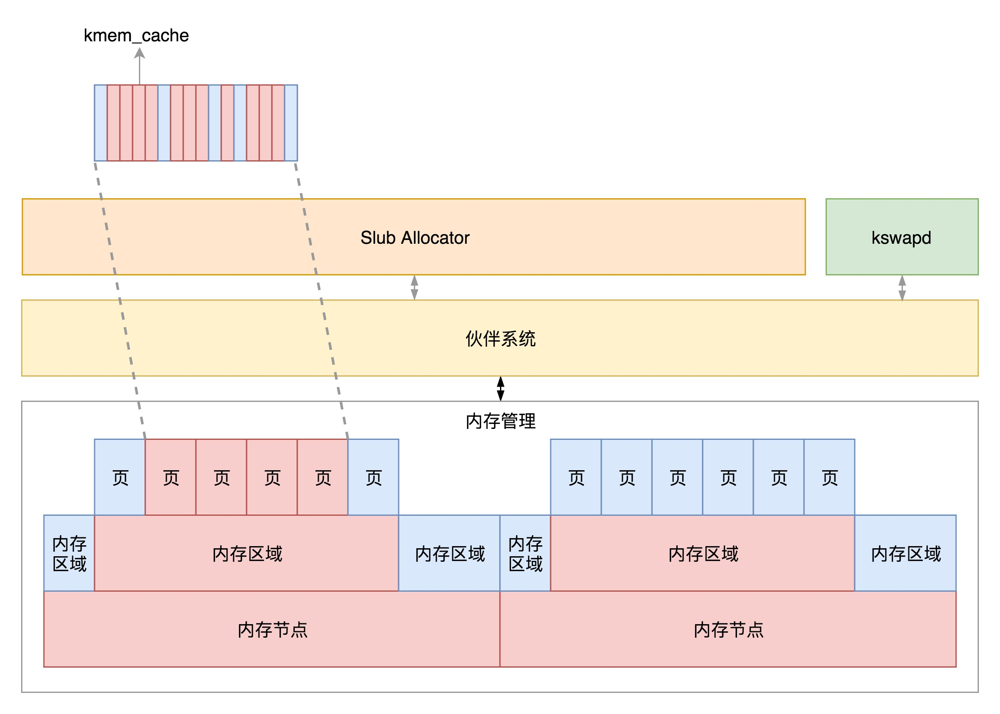

如果遇到小的对象，会使用 slub 分配器进行分配

对于要分配比较大的内存，例如到分配页级别的，可以使用伙伴系统（Buddy System）

Linux 中的内存管理的“页”大小为 4KB。把所有的空闲页分组为 11 个页块链表，每个块链表分别包含很多个大小的页块，有 1、2、4、8、16、32、64、128、256、512 和 1024 个连续页的页块。最大可以申请 1024 个连续页，对应 4MB 大小的连续内存。每个页块的第一个页的物理地址是该页块大小的整数倍。

### 虚拟内存与物理内存的映射

Linux 的各个模块都需要内存，比如内核需要分配内存给页表，内核栈，还有 slab，也就是内核各种数据结构的 Cache Pool；用户态进程里的堆内存和栈的内存，共享库的内存，还有文件读写的 Page Cache。

应用程序在申请内存的时候，比如说，调用 malloc() 来申请 100MB 的内存大小，malloc() 返回成功了，这时候系统其实只是把 100MB 的虚拟地址空间分配给了进程，但是并没有把实际的物理内存页面分配给进程。（例如，我们运行 top 命令查看这个程序在运行了 malloc() 之后的内存，我们可以看到这个程序的虚拟地址空间（VIRT）已经有了 106728KB（～100MB)，但是实际的物理内存 RSS（top 命令里显示的是 RES，就是 Resident 的简写，和 RSS 是一个意思）在这里只有 688KB。）

RSS 是每个进程实际占用的物理内存，它包括了进程的代码段内存，进程运行时需要的堆和栈的内存，这部分内存是进程运行所必须的。

Page Cache 是进程在运行中读写磁盘文件后，作为 Cache 而继续保留在内存中的，它的目的是为了提高磁盘文件的读写性能。

在有磁盘文件访问的时候，Linux 会尽量把系统的空闲内存用作 Page Cache 来提高文件的读写性能。在没有打开 Swap 空间的情况下，一旦内存不够，这种情况下就只能把 Page Cache 释放了，而 RSS 内存是不能释放的。在 RSS 里的内存，大部分都是没有对应磁盘文件的内存，比如用 malloc() 申请得到的内存，这种内存也被称为匿名内存（Anonymous memory）。那么当 Swap 空间打开后，可以写入 Swap 空间的，就是这些匿名内存。在释放内存的时候，需要平衡 Page Cache 的释放和匿名内存的释放，而 swappiness，就是用来定义这个平衡的参数。

- swappiness 的取值范围在 0 到 100，值为 100 的时候系统平等回收匿名内存和 Page Cache 内存；
- 一般缺省值为 60，就是优先回收 Page Cache；
- 即使 swappiness 为 0，也不能完全禁止 Swap 分区的使用，就是说在内存紧张的时候，也会使用 Swap 来回收匿名内存。

内存回收的算法会根据不同类型的内存以及内存的最近最少用原则，就是 LRU（Least Recently Used）算法决定哪些内存页面先被释放。因为 Page Cache 的内存页面只是起到 Cache 作用，自然是会被优先释放的。

所以，Page Cache 是一种为了提高磁盘文件读写性能而利用空闲物理内存的机制。同时，内存管理中的页面回收机制，又能保证 Cache 所占用的页面可以及时释放

#### 用户态映射

用户态缺页中断: 内存管理并不直接分配物理内存，因为物理内存相对于虚拟地址空间太宝贵了，只有等你真正用的那一刻才会开始分配。

每个进程都有独立的地址空间，为了这个进程独立完成映射，每个进程都有独立的进程页表，这个页表的最顶级的 pgd 存放在 task_struct 中的 mm_struct 的 pgd 变量里面。

- cr3 里面存放当前进程的顶级 pgd，这个是硬件的要求。cr3 里面需要存放 pgd 在物理内存的地址，不能是虚拟地址
- 用户进程在运行的过程中，访问虚拟内存中的数据，会被 cr3 里面指向的页表转换为物理地址后，才在物理内存中访问数据，这个过程都是在用户态运行的，地址转换的过程无需进入内核态。

如果是匿名映射则分配物理内存；如果是 swap，则将 swap 文件读入；如果是文件映射，则将文件读入。

对于用户态的内存分配，或者直接调用 mmap 系统调用分配，或者调用 malloc。调用 malloc 的时候，如果分配小的内存，就用 sys_brk 系统调用；如果分配大的内存，还是用 sys_mmap 系统调用。正常情况下，用户态的内存都是可以换出的，因而一旦发现内存中不存在，就会调用 do_page_fault。

#### 内核态映射

和用户态页表不同，在系统初始化的时候，我们就要创建内核页表了。

对于内核态，kmalloc 在分配大内存的时候，以及 vmalloc 分配不连续物理页的时候，直接使用伙伴系统，分配后转换为虚拟地址，访问的时候需要通过内核页表进行映射。

对于 kmem_cache 以及 kmalloc 分配小内存，则使用 slub 分配器，将伙伴系统分配出来的大块内存切成一小块一小块进行分配。

kmem_cache 和 kmalloc 的部分不会被换出，因为用这两个函数分配的内存多用于保持内核关键的数据结构。内核态中 vmalloc 分配的部分会被换出，因而当访问的时候，发现不在，就会调用 do_page_fault。

1、内核态内存映射函数 vmalloc、kmap_atomic 是如何工作的；

kmap_atomic 和 vmalloc 不同。kmap_atomic 发现，没有页表的时候，就直接创建页表进行映射了。而 vmalloc 没有，它只分配了内核的虚拟地址。所以，访问它的时候，会产生缺页异常。


2、内核态页表是放在哪里的，如何工作的？swapper_pg_dir 是怎么回事；

3、出现了内核态缺页异常应该怎么办？

### 数据安全问题

假设多个CPU，同时对一块内存写操作，那么就存在竞态问题

CPU实现原子指令有3种方式：

1、处理器自动保证基本内存操作的原子性

处理器保证从系统内存当中读取或者写入一个字节是原子的，其他处理器不能访问这个字节的内存地址。

但是复杂的内存操作处理器不能自动保证其原子性，比如跨总线宽度，跨多个缓存行，跨页表的访问。但是处理器提供总线锁定和缓存锁定两个机制来保证复杂内存操作的原子性。

2、总线锁定

处理器使用了总线锁，一个 LOCK# 信号，当一个处理器在总线上输出此信号时，其他处理器的请求将被阻塞住，那么该处理器可以独占共享内存。

3、缓存锁定

保证对某个内存地址的操作是原子性，指内存区域如果被缓存在处理器的缓存行中，并且在Lock 操作期间被锁定

当它执行操作写回到内存时，处理器不在总线上输出 LOCK# 信号，而是修改内部的内存地址，并允许它的缓存一致性机制来保证操作的原子性

因为缓存一致性机制会阻止同时修改两个以上处理器缓存的内存区域数据，当其他处理器回写已被锁定的缓存行的数据时，会使缓存行无效。

**注意：有两种情况下处理器不会使用缓存锁定**

1.  当操作的数据不能被缓存在处理器内部，或操作的数据跨多个缓存行时，则处理器会调用总线锁定。
2.  有些处理器不支持缓存锁定，对于 Intel 486 和 Pentium 处理器，就是锁定的内存区域在处理器的缓存行也会调用总线锁定。

## 磁盘

吞吐量=数据块大小*IOPS。

- IOPS是Input/Output Operations Per Second的简称，也就是每秒钟磁盘读写的次数，这个数值越大，当然也就表示性能越好。
- 吞吐量（Throughput）是指每秒钟磁盘中数据的读取量，一般以MB/s为单位。这个读取量可以叫作吞吐量，有时候也被称为带宽（Bandwidth）。


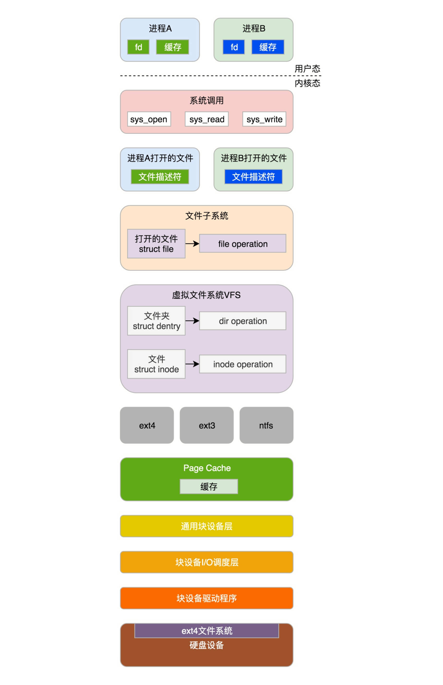

- 在应用层，进程在进行文件读写操作时，可通过系统调用如 sys_open、sys_read、sys_write 等。
- 在内核，每个进程都需要为打开的文件，维护一定的数据结构。
- 在内核，整个系统打开的文件，也需要维护一定的数据结构。
- Linux 可以支持多达数十种不同的文件系统。它们的实现各不相同，因此 Linux 内核向用户空间提供了虚拟文件系统这个统一的接口，来对文件系统进行操作。它提供了常见的文件系统对象模型，例如 inode、directory entry、mount 等，以及操作这些对象的方法，例如 inode operations、directory operations、file operations 等。
- 然后就是对接的是真正的文件系统，例如我们上节讲的 ext4 文件系统。
- 为了读写 ext4 文件系统，要通过块设备 I/O 层，也即 BIO 层。这是文件系统层和块设备驱动的接口。
- 为了加快块设备的读写效率，我们还有一个缓存层。
- 最下层是块设备驱动程序。

这里核心的四个系统调用

- mount 系统调用用于挂载文件系统；
- open 系统调用用于打开或者创建文件，创建要在 flags 中设置 O_CREAT，对于读写要设置 flags 为 O_RDWR；
- read 系统调用用于读取文件内容；
- write 系统调用用于写入文件内容。

### 文件系统

> 为了防止任务就消失以及记录结果方便以后继续使用，我们需要设计一个文件系统，来放置各个数据

inode, 一个索引区域，用来维护“某个文件分成几块、每一块在哪里“等等这些基本信息，文件还有元数据部分，例如名字、权限等。访问了，不代表修改了，也可能只是打开看看，就会改变 access time。其次，修改 inode，有可能修改的是用户和权限，没有修改数据部分，就会改变 change time。只有数据也修改了，才改变 modify time。

目录项: dentry(与目录是一个文件不同，目录项只是一个数据结构), 由内核维护不存在磁盘而是缓存在内存中, 包含文件名，索引节点指针，与其他节点的层级关系

- 文件系统要有严格的组织形式，使得文件能够以块为单位进行存储
- 文件系统中也要有索引区，用来方便查找一个文件分成的多个块都存放在了什么位置
- 如果文件系统中有的文件是热点文件，近期经常被读取和写入，文件系统应该有缓存层。
- 文件应该用文件夹的形式组织起来，方便管理和查询。
- Linux 内核要在自己的内存里面维护一套数据结构，来保存哪些文件被哪些进程打开和使用

文件系统的分类，按照存储位置不同

-   _磁盘的文件系统_，它是直接把数据存储在磁盘中，比如 Ext 2/3/4、XFS 等都是这类文件系统。
-   _内存的文件系统_，这类文件系统的数据不是存储在硬盘的，而是占用内存空间，我们经常用到的 `/proc` 和 `/sys` 文件系统都属于这一类，读写这类文件，实际上是读写内核中相关的数据数据。
-   _网络的文件系统_，用来访问其他计算机主机数据的文件系统，比如 NFS、SMB 等等。

所有的文件系统都需要挂载到某个目录下才能正常使用，比如linux启动的时候就会把一些文件系统挂载到根目录

#### 块

 Linux 是用位图的方式管理空闲空间，用户在创建一个新文件时，Linux 内核会通过 inode 的位图找到空闲可用的 inode，并进行分配。要存储数据时，会通过块的位图找到空闲的块，并分配。

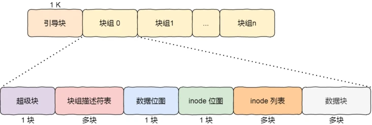

-   _超级块_，包含的是文件系统的重要信息，比如 inode 总个数、块总个数、每个块组的 inode 个数、每个块组的块个数等等。
-   _块组描述符_，包含文件系统中各个块组的状态，比如块组中空闲块和 inode 的数目等，每个块组都包含了文件系统中「所有块组的组描述符信息」。
-   _数据位图和 inode 位图_， 用于表示对应的数据块或 inode 是空闲的，还是被使用中。
-   _inode 列表_，包含了块组中所有的 inode，inode 用于保存文件系统中与各个文件和目录相关的所有元数据。
-   _数据块_，包含文件的有用数据。

文件系统操作的基本单位是数据块

-   当用户进程从文件读取 1 个字节大小的数据时，文件系统则需要获取字节所在的数据块，再返回数据块对应的用户进程所需的数据部分。
-   当用户进程把 1 个字节大小的数据写进文件时，文件系统则找到需要写入数据的数据块的位置，然后修改数据块中对应的部分，最后再把数据块写回磁盘。

`文件控制块`

file control block，文件控制块，存储文件在磁盘中的相关信息，每一个文件都包含一个独立的且含所有文件信息的fcb

打开文件，操作系统根据文件名a，在系统文件打开表中查找，如果文件a已经打开，则在进程文件打开表中为文件a分配一个表项，然后将该表项的指针指向系统文件打开表中和文件a对应的一项;然后再PCB中为文件分配一个文件描述符fd，作为进程文件打开表项的指针,文件打开完成。

如果文件a没有打开，查看含有文件a信息的目录项是否在内存中，如果不在，将目录表装入到内存中，作为cache；根据目录表中文件a对应项找到FCB在磁盘中的位置；将文件a的FCB装入到内存中的Active inode中；然后在系统文件打开表中为文件a增加新的一个表项，将表项的指针指向Active Inode中文件a的FCB；然后在进程的文件打开表中分配新的一项，将该表项的指针指向系统文件打开表中文件a对应的表项；然后在PCB中，为文件a分配一个文件描述符fd，作为进程文件打开表项的指针,文件打开完成。

Linux 通过文件描述符表维护了打开的文件描述符信息，而文件描述符表中的每一项都指向一个内核维护的文件表，文件表指向打开的文件的 [vnode](https://www.freebsd.org/cgi/man.cgi?query=vnode)(Unix) 和 [inode](https://en.wikipedia.org/wiki/Inode)。同时，文件表保存了进程对文件读写的偏移量等信息。

从每一步的文件偏移量来看，读取的程序只是按部就班的一个字符一个字符的读取文件，对文件内容的变化毫无感知，当读取到文件结尾的 `EOF` 时结束读取。

那么我们要如何保证读取与写入的一致性呢？ Linux 提供了 `fcntl` 系统调用，可以[锁定文件](https://www.gnu.org/software/libc/manual/html_node/File-Locks.html)。

1.  文件锁是与进程相关的，一个进程中的多个线程/协程对同一个文件进行的锁操作会互相覆盖掉，从而无效。
2.  `fcntl` 创建的锁是建议性锁，只有写入的进程和读取的进程都遵循建议才有效；对应的有强制性锁，会在每次文件操作时进行判断，但性能较差，因此 Linux/Unix 系统默认采用的是建议性锁。

那么可以创建一个临时文件来表示当前有对象在操作，从而避免并发问题。

### 格式化

> 使用 Windows 的时候，常格式化的格式为NTFS（New Technology File System）。在 Linux 下面，常用的是 ext3 或者 ext4。

```bash
mkfs.ext4 /dev/vdc
```

ext3增加了日志功能，即使在非正常关机后，系统也不需要检查文件系统

ext3文件系统能够极大地提高文件系统的完整性，避免了意外宕机对文件系统的破坏

Ext3 目前所支持的最大16TB 文件系统和最大2TB 文件

ext2/ext3文件系统使用索引节点来记录文件信息，包含了一个文件的长度、修改时间、权限、所属关系、磁盘中的位置等信息

ext2/ext3均不包含文件创建时间

### 文件类型

硬链接与原始文件共用一个 inode 的，但是 inode 是不跨文件系统的，每个文件系统都有自己的 inode 列表，因而硬链接是没有办法跨文件系统的。

而软链接不同，软链接相当于重新创建了一个文件。这个文件也有独立的 inode，只不过打开这个文件看里面内容的时候，内容指向另外的一个文件。这就很灵活了。我们可以跨文件系统，甚至目标文件被删除了，链接文件还是在的，只不过指向的文件找不到了而已。

快速创建一个指定大小的文件, 比如10G, `dd if=/dev/zero of=./test.log bs=4096 count=2621440`

### 缓存IO

缓存 I/O 读写的流程不一样。对于读，从块设备读取到缓存中，然后从缓存中拷贝到用户态。对于写，从用户态拷贝到缓存，设置缓存页为脏，然后启动一个线程写入块设备。

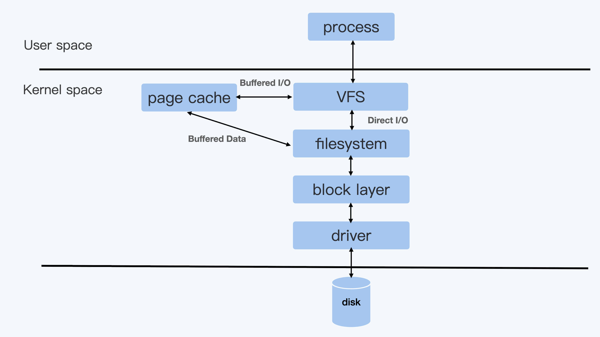

#### dirty page

设定一个比值 A，A 等于 dirty pages 的内存 / 节点可用内存 *100%。

- dirty_background_ratio: 如果比值 A 大于这个值就会刷脏
- dirty_background_bytes: 比较的是bytes
- dirty_ratio: 如果比值A大于这个值，正在执行 Buffered I/O 写文件的进程就会被阻塞住
- dirty_bytes
- dirty_writeback_centisecs
- dirty_expire_centisecs

dirty_background_ratio 和 dirty_background_bytes 只有一个可以起作用，如果你给其中一个赋值之后，另外一个参数就归 0 了。

# 远端数据

网络系统

## 网络IO模型

本质上io复用是将用户态的轮询状态操作移到了内核态，由系统内核处理轮询操作并通知，操作的输入输出设备就是网卡，涉及到从网卡的缓冲区与内核缓冲区之间的数据拷贝。(zero copy, 就是指通过DMA处理这两步，省去CPU操作的将数据从内核拷贝到用户空间，然后从用户空间拷贝到socket中的操作)

IO事件通知方式

- 水平触发: 允许在任意时刻重复检测IO的状态
- 边缘触发: 只有在新的io事件到来时才发送一次通知

IO多路复用的方法，用于监听多个描述符，发生变化时，通知程序进行相应的读写操作

**select | poll**

> 非阻塞IO+水平触发通知

poll和select都会有用户空间与内核空间之间的数据拷贝

select的最大数量受到单个进程可监视的fd数量被限制(`/proc/sys/fs/file-max`, 32位系统默认是1024个，64位系统是2048个)

poll相较于select没有限制，是因为使用链表进行存储的。它的上限是最大是可以打开的文件的个数

从文件描述符列表中找出可以执行IO的，然后进行网络IO读写。由于I/O是非阻塞的，一个线程中就可以同时监控一批套接字的文件描述符，达到了单线程处理多请求的目的。

需要对文件描述符列表轮询，请求多时较为耗时，且select和poll还有一些限制。以及应用程序每次调用select和poll时还需要把文件描述符的集合从用户空间传入内核空间，由内核修改后再传回用户空间。增加了处理成本。

**epoll**

LT和ET，默认是LT水平触发

> 非阻塞IO+边缘触发通知

示例: 一个管道收到了1kb的数据,epoll会立即返回,此时读了512字节数据,然后再次调用epoll.这时如果是水平触发的,epoll会立即返回,因为有数据准备好了.如果是边缘触发的不会立即返回,因为此时虽然有数据可读但是已经触发了一次通知,在这次通知到现在还没有新的数据到来,直到有新的数据到来epoll才会返回,此时老的数据和新的数据都可以读取到(当然是需要这次你尽可能的多读取).

使用红黑树在内核中管理文件描述符的集合，使用边缘触发，不需要轮询整个集合。

需要注意的是，由于边缘触发只在文件描述符可读或可写事件发生时才通知，应用程序需要尽可能多地执行I/O并要处理更多的异常事件。不然有可能有些数据无法读取到

**异步IO**

会通知内核进行某个 I/O 操作，并让内核在整个 I/O 操作完成后 回复消息 给进程。不需要像 select 或 poll 主动询问，也没有了询问描述符的数量限制

# 虚拟化

## 完全虚拟化

虚拟化软件会模拟假的 CPU、内存、网络、硬盘

虚拟化软件当做传话筒

运行慢

服务器上的虚拟化软件，多使用 qemu，其中关键字 emu，全称是 emulator，模拟器。所以，单纯使用 qemu，采用的是完全虚拟化的模式。qemu 向 Guest OS 模拟 CPU，也模拟其他的硬件，GuestOS 认为自己和硬件直接打交道，其实是同 qemu 模拟出来的硬件打交道，qemu 会将这些指令转译给真正的硬件。

## 硬件辅助虚拟化

CPU 和内存主要使用硬件辅助虚拟化进行加速，需要配备特殊的硬件才能工作

对于虚拟机内核来讲，只要将标志位设为虚拟机状态，就可以直接在 CPU 上执行大部分的指令，不需要虚拟化软件在中间转述，除非遇到特别敏感的指令，才需要将标志位设为物理机内核态运行，这样大大提高了效率。

当确认开始了标志位之后，通过 KVM，GuestOS 的 CPU 指令不用经过 Qemu 转译，直接运行，大大提高了速度。

## 半虚拟化

网络和存储主要使用特殊的半虚拟化驱动加速，需要加载特殊的驱动程序

让 Guest OS 加载特殊的驱动来做这件事情，进行特定的优化。GuestOS 知道自己是虚拟机，所以数据会直接发送给半虚拟化设备，经过特殊处理（例如排队、缓存、批量处理等性能优化方式），最终发送给真正的硬件。

virtio，就是虚拟化 I/O 设备的意思。virtio 负责对于虚拟机提供统一的接口。

## kmenu-kvm

用户态的 qemu 和内核态的 kvm一起协作创建虚拟机，二者通过 ioctl 进行通信


