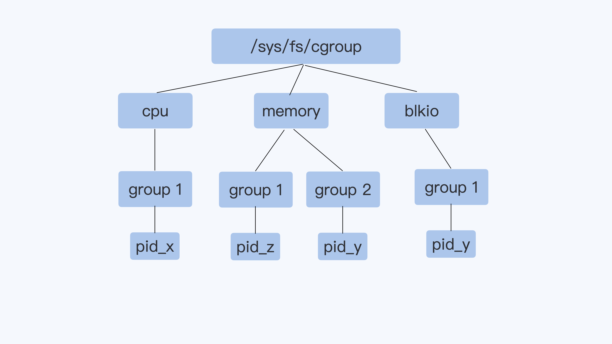
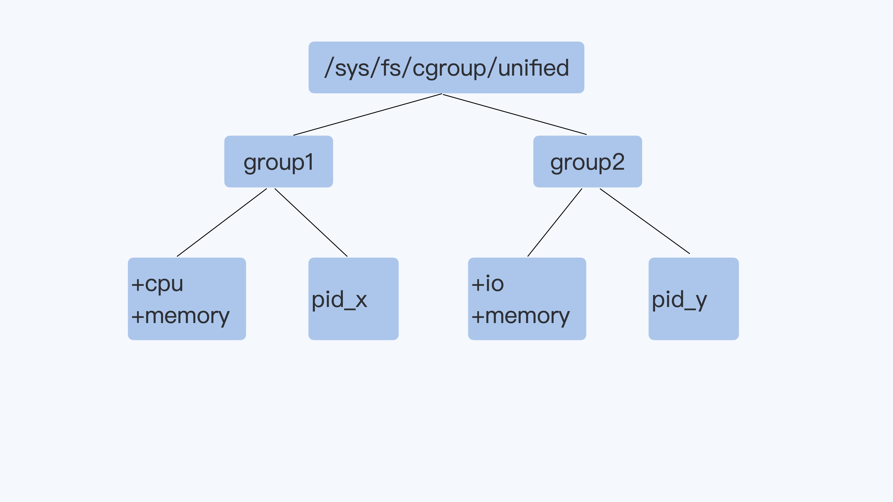
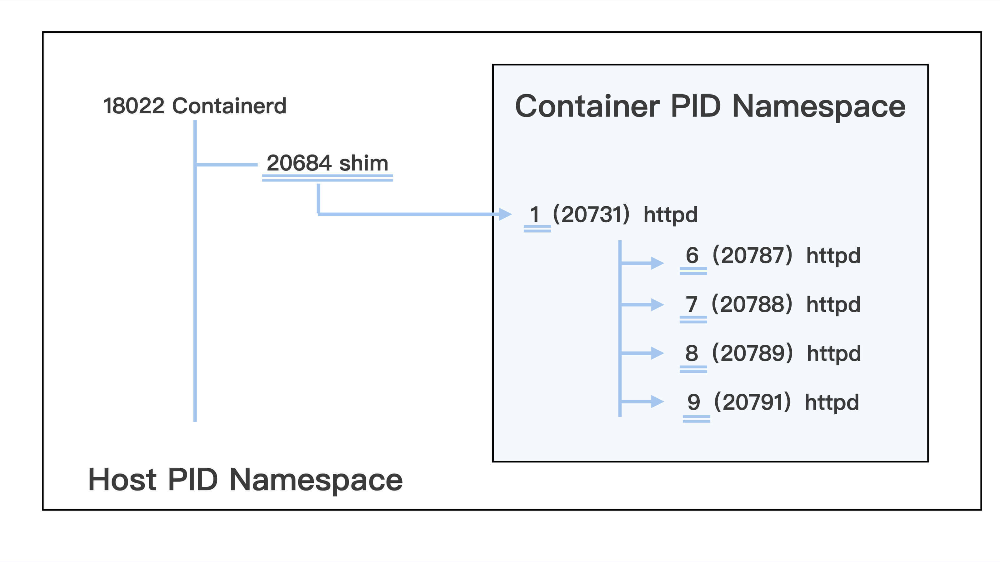
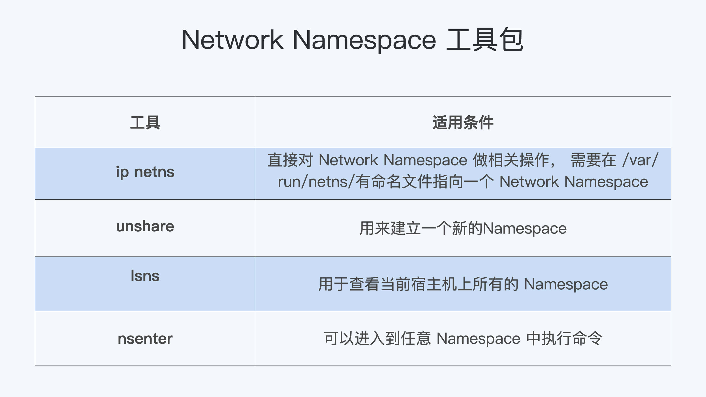
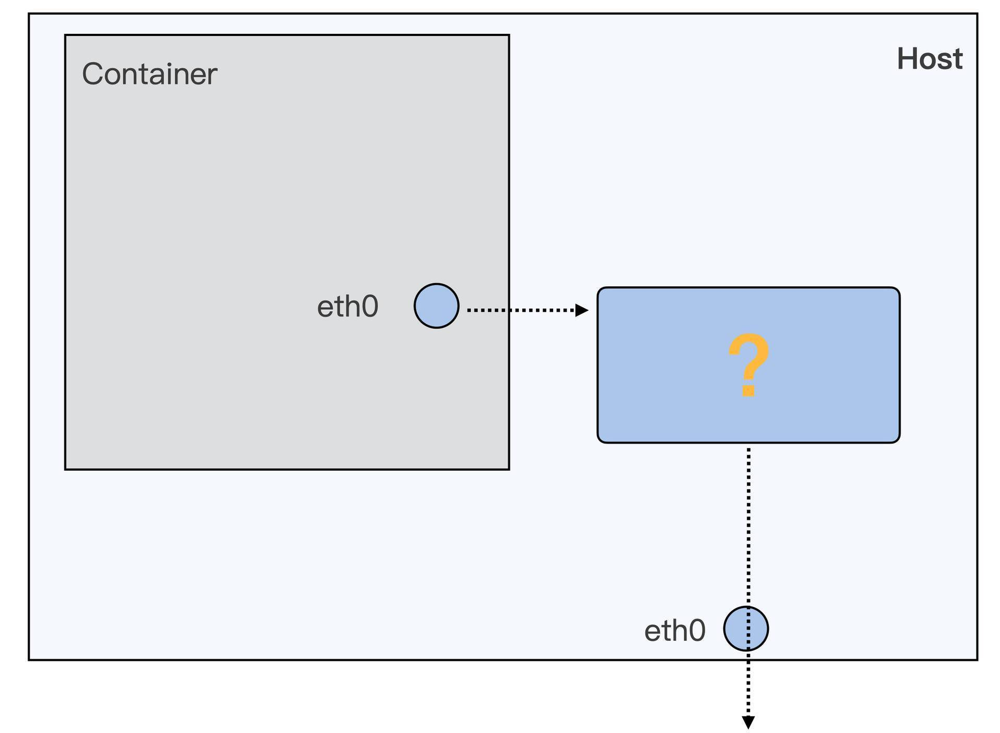
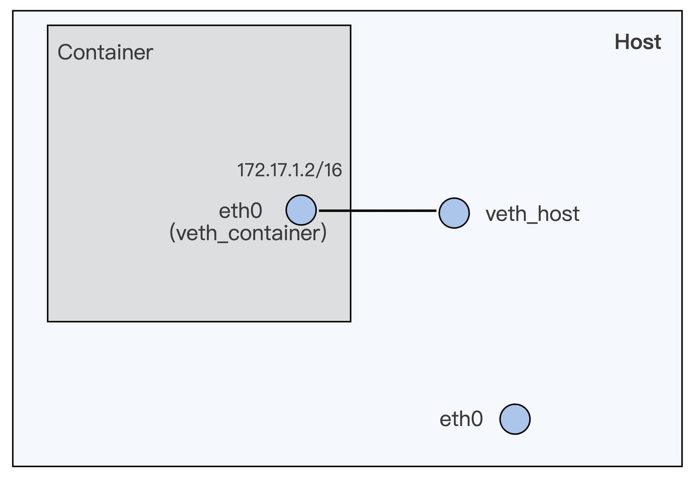
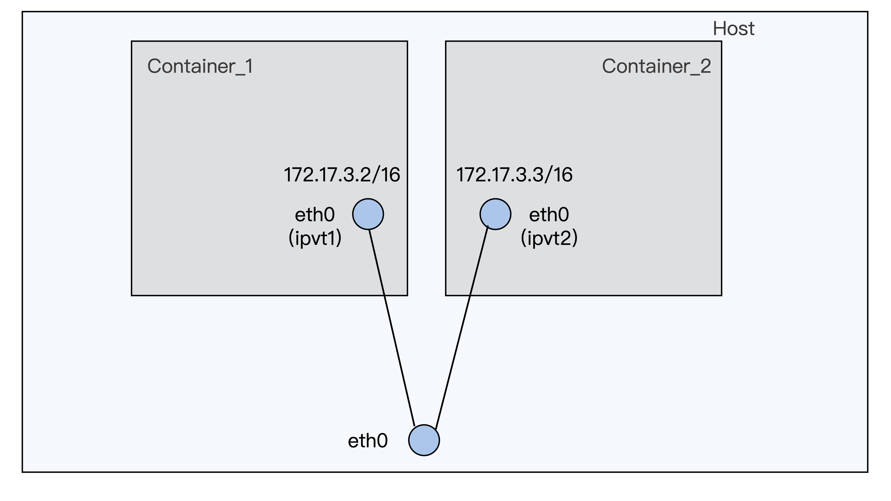
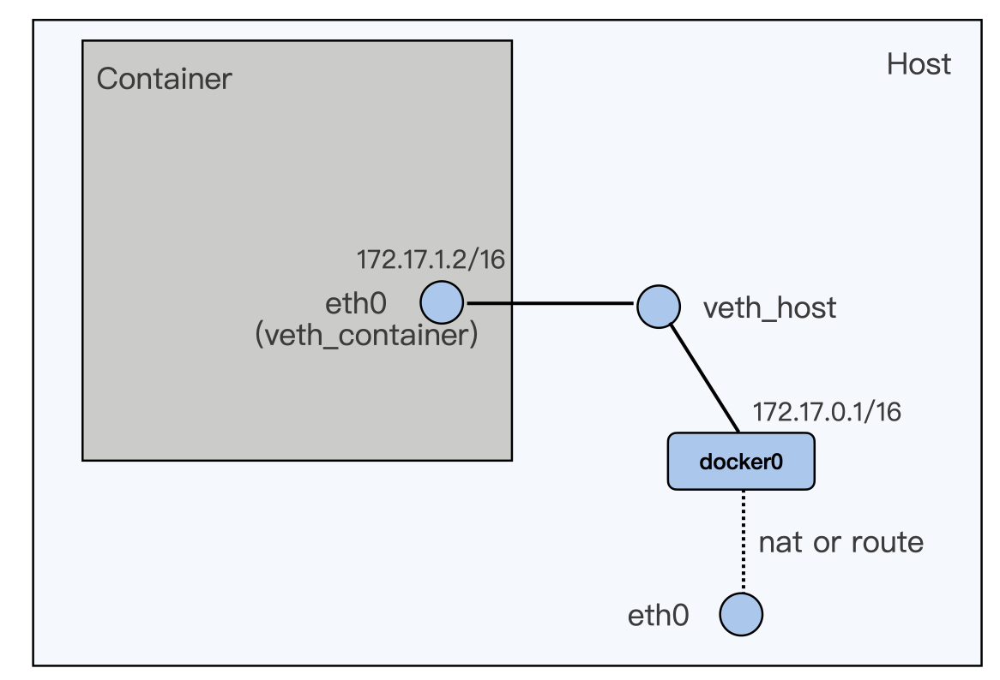

===tag=云原生
===description=容器使用与主机的区别
===pinned=false

# 底层原理

基于Linux内核的Cgroup、Namespace、UnionFS等技术，对进程进行封装隔离(本质上还是一个进程)，用于操作系统层面的虚拟化技术

## Namespace

> 参考资料
> https://en.wikipedia.org/wiki/Linux_namespaces
> https://man7.org/linux/man-pages/man7/namespaces.7.html

对namespace的操作方法

`clone`

在创建新进程的系统调用时，通过CLONE_NEWCGROUP、CLONE_NEWIPC、CLONE_NEWNET等创建新的命名空间

`setns`

让一个调用进程加入某个已经存在的Namespace中

`unshare`

将调用进程移动到新的Namespace下, 各个namespace下的资源配置则是通过各种容器管理工具(docker、kubernetes)，例如通过`unshare -fn [进程命令]`,创建的network namespace就是只有loopback

用用命令

- 查看当前系统所在命名空间: `lsns -t [类型]`
- 查看某进程的namespace: `ls -la /proc/<pid>/ns/`
- 进入某namespace运行命令: `nsenter -t <pid> -n ip addr`


> 提供共不同类型资源的隔离

内核级别的系统资源隔离方式

主机有其默认的Namespace，行为与用户的Namespace 完全一致，不同进程可以通过不同的Namespace 进行隔离。

当系统启动一个容器时，会为该容器创建相应的不同类型的Namespace，为运行在容器内的进程提供相应的资源隔离。

每个Namespace都附带一个编号，是该Namespace在系统中的唯一标识。

对Namespace操作相关的系统调用

- clone：创建新进程的系统调用时，通过flags参数指定需要新建的Namespace类型
- setns：让调用进程加入某个已经存在的Namespace
- unshare：将调用进程移动到新的Namespace下

### Mount (mnt)

挂载点

- `/proc/[pid]/ns/mnt`


> kernel 2.4.19

挂载点

在主机上`/proc/[pid]/mounts`，`/proc/[pid]/mountinfo`(可以看到该pid所属的mount Namespace下的挂载点的传播类型及所属的对等组)，`/proc/[pid]/mountstats`等文件查看挂载点。

在容器内，通过mount或lsmnt命令查看Mount Namespace的有效挂载点。

挂载点传播类型

- MS_SHARED
- MS_PRIVATE
- MS_SLAVE
- MS_UNBINDABLE

### Process ID (pid)

进程id

- `/proc/[pid]/ns/pid`
- `/proc/[pid]/ns/pid_for_children`


> kernel 2.6.14

进程，在主机的`/proc/[pid]/ns`目录中可以查看系统进程归属的Namespace。

容器启动后，Entrypoint 进程会作为PID 为1 的进程存在，因此是该PID Namespace 的init 进程。

它是当前Namespace所有进程的父进程，如果该进程退出，内核会对该PID Namespace的所有进程发送SIGKILL 信号，以便同时结束它们。

init 进程默认屏蔽系统信号，即除非该进程对系统信号做特殊处理，否则发往该进程的系统信号默认都会被忽略。不过SIGKILL 和SIGSTOP 信号比较特殊，init 进程无法捕获这两个信号。

Kubernetes 默认对同一Pod 的不同容器构建独立的PIDNamespace，以便将不同容器的进程彼此隔离，同时允许通过ShareProcessNamespace 属性设置不同容器的进程共享PID Namespace。

Kubernetes 支持多重容器进程的重启策略，默认行为是用户进程退出后立即重启。Kubernetes 用户只需中止其容器中的Entrypoint 进程，即可实现容器重启。

### Network (net)

- `/proc/[pid]/ns/net`


> kernel 2.6.29

一个物理的网络设备通常会放到系统初始的Network Namespace中。

- 网络设备
- 网络协议栈
- 网络端口
- IP路由表
- 防火墙规则
- `/proc/net`
- `/sys/class/net`
- `/proc/sys/net`

不同网络的Namespace 由网络虚拟设备（Virtual EthernetDevice，即VETH）连通，再基于网桥或者路由实现与物理网络设备的连通。当网络Namespace 被释放后，对应的VETH Pair 设备也会被自动释放。

在Kubernetes 中，同一Pod 的不同容器共享同一网络的Namespace，没有例外。这使得Kubernetes 能将网络挂载在更轻量、更稳定的sandbox 容器上，而用户定义的容器只需复用已配置好的网络即可。另外，同一Pod 的不同容器中运行的进程可以基于localhost彼此通信

### Interprocess Communication (ipc)

- `/proc/[pid]/ns/ipc`

> kernel 2.6.19

System V IPC和POSIX消息队列（都是进程间通信相关的资源）

System V IPC 对象包含信号量、共享内存和消息队列，用于进程间的通信。System V IPC对象具有全局唯一的标识，对在该IPC Namespace 内的进程可见，而对其外的进程不可见。当IPC Namespace 被销毁后，所有的IPC 对象也会被自动销毁。

Kubernetes 允许用户在Pod 中使用hostIPC 进行定义，通过该属性使授权用户容器共享主机IPC Namespace，达到进程间通信的目的。

### UTS

- `/proc/[pid]/ns/uts`


> kernel 2.6.19

主机名和域名，UTS Namespace中的一个进程可以看做一个在网络上独立存在的节点（除IP外，还能通过主机名进行访问）

### User ID (user)

用户用户组

- `/proc/[pid]/ns/user`

> kernel 3.8

> 权限隔离和用户身份标识隔离，在容器类创建切换用户，以及为文件目录设置不同的用户权限，从而实现容器内的权限管理，而无须影响主机配置。

主要隔离安全相关的标识符和属性，用户ID、用户组ID、root 目录、秘钥等。

一个进程的用户ID 和组ID 在User Namespace 内外可以有所不同。在该User Namespace 外，它是一个非特权的用户ID；而在User Namespace 内，进程可以使用0（root）作为用户ID，且其具有完全的特权权限。

### Control group (cgroup) Namespace

- `/proc/[pid]/ns/cgroup`

### Time Namespace

- `/proc/[pid]/ns/time`
- `/proc/[pid]/ns/time_for_children`

## cgroup

Linux下用于对一个或一组进程进行资源控制和监控的机制，可以对诸如CPU使用时间、内存、磁盘I/O等进程所需的资源进行限制。

不同资源的具体管理工作由对应的Cgroup子系统来实现，以层级树(Hierarchy)的方式来组织管理，每个Cgroup都可以包含其他的子Group，因此子Cgroup能使用的资源除了受本Cgroup配置的资源参数限制，还受到父CGroup设置的资源限制，针对不同类型的资源限制，只要讲限制策略在不同的子系统上进行关联即可

> kernel 4.6

内核从 4.6 版本开始支持 CGroup Namespace。如果容器启动时没有开启 CGroup Namespace，那么在容器内部查询 CGroup 时，返回整个系统的信息；而开启 CGroup Namespace 后，可以看到当前容器以根形式展示的单独的CGroup 信息。


### cgroup v1




v1 的CPU Cgroup，memory Cgroup和blkio Cgroup，那么Cgroup v1的一个整体结构，你应该已经很熟悉了。它的每一个子系统都是独立的，资源的限制只能在子系统中发生。

### cgroup v2



Cgroup v2相比Cgroup v1做的最大的变动就是一个进程属于一个控制组，而每个控制组里可以定义自己需要的多个子系统。

比如Cgroup V2中，某个进程pid_y属于控制组group2，而在group2里同时打开了io和memory子系统 （Cgroup V2里的io子系统就等同于Cgroup v1里的blkio子系统）。

那么，Cgroup对进程pid_y的磁盘 I/O做限制的时候，就可以考虑到进程pid_y写入到Page Cache内存的页面了，这样buffered I/O的磁盘限速就实现了。

目前即使最新版本的Ubuntu Linux或者Centos Linux，仍然在使用Cgroup v1作为缺省的Cgroup。打开方法就是配置一个kernel参数"cgroup_no_v1=blkio,memory"，这表示把Cgroup v1的blkio和Memory两个子系统给禁止，我们可以把这个参数配置到grub中，然后我们重启Linux机器，这时Cgroup v2的 io还有Memory这两个子系统，它们的功能就打开了。


### CPU

- cpu.shares
- cpu.cfs_period_us和cpu.cfs_quota_us
- cpu.stat:
- nr_periods
- nr_throttled

### cpuacct

统计CGroup及其子CGroup下进程的CPPU使用情况

- cpuacct.usage
- cpuacct.stat

### cpuset

分配单独的CPU和内存节点，将进程固定在某个CPU或内存节点上，以达到提高性能的目的

- cpuset.cpus
- cpuset.mems
- cpuset.memory_migrate
- cpuset.cpu_exclusive
- cpuset.mem_exclusive

### memory

用于限制CGroup下进程的内存使用量

 - memory.stat
 - memory.usage_in_bytes
 - memory.max_usage_in_bytes
 - memory.limit_in_bytes
 - memory.failcnt
 - memory.force_empty
 - memory.oom_control

### blkio

对块设备放的IO控制，按权重分配目前有两种限制方式：一是限制每秒写入的字节数（Bytes Per Second，即BPS），二是限制每秒的读写次数（I/O Per Second，即IOPS）

依赖于磁盘的CFQ调度，如果磁盘调度使用deadline或者none的算法则无法支持

**权重方式的配置**

- blkio.weight
- blkio.weight_device

**IO限流方式的配置**

![[Pasted image 20220524111700.png]]

### PID

PID 子系统用来限制CGroup 能够创建的进程数。

● pids.max：允许创建的最大进程数量。
● pids.current：当前的进程数量。

### 其他

● devices 子系统，控制进程访问某些设备
● perf_event 子系统，控制perf 监控CGroup 下的进程。
● net_cls 子系统，标记CGroups 中进程的网络数据包，通过TC 模块（Traffic Control）对数据包进行控制。
● net_prio 子系统，针对每个网络设备设置特定的优先级。
● hugetlb 子系统，对hugepage 的使用进行限制。
● freezer 子系统，挂起或者恢复CGroups 中的进程。
● ns 子系统，使不同CGroups 下面的进程使用不同的Namespace。
● rdma 子系统，对RDMA/IB-spe-cific 资源进行限制

# 容器进程

## namespace

### pids



## cgroup

### pids

pids Cgroup 通过 Cgroup 文件系统的方式向用户提供操作接口，一般它的 Cgroup 文件系统挂载点在 /sys/fs/cgroup/pids。

在一个容器建立之后，创建容器的服务会在 /sys/fs/cgroup/pids 下建立一个子目录，就是一个控制组，控制组里最关键的一个文件就是 pids.max。我们可以向这个文件写入数值，而这个值就是这个容器中允许的最大进程数目。

```bash
# pwd
/sys/fs/cgroup/pids
# df ./
Filesystem     1K-blocks  Used Available Use% Mounted on
cgroup                 0     0         0    - /sys/fs/cgroup/pids
# docker ps
CONTAINER ID        IMAGE                      COMMAND                  CREATED             STATUS              PORTS               NAMES
7ecd3aa7fdc1        registry/zombie-proc:v1   "/app-test 1000"         37 hours ago        Up 37 hours                             frosty_yalow

# pwd
/sys/fs/cgroup/pids/system.slice/docker-7ecd3aa7fdc15a1e183813b1899d5d939beafb11833ad6c8b0432536e5b9871c.scope

# ls
cgroup.clone_children  cgroup.procs  notify_on_release  pids.current  pids.events  pids.max  tasks
# echo 1002 > pids.max
# cat pids.max
1002
```

### CPU

> 这个cgroup的使用方式就是创建好对应的文件，然后把程序的pid加入进去
>
> ./threads-cpu/threads-cpu 2 &
> echo $! > /sys/fs/cgroup/cpu/group2/group3/cgroup.procs

第一个参数是 cpu.cfs_period_us，它是 CFS 算法的一个调度周期，一般它的值是 100000，以 microseconds 为单位，也就 100ms。

第二个参数是 cpu.cfs_quota_us，它“表示 CFS 算法中，在一个调度周期里这个控制组被允许的运行时间，比如这个值为 50000 时，就是 50ms。

如果用这个值去除以调度周期（也就是 cpu.cfs_period_us），50ms/100ms = 0.5，这样这个控制组被允许使用的 CPU 最大配额就是 0.5 个 CPU。

从这里能够看出，cpu.cfs_quota_us 是一个绝对值。如果这个值是 200000，也就是 200ms，那么它除以 period，也就是 200ms/100ms=2。

第三个参数， cpu.shares。这个值是 CPU Cgroup 对于控制组之间的 CPU 分配比例，它的缺省值是 1024。不同组之间会按照这个值的比例进行分配，例如(group3 中的 cpu.shares 是 1024，而 group4 中的 cpu.shares 是 3072，那么 group3:group4=1:3, 在一台 4 个 CPU 的机器上，当 group3 和 group4 都需要 4 个 CPU 的时候，它们实际分配到的 CPU 分别是这样的：group3 是 1 个，group4 是 3 个。)

## init进程

容器init进程对SIGKILL和SIGTERM信号的处理

Linux 内核针对每个 Nnamespace 里的 init 进程，把只有 default handler 的信号都给忽略了。

如果我们自己注册了信号的 handler（应用程序注册信号 handler 被称作"Catch the Signal"），那么这个信号 handler 就不再是 SIG_DFL 。即使是 init 进程在接收到 SIGTERM 之后也是可以退出的。

不过，由于 SIGKILL 是一个特例，因为 SIGKILL 是不允许被注册用户 handler 的（还有一个不允许注册用户 handler 的信号是 SIGSTOP），那么它只有 SIG_DFL handler。

所以 init 进程是永远不能被 SIGKILL 所杀，但是可以被 SIGTERM 杀死。

```bash
# ## golang init
# cat /proc/1/status | grep -i SigCgt
SigCgt:     fffffffe7fc1feff

# ## C init
# cat /proc/1/status | grep -i SigCgt
SigCgt:     0000000000000000

# ## bash init
# cat /proc/1/status | grep -i SigCgt
SigCgt:     0000000000010002
```

内核为什么必须要给容器中的子进程发 SIGKILL 信号，而不是直接发送 SIGTERM 信号？这样不就不用转发了吗？

因为 SIGTERM 信号可以被捕获，如果容器内有进程忽略该信号，那么关闭容器后，就有进程残留或僵尸进程。从这点来说，使用 SIGKILL 进行强杀，也是无奈之举。

容器中一个标准的 init 进程应该具备哪些能力？

- （1）至少可以转发 SIGTERM 信号给容器里的其他进程。
- （2）能够接收外部的 SIGTERM 信号而退出（在 tini 中，init 进程将所有 SIGTERM 信号转发给子进程后，后面还有回收僵尸进程的流程，在这里 init 进程发现所有子进程都退出了，就会让自己也退出）。
- （3）具备清理僵尸进程的能力。

## 如何拿到正确的CPU开销

在容器中运行 top 命令，虽然可以看到容器中每个进程的 CPU 使用率，但是 top 中"%Cpu(s)"那一行中显示的数值，并不是这个容器的 CPU 整体使用率，而是容器宿主机的 CPU 使用率。

对于每个进程，top 都会从 proc 文件系统中每个进程对应的 stat 文件`/proc/[pid]/stat`中读取 2 个数值utime(进程的用户态部分在 Linux 调度中获得 CPU 的 ticks)和stime(进程的内核态部分在 Linux 调度中获得 CPU 的 ticks)

由于 /proc/stat 文件是整个节点全局的状态文件，不属于任何一个 Namespace，因此在容器中无法通过读取 /proc/stat 文件来获取单个容器的 CPU 使用率。

所以要得到单个容器的 CPU 使用率，我们可以从 CPU Cgroup 每个控制组里的统计文件 cpuacct.stat 中获取。单个容器 CPU 使用率 =((utime_2 – utime_1) + (stime_2 – stime_1)) * 100.0 / (HZ * et * 1 )。

# 容器内存

## namespace

## cgroup

### memory

Memory Cgroup 的虚拟文件系统的挂载点一般在"/sys/fs/cgroup/memory"这个目录下,可以在 Memory Cgroup 的挂载点目录下，创建一个子目录作为控制组。

- memory.limit_in_bytes: 一个控制组里所有进程可使用内存的最大值
- memory.oom_control: 当控制组中的进程内存使用达到上限值时，这个参数能够决定会不会触发 OOM Killer(不希望触发 OOM Killer，只要执行 echo 1 > memory.oom_control)
- memory.usage_in_bytes: 只读的，它里面的数值是当前控制组里所有进程实际使用的内存总和。
- memory.swappiness: 用于控制是否使用swap分区

对于每个容器创建后，系统都会为它建立一个 Memory Cgroup 的控制组，容器的所有进程都在这个控制组里。

容器里所有进程使用的内存量，超过了容器所在 Memory Cgroup 里的内存限制。这时 Linux 系统就会主动杀死容器中的一个进程，往往这会导致整个容器的退出。

为什么 memory.usage_in_bytes 与 memory.limit_in_bytes 的值只相差了 90KB，我们在容器中还是可以申请出 50MB 的物理内存？

Memory Cgroup 控制组里 RSS 内存和 Page Cache 内存的和，正好是 memory.usage_in_bytes 的值。

当控制组里的进程需要申请新的物理内存，而且 memory.usage_in_bytes 里的值超过控制组里的内存上限值 memory.limit_in_bytes，这时我们前面说的 Linux 的内存回收（page frame reclaim）就会被调用起来。

那么在这个控制组里的 page cache 的内存会根据新申请的内存大小释放一部分，这样我们还是能成功申请到新的物理内存，整个控制组里总的物理内存开销 memory.usage_in_bytes 还是不会超过上限值 memory.limit_in_bytes。

```bash
docker run -d --name mem_alloc registry/mem_alloc:v1

sleep 2
CONTAINER_ID=$(sudo docker ps --format "{{.ID}}\t{{.Names}}" | grep -i mem_alloc | awk '{print $1}')
echo $CONTAINER_ID

CGROUP_CONTAINER_PATH=$(find /sys/fs/cgroup/memory/ -name "*$CONTAINER_ID*")
echo $CGROUP_CONTAINER_PATH

echo 536870912 > $CGROUP_CONTAINER_PATH/memory.limit_in_bytes
cat $CGROUP_CONTAINER_PATH/memory.limit_in_bytes
```

memory.limit_in_bytes: 设置容器最大的内存使用量

> 如果我们运行docker inspect 命令查看容器退出的原因，就会看到容器处于"exited"状态，并且"OOMKilled"是 true。

在发生 OOM 的时候,Linux根据进程已经使用的物理内存页面数，每个进程的OOM校准值oom_score_adj(在 /proc 文件系统中，每个进程都有一个 /proc//oom_score_adj 的接口文件。我们可以在这个文件中输入 -1000 到 1000 之间的任意一个数值，调整进程被 OOM Kill 的几率。)来决定杀死哪个进程的，用系统总的可用页面数，去乘以 OOM 校准值 oom_score_adj，再加上进程已经使用的物理页面数，计算出来的值越大，那么这个进程被 OOM Kill 的几率也就越大。

## swap分区

memory.swappiness 可以控制这个 Memroy Cgroup 控制组下面匿名内存和 page cache 的回收，取值的范围和工作方式和全局的 swappiness 差不多。这里有一个优先顺序，在 Memory Cgorup 的控制组里，如果你设置了 memory.swappiness 参数，它就会覆盖全局的 swappiness，让全局的 swappiness 在这个控制组里不起作用。

不过有一点和全局的swappiness不同的是：当 memory.swappiness = 0 的时候，对匿名页的回收是始终禁止的，也就是始终都不会使用 Swap 空间。

这时 Linux 系统不会再去比较 free 内存和 zone 里的 high water mark 的值，再决定一个 Memory Cgroup 中的匿名内存要不要回收了。


# 容器存储

## namespace

### mount

容器中的根文件系统，其实就是我们做的镜像。

Mount Namespace 保证了每个容器都有自己独立的文件目录结构。

可以通过 /proc/mounts 这个路径，找到容器 OverlayFS 对应的 lowerdir 和 upperdir。

## cgroups

### quota

从宿主机的角度看，upperdir 就是一个目录，如果容器不断往容器文件系统中写入数据，实际上就是往宿主机的磁盘上写数据，这些数据也就存在于宿主机的磁盘目录中。

当然对于容器来说，如果有大量的写操作是不建议写入容器文件系统的，一般是需要给容器挂载一个 volume，用来满足大量的文件读写。

但是不能避免的是，用户在容器中运行的程序有错误，或者进行了错误的配置。

比如说，我们把 log 写在了容器文件系统上，并且没有做 log rotation，那么时间一久，就会导致宿主机上的磁盘被写满。这样影响的就不止是容器本身了，而是整个宿主机了

因为 upperdir 在宿主机上也是一个普通的目录, 可以通过限制 upperdir 目录容量的方式，来限制一个容器 OverlayFS 根目录的写入数据量,对于 Linux 上最常用的两个文件系统 XFS 和 ext4，它们有一个特性 Quota,这个特性可以为 Linux 系统里的一个用户（user），一个用户组（group）或者一个项目（project）来限制它们使用文件系统的额度（quota），也就是限制它们可以写入文件系统的文件总量。

要使用 XFS Quota 特性，必须在文件系统挂载的时候加上对应的 Quota 选项，比如我们目前需要配置 Project Quota，那么这个挂载参数就是"pquota"。对于根目录来说，这个参数必须作为一个内核启动的参数"rootflags=pquota"，这样设置就可以保证根目录在启动挂载的时候，带上 XFS Quota 的特性并且支持 Project 模式。我们可以从 /proc/mounts 信息里，看看根目录是不是带"prjquota"字段。如果里面有这个字段，就可以确保文件系统已经带上了支持 project 模式的 XFS quota 特性。

通过 xfs_quota 这条命令,给一个指定的目录打上一个 Project ID, 未这个id做Quota限制

`xfs_quota -x -c 'limit -p bhard=10m 101' /`

在用 docker run 启动容器的时候，加上一个参数 --storage-opt size= ，就能限制住容器 OverlayFS 文件系统可写入的最大数据量了。

### blkio

> Direct I/O可以通过blkio Cgroup来限制磁盘I/O，但是Buffered I/O不能被限制。这个问题只有在cgroupv2版本中才解决了

不过容器文件系统并不适合频繁地读写。对于频繁读写的数据，容器需要把他们到放到"volume"中。这里的volume可以是一个本地的磁盘，也可以是一个网络磁盘。如果多个容器同时读写是会产生影响的，我们可以限制某一个的读写速率

Cgroup v1中有blkio子系统, 可以来限制磁盘的I/O。不过blkio子系统对于磁盘I/O的限制，并不像CPU，Memory那么直接

在Cgroups v1里，blkio Cgroup的虚拟文件系统挂载点一般在"/sys/fs/cgroup/blkio/"。

- blkio.throttle.read_iops_device
- blkio.throttle.read_bps_device
- blkio.throttle.write_iops_device
- blkio.throttle.write_bps_device

```bash
# "252:16"是要写入的设备例如/dev/vdb的主次设备号，你可以通过 ls -l /dev/vdb 看到这两个值
# 设置写入吞吐量不超过10MB/s
echo "252:16 10485760" > $CGROUP_CONTAINER_PATH/blkio.throttle.write_bps_device
```

### io

> cgroupv2 版本中的系统，用于解决无法对buffered io限速的问题

```bash
# Create a new control group
mkdir -p /sys/fs/cgroup/unified/iotest

# enable the io and memory controller subsystem
echo "+io +memory" > /sys/fs/cgroup/unified/cgroup.subtree_control

# Add current bash pid in iotest control group.
# Then all child processes of the bash will be in iotest group too,
# including the fio

echo $$ >/sys/fs/cgroup/unified/iotest/cgroup.procs

# 256:16 are device major and minor ids, /mnt is on the device.
echo "252:16 wbps=10485760" > /sys/fs/cgroup/unified/iotest/io.max
cd /mnt
#Run the fio in non direct I/O mode
fio -iodepth=1 -rw=write -ioengine=libaio -bs=4k -size=1G -numjobs=1  -name=./fio.test
```

## 容器镜像的文件系统

在容器里，运行 df 命令，你可以看到在容器中根目录 (/) 的文件系统类型是"overlay"，它不是我们在普通 Linux 节点上看到的 Ext4 或者 XFS 之类常见的文件系统。

如果没有特别的容器文件系统，只是普通的 Ext4 或者 XFS 文件系统，那么每次启动一个容器，就需要把一个镜像文件下载并且存储在宿主机上。overlay文件系统就是用来解决这种冗余的

> 在 Linux 内核 3.18 版本中，OverlayFS 代码正式合入 Linux 内核的主分支。在这之后，OverlayFS 也就逐渐成为各个主流 Linux 发行版本里缺省使用的容器文件系统了。

overlay在分类中属于UnionFS，UnionFS 这类文件系统实现的主要功能是把多个目录（处于不同的分区）一起挂载（mount）在一个目录下。


> "work/"，一个存放临时文件的目录，OverlayFS 中如果有文件修改，就会在中间过程中临时存放文件到这里。

```bash
# !/bin/bash

umount ./merged
rm upper lower merged work -r

mkdir upper lower merged work
echo "I'm from lower!" > lower/in_lower.txt
echo "I'm from upper!" > upper/in_upper.txt
# `in_both` is in both directories
echo "I'm from lower!" > lower/in_both.txt
echo "I'm from upper!" > upper/in_both.txt

sudo mount -t overlay overlay \
 -o lowerdir=./lower,upperdir=./upper,workdir=./work \
 ./merged
```

OverlayFS 也是把多个目录合并挂载，被挂载的目录分为两大类：lowerdir 和 upperdir。

lowerdir 允许有多个目录，在被挂载后，这些目录里的文件都是不会被修改或者删除的，也就是只读的；upperdir 只有一个，不过这个目录是可读写的，挂载点目录中的所有文件修改都会在 upperdir 中反映出来。

在merged文件夹中进行操作的效果:

- 新建文件，这个文件会出现在 upper/ 目录中。
- 删除文件，如果我们删除"in_upper.txt"，那么这个文件会在 upper/ 目录中消失。如果删除"in_lower.txt", 在 lower/ 目录里的"in_lower.txt"文件不会有变化，只是在 upper/ 目录中增加了一个特殊文件来告诉 OverlayFS，"in_lower.txt'这个文件不能出现在 merged/ 里了，这就表示它已经被删除了。
- 修改文件, 类似如果修改"in_lower.txt"，那么就会在 upper/ 目录中新建一个"in_lower.txt"文件，包含更新的内容，而在 lower/ 中的原来的实际文件"in_lower.txt"不会改变。

## 磁盘读写

Blkio Cgroup: 在容器中对磁盘I/O的限速

Linux内存和文件系统管理对容器IO的影响: Page Frame Reclaim, Dirty Page

# 容器网络

## namespace

### network

隔离的资源包括

- 第一种，网络设备，lo，eth0等
- 第二种是 IPv4 和 IPv6 协议栈。IP 层以及上面的 TCP 和 UDP 协议栈也是每个 Namespace 独立工作的。所以 IP、TCP、UDP 的很多协议，它们的相关参数也是每个 Namespace 独立的，这些参数大多数都在 /proc/sys/net/ 目录下面，同时也包括了 TCP 和 UDP 的 port 资源。
- 第三种，IP 路由表
- 第四种是iptables 规则了
- 第五种是网络的状态信息，这些信息你可以从 /proc/net 和 /sys/class/net 里得到

tcp_keepalive 的三个参数都是重新初始化的，而 tcp_congestion_control 的值是从 Host Namespace 里复制过来的。

在启动普通容器，尝试一下在容器里去修改"/proc/sys/net/"下的参数，会报错

> 只读模式下，容器中"/proc/sys/"是只读 mount 的，那么在容器里是不能修改"/proc/sys/net/"下面的任何参数了。

想修改 Network Namespace 里的网络参数，要选择容器刚刚启动，而容器中的应用程序还没启动之前进行。runC 也在对 /proc/sys 目录做 read-only mount 之前，预留出了修改接口，就是用来修改容器里 "/proc/sys"下参数的，同样也是 sysctl 的参数。而 Docker 的–sysctl或者 Kubernetes 里的allowed-unsafe-sysctls特性也都利用了 runC 的 sysctl 参数修改接口，允许容器在启动时修改容器 Namespace 里的参数。

```bash
# docker run -d --name net_para --sysctl net.ipv4.tcp_keepalive_time=600 centos:8.1.1911 sleep 3600
7efed88a44d64400ff5a6d38fdcc73f2a74a7bdc3dbc7161060f2f7d0be170d1
# docker exec net_para cat /proc/sys/net/ipv4/tcp_keepalive_time
600
```



## cgroup


## 容器网络接口



第一步，就是要让数据包从容器的 Network Namespace 发送到 Host Network Namespace 上。

一般来说就只有两类设备接口：一类是veth，另外一类是 macvlan/ipvlan。

用 Docker 启动的容器缺省的网络接口用的也是这个 veth



```bash
# 示例 创建一个无网络的容器，手动创建一个veth网卡
docker run -d --name if-test --network none centos:8.1.1911 sleep 36000

pid=$(ps -ef | grep "sleep 36000" | grep -v grep | awk '{print $2}')
echo $pid

# 在"/var/run/netns/"的目录下建立一个符号链接，指向这个容器的 Network Namespace。完成这步操作之后，在后面的"ip netns"操作里，就可以用 pid 的值作为这个容器的 Network Namesapce 的标识了。
ln -s /proc/$pid/ns/net /var/run/netns/$pid

# 建立一对 veth 的虚拟设备接口
ip link add name veth_host type veth peer name veth_container
# 把 veth_container 这个接口放入到容器的 Network Namespace 中
ip link set veth_container netns $pid

# In the container, setup veth_container
ip netns exec $pid ip link set veth_container name eth0
ip netns exec $pid ip addr add 172.17.1.2/16 dev eth0
ip netns exec $pid ip link set eth0 up
ip netns exec $pid ip route add default via 172.17.0.1

# In the host, set veth_host up
ip link set veth_host up
```

ipvlan网络配置方式

> 对于延时敏感的应用程序，我们可以考虑使用 ipvlan/macvlan 网络接口的容器。不过，由于 ipvlan/macvlan 网络接口直接挂载在物理网络接口上，对于需要使用 iptables 规则的容器，比如 Kubernetes 里使用 service 的容器，就不能工作了。

无论是 macvlan 还是 ipvlan，它们都是在一个物理的网络接口上再配置几个虚拟的网络接口。在这些虚拟的网络接口上，都可以配置独立的 IP，并且这些 IP 可以属于不同的 Namespace。对于 macvlan，每个虚拟网络接口都有自己独立的 mac 地址；而 ipvlan 的虚拟网络接口是和物理网络接口共享同一个 mac 地址。而且它们都有自己的 L2/L3 的配置方式



```bash
docker run --init --name lat-test-1 --network none -d registry/latency-test:v1 sleep 36000

pid1=$(docker inspect lat-test-1 | grep -i Pid | head -n 1 | awk '{print $2}' | awk -F "," '{print $1}')
echo $pid1
ln -s /proc/$pid1/ns/net /var/run/netns/$pid1
 
ip link add link eth0 ipvt1 type ipvlan mode l2
ip link set dev ipvt1 netns $pid1

ip netns exec $pid1 ip link set ipvt1 name eth0
ip netns exec $pid1 ip addr add 172.17.3.2/16 dev eth0
ip netns exec $pid1 ip link set eth0 up
```


第二步，数据包发到了 Host Network Namespace 之后，还要解决数据包怎么从宿主机上的 eth0 发送出去的问题。

这一步呢，就是一个普通 Linux 节点上数据包转发的问题了。用 nat 来做个转发，或者建立 Overlay 网络发送，也可以通过配置 proxy arp 加路由的方法来实现。

Docker 缺省使用的是 bridge + nat 的转发方式

Docker 程序在节点上安装完之后，就会自动建立了一个 docker0 的 bridge interface。所以我们只需要把第一步中建立的 veth_host 这个设备，接入到 docker0 这个 bridge 上。



容器和 docker0 组成了一个子网，docker0 上的 IP 就是这个子网的网关 IP。如果我们要让子网通过宿主机上 eth0 去访问外网的话，那么加上 iptables 的规则就可以了`iptables -P FORWARD ACCEPT`

两个网络设备接口之间的数据包转发，需要ip_forward参数，所以还需要把这个改为1

```bash
echo 1 > /proc/sys/net/ipv4/ip_forward
```

## 容器网络的问题

延时增加, 因为多了虚拟网卡的转发以及各种路由

乱序包的增加

在云平台的这种网络环境里，网络包乱序 +SACK 之后，产生的数据包重传的量要远远高于网络丢包引起的重传。

把 RPS 的这个特性配置到 veth 网络接口上，来减少数据包乱序的几率。不过RPS 的配置还是会带来额外的系统开销，在某些网络环境中会引起 softirq CPU 使用率的增大

尽管容器中 root 用户的 Linux capabilities 已经减少了很多，但是在没有 User Namespace 的情况下，容器中 root 用户和宿主机上的 root 用户的 uid 是完全相同的，一旦有软件的漏洞，容器中的 root 用户就可以操控整个宿主机。

User Namespace，它带来的好处有两个。一个是把容器中 root 用户（uid 0）映射成宿主机上的普通用户，另外一个好处是在云平台里对于容器 uid 的分配要容易些。

为了减少安全风险，业界都是建议在容器中以非 root 用户来运行进程。不过在没有 User Namespace 的情况下，在容器中使用非 root 用户，对于容器云平台来说，对 uid 的管理会比较麻烦。

除了在容器中以非 root 用户来运行进程外，Docker 和 podman 都支持了 rootless container，也就是说它们都可以以非 root 用户来启动和管理容器，这样就进一步降低了容器的安全风险。

# 容器安全

对于容器的 root 用户，缺省只赋予了 15 个 capabilities。如果我们发现容器中进程的权限不够，就需要分析它需要的最小 capabilities 集合，而不是直接赋予容器"privileged"。

因为"privileged"包含了所有的 Linux capabilities, 这样"privileged"就可以轻易获取宿主机上的所有资源，这会对宿主机的安全产生威胁。容器平台上是基本不允许把容器直接设置为"privileged"的，我们需要根据容器中进程需要的最少特权来赋予 capabilities。

假设容器里需要使用 iptables。因为使用 iptables 命令，只需要设置 CAP_NET_ADMIN 这个 capability 就行。那么我们只要在运行 Docker 的时候，给这个容器再多加一个 NET_ADMIN 参数就可以了。

```bash
# docker run --name iptables --cap-add NET_ADMIN -it registry/iptables:v1 bash
[root@cfedf124dcf1 /]# iptables -L
Chain INPUT (policy ACCEPT)
target     prot opt source               destination

Chain FORWARD (policy ACCEPT)
target     prot opt source               destination

Chain OUTPUT (policy ACCEPT)
target     prot opt source               destination
```

## not a root

如果不想让容器以 root 用户运行，最直接的办法就是给容器指定一个普通用户 uid

```bash
docker run -ti --name root_example -u 6667:6667 -v /etc:/mnt  centos bash
```

还有另外一个办法，就是我们在创建容器镜像的时候，用 Dockerfile 为容器镜像里建立一个用户。这样操作以后，容器里缺省的进程都会以这个用户启动。

```dockerfile
FROM centos

RUN adduser -u 6667 nonroot
USER nonroot
```

但是这种方法会导致当多个客户的容器在同一个节点上运行的时候，其实就都使用了宿主机上 uid 6667。然而Linux 系统上，每个用户下的资源是有限制的，比如打开文件数目（open files）、最大进程数目（max user processes）等等。一旦有很多个容器共享一个 uid，这些容器就很可能很快消耗掉这个 uid 下的资源，这样很容易导致这些容器都不能再正常工作。

## Usernamespace

> k8s还未引入

User Namespace 隔离了一台 Linux 节点上的 User ID（uid）和 Group ID（gid），它给 Namespace 中的 uid/gid 的值与宿主机上的 uid/gid 值建立了一个映射关系。经过 User Namespace 的隔离，我们在 Namespace 中看到的进程的 uid/gid，就和宿主机 Namespace 中看到的 uid 和 gid 不一样了。

> 跟 Docker 相比，podman 不再有守护进程 dockerd，而是直接通过 fork/execve 的方式来启动一个新的容器。这种方式启动容器更加简单，也更容易维护。

`podman run -ti  -v /etc:/mnt --uidmap 0:2000:1000 centos bash`

`0:2000:1000`意思是第一个 0 是指在新的 Namespace 里 uid 从 0 开始，中间的那个 2000 指的是 Host Namespace 里被映射的 uid 从 2000 开始，最后一个 1000 是指总共需要连续映射 1000 个 uid。

容器里的uid 0 是被映射到宿主机上的 uid 2000

## rootless container

rootless container 中的"rootless"不仅仅指容器中以非 root 用户来运行进程，还指以非 root 用户来创建容器，管理容器。也就是说，启动容器的时候，Docker 或者 podman 是以非 root 用户来执行的。

```bash
$ id
uid=1001(redhat) gid=1001(redhat) groups=1001(redhat)
$ podman run -it  ubi7/ubi bash   ### 在宿主机上以redhat用户启动容器
[root@206f6d5cb033 /]# id     ### 容器中的用户是root
uid=0(root) gid=0(root) groups=0(root)
[root@206f6d5cb033 /]# sleep 3600   ### 在容器中启动一个sleep 进程

# ps -ef |grep sleep   ###在宿主机上查看容器sleep进程对应的用户
redhat   29433 29410  0 05:14 pts/0    00:00:00 sleep 3600
```