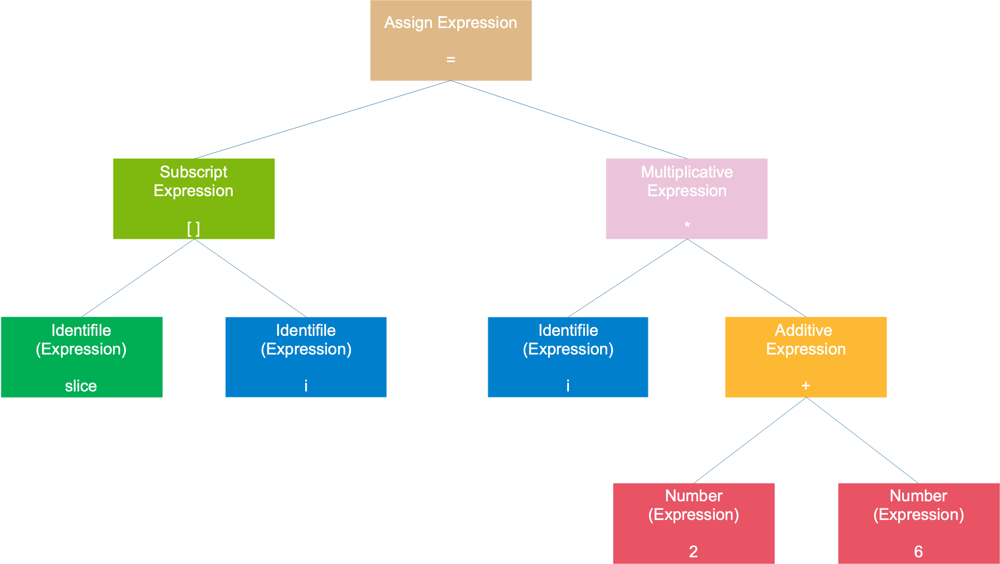

===tag=编程语言
===description=golang编译原理
===pinned=false
===create=2022-10-10

# 基础环境

GoRoot：Go的安装目录，go/pkg/tool/[platform]下面有些重要的有compile(编译器)、link（链接器）

GoPath：寻找`.go`源码的路径

go语言的源码分为三类：命令源码、库源码、测试源码

- 命令源码文件：Go程序的入口，包含`func main()`函数，且第一行用`pacakge main`声明
- 库源码文件：各种函数、接口等
- 测试源码文件：以`_test.go`为后缀的文件

## go111module

GO111MODULE 是个环境变量，可以在使用 Go 或者更改 Go 导入包的方式时候设置。

要注意的是，这个变量在不同 Go 版本有不同的语义

**没有包管理阶段**

-   一开始go发布的时候是没有包管理的
-   go get命令会根据路径，把相应的模块获取并保存在$GOPATH/src
-   也没有版本的概念，master 就代表稳定的版本

**Go 1.11-1.12 阶段**

GO111MODULE = on ，即使项目在您的 GOPATH 中，仍将强制使用 Go 模块。仍然需要 go.mod 才能正常工作。

GO111MODULE = off，强制 Go 表现出 GOPATH 方式，即使你的项目不在 GOPATH 目录里。

GO111MODULE = auto 是默认模式。当项目路径在 GOPATH 目录外部时， 设置为 GO111MODULE = on 当项目路径位于 GOPATH 内部时，即使存在 go.mod, 设置为 GO111MODULE = off。

**Go 1.13**

-   当存在 go.mod 文件时或处于 GOPATH 外， 其行为均会等同于 GO111MODULE=on。相当于 Go 1.13 下你可以将所有的代码仓库均不存储在 GOPATH 下。
-   当项目目录处于 GOPATH 内，且没有 go.mod 文件存在时其行为会等同于 GO111MODULE=off。

## 逃逸分析

逃逸分析是什么、逃逸分析有什么作用、逃逸分析是怎么完成的、如何确定是否发生逃逸、go中的堆栈与C中的是同一个概念吗

> 在编译原理中，分析指针范围的方法就称为逃逸分析。一般来说当一个对象的指针被多个方法或线程引用时，称这个指针发生了逃逸

堆和栈相比，堆适合不可预知大小的内存分配。但是为此付出的代价是分配速度较慢，而且会形成内存碎片，会增大GC的压力。栈内存分配则会非常快。栈分配内存只需要两个CPU指令：“PUSH”和“RELEASE”，分配和释放；而堆分配内存首先需要去找到一块大小合适的内存块，之后要通过垃圾回收才能释放。

Go语言的逃逸分析是编译器执行静态代码分析后，对内存管理进行的优化和简化，它可以决定一个变量是分配到堆还栈上。

> `go build -gcflags '-m -l' main.go` 能够查看到整个的逃逸情况，另外加l是为了让函数不要内联

- 如果函数外部没有引用，优先放在栈中
- 如果函数外部存在引用，必定放在堆中

将值传递给另外的函数使用时，如果是传递原始值(会完全复制，指针参数就有些值复制不到)或者另外一个函数直接将输入变成返回值，都不会进行逃逸。

> 如果作用域变了，另外的函数要访问到这个变量，如果变量是在之前函数的栈中是访问不到的，所以只能逃逸到堆中分配

```go
type S struct {}

func main() {
  var x S
  y := &x
  _ = *identity(y)
}

func identity(z *S) *S {
  return z
}
```

变量在输入或者输出中，逃逸分析的结果也是不一样的

```Go
type S struct {
  M *int
}

func main() {
  var i int

  // 这里调用函数时，refStruct的S是定义在返回值里的，S所引用的i也还是在main函数的作用域里的
  refStruct(&i)
}

func refStruct(y *int) (z S) {
  z.M = y
  return z
}
```

如果是在输入参数中，解引用传给ref函数，那么作用域就是变了。

```go
type S struct {
  M *int
}

func main() {
  var x S
  var i int
  ref(&i, &x)
}

func ref(y *int, z *S) {
  z.M = y
}
```

对于接口，调用方法时，即使是标量同样也会发生逃逸

```go
type Addifier interface{ Add(a, b int32) int32 }

type Adder struct{ name string }
//go:noinline
func (adder Adder) Add(a, b int32) int32 { return a + b }

func main() {
    adder := Adder{name: "myAdder"}
    adder.Add(10, 32)          // doesn't escape
    Addifier(adder).Add(10, 32) // escapes
}
```

# go命令

#buildflags

`build, clean, get, install, list, run, test` 这些命令会共用一套

| 参数 | 作用 |
| --- | --- |
| -a | 强制重新编译所有涉及到的包，包括标准库中的代码包，这会重写 /usr/local/go 目录下的 `.a` 文件 |
| -n | 打印命令执行过程，不真正执行 |
| -p n | 指定编译过程中命令执行的并行数，n默认为CPU核数 |
| -race | 检测数据竞争问题 |
| -v | 打印命令执行过程中所涉及到的代码包名称 |
| -x | 打印命令执行过程中所涉及到的命令，并执行 |
| -work | 打印编译过程中的临时文件夹。通常情况下，编译完成后会被删除 |

#gcflags

- `-N`：关闭编译器优化
- `-l`：禁止函数内联

## build命令

gobuild会忽略`*_test.go`文件。

**参数**

`-o` 只能在编译单个包的时候出现，它指定输出的可执行文件的名字。

`-i` 会安装编译目标所依赖的包，安装是指生成与代码包相对应的 `.a` 文件，即静态库文件（后面要参与链接），并且放置到当前工作区的 pkg 目录下，且库文件的目录层级和源码层级一致。（使用这个参数后会在工作目录的pkg下生成相应的`.a`文件，这样在再次编译的时候不会重新编译这些文件，加快编译速度）

**环境变量**

GOOS：需要编译到的操作系统类型
GOARCH：需要编译到的CPU架构

# 编译链接

> vim中命令模式下`:%!xxd`能够以十六进制查看文件内容

> 编译过程一般分为前端和后端，前端生成平台无关的中间代码，后端针对不同的平台生成不同的机器码

编译过程就是对源文件进行词法分析、语法分析、语义分析、优化，最后生成汇编代码文件，以 `.s` 作为文件后缀。

> 词法解析、语法解析、抽象语法树构建、类型检查、变量捕获、函数内联、逃逸分析、闭包重写、遍历函数、SSA生成、机器码生成-汇编器、机器码生成-链接、ELF文件解析

## 词法分析

将字符序列转换为标记（token）序列

一种类似于有限状态机的算法。

记号一般分为这几类：关键字、标识符、字面量（包含数字、字符串）、特殊符号（如加号、等号）。

## 语法分析

将token转为语法树



## 语义分析

> 确定类型，优化抽象语法树

查看语法树各个节点分别代表什么，完善语法树，例如标注类型

Go 语言编译器在这一阶段检查常量、类型、函数声明以及变量赋值语句的类型，然后检查哈希中键的类型。

类型检查是 Go 语言编译的第二个阶段，在词法和语法分析之后我们得到了每个文件对应的抽象语法树，随后的类型检查会遍历抽象语法树中的节点，对每个节点的类型进行检验，找出其中存在的语法错误。

在这个过程中也可能会对抽象语法树进行改写，这不仅能够去除一些不会被执行的代码对编译进行优化提高执行效率，而且也会修改 make、new 等关键字对应节点的操作类型。

## 中间代码生成

中间代码一般和目标机器以及运行时环境无关，它有几种常见的形式：三地址码、P-代码。

Go 语言的中间代码表示形式为 SSA（Static Single-Assignment，静态单赋值），之所以称之为单赋值，是因为每个名字在 SSA 中仅被赋值一次。

这一阶段会根据 CPU 的架构设置相应的用于生成中间代码的变量，例如编译器使用的指针和寄存器的大小、可用寄存器列表等。中间代码生成和机器码生成这两部分会共享相同的设置。

中间代码的生成过程其实就是从 AST 抽象语法树到 SSA 中间代码的转换过程，在这期间会对语法树中的关键字在进行一次更新，更新后的语法树会经过多轮处理转变最后的 SSA 中间代码。

## 目标代码生成与优化

不同机器的机器字长、寄存器等等都不一样，意味着在不同机器上跑的机器码是不一样的。最后一步的目的就是要生成能在不同 CPU 架构上运行的代码。

> Go汇编器所用的指令，一部分与目标机器的指令 一一对应，而另外一部分则不是。概括来说，特定于机器的指令会以他们的本尊出现， 然而对于一些通用的操作，如内存的移动以及子程序的调用以及返回通常都做了抽象。细 节因架构不同而不一样

## 链接过程

> 最后链接生成的可执行文件是分段的：例如数据段、代码段、BSS段等

编译过程是针对单个文件进行的，文件与文件之间不可避免地要引用定义在其他模块的全局变量或者函数，这些变量或函数的地址只有在此阶段才能确定。

链接过程就是要把编译器生成的一个个目标文件链接成可执行文件。最终得到的文件是分成各种段的，比如数据段、代码段、BSS段等等，运行时会被装载到内存中。各个段具有不同的读写、执行属性，保护了程序的安全运行。

## 汇编代码

> 参考: https://go-internals-cn.gitbook.io/go-internals/chapter1_assembly_primer

Go 编译器不会生成任何 PUSH/POP 族的指令: 栈的增长和收缩是通过在栈指针寄存器 `SP` 上分别执行减法和加法指令来实现的

> SP伪寄存器是虚拟的栈指针，用于引用帧局部变量以及为函数调用准备的参数。 它指向局部栈帧的顶部，所以应用应该使用负的偏移且范围在`[-framesize, 0): x-8(SP), y-4(SP)`, 等等。
> 例如: `"".b+12(SP)` 和 `"".a+8(SP)` 分别指向栈的低 12 字节和低 8 字节位置(另外，栈是向低地址方向增长的)

`0x0000`: 表示指令相对于当前函数的偏移量

`TEXT`: 程序代码在运行期会放在内存的 .text 段中)的一部分，并表明跟在这个声明后的是函数的函数体。 在链接期，`""` 这个空字符会被替换为当前的包名: 也就是说，`"".add` 在链接到二进制文件后会变成 `main.add`

`(SB)`: 虚拟寄存器，保存了静态基地址(static-base) 指针，即我们程序地址空间的开始地址。 `"".add(SB)` 表明我们的符号位于某个固定的相对地址空间起始处的偏移位置 (最终是由链接器计算得到的)

`NOSPLIT`: 向编译器表明_不应该_插入 _stack-split_ 的用来检查栈需要扩张的前导指令。在我们 `add` 函数的这种情况下，编译器自己帮我们插入了这个标记: 它足够聪明地意识到，由于 `add` 没有任何局部变量且没有它自己的栈帧，所以一定不会超出当前的栈；因此每次调用函数时在这里执行栈检查就是完全浪费 CPU 循环了。

`$0-16`: 其中`$0`代表即将分配的栈帧大小，而`$16`指定了调用方传入的参数大小

`FUNCDATA、PCDATA`: 包含有被垃圾回收所使用的信息，这些指令是编译器加入的

`ADDL`: 进行实际的加法操作，例如`0x0008 ADDL CX, AX`, 将`AX` 和 `CX` 寄存器中的值进行相加，然后再保存进 `AX` 寄存器中

`MOVL`: 将值移动到新的地址中，例如`0x000a MOVL AX, "".~r2+16(SP)`

`RET`: 告诉 Go 汇编器插入一些指令, 从子过程中返回时所需要的指令。 一般情况下这样的指令会使在 `0(SP)` 寄存器中保存的函数返回地址被 pop 出栈，并跳回到该地址

`SUBQ`: 例如`0x000f SUBQ $24, SP`, 分配了24字节的栈帧

`MOVQ`: 例如`0x0013 MOVQ BP, 16(SP)`, 不接收参数

`LEAQ`: 例如`0x0018 LEAQ 16(SP), BP`, 无返回值。跟着栈的增长，`LEAQ` 指令计算出帧指针的新地址，并将其存储到 `BP` 寄存器中

### 示例

```go
//go:noinline
func add(a, b int32) (int32, bool) { return a + b, true }

func main() { add(10, 32) }
```

```bash
0x0000 TEXT "".add(SB), NOSPLIT, $0-16

0x0000 FUNCDATA $0, gclocals·f207267fbf96a0178e8758c6e3e0ce28(SB)

0x0000 FUNCDATA $1, gclocals·33cdeccccebe80329f1fdbee7f5874cb(SB)

0x0000 MOVL "".b+12(SP), AX

0x0004 MOVL "".a+8(SP), CX

0x0008 ADDL CX, AX

0x000a MOVL AX, "".~r2+16(SP)

0x000e MOVB $1, "".~r3+20(SP)

0x0013 RET


0x0000 TEXT "".main(SB), $24-0 ;; ...omitted stack-split prologue...

0x000f SUBQ $24, SP

0x0013 MOVQ BP, 16(SP)

0x0018 LEAQ 16(SP), BP

0x001d FUNCDATA $0, gclocals·33cdeccccebe80329f1fdbee7f5874cb(SB)

0x001d FUNCDATA $1, gclocals·33cdeccccebe80329f1fdbee7f5874cb(SB)

0x001d MOVQ $137438953482, AX

0x0027 MOVQ AX, (SP)

0x002b PCDATA $0, $0

0x002b CALL "".add(SB)

0x0030 MOVQ 16(SP), BP

0x0035 ADDQ $24, SP

0x0039 RET

;; ...omitted stack-split epilogue...
```

```bash
   |    +-------------------------+ <-- 32(SP)
   |    |                         |
 G |    |                         |
 R |    |                         |
 O |    | main.main's saved       |
 W |    |     frame-pointer (BP)  |
 S |    |-------------------------| <-- 24(SP)
   |    |      [alignment]        |
 D |    | "".~r3 (bool) = 1/true  | <-- 21(SP)
 O |    |-------------------------| <-- 20(SP)
 W |    |                         |
 N |    | "".~r2 (int32) = 42     |
 W |    |-------------------------| <-- 16(SP)
 A |    |                         |
 R |    | "".b (int32) = 32       |
 D |    |-------------------------| <-- 12(SP)
 S |    |                         |
   |    | "".a (int32) = 10       |
   |    |-------------------------| <-- 8(SP)
   |    |                         |
   |    |                         |
   |    |                         |
 \ | /  | return address to       |
  \|/   |     main.main + 0x30    |
   -    +-------------------------+ <-- 0(SP) (TOP OF STACK)

(diagram made with https://textik.com)
```

### 调用栈

由于 Go 程序中的 goroutine 数目是不可确定的，并且实际场景可能会有百万级别的 goroutine，runtime 必须使用保守的思路来给 goroutine 分配空间以避免吃掉所有的可用内存。

也由于此，每个新的 goroutine 会被 runtime 分配初始为 2KB 大小的栈空间(Go 的栈在底层实际上是分配在堆空间上的)。

随着一个 goroutine 进行自己的工作，可能会超出最初分配的栈空间限制(就是栈溢出的意思)。 为了防止这种情况发生，runtime 确保 goroutine 在超出栈范围时，会创建一个相当于原来两倍大小的新栈，并将原来栈的上下文拷贝到新栈上。 这个过程被称为 _栈分裂_(stack-split)，这样使得 goroutine 栈能够动态调整大小。

*栈分裂*

> 这样就形成了一个反馈循环，使我们的栈在没有达到饥饿的 goroutine 要求之前不断地进行空间扩张。

为了使栈分裂正常工作，编译器会在每一个函数的开头和结束位置插入指令来防止 goroutine 爆栈。 像我们本章早些看到的一样，为了避免不必要的开销，一定不会爆栈的函数会被标记上 `NOSPLIT` 来提示编译器不要在这些函数的开头和结束部分插入这些检查指令。

```bash
;; stack-split prologue // 会检查当前 goroutine 是否已经用完了所有的空间，然后如果确实用完了的话，会直接跳转到后部

...

;; stack-split epilogue // 会触发栈增长(stack-growth)，然后再跳回到前部
```

### 函数调用

函数调用会被翻译成直接跳转指令，目标是 `.text` 段的全局函数符号，参数和返回值会被存储在发起调用者的栈帧上。

顶层函数的直接调用： 对顶层函数的直接调用会通过栈来传递所有参数，并期望返回值占据连续的栈位置。

对方法的调用(无论 receiver 是值类型还是指针类型)和对函数的调用是相同的，唯一的区别是 receiver 会被当作第一个参数传入

receiver 是值类型，且编译器能够通过静态分析推测出其值，这种情况下编译器认为不需要对值从它原来的位置(`28(SP)`)进行拷贝了: 相应的，只要简单的在栈上创建一个新的和 `Adder` 相等的值，把这个操作和传第二个参数的操作进行捆绑，还可以节省一条汇编指令。

如果 receiver 在栈上，且 receiver 本身很小，这种情况只需要很少的汇编指令就可以将其值拷贝到栈顶然后再对 `"".Adder.AddVal` 进行一次直接的方法调用

receiver 逃逸到堆上的话，编译器需要用更聪明的过程来解决问题了: 先生成一个新方法(该方法 receiver 为指针类型，原始方法 receiver 为值类型)，然后用新方法包装原来的 `"".Adder.AddVal`，然后将对原始方法`"".Adder.AddVal`的调用替换为对新方法 `"".(*Adder).AddVal` 的调用。 包装方法唯一的任务，就是保证 receiver 被正确的解引用，并将解引用后的值和其它参数以及返回值在原始方法和调用方法之间拷贝来拷贝去。

