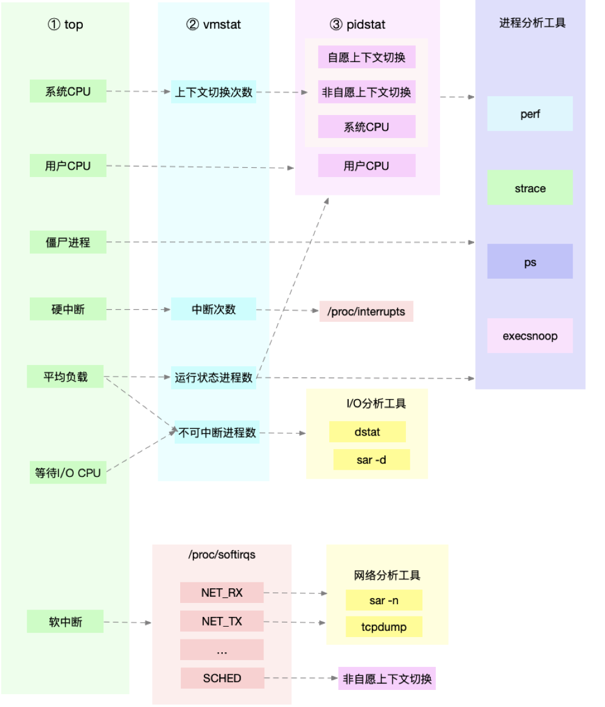
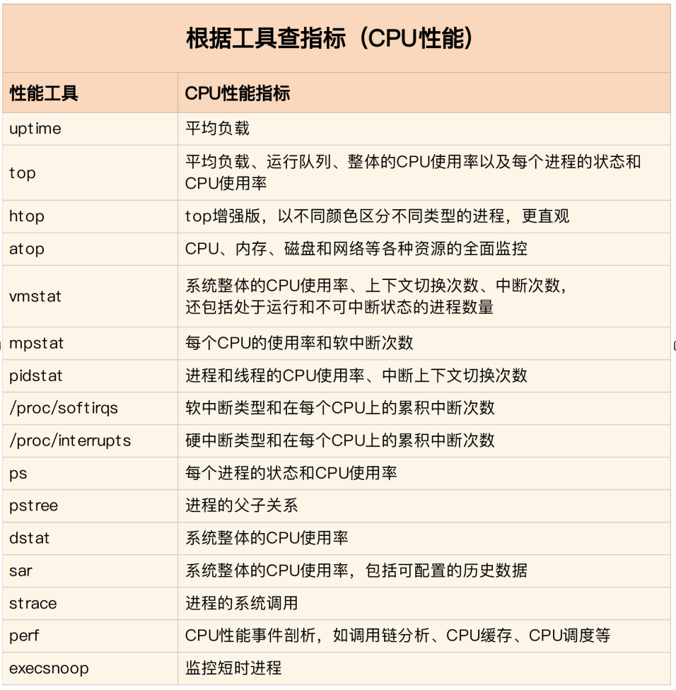
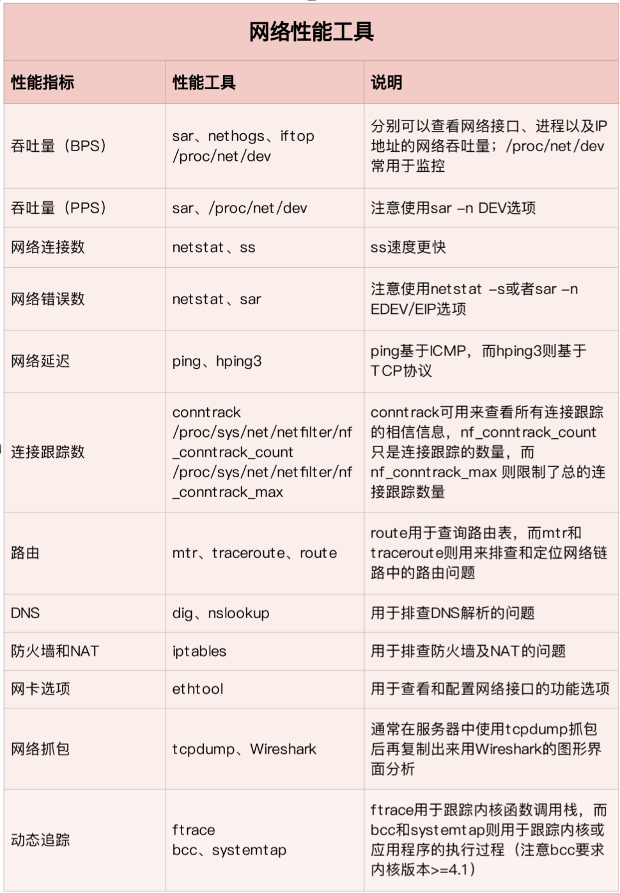
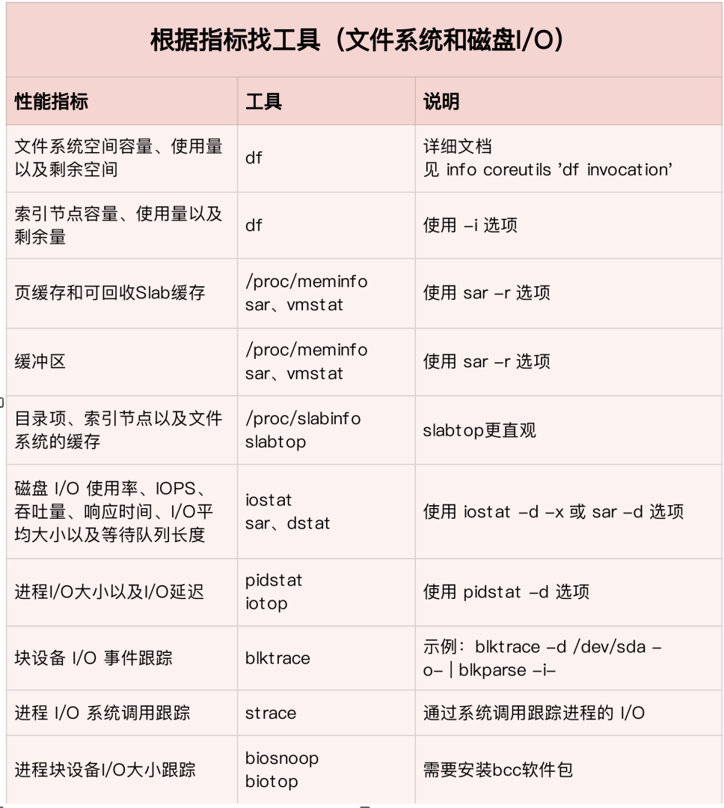
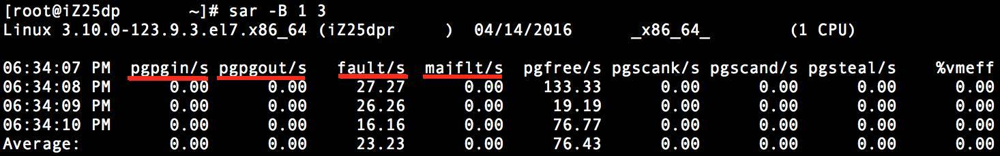
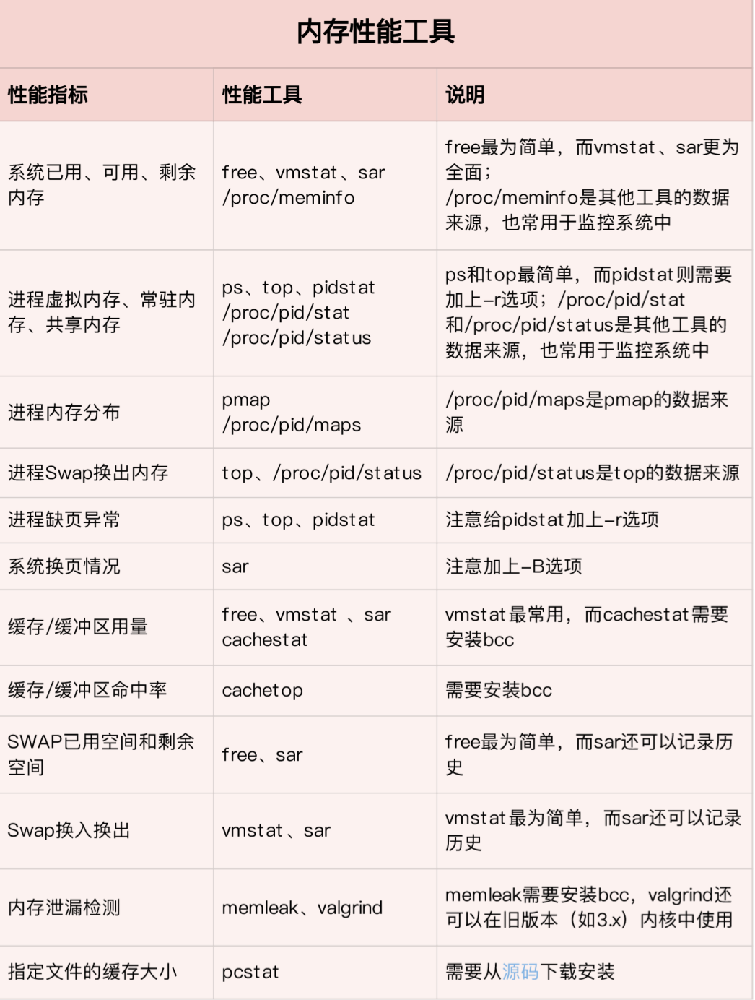

===tag=操作系统
===description=操作系统性能分析工具
===pinned=true

# 性能分析

> 下面的所有测试都是在ubuntu:22的docker镜像环境下测试的
> 使用系统自带的工具，对于需要三方安装的工具集会标注出来

## CPU

- CPU使用率
    - 用户CPU
    - 系统CPU
    - IOWAIT
    - 软中断
    - 硬中断
    - 窃取CPU
    - 客户CPU
- 上下文切换
    - 自愿上下文切换
    - 非自愿上下文切换
- 平均负载
- CPU缓存命中率

> systat(`apt update && apt install sysstat`): 包含的命令包括iostat、mpstat、pidstat、sar、sadc、sa1、sa2、sadf、nfsiostat、cifsiostat



- 平均负载: 指系统处于可运行状态和不可中断状态的平均进程数, 数值高CPU使用率不一定高，有可能是由于IO导致
- 上下文切换: 无法获取资源的自愿切换和系统强制调度时的非自愿切换。过多的切换会导致CPU时间过多消耗在寄存器、内核以及虚拟内存等数据保存和恢复上
- CPU使用率: 分为用户、系统、iowait(等待io的cpu使用率)、软/硬中断CPU使用率、steal cpu/ guest cpu(虚拟机占用)
- CPU缓存命中率: CPU缓存的复用情况,命中率越高性能越好. 其中L1/L2常用在单核,L3则用在多核中。
- 对于僵尸问题，用pstree找到父进程，然后看源码检查子进程结束的处理逻辑
- 软中断线程CPU使用率高的情况下, 可以借助sar和tcpdump等工具分析来源



## 优化思路

> 先运行几个支持指标较多的工具, 如top/vmstat/pidstat,根据它们的输出可以得出是哪种类型的性能问题. 定位到进程后再用strace/perf分析调用情况进一步分析. 如果是软中断导致用/proc/softirqs

1、使用top命令分析系统的整体运行情况

```bash
top - 09:44:56 up 16 days, 21:23,  1 user,  load average: 9.59, 4.75, 1.92
Tasks: 145 total,   2 running, 143 sleeping,   0 stopped,   0 zombie
Cpu(s): 99.8%us,  0.1%sy,  0.0%ni,  0.2%id,  0.0%wa,  0.0%hi,  0.0%si,  0.0%st
Mem:   4147888k total,  2493092k used,  1654796k free,   158188k buffers
Swap:  5144568k total,       56k used,  5144512k free,  2013180k cached
```

上面的执行情况的含义

- 当前时间为`9:44:56`, 系统运行了16天，有一个用户当前登录
- 系统负载情况`9.59 4.75 1.92`（系统在过去 1 分钟内，5 分钟内，15 分钟内的平均负载, 在这段时间内总的进程数与处理的进程数之间的比例）
- 总进程数145,2个正在运行，143个正在休眠，0个暂停，0个僵死进程
- cpu使用率
	- us (user): 非 nice 用户进程占用 CPU 的比率
	- sy (system): 内核、内核进程占用 CPU 的比率
	- ni (nice): 用户进程空间内改变过优先级的进程占用 CPU 比率
	- id (idle): CPU 空闲比率，如果系统缓慢而这个值很高，说明系统慢的原因不是 CPU 负载高
	- wa (iowait): CPU 等待执行 I/O 操作的时间比率，该指标可以用来排查磁盘 I/O 的问题，通常结合 wa 和 id 判断(如果内存充足，但 wa 很高，说明需要检查哪个进程占用了大量的 I/O 资源。如果内存不够就是发生了内存交换导致的)
	- hi (Hardware IRQ): CPU 处理硬件中断所占时间的比率
	- si (Software Interrupts): CPU 处理软件中断所占时间的比率
	- st (steal): 流逝的时间，虚拟机中的其他任务所占 CPU 时间的比率
- 物理内存总量`4147888k`, 正在使用`2493092k`,空闲`1654796k`, 内核缓存`158188k`
- 交换区总量`5144568k`, 正在使用`56k`, 空闲`5144512k`,缓冲区的交换总量`2013180k`

根据这个运行结果判断具体的瓶颈在那再继续分析

2、使用vmstat查看系统的上下文切换状态

- 进程上下文切换
- 线程上下文切换
- 中断上下文切换

当每秒上下文切换超过1w次，或者切换次数出现数量级的增长时，系统可能出现了性能问题。此时可以根据上下文切换类型来具体分析是I/O问题还是CPU瓶颈，或者具体哪一类中断导致的异常

3、使用pidstat查看是哪个进程状态导致出现问题

> 需要安装systat

可以查看哪个进程占用了大量的cpu或者io

```shell
pidstat -u 5 1
```

4、使用perf查看具体进程的执行情况

5、使用pstree查看进程的层级状态

## 网络

- 应用层
    - QPS
    - 套接字缓冲区大小
    - DNS解析延迟
    - 响应时间
    - 错误数
- 传输层
    - TCP连接数: 全连接、半连接、TIMEWAIT
    - 连接跟踪数
    - 重传数
    - 丢包数
    - 延迟
- 网络层
    - 丢包数
    - TTL
    - 拆包
- 链路层
    - PPS每秒网络帧数
    - BPS每秒字节数
    - 丢包数
    - 错误数

比较常用的指标包括

- 带宽: 最大传输速率 B/s
- 吞吐量: 用来评估单位时间内成功传输的数据量
- 网络使用率：吞吐量/带宽
- PPS：Packet Per Second（包/秒）,一般用在交换机上，评估数据包的转发能力
- 延时：表示从网络中发出请求后，到远端响应的延迟时间



## 优化思路

网络性能优化首先要获得网络基准测试报告，然后通过相关性能工具，定位出网络性能瓶颈，再进行优化。可以从应用程序、套接字、传输层、网络层以及链路层分别来看

应用层: 通过优化io模型、dns缓存、数据序列化方式等入手

套接字: 调整每个套接字的缓冲区

传输层: 优化TCP的TIME_WAIT状态，减少net.ipv4.tcp_fin_timeout让尽快让出资源，端口复用net.ipv4.tcp_tw_reuse。对于SYNC FLOOD问题，可以增大TCP半连接的最大数量，或者开启TCP SYN Cookies来绕开半开连接数量限制，或者减少SYN_RECV的重传SYN+ACK次数

`ulimit -n`能够查看当前最大的文件句柄限制

```bash
# 参考: https://blog.csdn.net/whatday/article/details/113427085

# /etc/sysctl.d
vim /etc/sysctl.conf

net.ipv4.tcp_tw_reuse = 1  
net.ipv4.tcp_tw_recycle = 1(客户端最好不要设置这个)

# 或者
sysctl net.ipv4.tcp_tw_reuse=1

# 查看内核配置
sysctl -a | fgrep tcp
```

在container中修改需要额外注意，如果docker container不是以 –net=”host” 方式启动的，那么它将有自己独立的网络堆栈。修改host的配置将会无效。在container中又无法直接修改/proc，因为docker会以只读的方式重新挂载/proc/sys。 对于这个问题，可以在container启动的时候将/proc挂载到另一可读写位置，譬如

`docker run -ti -v /proc:/writable-proc ubuntu:14.04 /bin/bash`

或者

`docker service update --sysctl-add net.ipv4.tcp_tw_reuse=1 exporterdev`

## 磁盘

文件系统

- 存储空间容量、使用空间及剩余空间
- 索引节点容量、使用量及剩余量
- 缓存
    - 页缓存
    - 目录项缓存
    - 索引节点缓存
    - 具体文件系统缓存(例如ext4的缓存)
- IOPS文件IO每秒io次数
- 响应时间
- 吞吐量

磁盘

- 使用率
- IOPS
- 吞吐量
- 响应时间
- 缓冲区
- 读写类型(顺序读、随机读)、读写比例、读写大小、存储类型(RAID阵列、本地还是网络)

## 性能指标

IOPS是指单位时间内系统能处理的I/O请求数量，I/O请求通常为读或写数据操作请求。随机读写频繁的应用，如OLTP(Online Transaction Processing)，IOPS是关键衡量指标。

数据吞吐量(Throughput)，指单位时间内可以成功传输的数据数量。对于大量顺序读写的应用，如VOD(Video On Demand)，则更关注吞吐量指标。

> 每秒 I/O 吞吐量＝ IOPS* 平均 I/O SIZE

对于随机负载，当遇到余下情况时，我们那通常认为存在 I/O 性能问题：

1. 平均读时间大于 15ms
2. 在具有写 cache 的条件下，平均写时间大于 2.5ms

对于顺序负载，当遇到余下情况时，我们那通常认为存在 I/O 性能问题：

1. 在一个磁盘上有两个连续的 I/O 流
2. 吞吐量不足（即远远小于磁盘 I/O 带宽）

## 分析工具



-   先用iostat发现磁盘IO性能瓶颈
-   再借助pidstat和vmstat定位出导致瓶颈的进程
-   随后分析进程的IO行为
-   最后结合应用程序的原理，分析这些IO的来源

## 内存

- 系统内存指标
    - 已用内存
    - 剩余内存
    - 可用内存
    - 缺页异常: 主缺页异常、次缺页异常
    - 缓存区: 使用量、命中率
    - slabs
- 进程内存指标
    - VSS虚拟内存
    - RSS常驻内存
    - PSS按比例分配共享内存后的物理内存
    - USS独占内存
    - 共享内存
    - SWAP内存
    - 缺页异常: 主缺页异常、次缺页异常
- SWAP
    - 已用空间
    - 剩余空间
    - 换入速度
    - 换出速度

基础性能指标包括，物理内存(RES)、交换区(SWAP)、虚拟内存(VIRT)

> 虚拟内存 = 物理内存 + 交换区

可以使用top查看各个进程大致的内存使用情况

> 执行**top**命令后，通常不会显示**SWAP**列, 需要进入点击f进入列编辑模式，然后按p，这时swap被选中，然后按回车键就可以了

除了上面这个与进程使用强相关的，还有系统整体的分析指标

totoal(物理内存总大小)、used(已经使用的物理内存大小)、free(空闲的物理内存)、shared(多个进程共享内存的大小)、buffers/cached(作为缓存的内存大小，buffer用来缓存磁盘文件的元数据例如文件属性、目录结构等，cache缓存的是真正的文件内容)、swap(交换空间的使用状态)

## 常见问题

1、空闲空间少不一定是内存不够，linux会尽量提高内存使用率，经常会把磁盘上的内容缓存到内存，用来加速，当内存不足时，linux就会释放缓存部分，让给真正需要的程序使用

2、内存真正存在问题的情形是: 持续的内存换入换出、较多的主缺页中断

可以通过sar工具查看到`sar -B 1 3`

> 主缺页中断(majflt): 内存中找不到，需要到磁盘中找
> 次缺页中断(fault): 在内存中可以找到目标页

内存的换入换出(pgpgin/pgpgout)



vmstat可以查看空闲的物理内存、缓存、以及换入换出之类的

## 常用工具



# 命令概览

## top

可以查看进程状态(正在运行、睡眠、停止的)，用户空间占比，内存使用情况(物理内存总量、交换区总量等)

第一行是任务队列信息：当前时间、系统运行时间、当前登录用户数，系统负载(任务队列的平均长度)

- 2500 毫秒刷新一次 TOP 内容，总共 5 次，输出内容存放到 performace.txt 文件中: `top -b -d 2.5 -n 5 > performace.txt`
- TOP 默认排序为倒序，如果确实需要升序排序，可以使用大写字母按键：R

## vmstat

可以用于查看进程(运行队列中进程数量，等待IO的进程数量)、内存、IO等系统的整体运行状态

si、so为交换区与内存之间的换入换出，如果长期大于0说明经常发生内存交换，硬盘io和CPU都会消耗，这个时候需要扩大内存

in: 每秒中断数包括时钟中断，cs: 每秒上下文切换数。这两个数值越大，内核消耗的CPU时间越大

wa高说明IO等待比较严重，这可能是由于磁盘大量作随机访问造成，也有可能磁盘出现瓶颈(块操作)

us: 用户进程执行时间百分比(user time)。us的值比较高时，说明用户进程消耗的CPU时间多，但是如果长期超50%的使用，那么我们就该考虑优化程序算法或者进行加速。

sy: 内核系统进程执行时间百分比。sy的值高时，说明系统内核消耗的CPU资源多，这并不是良性表现，我们应该检查原因。

```shell
vmstat 3
procs -----------memory---------- ---swap-- -----io---- --system-- -----cpu------
 r  b   swpd   free   buff  cache   si   so    bi    bo   in   cs us sy id wa st
 0  0    320  42188 167332 1534368    0    0     4     7    1    0  0  0 99  0  0
 0  0    320  42188 167332 1534392    0    0     0     0 1002   39  0  0 100  0  0
 0  0    320  42188 167336 1534392    0    0     0    19 1002   44  0  0 100  0  0
 0  0    320  42188 167336 1534392    0    0     0     0 1002   41  0  0 100  0  0
 0  0    320  42188 167336 1534392    0    0     0     0 1002   41  0  0 100  0  0
```

## pidstat

-   -u：默认的参数，显示各个进程的cpu使用统计
-   -r：显示各个进程的内存使用统计
-   -d：显示各个进程的IO使用情况
-   -p：指定进程号
-   -w：显示每个进程的上下文切换情况
-   -t：显示选择任务的线程的统计信息外的额外信息

`pidstat -u 5 1`： 查看哪个进程占用了大量的CPU或者io

`pidstat -u -p ALL`: 查看所有进程的CPU使用情况

`pidstat -r -p [pid] [时间间隔] [收集次数]`

## lsof

lsof中`-P`是禁止将端口转成别名(例如`8000 -> irdmi`, `8001 -> vcom-tunnel`)

1、通过端口获取pid: `lsof -i:[端口] -P -t`

2、通过pid获取端口占用情况`lsof -i -P | grep [pid]`

