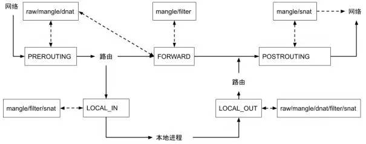

===tag=网络
===description=iptables规则
===pinned=true

## 简介



四表

- filter 表（过滤规则表）
- nat 表（地址转换规则表）
- mangle（修改数据标记位规则表）
- raw（跟踪数据表规则表）

五链

- INPUT（入站数据过滤）
- OUTPUT（出站数据过滤）
- FORWARD（转发数据过滤）
- PREROUTING（路由前过滤）
- POSTROUTING（路由后过滤）

### netfilter

iptables依赖于netfilter内核模块实现，同样的firewalld也是

```bash
firewall-cmd --zone=public --add-port=80/tcp --permanent //开放80
firewall-cmd --zone=public --add-port=443/tcp --permanent //开放443
firewall-cmd --reload //重启防火墙
firewall-cmd --list-ports // 当前开放的端口列表
```

## 规则

> iptables -t 表名 <-A/I/D/R> 规则链名 [规则号] <-i/o 网卡名> -p 协议名 <-s 源IP/源子网> --sport 源端口 <-d 目标IP/目标子网> --dport 目标端口 -j 动作

动作包括:

- accept:接收数据包
- DROP:丢弃数据包
- REDIRECT:重定向,映射,透明代理
- SNAT:源地址转换
- DNAT:目标地址转换
- MASQUERADE:IP伪装(NAT),用于ADSL
- LOG:日志记录

## 实例

`-t`指定表，默认是filter表

0、基本配置

```bash
iptables -F  # 清空所有的防火墙规则
iptables -X  # 删除用户自定义的空链
iptables -Z  # 清空计数

iptables -P INPUT DROP # 配置默认的不让进
iptables -P FORWARD DROP # 默认的不允许转发
iptables -P OUTPUT ACCEPT # 默认的可以出去

iptables -A INPUT -p all -s 192.168.1.0/24 -j ACCEPT  # 允许机房内网机器可以访问
iptables -A INPUT -p all -s 192.168.140.0/24 -j ACCEPT  # 允许机房内网机器可以访问
iptables -A INPUT -p tcp -s 183.121.3.7 --dport 3380 -j ACCEPT # 允许183.121.3.7访问本机的3380端口

iptables -A INPUT -p tcp --dport 80 -j ACCEPT # 开启80端口，因为web对外都是这个端口
iptables -A INPUT -p icmp --icmp-type 8 -j ACCEPT # 允许被ping
iptables -A INPUT -m state --state ESTABLISHED,RELATED -j ACCEPT # 已经建立的连接得让它进来
```

1、查看所有已添加的iptables表

`iptables -nvL`

- -L 表示查看当前表的所有规则，默认查看的是 filter 表，如果要查看 nat 表，可以加上 -t nat 参数。
- -n 表示不对 IP 地址进行反查，加上这个参数显示速度将会加快。
- -v 表示输出详细信息，包含通过该规则的数据包数量、总字节数以及相应的网络接口。

2、允许本地回环接口(即运行本机访问本机)

`iptables -A INPUT -s 127.0.0.1 -d 127.0.0.1 -j ACCEPT`

3、允许已建立的或相关连的通行

`iptables -A INPUT -m state --state ESTABLISHED,RELATED -j ACCEPT`

4、允许所有本机向外的访问

`iptables -A OUTPUT -j ACCEPT`

5、允许访问22端口

`iptables -A INPUT -p tcp --dport 22 -j ACCEPT`

6、禁止其他未允许的规则访问

`iptables -A INPUT -j reject`

## 调试

用raw表进行调试，使用到raw表、ipt_LOG内核模块、日志记录在kern.log中。

准备ipt_LOG内核模块

```bash
modprobe ipt_LOG
modprobe nf_log_ipv4
sysctl net.netfilter.nf_log.2=nf_log_ipv4
```

使用raw表，加入跟踪规则。raw表只能在PREROUTING和OUTPUT上加处理规则，符合规则的包会被跟踪，并输出到日志中。

```bash
iptables -t raw -A PREROUTING -p icmp -j TRACE
iptables -t raw -A OUTPUT -p icmp -j TRACE

iptables -t raw -A PREROUTING -p tcp -dport 80 -j TRACE
iptables -t raw -A OUTPUT -p tcp -dport 80 -j TRACE
```

查看日志

```bash
tail -f /var/log/kern.log
```