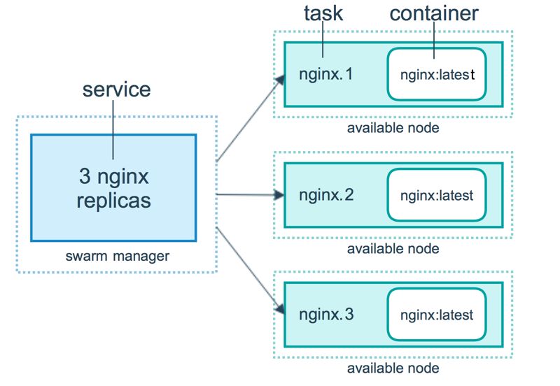
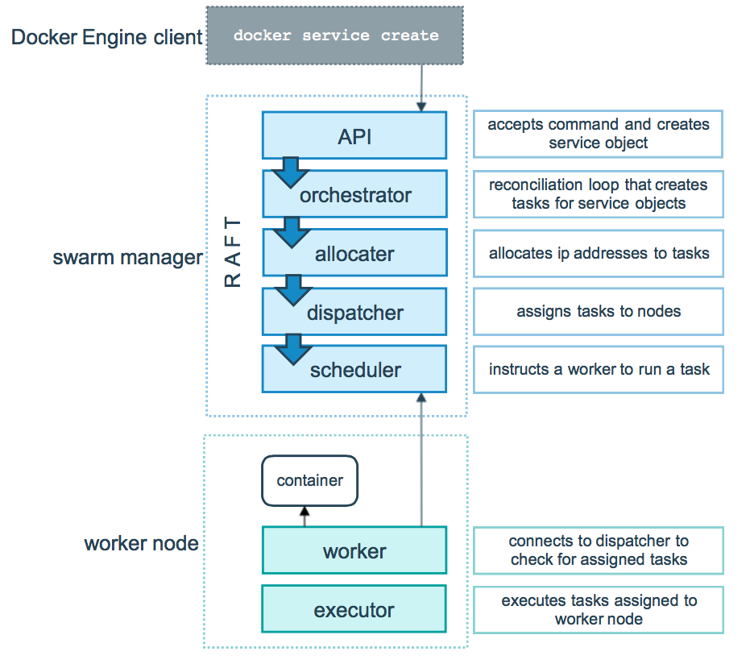

===tag=云原生
===description=docker-swarm的工作原理
===pinned=false

# node

n个manager由内置的raft协议数据库组成分布式集群，管理m个worker节点

n个manager最多容忍`(n-1)/2`个节点down

master

- 集群状态管理
- 服务调度
- api endpoint

worker节点唯一的工作内容就是执行容器

- worker -> manager: `docker node promote`
- manager -> worker: `docker node demote`

# service

> service -> container -> task

service类型

- Replicated: 服务多副本
- Global: 每个node都会都要执行的

# service创建流程

