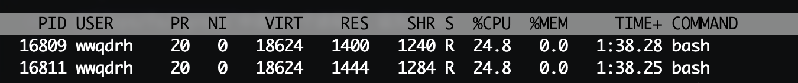

===tag=实践
===description=cgroup-cpu限制实践
===pinned=false
===create=2022-10-30

在cgroup1中，限制cpu的参数是

- cpu.cfs_quota_us(CFS调度周期)
- cpu.cfs_period_us(在一个调度周期中允许执行的时间)
- cpu.shares，控制组之间的CPU分配比例

在v2中只有两个参数了

- cpu.max
- cpu.weight

## 实验

一个两个cpu耗时的程序

```bash
#!/bin/bash
if [ $# != 1 ] ; then
    echo "USAGE: $0 <CPUs>"
    exit 1;
fi

function endless_loop()
{
    echo -ne "i=0;
    while true
    do
    i=i+100;
    i=100
    done" | /bin/bash &
}

for i in `seq $1`; do
    endless_loop
    pid_array[$i]=$! ;
done

for i in "${pid_array[@]}"; do
    echo 'kill ' $i ';';
done
```

在`/sys/fs/cgroup`中添加一个进程组，设为ctest


```bash
# 启动程序 这个shell脚本传入几就占用几个cpu，不过也同样的会有多个进程，所以需要把这多个进程一起加入到cgroup中

echo $? >> /sys/fs/cgroup/ctest/cgroup.procs
```

使用top查看这个进程的CPU占用情况

加入cgroup资源限制条件

```bash
echo 100 >> /sys/fs/cgroup/ctest/cpu.weight

echo 50000 >> /sys/fs/cgroup/ctest/cpu.max # 0.5个CPU
```

继续查看资源消耗

实验结果



可以看到两个加起来只占了0.5个，说明成功了
