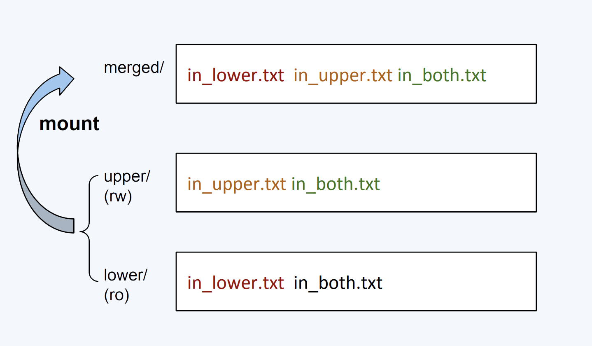

===tag=实践
===description=overlay文件系统实践，探索容器原理
===pinned=false
===create=2022-11-01

# 实验

```bash
# !/bin/bash

sudo umount ./merged
rm -rf upper lower merged work

mkdir upper lower merged work
echo "I'm from lower!" > lower/in_lower.txt
echo "I'm from upper!" > upper/in_upper.txt
# `in_both` is in both directories
echo "I'm from lower!" > lower/in_both.txt
echo "I'm from upper!" > upper/in_both.txt
```

当前文件目录结构

```bash
├── lower
│   ├── in_both.txt
│   └── in_lower.txt
├── merged
├── upper
│   ├── in_both.txt
│   └── in_upper.txt
└── work

4 directories, 4 files
```

使用overlay文件系统来挂载目录

```bash
sudo mount -t overlay overlay \
 -o lowerdir=./lower,upperdir=./upper,workdir=./work \
 ./merged
```

OverlayFS 就是 UnionFS 的一种实现，最底下这一层里的文件是不会被修改的,upper目录是可读写的，最上面的"merged" ，它是挂载点（mount point）目录，也是用户看到的目录，用户的实际文件操作在这里进行。



`1、新建文件`

这个文件会出现在 upper/ 目录中

```bash
$touch merged/newfile.txt

$tree
├── lower
│   ├── in_both.txt
│   └── in_lower.txt
├── merged
│   ├── in_both.txt
│   ├── in_lower.txt
│   ├── in_upper.txt
│   └── newfile.txt
├── upper
│   ├── in_both.txt
│   ├── in_upper.txt
│   └── newfile.txt
└── work
    └── work  [error opening dir]
```

`2、删除文件`

- 删除属于上层的文件，upper目录下的会消失
- 删除属于下层的文件，下层目录的不会消失而是在上层新建一个特殊文件表示下层的已经消失了

```bash
$ rm merged/in_lower.txt

$ tree
├── lower
│   ├── in_both.txt
│   └── in_lower.txt
├── merged
│   ├── in_both.txt
│   ├── in_upper.txt
│   └── newfile.txt
├── upper
│   ├── in_both.txt
│   ├── *in_lower.txt
│   ├── in_upper.txt
│   └── newfile.txt
└── work
    └── work  [error opening dir]

$ ls -l upper/in_lower.txt
c--------- 2 root root 0, 0 11月  1 16:18 upper/in_lower.txt
```

> 字符设备(以字符为单位进行传输，例如键盘，打印机)可以使用与普通文件相同的文件操作命令对字符设备文件进行操作，例如打开、关闭、读、写等。

`3、修改文件`

- 属于底层文件: 在upper新建然后修改
- 属于上层文件: 在upper中进行修改

```bash
$ echo 'modify' >> merged/in_lower.txt

$ tree
├── lower
│   ├── in_both.txt
│   └── in_lower.txt
├── merged
│   ├── in_both.txt
│   ├── in_lower.txt
│   ├── in_upper.txt
│   └── newfile.txt
├── upper
│   ├── in_both.txt
│   ├── in_lower.txt
│   ├── in_upper.txt
│   └── newfile.txt
└── work
    └── work  [error opening dir]

$ cat lower/in_lower.txt
I'm from lower!

$ cat merged/in_lower.txt
modify
```

4、验证docker使用的overlay文件系统

```bash
$ cat /proc/mounts | grep overlay
overlay /var/lib/docker/overlay2/4e6...
# 同样也有lowerdir，upperdir、workdir等配置
```

# overlay与overlay2的区别

overlay驱动只能工作在两层之上，每个镜像层在/var/lib/docker/overlay中用自己的目录来实现。

overlay驱动只工作在一个lower OverlayFS层之上，因此需要硬链接来实现多层镜像，存在inode耗尽问题 

```bash
$ mount | grep overlay

overlay on /var/lib/docker/overlay/ec444863a55a.../merged
type overlay (rw,relatime,lowerdir=/var/lib/docker/overlay/55f1e14c361b.../root,
upperdir=/var/lib/docker/overlay/ec444863a55a.../upper,
workdir=/var/lib/docker/overlay/ec444863a55a.../work)
```

overlay2驱动原生地支持多层lower OverlayFS镜像（最多128层）

```bash
$ mount | grep overlay

overlay on /var/lib/docker/overlay2/9186877cdf386d0a3b016149cf30c208f326dca307529e646afce5b3f83f5304/merged
type overlay (rw,relatime,
lowerdir=l/DJA75GUWHWG7EWICFYX54FIOVT:l/B3WWEFKBG3PLLV737KZFIASSW7:l/JEYMODZYFCZFYSDABYXD5MF6YO:l/UL2MW33MSE3Q5VYIKBRN4ZAGQP:l/NFYKDW6APBCCUCTOUSYDH4DXAT:l/6Y5IM2XC7TSNIJZZFLJCS6I4I4,
upperdir=9186877cdf386d0a3b016149cf30c208f326dca307529e646afce5b3f83f5304/diff,
workdir=9186877cdf386d0a3b016149cf30c208f326dca307529e646afce5b3f83f5304/work)
```
