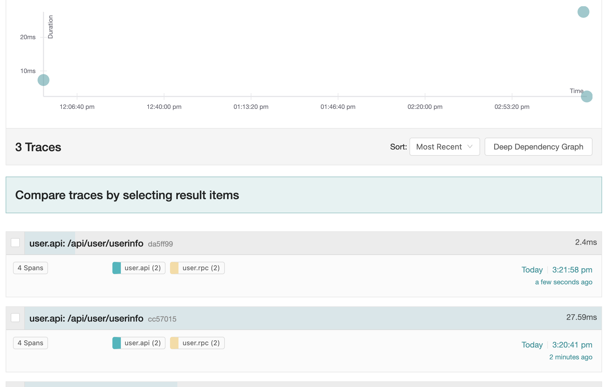
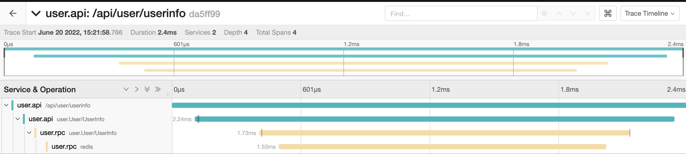
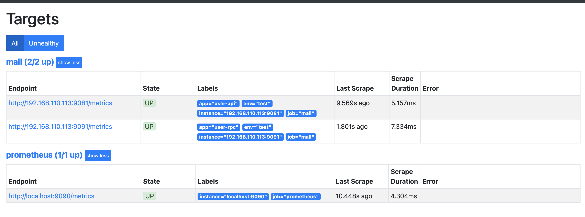

# 简介

介绍go-zero之前先说明什么是微服务、为什么要用微服务、微服务有哪些缺点

微服务是比代码更高粒度设计模式思想的体现，将功能高度相关的集中在一起是高内聚的体现，通过服务的拆分来降低系统之间的耦合度是低耦合的体现

不仅是代码的可维护、可测试、可扩展重要，应用层面的这些特性同样重要

至于高内聚低耦合、服务分层有什么优点，写过代码的应该都清楚就不赘述

另外，两个要点

1、不要因为代码规模太小而拒绝良好的设计，设计与代码规模无关，只与应用是否可维护、可扩展有关
2、不要为了拆成微服务而拆，没有良好的服务划分，拆出来只会加大服务之间的混乱程度

# 微服务需要解决的问题

## 服务注册与发现

主要就是让服务之间知道某个服务在某个地址，以及做负载均衡等

## 日志收集

各个服务拆分之后日志保存会很分散，一个个的去服务上查看日志显然不合适，需要有日志上报集中查看的功能

## 链路追踪

多个服务之间的调用链条需要有可视化的查看机制

## 服务监控

及时查看服务是否运行正常

## 分布式事务

涉及到数据修改，为了保证数据一致性，避免其中某个服务出错而数据无法回滚到正确的版本

## 服务治理

自适应降级能非常智能的保护服务自身，根据服务自身的系统负载动态判断是否需要降级。保护自身不被调用方压垮

限流，防止突发流量压垮系统

熔断，发起服务调用的时候，如果被调用方返回的错误率超过一定的阈值，那么后续的请求将不会真正发起请求，而是在调用方直接返回错误

# go-zero如何解决这些问题的

在讲go-zero如何解决上述微服务要点之前，先说说go-zero有什么优点

## 代码自动生成

包括rpc、api、model三部分，其中rpc、api是gateway层，rpc是基于zrpc(grpc的封装)框架的服务之间调用服务。api是给外部用户使用的

model层是模型层+缓存服务的自动生成(但是有个问题，现在只能生成mysql的，但是问题不大，数据层的代码本身就有很多逻辑要自己写，这部分可以照旧使用原来的技术栈)

- `goctl api go -dir . -api user.api`
- `goctl rpc protoc --go_out=. --go-grpc_out=. --zrpc_out=. user.proto`
- `goctl model mysql ddl -c -dir . -src user.sql`

*api文件格式*

```go
type (
	// 用户登录
	LoginRequest {
		Mobile   string `json:"mobile"`
		Password string `json:"password"`
	}
	LoginResponse {
		AccessToken  string `json:"accessToken"`
		AccessExpire int64  `json:"accessExpire"`
	}
	// 用户登录

	// 用户注册
	RegisterRequest {
		Name     string `json:"name"`
		Gender   int64  `json:"gender"`
		Mobile   string `json:"mobile"`
		Password string `json:"password"`
	}
	RegisterResponse {
		Id     int64  `json:"id"`
		Name   string `json:"name"`
		Gender int64  `json:"gender"`
		Mobile string `json:"mobile"`
	}
	// 用户注册

	// 用户信息
	UserInfoResponse {
		Id     int64  `json:"id"`
		Name   string `json:"name"`
		Gender int64  `json:"gender"`
		Mobile string `json:"mobile"`
	}
	// 用户信息
)

service User {
	@handler Login
	post /api/user/login (LoginRequest) returns (LoginResponse)
	
	@handler Register
	post /api/user/register (RegisterRequest) returns (RegisterResponse)
}

@server(
	jwt: Auth
)
service User {
	@handler UserInfo
	post /api/user/userinfo () returns (UserInfoResponse)
}
```

## 容器文件自动生成

创建Dockerfile, `goctl docker -go hello.go`

docker build -t .... 创建镜像

## k8s服务文件自动生成

`goctl kube deploy -name redis -namespace adhoc -image redis:6-alpine -o redis.yaml -port 6379`

这条命令的含义就是在adhoc命名空间中创建Deployment类型的资源，名字叫做redis，使用的镜像为`redis:6-alpine`, containerPort为6379

接下来是go-zero中如何解决上文所说的问题

## 服务注册与发现

部署etcd(这里为了简单仅部署单节点)

```bash
docker pull bitnami/etcd:3.5.3

docker run -d -p 2379:2379 -p 2380:2380 \
-e ETCD_ROOT_PASSWORD=123456 \
--name etcd3 bitnami/etcd:3.5.3
```

go-zero中配置(配置文件也是由上文的goctl自动生成的，执行一遍就知道了)

```yaml
// 注册者
Etcd:
  Hosts:
  - 127.0.0.1:2379
  Key: user.rpc
  User: root
  Pass: "123456"
```

其中Key就是该服务注册到etcd中的名字

调用者,首先修改配置以及修改go中的结构体

```yaml
UserRpc:
  Etcd:
    Hosts:
      - 127.0.0.1:2379
    Key: user.rpc
    User: root
    Pass: "123456"
```

```go
type Config struct {
	...
	UserRpc zrpc.RpcClientConf
}
```

然后将服务初始化到上下文中

```go
type ServiceContext struct {
	Config  config.Config
	UserRpc user.User
}

func NewServiceContext(c config.Config) *ServiceContext {
	return &ServiceContext{
		Config:  c,
		UserRpc: user.NewUser(zrpc.MustNewClient(c.UserRpc)),
	}
}
```

之后就可以直接使用UserRpc进行rpc调用

## 日志收集

部署EFK架构，当然如果只是为了将日志集中起来方便查看，可以暂时需要elasticsearch+kibana

部署fluentd

```bash
docker pull fluent/fluentd:v1.14-debian

docker run -d -p 24224:24224 -v ${conf}:/fluentd/etc/fluent.conf fluent/fluentd:v1.14-debian
```

示例配置文件

参考: https://docs.fluentd.org/configuration/config-file

```conf
<source>
  @type   forward
</source>
<match *>
  @type              file
  path               /fluentd/log/${tag}
  append             true
  <format>
    @type            single_value
    message_key      log
  </format>
  <buffer tag,time>
    @type             file
    timekey           1d
    timekey_wait      10m
    flush_mode        interval
    flush_interval    30s
  </buffer>
</match>
```

将上传到flutend的操作封装进基础logger库的可选项以及包装成go-zero可使用的模式

参考: github.com/wwqdrh/logger

```go
import (
    mylogx "github.com/wwqdrh/logger/logx"
	"github.com/zeromicro/go-zero/core/conf"
	"github.com/zeromicro/go-zero/core/logx"
)

func init() {
    l := logger.NewLogger(
        logger.WithLevel(zapcore.WarnLevel),
        logger.WithLogPath("./logs/info.log"),
        logger.WithName("info"),
        logger.WithFluentd(true, "127.0.0.1", 24224),
        logger.WithConsole(false),
    )

    writer, _ := mylogx.NewZeroWriter(l)
    logx.Must(err)
    logx.SetWriter(writer)
}
```

之后使用logx.Infof就可以将日志上传至服务中, 所有的服务的日志就已经收集到了flutend容器中

## 链路追踪

go-zero已经封装了，仅需部署jaeger之后修改服务的配置项进行启用

部署jaeger

```bash
docker pull jaegertracing/all-in-one:1.34

docker run -d --name jaeger \
-e COLLECTOR_ZIPKIN_HTTP_PORT=9411 \
-p 5775:5775/udp \
-p 6831:6831/udp \
-p 6832:6832/udp \
-p 5778:5778 \
-p 16686:16686 \
-p 14268:14268 \
-p 9411:9411 \
jaegertracing/all-in-one:1.34
```

修改配置

```yaml
Telemetry:
  Name: user.api
  Endpoint: http://127.0.0.1:14268/api/traces
  Sampler: 1.0
  Batcher: jaeger
```

效果





## 服务监控

go-zero已经集成

部署prometheus

```bash
docker pull bitnami/prometheus:2.9.2

docker run --name prometheus \
-v ${CURDIR}"/env/prometheus/prometheus.yml":/opt/bitnami/prometheus/data \
-p 9090:9090 \
    bitnami/prometheus:2.9.2
```

进行配置

```yaml
Prometheus:
  Host: 0.0.0.0
  Port: 9081
  Path: /metrics
```

修改prometheus监听的服务配置（上文的prometheus.yml）

```yaml
# my global config
global:
  scrape_interval: 15s # Set the scrape interval to every 15 seconds. Default is every 1 minute. 
  evaluation_interval: 15s # Evaluate rules every 15 seconds. The default is every 1 minute.     
  # scrape_timeout is set to the global default (10s).

# Alertmanager configuration
alerting:
  alertmanagers:
    - static_configs:
        - targets:
          # - alertmanager:9093

# Load rules once and periodically evaluate them according to the global 'evaluation_interval'.  
rule_files:
  # - "first_rules.yml"
  # - "second_rules.yml"

# A scrape configuration containing exactly one endpoint to scrape:
# Here it's Prometheus itself.
scrape_configs:
  # The job name is added as a label `job=<job_name>` to any timeseries scraped from this config.
  - job_name: "prometheus"

    # metrics_path defaults to '/metrics'
    # scheme defaults to 'http'.

    static_configs:
      - targets: ["localhost:9090"]

  # 我们自己的商城项目配置
  - job_name: 'mall'
    static_configs:
      # 目标的采集地址
      - targets: ['192.168.110.113:9081']
        labels:
          # 自定义标签
          app: 'user-api'
          env: 'test'

      - targets: ['192.168.110.113:9091']
        labels:
          app: 'user-rpc'
          env: 'test'
```

效果



## 分布式事务

使用dtm

比较大的部分，详细文档查看: https://go-zero.dev/cn/docs/eco/distributed-transaction

## 服务治理

熔断器使用文档: https://go-zero.dev/cn/docs/blog/governance/breaker-algorithms

自适应降级文档: https://go-zero.dev/cn/docs/blog/governance/loadshedding

限流文档: https://go-zero.dev/cn/docs/blog/governance/periodlimit
