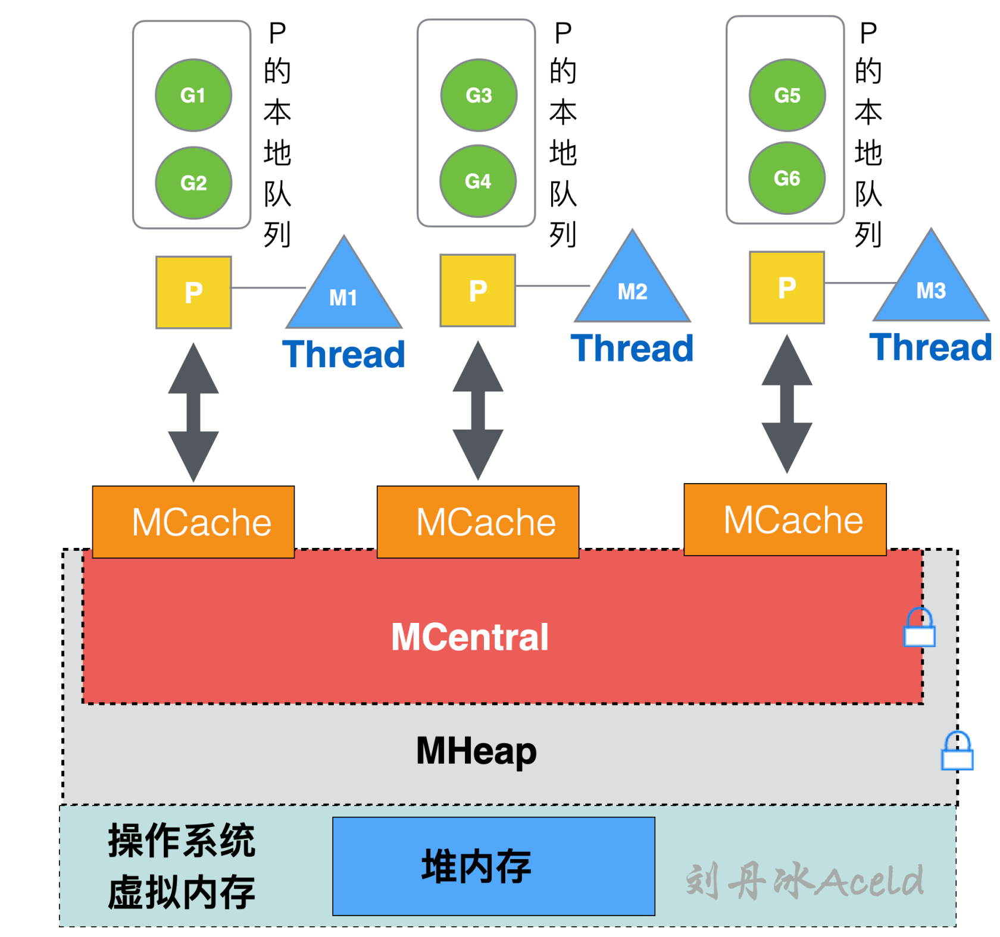
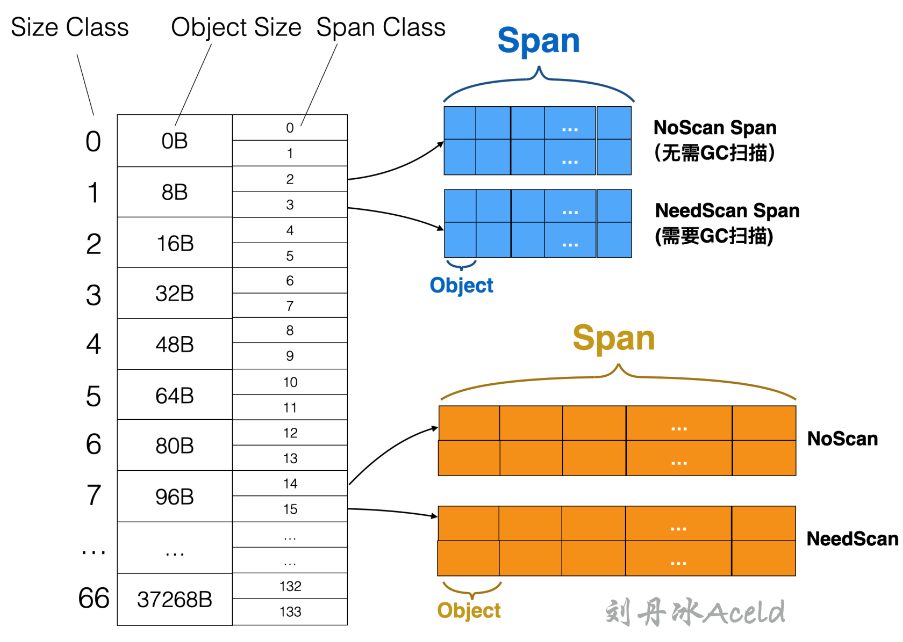
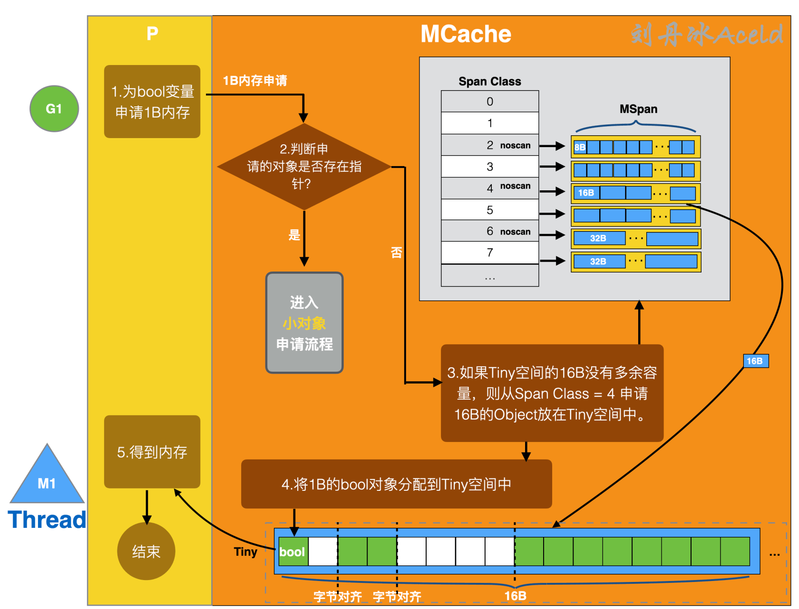
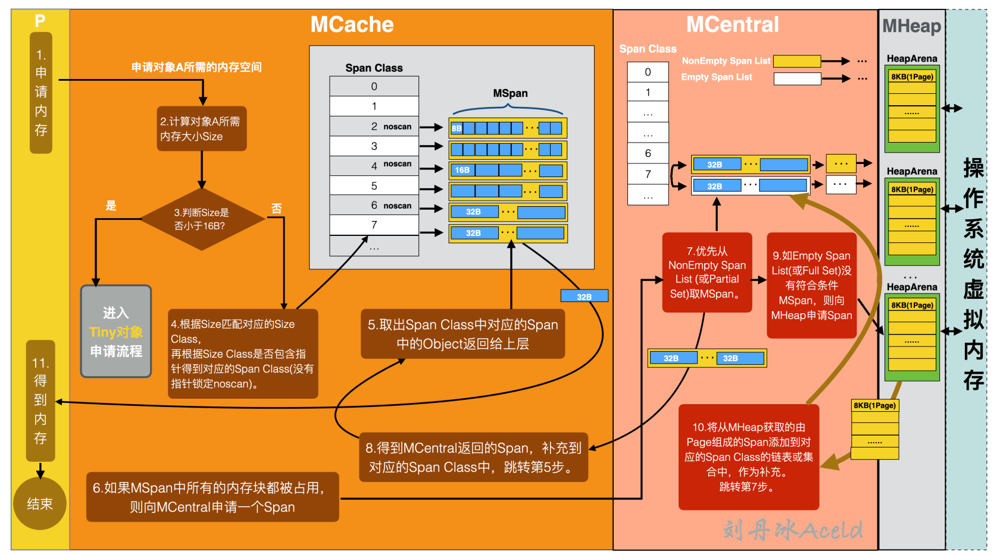
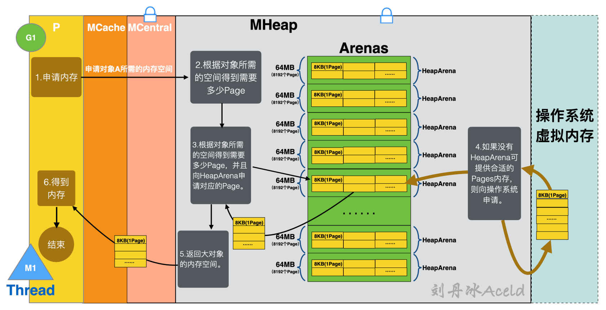
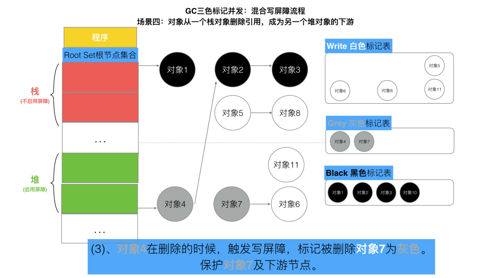
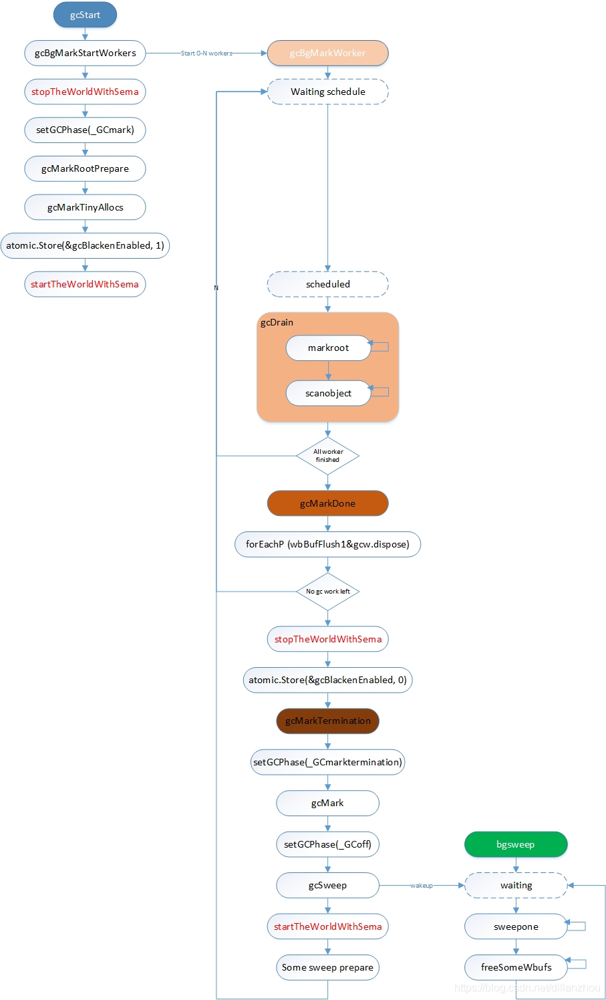

# 内存模型

1、对于频繁创建的对象可以考虑sync.Pool复用对象避免频繁gc

2、函数中最好返回结构体而不是指针，因为返回指针实际上在分配的时候是在堆上分配内存的，虽然省去复制的操作但是却为gc带来了麻烦


> 参考: https://learnku.com/articles/68141
> 参考：https://learnku.com/articles/68142



不同内存模型对于虚拟内存的管理以及使用方式是不一样的

## go内存模型

#TCMALLoc

> Golang 内存管理模型与 TCMalloc 的设计极其相似。基本轮廓和概念也几乎相同，只是一些规则和流程存在差异。Golang 内存管理中依然保留 TCMalloc 中的 Page、Span、Size Class 等概念。

- arean: 向操作系统申请内存时的最小单位，每个 arena 为 64MB 大小
- Page: 单个 arena 会被切分成以 8KB(64位系统) 为单位的 page
- mSpan: 一个或多个page可以组成一个mSpan, mspan 又分为 scan 和 noscan 两种，分别对应内部有指针的 object 和内部没有指针的 object。
- SizeClass
	- ObjectSize: object的内存大小
	- SizeClass: 表示刻度
	- SpanClass
- element: mspan可以按照 sizeclass 再划分成多个 element



内存分配流程可通过对象大小进行分类

- Tiny对象，直接在MCache的Tiny进行分配
- 小对象，按照span class规格进行匹配，如果MCache中的MSpan所有内存空间都被占用了，那么就会从MCentral申请一个对应的Span
- 大对象，直接从MHeap申请需要的Page

1B 至 16B 的 Tiny 对象



MCache 中不仅保存着各个 Span Class 级别的内存块空间，还有一个比较特殊的 Tiny 存储空间。Tiny 空间是从 Size Class = 2（对应 Span Class = 4 或 5）中获取一个 16B 的 Object，作为 Tiny 对象的分配空间。

16B 至 32kB 的小对象



分配小对象的标准流程是按照 Span Class 规格匹配的。

大于32kb的大对象



小对象是在 MCache 中分配的，而大对象是直接从 MHeap 中分配。对于不满足 MCache 分配范围的对象，均是按照大对象分配流程处理。

大对象分配流程是协程逻辑层直接向 MHeap 申请对象所需要的适当 Pages，从而绕过从 MCaceh 到 MCentral 的繁琐申请内存流程

# 垃圾回收

GC，基于标记-清除(Mark and Sweep)算法，为了降低STW时间，采用三色标记算法，最大程度的将标记过程和任务执行并行。

> 无分代（对象没有新旧之分）、不整理（不对对象进行移动与整理）、并发（与用户代码并发执行），三色标记清扫算法


- 三色标记法
- 后台并发标记

为了避免GC长时间STW影响正常任务执行，golang将主要标记工作放在单独的G上执行。这些G可以和其他任务G一起被调度，并发执行，而不需要STW。

由于执行并发标记的G有多个，这些G需要并发的从全局GC队列中获取对象。为了减少这些G的并发冲突，golang在每个G中维护了两段buffer，用于批量缓存扫描对象，这样每个G可以从GC队列中批量获取对象，减少冲突。

- 后台并发清除

被清除的对象已经不可能再被访问，因此没有必要在STW中处理。golang使用一个专门的G来清除回收内存，这个G可以与其他G并发调度执行。

- 写屏障（write barrier）

- 辅助GC

为了避免GC 的速度赶不上制造垃圾的速度

辅助GC是在mallocgc中执行一部分gc标记的机制。每分配一定数量的内存，就会在mallocgc中做一些gc标记工作。如果mallocgc分配了过多内存却没有完成足够多的标记工作，就会被挂起，直到其他GC工作线程完成了足够多的工作或GC结束时才会被唤醒。这个机制的目的是防止GC过程中mallocgc执行过快分配过多新内存，导致GC持续时间过长或无法完成。

---

标记部分中有栈对象可能会对"GC是针对堆对象这句话产生疑惑"，其实是没问题的，需要栈对象是因为标记初始阶段是需要一个“根”的，这里就是栈对象和全局变量。垃圾回收器标记过程最先检查的集合

1.  全局变量：程序在编译期就能确定的那些存在于程序整个生命周期的变量。
2.  执行栈：每个 goroutine 都包含自己的执行栈，这些执行栈上包含栈上的变量及指向分配的堆内存区块的指针。
3.  寄存器：寄存器的值可能表示一个指针，参与计算的这些指针可能指向某些赋值器分配的堆内存区块。

## 历史版本

-   Go 1：串行三色标记清扫
    
-   Go 1.3：并行清扫，标记过程需要 STW，停顿时间在约几百毫秒
    
-   Go 1.5：并发标记清扫，停顿时间在一百毫秒以内

 >开始三色标记之前就会加上 STW，在扫描确定黑白对象之后再放开 STW

白色: 新创建的对象，遍历过后如果还在就要回收的对象
灰色对象: 最初是根对象开始找到的白色对象(只找一层)，后续不断重复遍历灰色对象，将新的白色对象转为灰色对象，上一层的灰色对象转为黑色对象
黑色对象：最终存活的对象

> 引入屏障机制可以消除STW的同时保证对象引用关系的正确性

- 强三色不变式: 不允许黑色引用白色(避免这个白色被之前扫描过了的引用了确不知道，导致GC误删)
- 弱三色不变式: 黑色可以引用白色，但是这个白色同时必须被灰色引用(有了灰色，说明这个白色后续还是有可能被遍历到然后变成灰色的)

*插入屏障*

满足强三色不变式，保证黑色对象不会直接引用白色对象

当发生了黑色对象引用白色对象的情况，如果这个黑色对象是在堆区则触发插入屏障机制，将这个被引用的白色对象直接变为灰色对象

全部三色标记扫描之后，栈上有可能依然存在白色对象被引用的情况。需要开启STW暂停，对栈对象重新进行三色标记扫描。

最后将栈和堆空间扫描剩余的全部白色节点清除。

*删除屏障*

满足弱三色不变式，需要保护灰色对象到白色对象的路径不会断

灰色对象引用到白色对象时(只被前面一个灰色对象引用着)，如果删除了这层引用关系，需要触发删除屏障，将这个白色对象标记为灰色。

这种方式的回收精度低，一个对象即使被删除了最后一个指向它的指针也依旧可以活过这一轮，在下一轮 GC 中被清理掉。

-   Go 1.6：使用 bitmap 来记录回收内存的位置，大幅优化垃圾回收器自身消耗的内存，停顿时间在十毫秒以内
    
-   Go 1.7：停顿时间控制在两毫秒以内
    
-   Go 1.8：混合写屏障，停顿时间在半个毫秒左右

混合写屏障机制（hybrid write barrier），避免插入屏障与删除屏障的缺点。满足变形的弱三色不变式

> 其实就是开始以及新创建的对象由白色变为黑色，避免标记完成之后对栈空间的STW重新扫描

黑色：开始时的对象，gc期间创建的新对象
灰色：被删除引用的对象，被添加引用的对象
白色：需要回收的对象

GC开始的时候全部都为白色，扫描栈将栈全部标记为黑

1、当对象被堆对象删除引用并成为栈对象的下游：由于删除的引用来自堆区触发混合写屏障，将其标记为灰色
2、当对象被栈对象删除引用并成为另一个栈对象的下游：无屏障效果
3、对象被一个堆对象删除引用并成为另一个对象的下游：触发屏障机制，变为灰色
4、对象被一个栈对象删除引用并成为另一个堆对象的引用：栈空间的不触发屏障效果，堆空间下被转走的那个引用触发屏障机制，由白色变为灰色




-   Go 1.9：彻底移除了栈的重扫描过程
    
-   Go 1.12：整合了两个阶段的 Mark Termination，但引入了一个严重的 GC Bug 至今未修（见问题 20），尚无该 Bug 对 GC 性能影响的报告
    
-   Go 1.13：着手解决向操作系统归还内存的，提出了新的 Scavenger
    
-   Go 1.14：替代了仅存活了一个版本的 scavenger，全新的页分配器，优化分配内存过程的速率与现有的扩展性问题，并引入了异步抢占，解决了由于密集循环导致的 STW 时间过长的问题

## 执行流程

> 具体的语言层面运行逻辑参考: https://blog.csdn.net/dillanzhou/article/details/107148686




| 阶段 | 说明 | 赋值器状态 |
| --- | --- | --- |
| SweepTermination | 清扫终止阶段，为下一个阶段的并发标记做准备工作，启动写屏障，会触发 STW ，所有的 P（处理器） 都会进入 safe-point（安全点）； | STW |
| Mark | 扫描标记阶段，与赋值器并发执行，写屏障开启，恢复程序执行，GC 执行根节点的标记，这包括扫描所有的栈、全局对象以及不在堆中的运行时数据结构； | 并发 |
| MarkTermination | 标记终止阶段，保证一个周期内标记任务完成，停止写屏障，触发 STW，扭转 GC 状态，关闭 GC 工作线程等 | STW |
| sweep | 恢复程序执行，后台并发清理所有的内存管理单元 | 并发 |

1.  **主动触发**，通过调用 runtime.GC 来触发 GC，此调用阻塞式地等待当前 GC 运行完毕。
    
2.  **被动触发**，分为两种方式：
    - 监控线程 runtime.sysmon 定时调用；
    - 申请内存时 runtime.mallocgc 会根据堆大小判断是否调用；

这些触发gc的方法都会在gcTrigger进行校验

### 主协程

- gcStart有一个gcTrigger的参数
	- gcTriggerHeap： 触发条件是memstats.heap_live >= memstats.gc_trigger，即当前使用的内存量超过GC触发阈值
	- gcTriggerTime：当前时间与上次GC时间memstats.last_gc_nanotime间的时间间隔已经超过forcegcperiod（120s）
	- gcTriggerCycle： 没有开启垃圾收集，则触发新的循环
- gcBgMarkStartWorkers: 每个P启动一个gcBgMarkWorker的G用于标记全局和每个P上分配的内存,不会立即执行，等到标记（mark）阶段后被gcController.findRunnableGCWorker唤醒执行。gcController.findRunnableGCWorker在runtime.schedule中被调用，如果正处于GC状态且worker数量没有达到阈值，就会运行gcBgMarkWorker。gcBgMarkWorker一般不会在一次GC标记结束后就退出，而是会继续等待下一次GC工作

markroot中的根节点的类型: RootFinalizers：finalizer相关内存；RootFreeGStacks：已经结束的G的栈；FlushCache：每个P的本地mcache；Data：每个活跃模块的数据段；BSS：每个活跃模块的BSS段；Spans：finalizer使用的特殊mspan；Stacks：每个G的栈

> 这里就和golang的内存模型对应起来了，mspan、mcache等结构

- setGCPhase: 将GC阶段修改为_GCmark状态。setGCPhase除了修改状态外，更重要的是启动写屏障（write barrier）。如果状态为`_GCmark/_GCmarktermination`，写屏障就会打开
-  gcMarkRootPrepare，收集根节点信息，计算出根节点标记的任务量，记录在work.markrootJobs中，供后面的各个worker处理。
- gcMarkTinyAllocs，完成每个P的小型对象内存标记。gcMarkTinyAllocs会将每个P使用本地缓存mcache分配的小型数据结构地址标记为灰色并加入到p.gcw队列中。
- atomic.Store(&gcBlackenEnabled, 1)，设置gcBlackenEnabled。设置了这个状态后，会产生如下影响：
	- mallocgc分配内存时，会触发辅助GC(mutator assist)。
	- 操作mspan时(allocSpan/freeSpan/cacheSpan)会执行gcController.revise()，更新辅助GC的比例参数。
	- 调度器会尝试调度运行gcBgMarkWorker。

### 每个p中的gcgoroutine

gcDrain: 后台标记，循环调用markroot处理和标记根节点。所有worker会先并发完成根节点标记任务。根节点标记任务分成work.markrootJobs份，所有worker并发获取任务并执行，直到没有markroot任务待处理后执行下一步骤。

gcMarkDone：当所有worker都处理完了，完成并发标记

gcMarkTermination: 结束标记，开始清除

gcSweep: 清除对象，释放内存

清除和标记一样，有阻塞模式（调试用）和后台并行模式（日常实用模式）。在后台模式下，gcSweep只需要唤醒sweep.g即可。sweep.g在main函数执行时初始化，就是bgsweep函数。bgsweep启动后一直在主循环中等待，每次被唤醒后就执行一次内存回收操作，之后继续循环等待。

bgsweep循环调用sweepone释放mspan直到没有可释放的mspan，然后循环调用freeSomeWbufs释放GC过程中使用的workbuf结构。全部释放完成后这一轮GC完全结束。


## 执行分析

> 参考: https://www.luozhiyun.com/archives/680

通过debug.gcstoptheworld可以控制GC的方式，如果debug.gcstoptheworld=1则标记（mark）阶段会完全停止任务运行，如果debug.gcstoptheworld=2则标记（mark）和清除（sweep）阶段都会完全停止任务运行。默认情况下，debug.gcstoptheworld=0

观察gc

- `GODEBUG=gctrace=1`
- `go tool trace`

```Go
func main() {
	f, _ := os.Create("trace.out")
	defer f.Close()
	trace.Start(f)
	defer trace.Stop()
	(...)
}
```

- `debug.ReadGCStats`

```go
func printGCStats() {
	t := time.NewTicker(time.Second)
	s := debug.GCStats{}
	for {
		select {
		case <-t.C:
			debug.ReadGCStats(&s)
			fmt.Printf("gc %d last@%v, PauseTotal %v\n", s.NumGC, s.LastGC, s.PauseTotal)
		}
	}
}
```

- `runtime.ReadMemStats`

通过运行时内存API进行监控

```go
func printMemStats() {
	t := time.NewTicker(time.Second)
	s := runtime.MemStats{}

	for {
		select {
		case <-t.C:
			runtime.ReadMemStats(&s)
			fmt.Printf("gc %d last@%v, next_heap_size@%vMB\n", s.NumGC, time.Unix(int64(time.Duration(s.LastGC).Seconds()), 0), s.NextGC/(1<<20))
		}
	}
}
```

内存泄漏情况

- 预期能被快速释放的内存因被根对象引用而没有得到迅速释放
- goroutine泄漏

GC调优

关注的指标

- CPU利用率：回收占用的CPU时间以及其他占用CPU时间的百分比决定的
- GC停顿时间：回收器造成的停顿，GC 中需要考虑 STW 和 Mark Assist 两个部分可能造成的停顿。
- GC停顿频率
- GC可扩展性：当堆内存变大时，垃圾回收器的性能如何

如何调优

- 合理化内存分配的速度，提高赋值器的CPU利用率
- 降低并复用已经申请的内存
- 调整GOGC