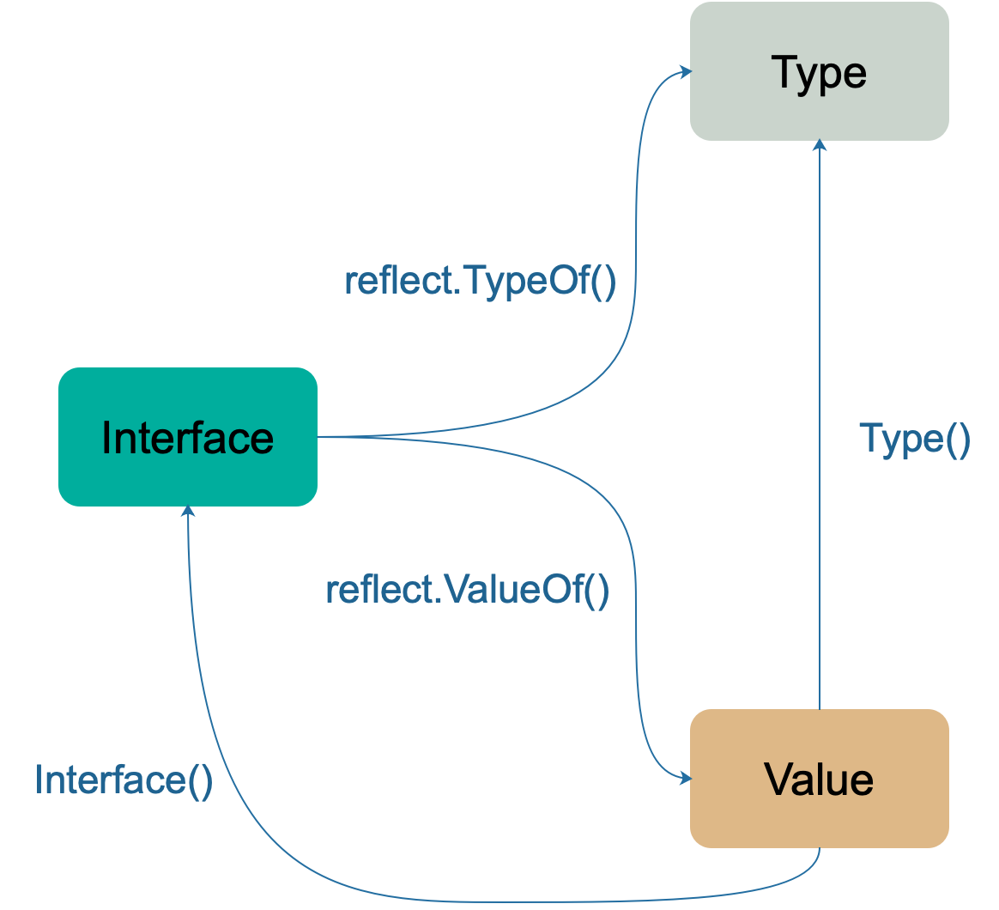
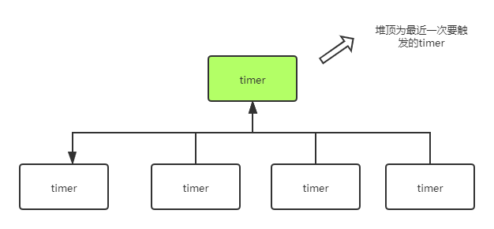

# unsafe

- Go的指针不能进行数学运算
- 不同类型的指针不能相互转换
- 不同类型的指针不能使用 `==` 或 `!=`比较：只有在两个指针类型相同或者可以相互转换的情况下，才可以对两者进行比较
- 不同类型的指针变量不能相互赋值

unsafe包提供了

- 将任何类型的指针和unsafe.Pointer可以相互转换
- uintptr类型和unsafe.Pointer相互转换

uintptr 并没有指针的语义，意思就是 uintptr 所指向的对象会被 gc 无情地回收。而 unsafe.Pointer 有指针语义，可以保护它所指向的对象在“有用”的时候不会被垃圾回收。

## 示例

1、获取slice长度

```go
s := make([]int, 9, 20)
Len := *(*int)(unsafe.Pointer(uintptr(unsafe.Pointer(&s)) + uintptr(8)))

fmt.Println(Len, len(s)) // 9 9

Cap := *(*int)(unsafe.Pointer(uintptr(unsafe.Pointer(&s)) + uintptr(16)))
fmt.Println(Cap, cap(s)) // 20 20
```

2、获取map的长度

```go
func main() {
	mp := make(map[string]int)
	mp["qcrao"] = 100
	mp["stefno"] = 18

	count := **(**int)(unsafe.Pointer(&mp))
	fmt.Println(count, len(mp)) // 2 2
}
```

如何利用unsafe包修改私有成员

如何利用unsafe获取slice和map的长度

如何实现字符串和byte切片的零复制转换

3、利用unsafe修改私有成员

> 结构体会被分配一块连续的内存，结构体的地址也代表了第一个成员的地址

通过offset获取结构体成员的偏移量进而获取成员的地址，读写该地址的内存，就可以达到改变成员值的目的。

```go
type Programmer struct {
	name string
	language string
}

type Programmer2 struct {
	name string
	age int
	language string
}

func main1() {
	p := Programmer{"stefno", "go"}
	fmt.Println(p)
	
	name := (*string)(unsafe.Pointer(&p)) // 结构体地址就是第一个成员的地址，这里转为*string类型，可以对其进行修改
	*name = "qcrao"

	lang := (*string)(unsafe.Pointer(uintptr(unsafe.Pointer(&p)) + unsafe.Offsetof(p.language)))
	*lang = "Golang"

	fmt.Println(p)
}

func main2() {
	p := Programmer{"stefno", 18, "go"}
	fmt.Println(p)
	
	lang := (*string)(unsafe.Pointer(uintptr(unsafe.Pointer(&p)) + unsafe.Sizeof(int(0)) + unsafe.Sizeof(string("")))) // 通过sizeof获取偏移量
	*lang = "Golang"
}
```

4、实现字符串和byte切片的零拷贝转换


```go
// string与slice的底层结构
type StringHeader struct {
	Data uintptr
	Len  int
}

type SliceHeader struct {
	Data uintptr
	Len  int
	Cap  int
}
```

通过unsafe.Pointer实现任意类型强转换

```go
func string2bytes(s string) []byte {
	return *(*[]byte)(unsafe.Pointer(&s))
}
func bytes2string(b []byte) string{
	return *(*string)(unsafe.Pointer(&b))
}
```

# error

接口error是什么

error 接口只包含一个方法—— Error ，这个函数需要返回一个描述错误信息的字符串。 当一个函数或方法需要返回错误时，我们通常是把错误作为最后一个返回值。

接口error有什么问题

如何理解关于error的三句谚语

- 视错误为值
- 检查并优雅地处理错误
- 只处理错误一次

错误处理的改进


# 反射

> 程序运行时检测和修改自身状态或行为的能力
> 可以用于IDE自动补全、对象序列化、ORM、fmt等

1.  不能明确接口调用哪个函数，需要根据传入的参数在运行时决定。
2.  不能明确传入函数的参数类型，需要在运行时处理任意对象。

缺点是：代码可读性，很难维护，反射时无法处理类型检查，反射很容易出错直接panic。会影响性能(慢一到两个数量级)

当向接口变量赋予一个实体类型的时候，接口会存储实体的类型信息，反射就是通过接口的类型信息实现的，反射建立在类型的基础上。



- 反射是一种检测存储在 `interface` 中的类型和值机制。这可以通过 `TypeOf` 函数和 `ValueOf` 函数得到。
- `ValueOf` 的返回值通过 `Interface()` 函数反向转变成 `interface` 变量。
- 如果需要操作一个反射变量，那么它必须是可设置的。反射变量可设置的本质是它存储了原变量本身，这样对反射变量的操作，就会反映到原变量本身；反之，如果反射变量不能代表原变量，那么操作了反射变量，不会对原变量产生任何影响，这会给使用者带来疑惑。所以第二种情况在语言层面是不被允许的。

**比较两个对象完全相等**

`reflect.DeepEqual`，参数是两个interface

> 如果是不同的类型，即使是底层类型相同，相应的值也相同，那么两者也不是“深度”相等(例如类型定义)

| 类型 | 深度相等情形 |
| --- | --- |
| Array | 相同索引处的元素“深度”相等 |
| Struct | 相应字段，包含导出和不导出，“深度”相等 |
| Func | 只有两者都是 nil 时 |
| Interface | 两者存储的具体值“深度”相等 |
| Map | 1、都为 nil；2、非空、长度相等，指向同一个 map 实体对象，或者相应的 key 指向的 value “深度”相等 |
| Pointer | 1、使用 == 比较的结果相等；2、指向的实体“深度”相等 |
| Slice | 1、都为 nil；2、非空、长度相等，首元素指向同一个底层数组的相同元素，即 &x[0] == &y[0] 或者 相同索引处的元素“深度”相等 |
| numbers, bools, strings, channels | \==比较结果为真 |

一般情况下，DeepEqual 的实现只需要递归地调用 == 就可以比较两个变量是否是真的“深度”相等。在递归过程中会添加visit标识，避免处理循环结构体时陷入无限循环，然后如果发现一个类型在map中已经出现过了，那么就直接判定深度结果为true。

但是，有一些异常情况

-  func 类型是不可比较的类型，只有在两个 func 类型都是 nil 的情况下，才是“深度”相等
-  float 类型，由于精度的原因，也是不能使用 == 比较的
-  包含 func 类型或者 float 类型的 struct， interface， array 等。

## TypeOf

获取接口的动态类型，调用时会将实参转换为`interface{}`类型，这样实参类型信息、方法集、值信息都存储在了`interface{}`变量里。然后就直接能够拿到它的动态类型了

```go
func TypeOf(i interface{}) Type {
	eface := *(*emptyInterface)(unsafe.Pointer(&i))
	return toType(eface.typ)
}
```

返回的动态类型实现了`Type`接口

```go
type Type interface {
    // 所有的类型都可以调用下面这些函数

	// 此类型的变量对齐后所占用的字节数
	Align() int
	
	// 如果是 struct 的字段，对齐后占用的字节数
	FieldAlign() int

	// 返回类型方法集里的第 `i` (传入的参数)个方法
	Method(int) Method

	// 通过名称获取方法
	MethodByName(string) (Method, bool)

	// 获取类型方法集里导出的方法个数
	NumMethod() int

	// 类型名称
	Name() string

	// 返回类型所在的路径，如：encoding/base64
	PkgPath() string

	// 返回类型的大小，和 unsafe.Sizeof 功能类似
	Size() uintptr

	// 返回类型的字符串表示形式
	String() string

	// 返回类型的类型值
	Kind() Kind

	// 类型是否实现了接口 u
	Implements(u Type) bool

	// 是否可以赋值给 u
	AssignableTo(u Type) bool

	// 是否可以类型转换成 u
	ConvertibleTo(u Type) bool

	// 类型是否可以比较
	Comparable() bool

	// 下面这些函数只有特定类型可以调用
	// 如：Key, Elem 两个方法就只能是 Map 类型才能调用
	
	// 类型所占据的位数
	Bits() int

	// 返回通道的方向，只能是 chan 类型调用
	ChanDir() ChanDir

	// 返回类型是否是可变参数，只能是 func 类型调用
	// 比如 t 是类型 func(x int, y ... float64)
	// 那么 t.IsVariadic() == true
	IsVariadic() bool

	// 返回内部子元素类型，只能由类型 Array, Chan, Map, Ptr, or Slice 调用
	Elem() Type

	// 返回结构体类型的第 i 个字段，只能是结构体类型调用
	// 如果 i 超过了总字段数，就会 panic
	Field(i int) StructField

	// 返回嵌套的结构体的字段
	FieldByIndex(index []int) StructField

	// 通过字段名称获取字段
	FieldByName(name string) (StructField, bool)

	// FieldByNameFunc returns the struct field with a name
	// 返回名称符合 func 函数的字段
	FieldByNameFunc(match func(string) bool) (StructField, bool)

	// 获取函数类型的第 i 个参数的类型
	In(i int) Type

	// 返回 map 的 key 类型，只能由类型 map 调用
	Key() Type

	// 返回 Array 的长度，只能由类型 Array 调用
	Len() int

	// 返回类型字段的数量，只能由类型 Struct 调用
	NumField() int

	// 返回函数类型的输入参数个数
	NumIn() int

	// 返回函数类型的返回值个数
	NumOut() int

	// 返回函数类型的第 i 个值的类型
	Out(i int) Type

    // 返回类型结构体的相同部分
	common() *rtype
	
	// 返回类型结构体的不同部分
	uncommon() *uncommonType
}
```

## ValueOf

获取接口的动态值，返回值 `reflect.Value` 表示 `interface{}` 里存储的实际变量，它能提供实际变量的各种信息。相关的方法常常是需要结合类型信息和值信息。例如，如果要提取一个结构体的字段信息，那就需要用到 \_type (具体到这里是指 structType) 类型持有的关于结构体的字段信息、偏移信息，以及 `*data` 所指向的内容 —— 结构体的实际值。

```go
// 设置切片的 len 字段，如果类型不是切片，就会panic
 func (v Value) SetLen(n int)
 
 // 设置切片的 cap 字段
 func (v Value) SetCap(n int)
 
 // 设置字典的 kv
 func (v Value) SetMapIndex(key, val Value)

 // 返回切片、字符串、数组的索引 i 处的值
 func (v Value) Index(i int) Value
 
 // 根据名称获取结构体的内部字段值
 func (v Value) FieldByName(name string) Value


// 用来获取 int 类型的值
func (v Value) Int() int64

// 用来获取结构体字段（成员）数量
func (v Value) NumField() int

// 尝试向通道发送数据（不会阻塞）
func (v Value) TrySend(x reflect.Value) bool

// 通过参数列表 in 调用 v 值所代表的函数（或方法
func (v Value) Call(in []Value) (r []Value) 

// 调用变参长度可变的函数
func (v Value) CallSlice(in []Value) []Value 
```


# slice

slice.sort底层原理是以快排为基础，在特定情况下选择其他排序例如堆、插入排序等

slice.stable是稳定排序，即保证相同元素在排序后相对位置不变
# runtime

常用函数包括

- NumCPU：返回当前系统的 CPU 核数量
- GOMAXPROCS：设置最大的可同时使用的 CPU 核数

通过runtime.GOMAXPROCS函数，应用程序何以在运行期间设置运行时系统中得P最大数量。但这会引起“Stop the World”。所以，应在应用程序最早的调用。并且最好是在运行Go程序之前设置好操作程序的环境变量GOMAXPROCS，而不是在程序中调用runtime.GOMAXPROCS函数。  
无论我们传递给函数的整数值是什么值，运行时系统的P最大值总会在1~256之间。

不过1.8之后默认让程序运行在多个核上，所以手动设置的意义不大了

- Gosched: 让当前协程让出CPU，如果存在与这个协程在一个系统线程中的协程，通过把这些协程调用到其他的线程下，从而避免阻塞
- Goexit: 退出当前 goroutine(但是defer语句会照常执行)
- NumGoroutine: 返回正在执行和排队的任务总数

活跃状态: `Grunnable\Gruning\Gsyscall\Gwaition`

垃圾回收所在Groutine的状态也处于这个范围内的话，也会被纳入该计数器。

- GOOS: 目标操作系统
- GC: 会让运行时系统进行一次强制性的垃圾收集  
1.强制的垃圾回收：不管怎样，都要进行的垃圾回收。2.非强制的垃圾回收（由系统自动检查，2分钟一次，超过内存阈值，以及手动设置了gc次数的也会执行）

## runtime

下有pprof包，用于性能分析

## metrics

go运行时的指标

## race

竞态检查

## trace

单单使用 PProf 有时候不一定足够完整，因为在真实的程序中还包含许多的隐藏动作，例如 Goroutine 在执行时会做哪些操作？执行/阻塞了多长时间？在什么时候阻止？在哪里被阻止的？谁又锁/解锁了它们？GC 是怎么影响到 Goroutine 的执行的？这些东西用 PProf 是很难分析出来的

```go
import (
    "os"
    "runtime/trace"
)

func main() {
    trace.Start(os.Stderr)
    defer trace.Stop()

    ch := make(chan string)
    go func() {
        ch <- "EDDYCJY"
    }()

    <-ch
}
```

```bash
go run main.go 2> trace.out

go tool trace trace.out
```

内容包括

-   View trace：查看跟踪
-   Goroutine analysis：Goroutine 分析
-   Network blocking profile：网络阻塞概况
-   Synchronization blocking profile：同步阻塞概况
-   Syscall blocking profile：系统调用阻塞概况
-   Scheduler latency profile：调度延迟概况
-   User defined tasks：用户自定义任务
-   User defined regions：用户自定义区域
-   Minimum mutator utilization：最低 Mutator 利用率

# strconv

字符串相关

中文转unicode

```go
sText := "hello 你好"
textQuoted := strconv.QuoteToASCII(sText)
textUnquoted := textQuoted[1 : len(textQuoted)-1]
fmt.Println(textUnquoted)
```

unicode转中文

```go
str, err := strconv.Unquote(strings.Replace(strconv.Quote(string(raw)), `\\u`, `\u`, -1))
    if err != nil {
        return nil, err
    }
    return []byte(str), nil
```
# time
在`windows`下，`time.Parse()`的时区和`time.Format()`的时区是一致的。

但是在`linux`环境下，`time.Parse()`的默认时区是`UTC`，`time.Format()`的时区默认是本地，两者如果不处理好就会导致错误。

`TZ=Asia/Shanghai`

尽量不用`time.Parse`而是`time.ParseInLocation`，指定location

LoadLocation 有个问题，它依赖于 IANA Time Zone Database (简称 tzdata 吧)。一般linux系统都带了，但是windows系统就没带。所以如果windows系统没有安装go环境，调用LoadLocation就会报错。

所以推荐只用FixedZone作为时区加载

```go
var cstZone = time.FixedZone("UTC+8", 8*3600) // 东八区 fmt.Println("SH : ", time.Now().In(cstZone).Format("2006-01-02 15:04:05"))
```

时间戳转time并format

// 2006-01-02 15:04:05

```go
time.UnixMilli(item.CreatedAt).In(time.FixedZone("UTC+8", 8*3600)).Format("2006-01-02")
```

## 计时器

go runtime实际上仅仅是启动了一个单独的goroutine，运行timerproc函数，维护了一个”最小堆”，定期wake up后，读取堆顶的timer，执行timer对应的f函数，并移除该timer element。创建一个Timer实则就是在这个最小堆中添加一个element，Stop一个timer，则是从堆中删除对应的element。

### 底层原理

-   Go 1.9 版本之前，所有的计时器由全局唯一的四叉堆维护，协程间竞争激烈。
-   Go 1.10 - 1.13，全局使用 64 个四叉堆维护全部的计时器，没有本质解决 1.9 版本之前的问题
-   Go 1.14 版本之后，每个 P 单独维护一个四叉堆，减少Goroutine之间的并发问题，提升了timer的性能

在最小堆中，作为排序依据的 key 是 timer 的 `when` 属性，也就是何时触发。即最近一次触发的 timer 将会处于堆顶。



-   调用 NewTimer，timer.After, timer.AfterFunc 生产 timer, 加入对应的 P 的堆上。
-   调用 timer.Stop, timer.Reset 改变对应的 timer 的状态。
-   GMP 在调度周期内中会调用 checkTimers ，遍历该 P 的 timer 堆上的元素，根据对应 timer 的状态执行真的操作。

对于每个 timerbucket 对应的 timeproc，该 goroutine 也不是时时刻刻都在监听。timerproc 的主要流程概括起来如下：

1.  **创建**。 timeproc 是懒加载的，虽然 64 个 timerBucket 一直是存在的，但是这些 timerproc 对应的 goroutine 并不是一开始就存在。第一个 timer 被加到 timerbucket 中时，才会调用 `go timerproc(tb)`, 创建该 goroutine。
2.  **调度**。从 timerbucket 不断取堆顶元素，如果堆顶的 timer 已触发，则将其从最小堆中移除，并调用对应的 callback。通过回调函数 sendTime 给 Timer 的 channel C 发一个当前时间，告诉我们这个 timer 已经被触发了。
3.  如果 timer 是个 ticker(周期性 timer)，则触发后会生成新的 timer 塞进 timerbucket 中。
4.  **挂起**。如果 timerbucket 为空，意味着所有的 timer 都被消费完了。则调用 `gopark` 挂起该 goroutine。
5.  **唤醒**。当有新的 timer 被添加到该 timerbucket 中时，如果 goroutine 处于挂起状态，会调用 goready 重新唤醒 timerproc。
6. 手动timer.Stop 并不会真正的从 p 的 timer 堆上删除 timer，只会将 timer 的状态修改为 timerDeleted。然后等待 GMP 触发的 adjusttimers 或者 runtimer 来执行。（真正删除 timer 的函数有两个 dodeltimer，dodeltimer0。）

### 使用方式

```go
t := time.NewTimer(d)
t := time.AfterFunc(d, f)
c := time.After(d)
```

而对于NewTimer和After这两种创建方法，则是Timer在超时(timer expire)后，执行一个标准库中内置的函数：sendTime。sendTime将当前当前事件send到timer的时间Channel中

对于AfterFunc这种创建方式而言，Timer就是在超时(timer expire)后，执行函数f，此种情况下：时间channel无用。

timer在创建后可能还占用的资源包括: 0-1个channel、0-1个goroutine

作为Timer的使用者，我们要做的就是尽量减少在使用Timer时对最小堆管理goroutine和GC的压力即可，即：及时调用timer的Stop方法从最小堆删除timer element(如果timer 没有expire)以及reuse active timer。

> 这就是为什么最好自己定义newTimer，这样可以使用reuse进行重用

**如果确保`Timer.Reset()`成功，得到我们想要的结果？`Timer.Reset()`前清空通道。**

清空通道是为了保证后续的计时器获取到的任务时正确的，而不是之前定义的

```go
// 如果明确time已经expired，并且t.C已经读取过值，那么可以直接使用Reset；如果程序之前没有从t.C中读取过值，这时需要首先调用Stop()，如果返回true，说明timer还没有expire，stop成功删除timer，可直接reset；如果返回false，说明stop前已经expire，需要显式drain channel。
if !idleTimeout.Stop() {
	select {
	case <-idleTimeout.C:
	// 避免hang住 有可能已经被读取过了
	default:
	}
}
		
// 它的返回值不代表重设定时器成功或失败，而是在表达定时器在重设前的状态：-   当Timer已经停止或者超时，返回false。, -   当定时器未超时时，返回true。
idleTimeout.Reset(idleDuration)
```

# math

数学库相关

rand，随机数

使用提供的seed值将发生器初始化为确定性状态

1、如果不使用rand.Seed(seed int64)，每次运行，得到的随机数会和上一次运行一样, 惊了😹，真的一模一样

2、每次运行时(其实只需要在init函数中初始化一次就是，但是多设置几次也没影响)rand.Seed(seed int64)，seed的值要不一样，这样生成的随机数才会和上次运行时生成的随机数不一样(需要注意的是如果用go run test测试，会发现使用了seed也一样，但是实际上是cache，虚惊一场😹)

打乱slice

```go
rand.Seed(time.Now().UnixNano())

rand.Shuffle(len(ips.Data), func(i, j int) {
	ips.Data[i], ips.Data[j] = ips.Data[j], ips.Data[i]
})
```