# 运行机制

## 简介

golang程序分为用户程序和运行时。它们之间通过函数调用来实现内存管理、channel 通信、goroutines 创建等功能。用户程序进行的系统调用都会被 Runtime 拦截，以此来帮助它进行调度以及垃圾回收相关的工作。

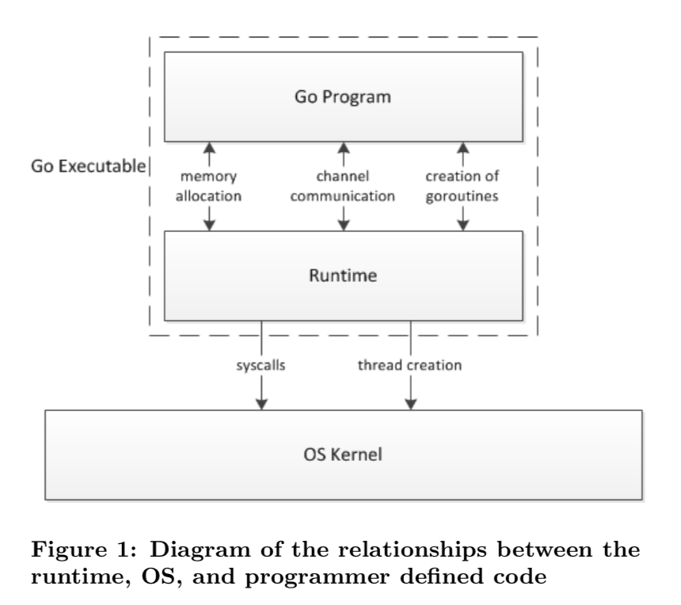

Go 程序在启动的时候会后台运行一个线程定时执行 runtime.sysmon 函数，这个函数主要用来检查死锁、运行计时器、调度抢占、以及 GC 等。

它会执行 `runtime.gcTrigger`中的 test 函数来判断是否应该进行 GC。由于 GC 可能需要执行时间比较长，所以运行时会在应用程序启动时在后台开启一个用于强制触发垃圾收集的 Goroutine 执行 forcegchelper 函数。

不过 forcegchelper 函数在一般情况下会一直被 goparkunlock 函数一直挂起，直到 sysmon 触发GC 校验通过，才会将该被挂起的 Goroutine 放转身到全局调度队列中等待被调度执行 GC。

## 调度器

> 参考: https://learnku.com/articles/41728

### gmp模型

有三个基础的结构体来实现 goroutines 的调度。g，m，p。

`g` 代表一个 goroutine，它包含：表示 goroutine 栈的一些字段，指示当前 goroutine 的状态，指示当前运行到的指令地址，也就是 PC 值。

`m` 表示内核线程，包含正在运行的 goroutine 等字段。

`p` 代表一个虚拟的 Processor，它维护一个处于 Runnable 状态的 g 队列，`m` 需要获得 `p` 才能运行 `g`。

当然还有一个核心的结构体：`sched`，它总览全局。

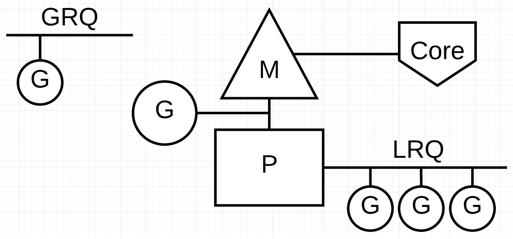

当使用go关键字、GC、系统调用、内存同步访问时可能会发生goroutine调度（主要是因为一个goroutine阻塞了，需要调度另外一个到machine进行执行）

> 当 threads 切换时，需要保存各种寄存器，而 goroutines 切换只需保存三个寄存器：Program Counter, Stack Pointer and BP。


g虽然没有数量限制，但**理论上会受内存的影响**，假设一个 Goroutine 创建需要 4k，那么100w就需要消耗4g内存

另外，m(真实干活的)的限制为10000，若确切是需要那么多，还可以通过 `debug.SetMaxThreads` 方法进行设置。

p的限制，数量受环境变量 `GOMAXPROCS` 的直接影响。与 P 相关联的的 M（系统线程），是需要绑定 P 才能进行具体的任务执行的，因此 P 的多少会影响到 Go 程序的运行表现。


#### groutine

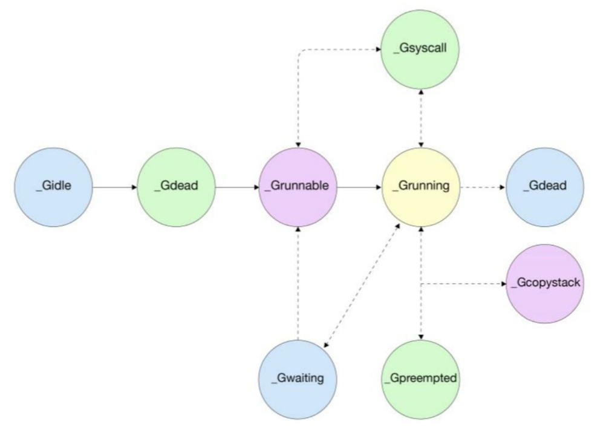

- `_Gidle`：新创建协程
- `_Gdead`：协程初始化完成、协程被销毁
- `_Grunnable`：等待运行
- `_GWaiting`：等待资源，例如垃圾回收或者channel通信时会遇到
- `_Gsyscall`：正在执行系统调用
- `_Gpreempted`：1.14新加的状态，G被强制抢占之后的状态
- `_Gcopystack`：在进行协程栈扫描时发现需要扩容或者缩小协程栈空间，将协程中的栈转移到新栈时的状态
- `_Gscan`
- `_Gscanrunnable`
- `_Gscanrunnint`

#### machine

代表一个工作线程，或者说系统线程。G 需要调度到 M 上才能运行，M 是真正工作的人。

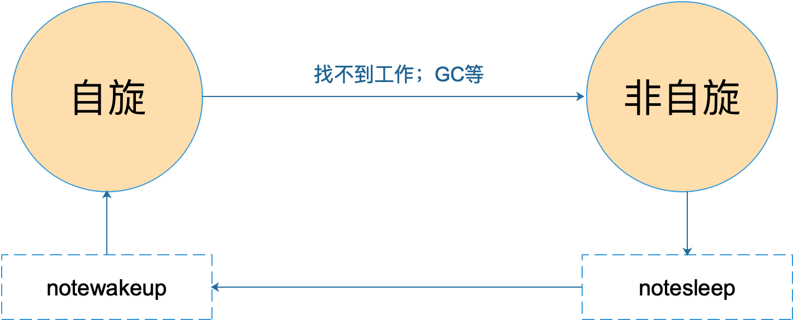

#### processor

为 M 的执行提供“上下文”，保存 M 执行 G 时的一些资源，例如本地可运行 G 队列，memeory cache 等。

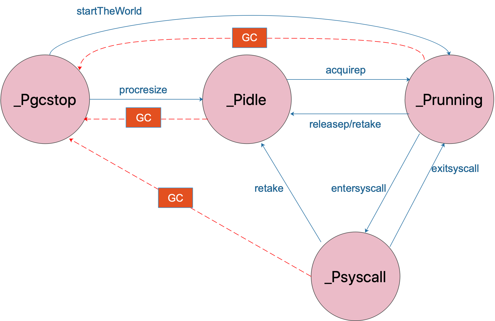

调度模型与演进过程

调度器状态的查看方法

goroutine调度实例简要分析

## 生命周期

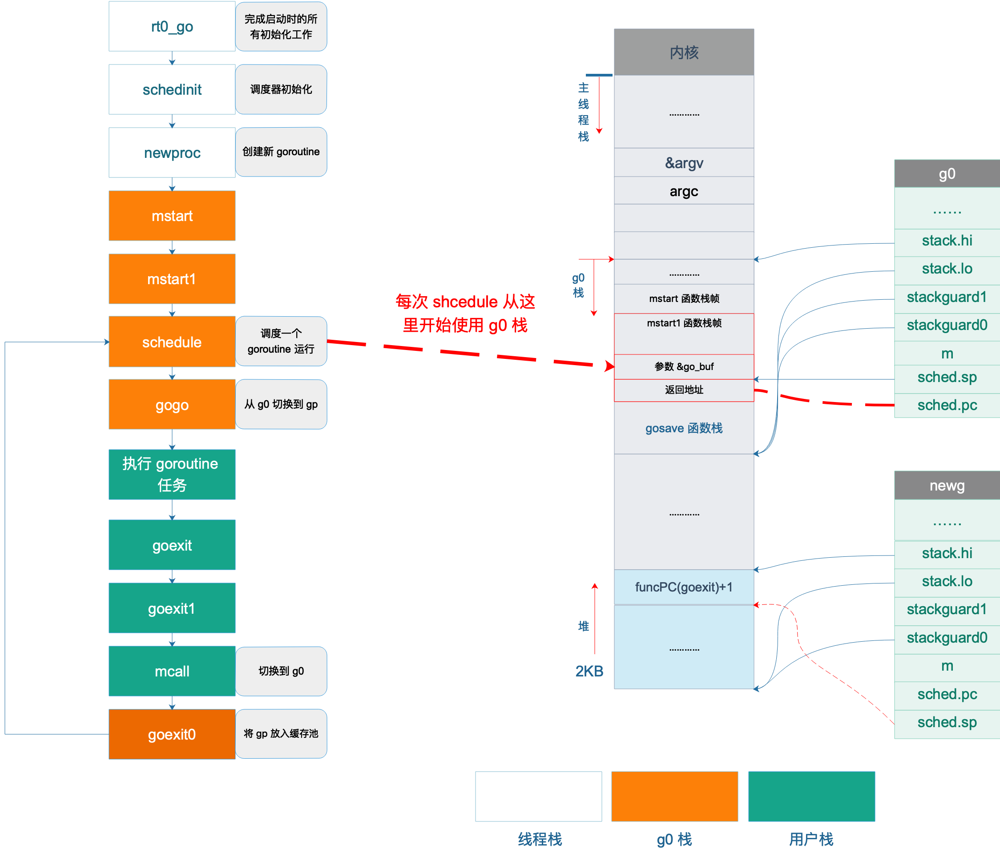


每一个工作线程中：rt0_go 负责 Go 程序启动的所有初始化，中间进行了很多初始化工作，调用 mstart 之前，已经切换到了 g0 栈，图中不同色块表示使用不同的栈空间。

接着调用 gogo 函数，完成从 g0 栈到用户 goroutine 栈的切换，包括 main goroutine 和普通 goroutine。

之后，执行 main 函数或者用户自定义的 goroutine 任务。

执行完成后，main goroutine 直接调用 eixt(0) 退出，普通 goroutine 则调用 goexit -> goexit1 -> mcall，完成普通 goroutine 退出后的清理工作，然后切换到 g0 栈，调用 goexit0 函数，将普通 goroutine 添加到缓存池中，再调用 schedule 函数进行新一轮的调度。

每次执行 mcall 切换到 g0 栈时都是切换到 g0.sched.sp 所指的固定位置。g0 一直没有动过，所有它之前保存的 sp 还能继续使用。每一次调度循环都会覆盖上一次调度循环的栈数据。不会造成g0栈空间过大。

### 初始化m0

### 初始化allp

### g0创建

### main goroutine

在 `runtime.main()` 函数中，执行 `runtime_init()` 前，会启动一个 sysmon 的监控线程，执行后台监控任务

后台线程sysmon任务：

- 运行计时器 — 获取下一个需要被触发的计时器；
- 轮询网络 — 获取需要处理的到期文件描述符；
- 抢占处理器 — 抢占运行时间较长的或者处于系统调用的 Goroutine；
- 垃圾回收 — 在满足条件时触发垃圾收集回收内存；

### goroutine退出

main goroutine，在执行完用户定义的 main 函数的所有代码后，直接调用 exit(0) 退出整个进程。

普通 goroutine 则没这么“舒服”，需要经历一系列的过程。先是跳转到提前设置好的 goexit 函数的第二条指令，然后调用 runtime.goexit1，接着调用 `mcall(goexit0)`，而 mcall 函数会切换到 g0 栈，运行 goexit0 函数，清理 goroutine 的一些字段，并将其添加到 goroutine 缓存池里，然后进入 schedule 调度循环。

# 并发模型

go常见的并发模型和并发模式

## channel

> CSP模型，不要通过共享内存来通信，而要通过通信来实现内存共享。

Go的CSP模型基于channel实现。

大多数的编程语言的并发编程模型是基于线程和内存同步访问控制，Go 的并发编程的模型则用 goroutine 和 channel 来替代。Goroutine 和线程类似，channel 和 mutex (用于内存同步访问控制)类似。

Channel 还可以和 select, cancel, timeout 结合起来。而 mutex 就没有这些功能。

| 操作 | nil | closed | normal |
| --- | ---  | ---  | --- |
| close | panic | panic | 正常关闭 |
| 读 | 阻塞 | 读取到对应类型零值 | 阻塞或者正常读取数据 |
| 写 | 阻塞 |panic  | 阻塞或者正常写入数据 

### 底层结构

> 发送和接收元素的本质， “值的拷贝”，无论是从 sender goroutine 的栈到 chan buf，还是从 chan buf 到 receiver goroutine，或者是直接从 sender goroutine 到 receiver goroutine。

> 泄漏的原因是 goroutine 操作 channel 后，处于发送或接收阻塞状态，而 channel 处于满或空的状态，一直得不到改变。同时，垃圾回收器也不会回收此类资源，进而导致 gouroutine 会一直处于等待队列中，不见天日。
> 另外，程序运行过程中，对于一个 channel，如果没有任何 goroutine 引用了，gc 会对其进行回收操作，不会引起内存泄漏。

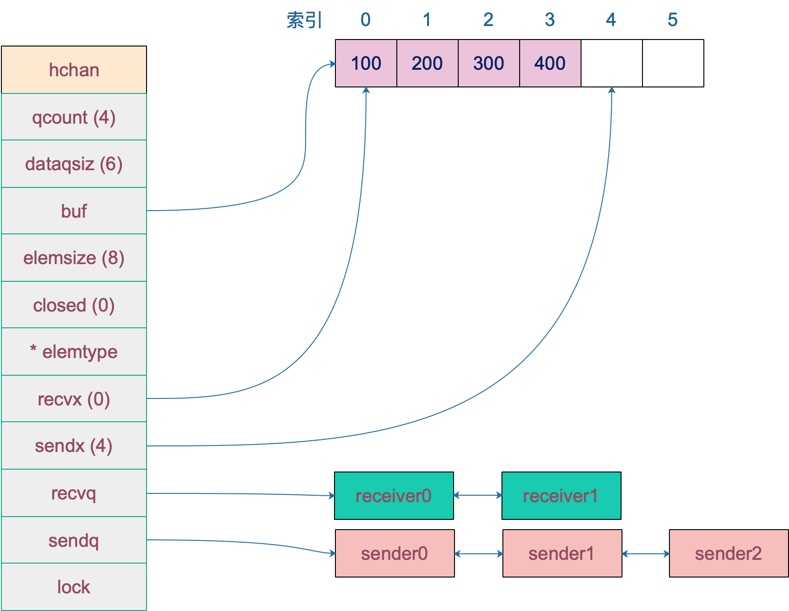

```go
type hchan struct {
	// chan 里元素数量
	qcount   uint
	// chan 底层循环数组的长度
	dataqsiz uint
	// 指向底层循环数组的指针
	// 只针对有缓冲的 channel
	buf      unsafe.Pointer
	// chan 中元素大小
	elemsize uint16
	// chan 是否被关闭的标志
	closed   uint32
	// chan 中元素类型
	elemtype *_type // element type
	// 已发送元素在循环数组中的索引
	sendx    uint   // send index
	// 已接收元素在循环数组中的索引
	recvx    uint   // receive index
	// 等待接收的 goroutine 队列
	recvq    waitq  // list of recv waiters
	// 等待发送的 goroutine 队列
	sendq    waitq  // list of send waiters

	// 保护 hchan 中所有字段，用来保证读channel或者写channel的操作都是原子的
	lock mutex
}

// sudog实际是对goroutine的一个封装
type waitq struct {
	first *sudog
	last *sudog
}
```

- buf指向底层循环数组，只有缓冲型channel才有
- `sendx`，`recvx` 均指向底层循环数组，表示当前可以发送和接收的元素位置索引值（相对于底层数组）。
- `sendq`，`recvq` 分别表示被阻塞的 goroutine，这些 goroutine 由于尝试读取 channel 或向 channel 发送数据而被阻塞。
- `waitq` 是 `sudog` 的一个双向链表，而 `sudog` 实际上是对 goroutine 的一个封装

### happen-before

1.  第 n 个 `send` 一定 `happened before` 第 n 个 `receive finished`，无论是缓冲型还是非缓冲型的 channel。
2.  对于容量为 m 的缓冲型 channel，第 n 个 `receive` 一定 `happened before` 第 n+m 个 `send finished`。
3.  对于非缓冲型的 channel，第 n 个 `receive` 一定 `happened before` 第 n 个 `send finished`。
4.  channel close 一定 `happened before` receiver 得到通知。

```go
var done = make(chan bool)
var msg string

func aGoroutine() {
	msg = "hello, world"
	<-done
}

func main() {
	go aGoroutine()
	done <- true
	// 根据第三条happen-before，接收在发送完成之前执行，所以这时msg已经附上值了，所以这里打印hello, world
	println(msg)
}
```

### 创建channel

通过make（返回的是指针）创建channel，能够指定长度即创建有缓冲通道。新建一个chan后，内存在堆上分配。

如果元素类型不含指针，或者size大小为0（无缓冲类型），只进行一次内存分配，如果hchan结构体不含指针GC就不会扫描chan中的元素，只分配`hchan结构体大小 + 元素大小*个数`的内存。

元素包含指针或者缓冲类型，会进行两次内存分配操作。

```go
c = new(hchan)
		c.buf = newarray(elem, int(size))
```

### 向channel发送数据

> 假设G1 和 G2 现在被挂起来了，等待 sender 的解救，现在向通道发送元素3，sender 发现 ch 的 recvq 里有 receiver 在等待着接收，就会出队一个 sudog，把 recvq 里 first 指针的 sudo “推举”出来了，并将其加入到 P 的可运行 goroutine 队列中。然后，sender 把发送元素拷贝到 sudog 的 elem 地址处，最后会调用 goready 将 G1 唤醒，状态变为 runnable。当调度器光顾 G1 时，将 G1 变成 running 状态，执行 goroutineA 接下来的代码。G 表示其他可能有的 goroutine。

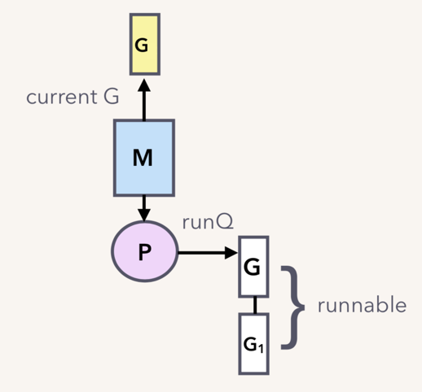

1、nil channel
	- 无缓冲，直接返回false
	- 有缓冲，当前goroutine挂起
2、未关闭channel且没有多余缓冲空间，返回false
	- 无缓冲并且等待接收队列没有goroutine
	- 有缓冲但是循环数组装满了
3、锁住channel，如果channel关闭了解锁并直接panic
4、如果接收队列有goroutine，直接将要发送的数据拷贝到接收goroutine，返回true
5、对于缓冲型且还有缓冲空间，将数据拷贝到指向buf的sendx位置，sendx加1，如果发送游标值等于容量值，游标值归0（循环数组），qcount加1，返回true
6、如果不需要阻塞直接返回false
7、channel满了，发送方会阻塞，构造一个sudog，获取当前的goroutine指针并且加入到sendq发送队列，当前goroutine挂起
8、当唤醒了说明这个数据可以发送了，不过这里也要检查唤醒后是否channel关闭了

如果能从等待接收队列 recvq 里出队一个 sudog（代表一个 goroutine），说明此时 channel 是空的，没有元素，所以才会有等待接收者。这时会调用 send 函数将元素直接从发送者的栈拷贝到接收者的栈，关键操作由 `sendDirect` 函数完成。然后，解锁、唤醒接收者，等待调度器的光临，接收者也得以重见天日，可以继续执行接收操作之后的代码了。

**send**

send 函数处理向一个空的 channel 发送操作，ep 指向被发送的元素，会被直接拷贝到接收的 goroutine。

接收的 goroutine 会被唤醒，c （\*hchan）必须是空的且必须上锁（因为等待队列里有 goroutine，肯定是空的），发送操作执行完后，会使用 unlockf 函数解锁。

sg( \*sudog)必须已经从等待队列里取出来了，ep 必须是非空，并且它指向堆或调用者的栈。


**sendDirect**

向一个非缓冲型的 channel 发送数据、从一个无元素的（非缓冲型或缓冲型但空）的 channel接收数据，都会导致一个 goroutine 直接操作另一个 goroutine 的栈，由于 GC 假设对栈的写操作只能发生在 goroutine 正在运行中并且由当前 goroutine 来写，所以这里实际上违反了这个假设。可能会造成一些问题，所以需要用到写屏障来规避。

这样做的好处是减少了一次内存 copy：不用先拷贝到 channel 的 buf，直接由发送者到接收者效率得到提高。

### 从channel接收数据

接收操作有两种写法，一种带 “ok”，反应 channel 是否关闭；一种不带 “ok”，这种写法，当接收到相应类型的零值时无法知道是真实的发送者发送过来的值，还是 channel 被关闭后，返回给接收者的默认类型的零值。

-   如果 channel 是一个空值（nil），在非阻塞模式下，会直接返回。在阻塞模式下，会调用 gopark 函数挂起 goroutine，这个会一直阻塞下去。因为在 channel 是 nil 的情况下，要想不阻塞，只有关闭它，但关闭一个 nil 的 channel 又会发生 panic，所以没有机会被唤醒了。更详细地可以在 closechan 函数的时候再看。
-   在非阻塞模式下快速检测失败不用获取锁，直接返回false，false
-   当我们观察到 channel 没准备好接收： 非缓冲型，等待发送列队里没有 goroutine 在等待； 缓冲型，但 buf 里没有元素。并且closed=\=0即未关闭直接快速返回
-   加锁
	-   如果 channel 已关闭，并且循环数组 buf 里没有元素。对应非缓冲型关闭和缓冲型关闭但 buf 无元素的情况，返回对应类型的零值，但 received 标识是 false，告诉调用者此 channel 已关闭
	-   如果有等待发送的队列，说明 channel 已经满了，要么是非缓冲型的 channel，要么是缓冲型的 channel，但 buf 满了，这两种情况都可以接收数据，调用recv函数
- 如果是非缓冲型的，就直接从发送者的栈拷贝到接收者的栈。否则，就是缓冲型 channel，而 buf 又满了的情形。说明发送游标和接收游标重合了，因此需要先找到接收游标，并将该处的元素拷贝到接收地址。然后将发送者待发送的数据拷贝到接收游标处。这样就完成了接收数据和发送数据的操作。接着，分别将发送游标和接收游标向前进一，如果发生“环绕”，再从 0 开始。
- 暂时无法读到，就构造一个 sudog，接着就是保存各种值了。注意，这里会将接收数据的地址存储到了 `elem` 字段，当被唤醒时，接收到的数据就会保存到这个字段指向的地址。然后将 sudog 添加到 channel 的 recvq 队列里。调用 goparkunlock 函数将 goroutine 挂起。
- 最后，取出 sudog 里的 goroutine，调用 goready 将其状态改成 “runnable”，待发送者被唤醒，等待调度器的调度。

### 关闭channel

执行函数closechan，如果是nil channel，会直接panic

加锁处理，如果channel已经关闭了就panic

将channel所有等待接收队列recvq，里的sudog释放，赋予相应类型的零值。

将channel中等待发送队列sendq里的sudog释放，如果存在发送者会panic（所以不能贸然关闭panic）

所有挂在这个 channel 上的 sender 和 receiver 全都连成一个 sudog 链表，再解锁。最后，再将所有的 sudog 全都唤醒。sender 会继续执行 chansend 函数里 goparkunlock 函数之后的代码，很不幸，检测到 channel 已经关闭了，panic。receiver 则比较幸运，进行一些扫尾工作后，返回。这里，selected 返回 true，而返回值 received 则要根据 channel 是否关闭，返回不同的值。

### 使用场景

**优雅的关闭channel**

> 不要从一个 receiver 侧关闭 channel，也不要在有多个 sender 时，关闭 channel。

1.  在不改变 channel 自身状态的情况下，无法获知一个 channel 是否关闭。
2.  关闭一个 closed channel 会导致 panic。所以，如果关闭 channel 的一方在不知道 channel 是否处于关闭状态时就去贸然关闭 channel 是很危险的事情。
3.  向一个 closed channel 发送数据会导致 panic。所以，如果向 channel 发送数据的一方不知道 channel 是否处于关闭状态时就去贸然向 channel 发送数据是很危险的事情。

```Go
// 但是这个是有副作用的，因为会读出一个元素
// 并不能保证调用之后会不会有其他 goroutine 对它进行了一些操作，改变了它的这种状态
func IsClosed(ch <-chan T) bool {
	select {
	case <-ch:
		return true
	default:
	}

	return false
}
```

有两个不那么优雅地关闭 channel 的方法：

1.  使用 defer-recover 机制，放心大胆地关闭 channel 或者向 channel 发送数据。即使发生了 panic，有 defer-recover 在兜底。
2.  使用 sync.Once 来保证只关闭一次。

优雅的关闭

- 一个 sender，一个 receiver：sender处关闭
- 一个 sender， M 个 receiver：sender处关闭
- N 个 sender，一个 reciver：增加一个传递关闭信号的 channel，receiver 通过信号 channel 下达关闭数据 channel 指令。senders 监听到关闭信号后，停止发送数据(这里不是直接给stopch发数据，因为这样只会有一个sender收到，而是关闭stopch，这样所有sender通过这个关闭的channel中都能获得零值)

> 并没有明确关闭 dataCh。在 Go 语言中，对于一个 channel，如果最终没有任何 goroutine 引用它，不管 channel 有没有被关闭，最终都会被 gc 回收。所以，在这种情形下，所谓的优雅地关闭 channel 就是不关闭 channel，让 gc 代劳。

```go
func main() {
	rand.Seed(time.Now().UnixNano())

	const Max = 100000
	const NumSenders = 1000

	dataCh := make(chan int, 100)
	stopCh := make(chan struct{})

	// senders
	for i := 0; i < NumSenders; i++ {
		go func() {
			for {
				select {
				case <- stopCh:
					return
				case dataCh <- rand.Intn(Max):
				}
			}
		}()
	}

	// the receiver
	go func() {
		for value := range dataCh {
			if value == Max-1 {
				fmt.Println("send stop signal to senders.")
				close(stopCh)
				return
			}

			fmt.Println(value)
		}
	}()

	select {
	case <- time.After(time.Hour):
	}
}
```

- N个sender，M个recevier：增加一个中间人，M 个 receiver 都向它发送关闭 dataCh 的“请求”，中间人收到第一个请求后，就会直接下达关闭 dataCh 的指令（通过关闭 stopCh，这时就不会发生重复关闭的情况，因为 stopCh 的发送方只有中间人一个）。另外，这里的 N 个 sender 也可以向中间人发送关闭 dataCh 的请求。

```go
func main() {
	rand.Seed(time.Now().UnixNano())

	const Max = 100000
	const NumReceivers = 10
	const NumSenders = 1000

	dataCh := make(chan int, 100)
	stopCh := make(chan struct{})

	// It must be a buffered channel.
	toStop := make(chan string, 1)

	var stoppedBy string

	// moderator
	go func() {
		stoppedBy = <-toStop
		close(stopCh)
	}()

	// senders
	for i := 0; i < NumSenders; i++ {
		go func(id string) {
			for {
				value := rand.Intn(Max)
				if value == 0 {
					select {
					case toStop <- "sender#" + id:
					default:
					}
					return
				}

				select {
				case <- stopCh:
					return
				case dataCh <- value:
				}
			}
		}(strconv.Itoa(i))
	}

	// receivers
	for i := 0; i < NumReceivers; i++ {
		go func(id string) {
			for {
				select {
				case <- stopCh:
					return
				case value := <-dataCh:
					if value == Max-1 {
						select {
						case toStop <- "receiver#" + id:
						default:
						}
						return
					}

					fmt.Println(value)
				}
			}
		}(strconv.Itoa(i))
	}

	select {
	case <- time.After(time.Hour):
	}

}
```

停止信号：经常是关闭某个 channel 或者向 channel 发送一个元素，使得接收 channel 的那一方获知道此信息，进而做一些其他的操作

任务定时：与timer结合，实现超时控制或者定期执行某个任务

```go
// 定时器
select {
	case <-time.After(100 * time.Millisecond):
	case <-s.stopc:
		return false
}

// 定时执行任务
func worker() {
	ticker := time.Tick(1 * time.Second)
	for {
		select {
		case <- ticker:
			// 执行定时任务
			fmt.Println("执行 1s 定时任务")
		}
	}
}
```

解耦生产方和消费方

```go
func main() {
	taskCh := make(chan int, 100)
	go worker(taskCh)

    // 塞任务
	for i := 0; i < 10; i++ {
		taskCh <- i
	}

    // 等待 1 小时 
	select {
	case <-time.After(time.Hour):
	}
}

func worker(taskCh <-chan int) {
	const N = 5
	// 启动 5 个工作协程
	for i := 0; i < N; i++ {
		go func(id int) {
			for {
				task := <- taskCh
				fmt.Printf("finish task: %d by worker %d\n", task, id)
				time.Sleep(time.Second)
			}
		}(i)
	}
}
```

控制并发数

> 还有一点要注意的是，如果 w() 发生 panic，那“许可证”可能就还不回去了，因此需要使用 defer 来保证。

```go
var limit = make(chan int, 3)

func main() {
    // …………
    for _, w := range work {
        go func() {
			// 放在外部的话就是控制系统goroutine的数量，可能会阻塞for循环，影响业务逻辑
            limit <- 1
            w()
            <-limit
        }()
    }
    // …………
}
```


## waitgroup


大概流程

1.  当调用 `WaitGroup.Add(n)` 时，counter 将会自增: `counter += n`
2.  当调用 `WaitGroup.Wait()` 时，会将 `waiter++`。同时调用 `runtime_Semacquire(semap)`, 增加信号量，并挂起当前 goroutine。
3.  当调用 `WaitGroup.Done()` 时，将会 `counter--`。如果自减后的 counter 等于 0，说明 WaitGroup 的等待过程已经结束，则需要调用 runtime_Semrelease 释放信号量，唤醒正在 `WaitGroup.Wait` 的 goroutine。

waitgroup针对内存优化以及并发性能有一些额外的设计点。

> 如果变量是 64 位对齐 (8 byte), 则该变量的起始地址是 8 的倍数。如果变量是 32 位对齐 (4 byte)，则该变量的起始地址是 4 的倍数。

上面所说的waiter、counter、sema存储在`state1`这个 长度为 3 的 uint32 数组

-   当 `state1` 是 32 位对齐：`state1` 数组的第一位是 sema，第二位是 counter，第三位是 writer。
-   当 `state1` 是 64 位对齐：`state1` 数组的第一位是 counter，第二位是 writer，第三位是 sema。

主要是因为counter与writer合在了一起作为一个64位整数对外使用，(跟sync.Pool里面的tailhead一样)，用于cas实现的无锁并发逻辑

另外32位对齐与64位对齐，各个变量顺序不一致是为了保证counter+waiter一定是64位对齐

> 在 32 位系统下，如果使用 atomic 对 64 位变量进行原子操作，调用者需要自行保证变量的 64 位对齐(让变量起始位置为8的倍数)，否则将会出现异常

在32位中第一个位置的sema还充当了padding的作用，保证后面的waiter+counter是以8的倍数为起始位置且是64位

```go
func (wg *WaitGroup) state() (statep *uint64, semap *uint32) {
	if uintptr(unsafe.Pointer(&wg.state1))%8 == 0 {
		return (*uint64)(unsafe.Pointer(&wg.state1)), &wg.state1[2]
	} else {
		return (*uint64)(unsafe.Pointer(&wg.state1[1])), &wg.state1[0]
	}
}

// 修改counter值
atomic.AddUint64(statep, uint64(delta)<<32)

// 调用wait 修改waiter值
atomic.CompareAndSwapUint64(statep, state, state+1)
// 进行等待
runtime_Semacquire(semap)
```

另外WaitGroup 在 Done 的时候，判断如果 counter 等于 0 ，直接将 `counter+waiter` 整个 64 位整数全部置 0然后唤醒其他wait的对象(`runtime_Semrelease(semap, false, 0)`)，既可以达到重置状态的效果，也免于后续`wait--`进行多次原子操作


## context


-   所有的长的、阻塞的操作都需要 `Context`
-   `errgroup` 是构架于 `Context` 之上很好的抽象
-   当 Request 的结束的时候，Cancel `Context`
-   `Context.Value` 应该被用于**告知性质**的事物，而不是**控制性质**的事物
-   约束 `Context.Value` 的键空间
-   `Context` 以及 `Context.Value` 应该是不可变的（immutable），并且应该是线程安全
-   `Context` 应该随 `Request` 消亡而消亡


> 并发控制和超时控制的标准做法

用于goroutine之间的传递上下文信息，包括取消信号、超时时间、截止时间、k-v等。

-   是不可变的(immutable)树节点
-   Cancel 一个节点，会连带 Cancel 其所有子节点 （_从上到下_）
-   Context values 是一个节点
-   Value 查找是回溯树的方式 （_从下到上_）

例如一个请求生成了多个协程，当这个请求取消了，这些协程需要能够快速退出。

在Go 里，我们不能直接杀死协程，协程的关闭一般会用 `channel+select` 方式来控制。但是在某些场景下，例如处理一个请求衍生了很多协程，这些协程之间是相互关联的：需要共享一些全局变量、有共同的 deadline 等，而且可以同时被关闭。再用 `channel+select` 就会比较麻烦，这时就可以通过 context 来实现。

1.  不要将 Context 塞到结构体里。直接将 Context 类型作为函数的第一参数，而且一般都命名为 ctx。
2.  不要向函数传入一个 nil 的 context，如果你实在不知道传什么，标准库给你准备好了一个 context：todo。
3.  不要把本应该作为函数参数的类型塞到 context 中，context 存储的应该是一些共同的数据。例如：登陆的 session、cookie 等。
4.  同一个 context 可能会被传递到多个 goroutine，别担心，context 是并发安全的。

### context.Value

> context是子节点指向父节点(查找值)。canceler是父节点指向子节点(取消context)

context.WithValue，要求key是可比较的

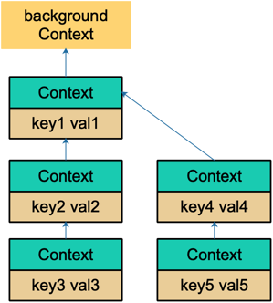

context的key查找是一个递归的过程(Context的Context指向它的父节点)。key是可以相等的，但是属于不同的context节点。

> 有可能被覆盖，不好排查，所以建议尽量不用context传值

寻找的时候找到相等的key就直接返回value，否则一直找到根节点返回nil。

```go
func (c *valueCtx) Value(key interface{}) interface{} {
	if c.key == key {
		return c.val
	}
	return c.Context.Value(key)
}
```

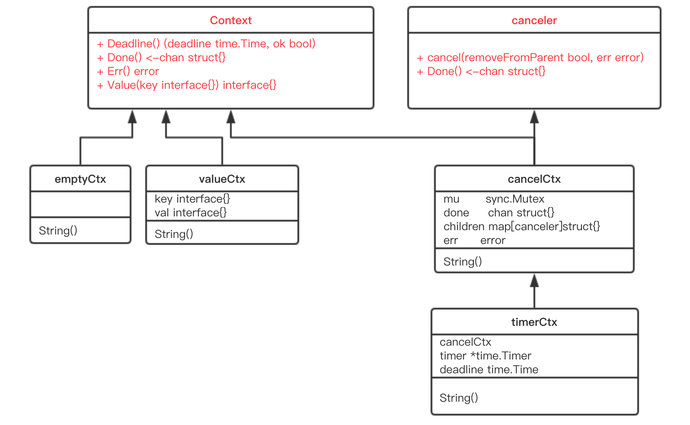


- WithCancel：基于context，生成一个可以取消的context
- WithDeadline：创建一个有deadline的context
- WithTimeout：创建一个有timeout的context
- WithValue：创建一个存储k-v的context

```go
func WithTimeout(parent Context, timeout time.Duration) (Context, CancelFunc) {
	return WithDeadline(parent, time.Now().Add(timeout))
}
```

`Context` 是一个接口，定义了 4 个方法，它们都是`幂等`的。也就是说连续多次调用同一个方法，得到的结果都是相同的。

`Done()` 返回一个 channel，可以表示 context 被取消的信号：当这个 channel 被关闭时，说明 context 被取消了。注意，这是一个只读的channel。 我们又知道，读一个关闭的 channel 会读出相应类型的零值。并且源码里没有地方会向这个 channel 里面塞入值。换句话说，这是一个 `receive-only` 的 channel。因此在子协程里读这个 channel，除非被关闭，否则读不出来任何东西。也正是利用了这一点，子协程从 channel 里读出了值（零值）后，就可以做一些收尾工作，尽快退出。

`Err()` 返回一个错误，表示 channel 被关闭的原因。例如是被取消，还是超时。

`Deadline()` 返回 context 的截止时间，通过此时间，函数就可以决定是否进行接下来的操作，如果时间太短，就可以不往下做了，否则浪费系统资源。当然，也可以用这个 deadline 来设置一个 I/O 操作的超时时间。

`Value()` 获取之前设置的 key 对应的 value。

### 取消流程

- `cancel()` 方法的功能就是关闭 channel：c.done（通过关闭channel将取消信号传递给了他的所有子节点）
- 递归地取消它的所有子节点；从父节点中删除自己。

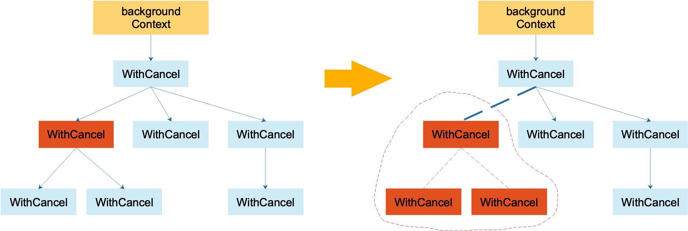

### timerCtx

timerCtx 基于 cancelCtx，只是多了一个 time.Timer 和一个 deadline。Timer 会在 deadline 到来时，自动取消 context。


# 并发工具包

## sync.Lock

### mutex
互斥锁，提供了

- `Lock`: 调用lock后同一个goroutine中必须释放锁了之后才能再次上锁
- `Unlock`: 已经锁定的 Mutex 并不与特定的 goroutine 相关联，这样可以利用一个 goroutine 对其加锁，再利用其他 goroutine 对其解锁。
- `TryLock`: 非阻塞式的取锁，1.18中新提供方法

互斥锁中的两个字段:`state(int32)`: 表示当前互斥锁的状态，`sema(uint32)`:信号量变量，用来控制等待goroutine的阻塞休眠和唤醒

> 不同位表示不同状态，并且更便于利用CAS实现无锁并发

state低三位由低到高分别表示`mutexed(锁定)`、`mutexWoken(唤醒)`和 `mutexStarving(饥饿状态)`，剩下的位则用来表示当前共有多少个`goroutine`在等待锁：

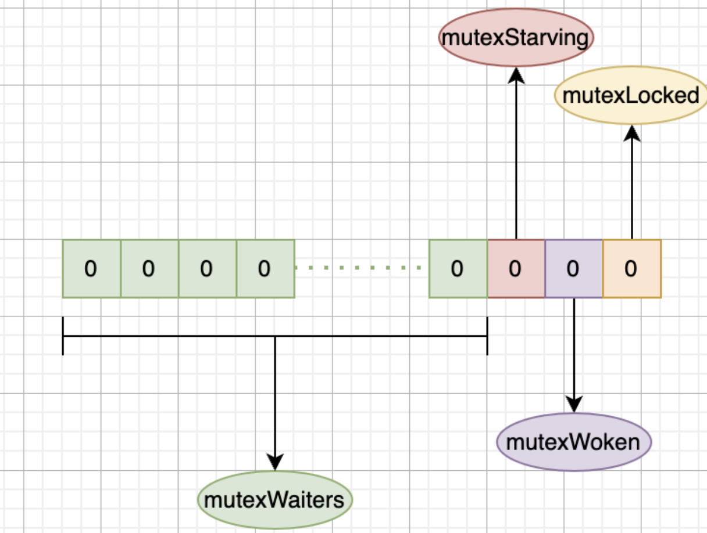

`Go`语言在`1.9`中进行了优化，引入了饥饿模式（!是指锁的状态，不是goroutine的状态），在饥饿模式中，互斥锁会直接交给等待队列最前面的`goroutine`，新的 goroutine 在该状态下不能获取锁、也不会进入自旋状态(`因为自旋是假定很快就能获得锁`)，它们只会在队列的末尾等待。如果一个 goroutine 获得了互斥锁并且它在队列的末尾或者它等待的时间少于 1ms，那么当前的互斥锁就会切换回正常模式。

#### Lock

通过CAS判断当前锁的状态，如果mutexed为0则获取到锁

如果mutexed为1即被其他的goroutine加锁，则进入lockSlow通过自旋或进入饥饿状态

*饥饿状态*: 当`goroutine`超过`1ms`没有获取到锁，就会将当前互斥锁切换到饥饿模式

*判断能否进入自旋状态的条件*

> 乐观的认为当前正在持有锁的goroutine能在较短时间内归还锁

- 自旋的次数要在4次以内
- CPU必须为多核
- GOMAXPROCS > 1
- 当前机器上至少存在一个正在运行的处理器P并且处理的运行队列为空

*自旋本质就是调用PAUSE指令*

判断当前`goroutine`可以进自旋后，调用`runtime_doSpin`方法进行自旋：自旋操作就是执行30次`PAUSE`指令，通过该指令占用`CPU`并消费`CPU`时间，进行忙等待；

#### UnLock

使用cas将mutexed位置为0，然后判断是否成功，如果成功了就进行返回

如果没成功进入unlockSlow: 解锁没有上锁的锁会panic; 饥饿模式下直接唤醒等待队列goroutine; 正常模式是一个循环，进行判断

- 直接返回的情况：如果锁处于加锁的状态，表示已经有goroutine获取到了锁；如果锁处于唤醒状态，如果没有等待者则直接返回即可；如果锁处于饥饿模式，锁之后会直接给等待队头goroutine
- 设置唤醒标志位，成功了就唤醒一个goroutine，否则进入下一次循环继续尝试解锁s

#### TryLock

判断当前锁的状态，如果锁处于加锁状态或者饥饿状态直接获取锁失败

```go
func (m *Mutex) TryLock() bool {  
  // 记录当前状态  
 old := m.state  
  //  处于加锁状态/饥饿状态直接获取锁失败  
 if old&(mutexLocked|mutexStarving) != 0 {  
  return false  
 }  
 // 尝试获取锁，获取失败直接获取失败  
 if !atomic.CompareAndSwapInt32(&m.state, old, old|mutexLocked) {  
  return false  
 }  
  
  
 return true  
}
```

### rwmutex

```go
type RWMutex struct {
	w Mutex // 互斥锁
	writerSem uint32 // 写锁监听读锁释放的信号量
	readerSem uint32 // 读锁监听写锁释放的信号量
	readerCount int32 // 当前正在执行读操作的数量
	readerWait int32 // 写操作阻塞是需要等待读操作完成的个数
}
```

- `RLock()`: 申请读锁，每次执行此函数后，会对readerCount++，此时当有写操作执行Lock()时会判断readerCount>0,就会阻塞。(另外获取读锁的时候由于是cas多个可以并发的，所以可能失败，使用for循环不断重试)
- `RUnLock()`: 解除读锁，执行readerCount–，如果此时有写锁在阻塞那么处理的就是readerWait的值，释放信号量唤醒等待写操作的goroutine。
- `Lock()`: 申请写锁，获取互斥锁，此时会阻塞其他的写操作。并将readerCount 置为 -1，readerWait变为readerCount的值，当有读操作进来，发现readerCount = -1， 即知道有写操作在进行，阻塞。
- `Unlock()`: 解除写锁，会先通知所有阻塞的读操作goroutine，然后才会释放持有的互斥锁。

使用readerWait防止出现写锁饿死的情况，当有写锁阻塞的时候，当写操作到来时，会把RWMutex.readerCount值拷贝到RWMutex.readerWait中，用于标记排在写操作前面的读者个数。

前面的读操作结束后，除了会递减RWMutex.readerCount，还会递减RWMutex.readerWait值，当RWMutex.readerWait值变为0时唤醒写操作。（后面的读锁获取判断，如果`readerWait大于0`则会阻塞着等待写操作完成进行信号通知再获取锁）

> 写操作要等待读操作结束后才可以获得锁，而写操作在等待期间可能还有新的读操作持续到来，如果写操作等待所有读操作结束，很可能会一直阻塞，这种现象称之为写操作被饿死。

`go1.18`提供了非阻塞加读锁的方法`TryLock`也就是当有写锁(当readerCount为-1)时直接返回false

## sync.Cond

> 参考: https://www.cyhone.com/articles/golang-sync-cond/

sync.Cond 往往被用在一个或一组 goroutine 等待某个条件成立后唤醒这样的场景，例如常见的生产者消费者场景。

```go
var mutex = sync.Mutex{}
var cond = sync.NewCond(&mutex)

var queue []int

func producer() {
	i := 0
	for {
		mutex.Lock()
		queue = append(queue, i)
		i++
		mutex.Unlock()

		cond.Signal()
		time.Sleep(1 * time.Second)
	}
}

func consumer(consumerName string) {
	for {
		mutex.Lock()
		// Wait 调用的条件检查一定要放在 for 循环中，代码如上。这是因为当 Boardcast 唤醒时，有可能其他 goroutine 先于当前 goroutine 唤醒并抢到锁，导致轮到当前 goroutine 抢到锁的时候，条件又不再满足了。
		for len(queue) == 0 {
			cond.Wait()
		}

		fmt.Println(consumerName, queue[0])
		queue = queue[1:]
		mutex.Unlock()
	}
}

func main() {
	// 开启一个 producer
	go producer()

	// 开启两个 consumer
	go consumer("consumer-1")
	go consumer("consumer-2")

	for {
		time.Sleep(1 * time.Minute)
	}
}
```

- sync.NewCond(l Locker): 新建一个 sync.Cond 变量。注意该函数需要一个 Locker 作为必填参数，这是因为在 cond.Wait() 中底层会涉及到 Locker 的锁操作。
- cond.Wait(): 等待被唤醒。唤醒期间会解锁并切走 goroutine。Wait 的调用一定要放在 Lock 和 UnLock 中间，否则将会造成 panic("sync: unlock of unlocked mutex") 错误
- cond.Signal(): 只唤醒一个最先 Wait 的 goroutine。对应的另外一个唤醒函数是 Broadcast，区别是 Signal 一次只会唤醒一个 goroutine，而 Broadcast 会将全部 Wait 的 goroutine 都唤醒。


```go
type notifyList struct {
    wait uint32
	notify uint32

	// List of parked waiters.
	lock mutex
	head *sudog
	tail *sudog
}
```

为何不直接取链表最头部唤醒呢？为什么会有一个 ticket 机制?这是因为 notifyList 会有乱序的可能。因为获取 ticket 和加入 notifyList，是两个独立的行为

## sync.Once

sync.Once实现单例模式

## sync.Pool

sync.Pool减轻垃圾回收压力


1.  利用 GMP 的特性，为每个 P 创建了一个本地对象池 poolLocal，尽量减少并发冲突。
2.  每个 poolLocal 都有一个 private 对象，优先存取 private 对象，可以避免进入复杂逻辑。
3.  在 Get 和 Put 期间，利用 `pin` 锁定当前 P，防止 goroutine 被抢占，造成程序混乱。
4.  在获取对象期间，利用对象窃取的机制，从其他 P 的本地对象池以及 victim 中获取对象。
5.  充分利用 CPU Cache 特性，提升程序性能。

对象池，get了之后使用完成在put回去，完成对象的复用，减少GC压力，不过有可能会被清除(对象池里都是一类的，清除部分问题不大，只是说不能用于存储持久对象的场景)

HTTP 框架 Gin 用 sync.Pool 来复用每个请求都会创建的 `gin.Context` 对象

lock free的并发安全实现

对于同一个pool，process会有自己本地的对象池`poolLocal`,每个p的get和put都会优先处理本地poolLocal

poolLocal中的核心属性是poolChain，一个链表+ring buffer的数据结构，优点在于预先分配的内存并且能够复用，本质是数组，利于CPU cache

```go
type Pool struct {
	noCopy noCopy // 通过 `go vet` 命令检测出 sync.Pool 的拷贝

	local     unsafe.Pointer // local fixed-size per-P pool, actual type is [P]poolLocal, 这里面存储着各个 P 对应的本地对象池
	localSize uintptr        // size of the local array

	victim     unsafe.Pointer // local from previous cycle, 上一轮清理前的对象池
	victimSize uintptr        // size of victims array

	New func() interface{}
}
```

ring buffer在不引入锁的情况保证多个p访问时依然并发安全，利用了 atomic 包中的 CAS 操作。两个 P 都可能会拿到对象，但在最终设置 headTail （head-tail就是当前ring中的元素个数）的时候，只会有一个 P 调用 CAS 成功，另外一个 CAS 失败。

```go
atomic.CompareAndSwapUint64(&d.headTail, ptrs, ptrs2)

const dequeueBits = 32

atomic.AddUint64(&d.headTail, 1<<dequeueBits) // head++的操作，head与tail的状态在一个int中
```

当put的时候， **初始化或者重新创建local数组。** 当 local 数组为空，或者和当前的 `runtime.GOMAXPROCS` 不一致时，将触发重新创建 local 数组，以和 P 的个数保持一致。然后取出当前poolLocal(直接根据索引获取)

另外在put的时候为了避免当前协程被抢占导致后续再执行时已经对不上原来的poolLocal,需要使用runtime 包里面的 procPin，暂时不允许 P 被抢占

Get对当前 P 本地对象池的操作，还可以对其他 P 的本地对象池的对象窃取。如果从其他 P 的本地对象池，也拿不到数据。接下来会尝试从 victim 中取数据，最后还是拿不到数据就调用用户自定义的New方法

防止对象池将可能会无限制的膨胀下去，造成内存泄漏，sync.Pool还有清理操作。首先每个被使用的 sync.Pool，都会在初始化阶段被添加到全局变量 `allPools []*Pool` 对象中。Golang 的 runtime 将会在 **每轮 GC 前**，触发调用 poolCleanup 函数，清理 allPools。

每轮 GC 后 sync.Pool 的对象池都会转移到 victim 中，同时将上一轮的 victim 清空掉。

## atomic

aomitc包与原子操作

对共享自定义类型变量的无锁读写