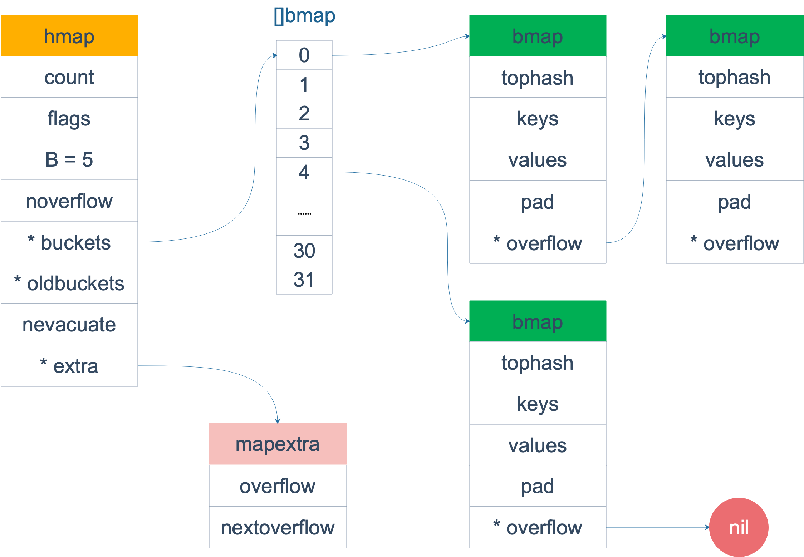
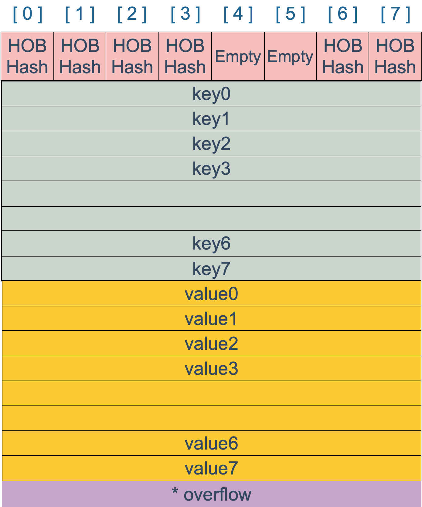
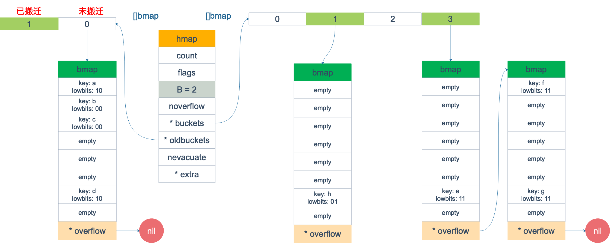
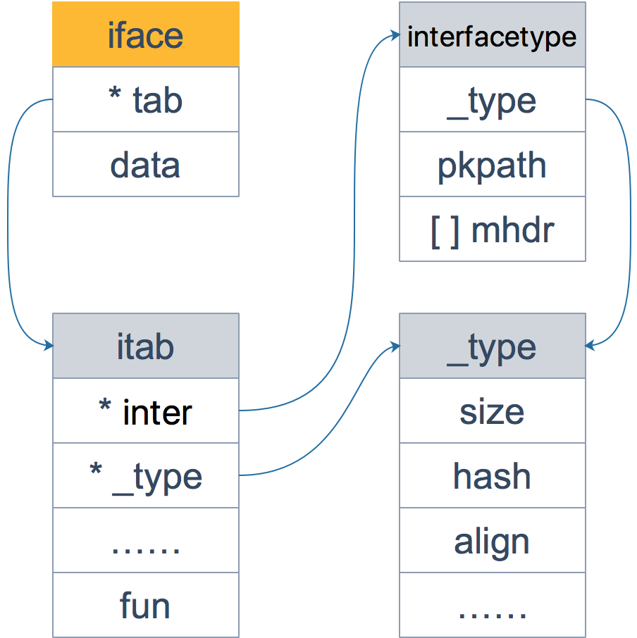

# 简介

# 可比较

golang中的数据类型可以按照可比较和不可比较两种类型

记不可比较的反而更简单，就是slice、map、function都是不可比较的，不过可以和nil比较

可比较的: 

- bool、integer、float、string这些基础数据类型都是可比较的
- 指针类型可以比较，指针指向同一个变量，或者动态类型相同且值都为nil
- channel: 同一个make创建的(即先创建一个，然后复制一个新的)
- interface: 如果两个接口值具有相同的动态类型和相等的动态值，则它们相等。
- 如果所有字段都具有可比性，则 struct (结构体值)具有可比性：如果它们对应的非空字段相等，则两个结构体值相等。
- 如果 array(数组)元素类型的值是可比较的，则数组值是可比较的：如果它们对应的元素相等，则两个数组值相等。
- (TODO, 还是没有理解到)假设一个类型可比较的结构体的值x，实现了一个接口类型T，那么x与转换成接口类型T的值t是可以比较的，如果 t 的动态类型与 X 相同且 t 的动态值等于 x，则它们相等。

`reflect.Kind`的数据类型: Bool、Int、Int8、Int16、Int32、Int64、Uint、Uint8、Uint16、Uint32、Uintptr、Float32、Float64、Complex64、Complex128、Array、Chan、Func、Interface、Map、Ptr、Slice、String、Struct、UnsafePointer

（1）任何类型的指针都可以被转化为Pointer 
（2）Pointer可以被转化为任何类型的指针 （3）uintptr可以被转化为Pointer 
（4）Pointer可以被转化为uintptr

Pointer具有指针语义，uintptr没有，所以Pointer会所指向的对象还有用，那么这个Pointer就不会被回收

# string

# slice


> 通过 slice 的 array 字段就可以拿到数组的地址

```Go
// runtime/slice.go
type slice struct {
	array unsafe.Pointer // 指针，指向底层的数组，可以被同时引用，也就是说如果两个切片引用了同一地址空间的数据，是会相互影响的
	len int // 长度，打印时候只会打印len长度的元素，即使底层数组不止这么多
	cap int // 容量
}
```

当截取切片的时候，容量默认到数组结尾，也可以指定数字（即容量到这个索引）

当往切片中追加元素时，如果原来的容量还够用，直接修改需要追加到的索引位置（会影响其他引用了这块地址的切片），当不够用的时候，会发生扩容，并把原来的元素复制到新的位置

```Go
func main() {
	slice := []int{0, 1, 2, 3, 4, 5, 6, 7, 8, 9}
	s1 := slice[2:5]
	s2 := s1[2:6:7]

	s2 = append(s2, 100)
	s2 = append(s2, 200)

	s1[2] = 20

	fmt.Println(s1) // [2,3,20]
	fmt.Println(s2) // [4,5,6,7,100,200]
	fmt.Println(slice) // [0,1,2,3,20,5,6,7,100,9]
}
```


## 容量增长流程

`func append(slice []Type, elems ...Type) []Type`

Go编译器不允许调用了 append 函数后不使用返回值

扩容时会额外分配一些内存，扩容策略：当原slice容量(oldcap)小于256的时候，新slice(newcap)容量为原来的2倍；原slice容量超过256，新slice容量`newcap = 5/4*oldcap+3/4*256`

除了扩大内存分配之外，go源码中还对newcap做了一个内存对齐，最终会大于前半部分生成的newcap。

需要注意的是，如果一次性添加多个元素，是不会拆分成多个步骤然后一步步扩容的

```Golang
func main() {
	s := []int{1,2}
	s = append(s,4,5,6)
	fmt.Printf("len=%d, cap=%d",len(s),cap(s)) // len=5 cap=6
}
```

例子中 `s` 原来只有 2 个元素，`len` 和 `cap` 都为 2，`append` 了三个元素后，长度变为 5，容量最小要变成 5，即调用 `growslice` 函数时，传入的第三个参数应该为 5。即 `cap=5`。而一方面，`doublecap` 是原 `slice`容量的 2 倍，等于 4。满足第一个 `if` 条件，所以 `newcap` 变成了 5。

```Go
// go 1.9.5 src/runtime/slice.go:82

func growslice(et *_type, old slice, cap int) slice {
    // ……
    newcap := old.cap
	doublecap := newcap + newcap
	if cap > doublecap {
		newcap = cap
	} else {
		// ……
	}
	// ……
	
	capmem = roundupsize(uintptr(newcap) * ptrSize)
	newcap = int(capmem / ptrSize)
}
```

然后经过内存对齐，这里传入40（ptrSize一个指针的大小，在64位机上是8）


```Go
// src/runtime/msize.go:13
func roundupsize(size uintptr) uintptr {
	if size < _MaxSmallSize {
		if size <= smallSizeMax-8 {
			return uintptr(class_to_size[size_to_class8[(size+smallSizeDiv-1)/smallSizeDiv]])
		} else {
			//……
		}
	}
    //……
}

const _MaxSmallSize = 32768
const smallSizeMax = 1024
const smallSizeDiv = 8
```

- size_to_class8表示通过size获取它的spanClass
- class_to_size通过spanClass获取span划分的object大小

传入的size=40 => `(size+smallSizeDiv-1)/smallSizeDiv = 5` => size_to_class8[5]为4 => class_to_size[4]为48 => 最终容量 `newcap = int(capmem / ptrSize)` = 6

```Go
var size_to_class8 = [smallSizeMax/smallSizeDiv + 1]uint8{0, 1, 2, 3, 3, 4, 4, 5, 5, 6, 6, 7, 7, 8, 8, 9, 9, 10, 10, 11, 11, 12, 12, 13, 13, 14, 14, 15, 15, 16, 16, 17, 17, 18, 18, 18, 18, 19, 19, 19, 19, 20, 20, 20, 20, 21, 21, 21, 21, 22, 22, 22, 22, 23, 23, 23, 23, 24, 24, 24, 24, 25, 25, 25, 25, 26, 26, 26, 26, 26, 26, 26, 26, 27, 27, 27, 27, 27, 27, 27, 27, 28, 28, 28, 28, 28, 28, 28, 28, 29, 29, 29, 29, 29, 29, 29, 29, 30, 30, 30, 30, 30, 30, 30, 30, 30, 30, 30, 30, 30, 30, 30, 30, 31, 31, 31, 31, 31, 31, 31, 31, 31, 31, 31, 31, 31, 31, 31, 31}

var class_to_size = [_NumSizeClasses]uint16{0, 8, 16, 32, 48, 64, 80, 96, 112, 128, 144, 160, 176, 192, 208, 224, 240, 256, 288, 320, 352, 384, 416, 448, 480, 512, 576, 640, 704, 768, 896, 1024, 1152, 1280, 1408, 1536, 1792, 2048, 2304, 2688, 3072, 3200, 3456, 4096, 4864, 5376, 6144, 6528, 6784, 6912, 8192, 9472, 9728, 10240, 10880, 12288, 13568, 14336, 16384, 18432, 19072, 20480, 21760, 24576, 27264, 28672, 32768}
```

通过这两个函数的转换就能获取到对齐后的内存大小。

## 作为参数调用

> Go语言的函数参数传递只有值传递，没有引用传递

当 slice 作为函数参数时，就是一个普通的结构体。其实很好理解：若直接传 slice，在调用者看来，实参 slice 并不会被函数中的操作改变；若传的是 slice 的指针，在调用者看来，是会被改变原 slice 的。

底层数据在 slice 结构体里是一个指针，尽管底层数据地址不会改变，但是通过指针改变底层的数据是会影响到切片的

另外在append之后必须赋值给一个变量，这个才算扩容完成（Go编译器不允许调用了 append 函数后不使用返回值，因为append之后长度改变了，也就是切片这个结构体的地址已经改变了，所以需要重新赋值使用）

# map

> 一种数据结构用来维护一个集合的数据，并且可以同时对集合进行增删查改的操作。最主要的数据结构有两种：哈希查找表（Hash table）、搜索树（Search tree）

```go
type hmap struct {
    // 元素个数，调用 len(map) 时，直接返回此值
	count     int
	flags     uint8
	// buckets 的对数 log_2
	B         uint8
	// overflow 的 bucket 近似数
	noverflow uint16
	// 计算 key 的哈希的时候会传入哈希函数
	hash0     uint32
    // 指向 buckets 数组，大小为 2^B
    // 如果元素个数为0，就为 nil
	buckets    unsafe.Pointer
	// 等量扩容的时候，buckets 长度和 oldbuckets 相等
	// 双倍扩容的时候，buckets 长度会是 oldbuckets 的两倍
	oldbuckets unsafe.Pointer
	// 指示扩容进度，小于此地址的 buckets 迁移完成
	nevacuate  uintptr
	extra *mapextra // optional fields
}
```

**哈希查找表**

用一个哈希函数将 key 分配到不同的桶（bucket，也就是数组的不同 index）。这样，开销主要在哈希函数的计算以及数组的常数访问时间。在很多场景下，哈希查找表的性能很高。不过哈希的时候一般会产生碰撞，应对的方法包括链表法（将一个bucket实现一个链表，落在同一个bucket的会插入到这个链表）和开放地址法（只按照一定规律，在数组的后面挑选控温防放置key）。

**搜索树法**

采用自平衡搜索树（AVL、红黑树等）

自平衡搜索树法的最差搜索效率是 O(logN)，而哈希查找表最差是 O(N)。当然，哈希查找表的平均查找效率是 O(1)，如果哈希函数设计的很好，最坏的情况基本不会出现。

遍历自平衡搜索树，返回的 key 序列，一般会按照从小到大的顺序；而哈希查找表则是乱序的

go中map不是线程安全的，在查找、赋值、遍历、删除的过程中都会检测写标志，一旦发现写标志置位（等于1），则直接 panic。赋值和删除函数在检测完写标志是复位之后，先将写标志位置位，才会进行之后的操作。

```go
if h.flags&hashWriting == 0 {
		throw("concurrent map writes")
	}
```

**key为什么是无序的**

扩容会导致bucket裂桶，顺序改变，并且go中的map在遍历时最开始的bucket也是通过随机值来确定的，即使写死一个map不做扩容，也不会获取到固定的顺序。

**有哪些可以作为key**

> float 型可以作为 key，但是由于精度的问题，会导致一些诡异的问题

从语法上来说，只要可以比较的类型都可以作为key（即基础类型除了slice、map、functions这几种类型其他的都可以）

如果结构体，就需要hash出来的值相等以及字面值相等才是同一个key（有些字面值相等(使用`==`相等)，但是hash出来的值不一样，比如引用）

当用 float64 作为 key 的时候，先要将其转成 uint64 类型，再插入 key 中。


```go
// Float64frombits returns the floating point number corresponding
// the IEEE 754 binary representation b.
func Float64frombits(b uint64) float64 { return *(*float64)(unsafe.Pointer(&b)) }

fmt.Println(math.Float64bits(2.4)) // 4612586738352862003
fmt.Println(math.Float64bits(2.400000000001)) // 4612586738352864255
fmt.Println(math.Float64bits(2.4000000000000000000000001)) // 4612586738352862003
```

NAN() 直接调用 `Float64frombits`，传入写死的 const 型变量 `0x7FF8000000000001`，得到 NAN 型值。但是由于float64类型的哈希函数专门有一个`f!=f`的case，针对NAN会再加一个随机数

NAN的特性：

- NAN != NAN
- hash(NAN) != hash(NAN)

**可以边遍历边删除吗**

> 分为删除当前遍历到的元素（安全，因为继续遍历之后的与删除当前的置空不会冲突）以及删除其他指定的元素。这里讨论删除其他key

map 并不是一个线程安全的数据结构，多个协程下，同时读写一个 map 是未定义的行为，如果被检测到，会直接 panic。

单个协程边遍历边删除不会检测到理论上是可以的，但是遍历的结果就可能不会是相同的了，有可能结果遍历结果集中包含了删除的 key，也有可能不包含，这取决于删除 key 的时间：是在遍历到 key 所在的 bucket 时刻前或者后。

所以不推荐。可以加锁将读写隔离开。

**可以对map元素取值吗**

无法取址，会无法通过编译

`cannot take the address of ...`

如果通过其他 hack 的方式，例如 unsafe.Pointer 等获取到了 key 或 value 的地址，也不能长期持有，因为一旦发生扩容，key 和 value 的位置就会改变，之前保存的地址也就失效了。

**如何比较两个map相等**

> 结论：只能遍历map的每个元素，比较元素是否都是深度相等

- 都为nil
- 非空、长度相等，执行同一个map实体对象
- 相应的key执行的value深度相等

无法直接使用map1 == map2，不能通过编译

```go
func main() {
	var m map[string]int
	var n map[string]int

	fmt.Println(m == nil)
	fmt.Println(n == nil)

	// 不能通过编译
	//fmt.Println(m == n)
}
```

## 实现原理



```Go
// a header for a go map
type hmap struct {
	count int // 元素个数
	flags uint8
	B uint8 // buckets的对数
	noverflow uint16 // overflow的bucket近似数
	hash0 uint32 // 计算key的哈希的时候会传入哈希函数
	buckets unsafe.Pointer // 指向buckets数组，大小为2^B, 如果元素个数为0就为nil
	oldbuckets unsafe.Pointer // 等量扩容的时候，buckets长度和oldbuckets相等；双倍扩容的时候，buckets长度回事oldbuckets的两倍
	bevacuate uintptr // 指示扩容进度，小于此地址的buckets迁移完成
	extra *mapextra // 可选字段
}

// buckets最终指向的结构体（编译前）
type bmap struct {
	tophash [bucketCnt]uint8
}

// buckets最终指向的结构体（编译后）
type bmap struct {
	topbits [8]uint8
	keys [8]keytype
	values [8]valuetype
	pad uintptr
	overflow uintptr
}

type mapextra struct {
	overflow [2]*[]*bmap // overflow[0]=>hamp.buckets, overflow[1] => hmap.oldbuckets
	
	nextOverflow *bmap // 空闲的overflowbucket，预分配的bucket
}
```

桶里面最多8个key，哈希计算相同的。

在桶内会根据计算出来的hash值高低决定key到底落入桶内的哪个位置。

当 map 的 key 和 value 都不是指针，并且 size 都小于 128 字节的情况下，会把 bmap 标记为不含指针，这样可以避免 gc 时扫描整个 hmap。这时候的bmap中的overflow指针字段会移动到hmap的extra字段，从而避免破坏hmap不含指针的设想。

### bmap内部结构



key，value各自放在一起，这样做的好处是某些情况下可以省略掉padding字段，节省内存空间

## 生命周期

### 创建map

> makemap（返回指针\*hmap） 和 makeslice （返回结构体slice）的区别，带来一个不同点：当 map 和 slice 作为函数参数时，在函数参数内部对 map 的操作会影响 map 自身；而对 slice 却不会

> 向nilmap添加元素会panic

make创建map底层调用的是makemap函数，初始化hamp结构体各种字段

- 计算B的大小
- 设置哈希种子hash0：（主要考察性能、碰撞概率）如果cpu支持aes就选用aeshash，否则使用memhash

### key的定位过程

> get操作中支持带与不带第二个返回值，是编译器的功劳，在分析代码后将两种语法对应到底层两个不同的函数

```Go
// src/runtime/hashmap.go
func mapaccess1(t *maptype, h *hmap, key unsafe.Pointer) unsafe.Pointer

func mapaccess2(t *maptype, h *hmap, key unsafe.Pointer) (unsafe.Pointer, bool)
```

key 经过哈希计算后得到哈希值，共 64 个 bit 位

- 根据hmap中的B指定的最后B个bit位来判断应该落在哪个桶中农（例如`01010` => 就是10号桶）
- 根据哈希值的高8位，找到此key在bucket中的位置（遍历寻找是否已经存在这个key），否则没有这个元素，直接链表的方式，从前往后找到空位添加将这个哈希值加入进去

### bucket迁移过程

当一个 cell 的 tophash 值小于 minTopHash 时，标志这个 cell 的迁移状态。

因为这个状态值是放在 tophash 数组里，为了和正常的哈希值区分开，会给 key 计算出来的哈希值一个增量：minTopHash。这样就能区分正常的 top hash 值和表示状态的哈希值。

```Go
// 空的 cell，也是初始时 bucket 的状态
empty          = 0
// 空的 cell，表示 cell 已经被迁移到新的 bucket
evacuatedEmpty = 1
// key,value 已经搬迁完毕，但是 key 都在新 bucket 前半部分，
// 后面扩容部分会再讲到。
evacuatedX     = 2
// 同上，key 在后半部分
evacuatedY     = 3
// tophash 的最小正常值
minTopHash     = 4
```

判断bucket是否迁移完成用到的函数

```Go
func evacuated(b *bmap) bool {
	h := b.tophash[0]
	return h > empty && h < minTopHash
}
```

只取了 tophash 数组的第一个值，判断它是否在 0-4 之间。对比上面的常量，当 top hash 是 `evacuatedEmpty`、`evacuatedX`、`evacuatedY` 这三个值之一，说明此 bucket 中的 key 全部被搬迁到了新 bucket。

### 遍历过程

> map 遍历的核心在于理解 2 倍扩容时，老 bucket 会分裂到 2 个新 bucket 中去。而遍历操作，会按照新 bucket 的序号顺序进行，碰到老 bucket 未搬迁的情况时，要在老 bucket 中找到将来要搬迁到新 bucket 来的 key

遍历所有的 bucket 以及它后面挂的 overflow bucket，然后挨个遍历 bucket 中的所有 cell。每个 bucket 中包含 8 个 cell，从有 key 的 cell 中取出 key 和 value。

在发生扩容的过程中，涉及遍历新老bucket

```go
type hiter struct {
	// key 指针
	key         unsafe.Pointer
	// value 指针
	value       unsafe.Pointer
	// map 类型，包含如 key size 大小等
	t           *maptype
	// map header
	h           *hmap
	// 初始化时指向的 bucket
	buckets     unsafe.Pointer
	// 当前遍历到的 bmap
	bptr        *bmap
	overflow    [2]*[]*bmap
	// 起始遍历的 bucket 编号
	startBucket uintptr
	// 遍历开始时 cell 的编号（每个 bucket 中有 8 个 cell）
	offset      uint8
	// 是否从头遍历了
	wrapped     bool
	// B 的大小
	B           uint8
	// 指示当前 cell 序号
	i           uint8
	// 指向当前的 bucket
	bucket      uintptr
	// 因为扩容，需要检查的 bucket
	checkBucket uintptr
}
```

生成随机数r，根据随机数选择从哪个bucket开始遍历，然后开始遍历cell，在 `mapiternext` 函数中就会从 it.startBucket 的 it.offset 号的 cell 开始遍历，取出其中的 key 和 value，直到又回到起点 bucket，完成遍历过程。



当发生扩容，新老bucket都挂了元素，遍历时处理新的buckets，可以根据新的bucket计算出原来老的对应的bucket，然后去检查是否已经被搬迁过

- 如果b.tophash[0]在(0,4)范围内说明已经搬迁过，那么就只需要遍历新的bucket
- 如果旧的bucket还未搬迁，那么就只取出老bucket中会分配到当前遍历的新bucket的key(因为扩容bucket是会分成两个新bucket的)

然后不断迭代遍历这个bucket数组，最终遍历到最开始的bucket位置，所有都已经遍历完了退出循环

### 赋值过程

> 向 map 中插入或者修改 key，最终调用的是 `mapassign` 函数，并且根据key类型不同，编译器会优化为相应的快速函数

对 key 计算 hash 值，根据 hash 值按照之前的流程，找到要赋值的位置（可能是插入新 key，也可能是更新老 key），对相应位置进行赋值。

函数首先会检查 map 的标志位 flags。如果 flags 的写标志位此时被置 1 了，说明有其他协程在执行“写”操作，进而导致程序 panic。这也说明了 map 对协程是不安全的。

扩容是渐进式的，如果 map 处在扩容的过程中，那么当 key 定位到了某个 bucket 后，需要确保这个 bucket 对应的老 bucket 完成了迁移过程。即老 bucket 里的 key 都要迁移到新的 bucket 中来（分裂到 2 个新 bucket），才能在新的 bucket 中进行插入或者更新的操作。

两个指针，一个（`inserti`）指向 key 的 hash 值在 tophash 数组所处的位置，另一个(`insertk`)指向 cell 的位置（也就是 key 最终放置的地址），以此就能计算出value位置（tophash的索引位置，value即需要跨过8个key的位置）

如果这个 bucket 的 8 个 key 都已经放置满了，那在跳出循环后，发现 inserti 和 insertk 都是空，这时候需要在 bucket 后面挂上 overflow bucket。当然，也有可能是在 overflow bucket 后面再挂上一个 overflow bucket。这就说明，太多 key hash 到了此 bucket。

检查map状态，判断是否需要扩容，满足扩容条件就主动触发一次扩容操作。然后之前的操作重走一次。

插入元素，count值加一，hashWriting写标志清零。

另外mapassign并不会传入值，而是通过计算返回过来的指针就是value的位置，然后就可以通过这个指针来进行赋值了。

### 删除操作

> 底层执行的函数是mapdelete，根据key类型不同会进行优化

首先会检查 h.flags 标志，如果发现写标位是 1，直接 panic，因为这表明有其他协程同时在进行写操作

计算 key 的哈希，找到落入的 bucket。检查此 map 如果正在扩容的过程中，直接触发一次搬迁操作

删除操作同样是两层循环，核心还是找到 key 的具体位置。寻找过程都是类似的，在 bucket 中挨个 cell 寻找。找到后对key或者value进行清零操作

将hmapcount值减1，将对应位置的tophash值置为Empty

## 扩容过程

随着向 map 中添加的 key 越来越多，key 发生碰撞的概率也越来越大。bucket 中的 8 个 cell 会被逐渐塞满，查找、插入、删除 key 的效率也会越来越低。

通过装载因子 `loadFactor := count / (2^B)` （count元素个数，2^B表示bucket数量，当没有溢出且每个桶都装满了的情况下，装载因子算出的结果是8）来描述负载情况

在向 map 插入新 key 的时候，会进行条件检测，符合下面这 2 个条件，就会触发扩容：

- 装载因子超过阈值6.5：两倍容量
- overflow太多：等量扩容，重新排列key使其紧密
	- bucket小于2^15情况下，如果overflow的bucket超过了2^B
	- bucket大于等于2^15情况下，如果overflow的bucket超过了2^15

负载因子比较小是对第一条的补充，这时候是由于overflow的bucket太多（这些是不会计算在2^B次方里面的）

不停地插入、删除元素。先插入很多元素，导致创建了很多 bucket，但是装载因子达不到第 1 点的临界值，未触发扩容来缓解这种情况。之后，删除元素降低元素总数量，再插入很多元素，导致创建很多的 overflow bucket。

overflowbucket太多，导致key很分散，导致key查找和插入效率很低

> “渐进式”地方式，原有的 key 并不会一次性搬迁完毕，每次最多只会搬迁 2 个 bucket

`hashGrow()` 函数实际上并没有真正地“搬迁”，它只是分配好了新的 buckets，并将老的 buckets 挂到了 oldbuckets 字段上。真正搬迁 buckets 的动作在 `growWork()` 函数中，而调用 `growWork()` 函数的动作是在 mapassign 和 mapdelete 函数中。也就是插入或修改、删除 key 的时候，都会尝试进行搬迁 buckets 的工作。先检查 oldbuckets 是否搬迁完毕，具体来说就是检查 oldbuckets 是否为 nil。

evacuate 函数每次只完成一个 bucket 的搬迁工作，因此要遍历完此 bucket 的所有的 cell，将有值的 cell copy 到新的地方。bucket 还会链接 overflow bucket，它们同样需要搬迁。因此会有 2 层循环，外层遍历 bucket 和 overflow bucket，内层遍历 bucket 的所有 cell。

确定了要搬迁到的目标 bucket 后，搬迁操作就比较好进行了。将源 key/value 值 copy 到目的地相应的位置。

设置 key 在原始 buckets 的 tophash 为 `evacuatedX` 或是 `evacuatedY`，表示已经搬迁到了新 map 的 x part 或是 y part。新 map 的 tophash 则正常取 key 哈希值的高 8 位。

### 扩容搬迁

新的 buckets 数量是之前的一倍，重新计算 key 的哈希，才能决定它到底落在哪个 bucket。例如，原来 B = 5，计算出 key 的哈希后，只用看它的低 5 位，就能决定它落在哪个 bucket。扩容后，B 变成了 6，因此需要多看一位，它的低 6 位决定 key 落在哪个 bucket。这称为 `rehash`。

> 桶的裂变：某个 key 在搬迁前后 bucket 序号可能和原来相等，也可能是相比原来加上 2^B（原来的 B 值），取决于 hash 值 第 6 bit 位是 0 还是 1。

X, Y part，其实就是我们说的如果是扩容到原来的 2 倍，桶的数量是原来的 2 倍，前一半桶被称为 X part，后一半桶被称为 Y part。一个 bucket 中的 key 可能会分裂落到 2 个桶，一个位于 X part，一个位于 Y part。

当搬迁碰到 `math.NaN()` 的 key 时，只通过 tophash 的最低位决定分配到 X part 还是 Y part（如果扩容后是原来 buckets 数量的 2 倍）。如果 tophash 的最低位是 0 ，分配到 X part；如果是 1 ，则分配到 Y part。

### 等量搬迁

新的 buckets 数量和之前相等，从老的 buckets 搬迁到新的 buckets，由于 bucktes 数量不变，因此可以按序号来搬，比如原来在 0 号 bucktes，到新的地方后，仍然放在 0 号 buckets。

# interface

> 参考: https://go-internals-cn.gitbook.io/go-internals/chapter2_interfaces

> 鸭子类型：动态编程语言的一种对象推断策略，它更关注对象能如何被使用（有哪些行为），而不是对象的类型本身

Go 语言作为一门静态语言，它通过通过接口的方式完美支持鸭子类型，不需要显示地声明实现某个接口，只要实现了相关的方法即可，编译器就能检测到（引入了动态语言的便利，同时又会进行静态语言的类型检查）

例如作为参数传递时，编译就会隐式的将对象转换成所需要的接口类型。

**与其他语言接口的不同**

C++ 定义接口的方式称为“侵入式”，而 Go 采用的是 “非侵入式”，不需要显式声明，只需要实现接口定义的函数，编译器自动会识别。

C++ 通过虚函数表来实现基类调用派生类的函数；而 Go 通过 `itab` 中的 `fun` 字段来实现接口变量调用实体类型的函数。

C++ 中的虚函数表是在编译期生成的；而 Go 的 `itab` 中的 `fun` 字段是在运行期间动态生成的。原因在于，Go 中实体类型可能会无意中实现 N 多接口，很多接口并不是本来需要的，所以不能为类型实现的所有接口都生成一个 `itab`， 这也是“非侵入式”带来的影响；这在 C++ 中是不存在的，因为派生需要显示声明它继承自哪个基类。

## 接口方法

方法能给用户自定义的类型添加新的行为。它和函数的区别在于方法有一个接收者，给一个函数添加一个接收者，那么它就变成了方法。接收者可以是`值接收者`，也可以是`指针接收者`。

> 类型 `T` 只有接受者是 `T` 的方法；而类型 `*T` 拥有接受者是 `T` 和 `*T` 的方法。
> 语法上 `T` 能直接调 `*T` 的方法仅仅是 `Go` 的语法糖。

|  | 值接受者 | 指针接收者 |
| --- | --- | --- |
| 值类型调用者 | 方法会使用调用者的一个副本，类似于“传值” | 使用值的引用 |
| 指针类型调用者 | 指针解引用值 | 拷贝一份指针，传值 |

> 实现了接收者是值类型的方法，相当于自动实现了接收者是指针类型的方法；而实现了接收者是指针类型的方法，不会自动生成对应接收者是值类型的方法。

- 如果方法的接收者是值类型，无论调用者是对象还是对象指针，修改的都是对象的副本，不影响调用者
- 如果方法的接收者是指针类型，则调用者修改的是指针指向的对象本身

使用指针作为方法的接受者理由：方法能够修改接受者指向的值，避免每次调用方法时复制该值，特别是大型结构体中会更加高效。

是使用值接收者还是指针接收者，不是由该方法是否修改了调用者（也就是接收者）来决定，而是应该基于该类型的`本质`。

如果类型具备“原始的本质”，也就是说它的成员都是由 Go 语言里内置的原始类型，如字符串，整型值等，那就定义值接收者类型的方法。像内置的引用类型，如 slice，map，interface，channel，这些类型比较特殊，声明他们的时候，实际上是创建了一个 `header`， 对于他们也是直接定义值接收者类型的方法。这样，调用函数时，是直接 copy 了这些类型的 `header`，而 `header` 本身就是为复制设计的。

如果类型具备非原始的本质，不能被安全地复制，这种类型总是应该被共享，那就定义指针接收者的方法。比如 go 源码里的文件结构体（struct File）就不应该被复制，应该只有一份`实体`。

下面的代码用于让编译器检查myWriter是否实现了io.Writer接口

```go
var _ io.Writer = (*myWriter)(nil)
```

主要原理是在赋值的时候发生隐式地类型转换，在转换过程中，编译器会检测等号右边的类型是否实现了等号左边接口所规定的函数。

## 多态

`Go` 语言并没有设计诸如虚函数、纯虚函数、继承、多重继承等概念，但它通过接口却非常优雅地支持了面向对象的特性。

多态是一种运行期的行为，它有以下几个特点：

> 1.  一种类型具有多种类型的能力
> 2.  允许不同的对象对同一消息做出灵活的反应
> 3.  以一种通用的方式对待个使用的对象
> 4.  非动态语言必须通过继承和接口的方式来实现

```go
func whatJob(p Person) {
	p.job()
}

func growUp(p Person) {
	p.growUp()
}

type Person interface {
	job()
	growUp()
}

type Student struct {
	age int
}

func (p Student) job() {
	fmt.Println("I am a student.")
	return
}

func (p *Student) growUp() {
	p.age += 1
	return
}

type Programmer struct {
	age int
}

func (p Programmer) job() {
	fmt.Println("I am a programmer.")
	return
}

func (p Programmer) growUp() {
	// 程序员老得太快 ^_^
	p.age += 10
	return
}
```

## iface

`iface` 和 `eface` 都是 Go 中描述接口的底层结构体，区别在于 `iface` 描述的接口包含方法，而 `eface` 则是不包含任何方法的空接口：`interface{}`。




```go
type iface struct {
	tab  *itab // 接口的类型
	data unsafe.Pointer // 指向接口具体的值，一般而言是一个指向堆内存的指针
}

// 表示接口的类型以及赋值给这个接口的实体类型
type itab struct {
	inter  *interfacetype // 描述了接口的类型
	_type  *_type // 实体类型，包括内存对齐方式、大小等
	link   *itab
	hash   uint32 // copy of _type.hash. Used for type switches.
	bad    bool   // type does not implement interface
	inhash bool   // has this itab been added to hash?
	unused [2]byte
	fun    [1]uintptr // variable sized；放置和接口方法对应的具体数据类型和方法地址，实现接口调用方法的动态分派，一般在每次接口赋值发生转换时会更新此表，或者直接拿缓存的itab
}

// 接口的类型
type interfacetype struct {
	type _type
	pkgpath name
	mhdr []imethod
}
```

> 接口的方法是按照函数名称的字典序进行排列的

itab中的`fun` 数组的大小为 1，存储的是第一个方法的函数指针，如果有更多的方法，在它之后的内存空间里继续存储。从汇编角度来看，通过增加地址就能获取到这些函数指针。

>iface.tab称为动态类型
>iface.data称为动态值

- 接口值的零值是指`动态类型`和`动态值`都为 `nil`。当仅且当这两部分的值都为 `nil` 的情况下，这个接口值就才会被认为 `接口值 == nil`。

```go
type Coder interface {
	code()
}

type Gopher struct {
	name string
}

func (g Gopher) code() {
	fmt.Printf("%s is coding\n", g.name)
}

func main() {
	var c Coder
	fmt.Println(c == nil) // true
	fmt.Printf("c: %T, %v\n", c, c) // c: <nil>, <nil>

	var g *Gopher
	fmt.Println(g == nil) // true

	c = g
	fmt.Println(c == nil) // false
	fmt.Printf("c: %T, %v\n", c, c) // c: *main.Gopher, <nil>
}
```

**如何打印出接口的动态类型和值**

```go
type iface struct {
	itab, data uintptr
}

func main() {
	var a interface{} = nil
	var b interface{} = (*int)(nil)
	
	x := 5
	var c interface{} = (*int)(&x)
	
	// 强制解释成自定义的iface
	ia := *(*iface)(unsafe.Pointer(&a))
	ib := *(*iface)(unsafe.Pointer(&b))
	ic := *(*iface)(unsafe.Pointer(&c))
	
	// 动态类型和动态值的地址
	fmt.Println(ia, ib, ic) // {0 0} {17426912 0} {17426912 842350714568}
	
	// 打印ic的动态值
	fmt.Println(*(*int)unsafce.Pointer(ic.data))
}
```

## eface

相比 `iface`，`eface` 就比较简单了。只维护了一个 `_type` 字段，表示空接口所承载的具体的实体类型。`data` 描述了具体的值。

## 类型转换和断言的区别

> 断言是对接口进行的操作，为了获取到真实的类型

我们知道，Go 语言中不允许隐式类型转换，也就是说 `=` 两边，不允许出现类型不相同的变量。

`类型转换`、`类型断言`本质都是把一个类型转换成另外一个类型。不同之处在于，类型断言是对接口变量进行的操作。

类型转换：`<结果类型> := <目标类型> ( <表达式> )`，需要两个类型相互兼容才行

因为空接口 `interface{}` 没有定义任何函数，因此 Go 中所有类型都实现了空接口。当一个函数的形参是 `interface{}`，那么在函数中，需要对形参进行断言，从而得到它的真实类型。

```txt
<目标类型的值>，<布尔参数> := <表达式>.( 目标类型 ) // 安全类型断言，避免断言失败panic

<目标类型的值> := <表达式>.( 目标类型 )　　//非安全类型断言
```

`fmt.Println` 函数的参数是 `interface`。

> 需要注意的是如何定义的String方法是指针接收者，那么就是只有\*T才有String方法, 所以需要fmt.Println(&T)才能调用到自定义的String方法。

- 对于内置类型，函数内部会用穷举法，得出它的真实类型，然后转换为字符串打印。
- 对于自定义类型，首先确定该类型是否实现了 `String()` 方法，如果实现了，则直接打印输出 `String()` 方法的结果
- 没有实现`String()`，会通过反射来遍历对象的成员进行打印。

## 接口转换的原理

`iface` 的源码可以看到，实际上它包含接口的类型 `interfacetype` 和 实体类型的类型 `_type`，这两者都是 `iface` 的字段 `itab` 的成员。也就是说生成一个 `itab` 同时需要接口的类型(interface、实现了哪些方法)和实体的类型(struct，具体的结构体)。

当判定一种类型是否满足某个接口时，Go 使用类型的方法集和接口所需要的方法集进行匹配，如果类型的方法集完全包含接口的方法集，则可认为该类型实现了该接口。

> 某类型有 `m` 个方法，某接口有 `n` 个方法，则很容易知道这种判定的时间复杂度为 `O(mn)`，Go 会对方法集的函数按照函数名的字典序进行排序，所以实际的时间复杂度为 `O(m+n)`。

`runtime.convI2I(SB)`，也就是 `convI2I` 函数，从函数名来看，就是将一个 `interface` 转换成另外一个 `interface`。

getitab 函数会根据 `interfacetype` 和 `_type` 去全局的 itab 哈希表中查找，如果能找到，则直接返回；否则，会根据给定的 `interfacetype` 和 `_type` 新生成一个 `itab`，并插入到 itab 哈希表，这样下一次就可以直接拿到 `itab`。

`additab` 会检查 `itab` 持有的 `interfacetype` 和 `_type` 是否符合，就是看 `_type` 是否完全实现了 `interfacetype` 的方法，也就是看两者的方法列表重叠的部分就是 `interfacetype` 所持有的方法列表。注意到其中有一个双层循环，乍一看，循环次数是 `ni * nt`，但由于两者的函数列表都按照函数名称进行了排序，因此最终只执行了 `ni + nt` 次。

1.  具体类型转空接口时，\_type 字段直接复制源类型的 \_type；调用 mallocgc 获得一块新内存，把值复制进去，data 再指向这块新内存。
2.  具体类型转非空接口时，入参 tab 是编译器在编译阶段预先生成好的，新接口 tab 字段直接指向入参 tab 指向的 itab；调用 mallocgc 获得一块新内存，把值复制进去，data 再指向这块新内存。
3.  而对于接口转接口，itab 调用 getitab 函数获取。只用生成一次，之后直接从 hash 表中获取。

## 反射


反射与接口强相关，`TypeOf`为将传递进来的接口变量转换为底层的实际空接口 emptyInterface，并获取空接口的类型值。

Interface核心方法调用了packEface函数。

### reflect.Type

1、reflect.TypeOf获取
2、reflect.Value.Type获取
- Name: 类型的名字
- Align
- Method

### reflect.Value
由reflect.ValueOf获取、
- Elem: 如果当前的值是指针，通过Elem获取指针指向的值
- Interface
- Int
- String
- ...

``` go
var z = 123
var y = &z
var x interface{} = y

v := reflect.ValueOf(&x)
vx := v.Elem()
fmt.Println(vx.Kind()) // interface{}
vy := vx.Elem()
fmt.Println(vy.Kind()) // ptr
vz := vy.Elem()
fmt.Println(vz.Kind()) // int
```

## reflect.StructField
由`reflect.Type.Field获取`
- Tag: 字段tag