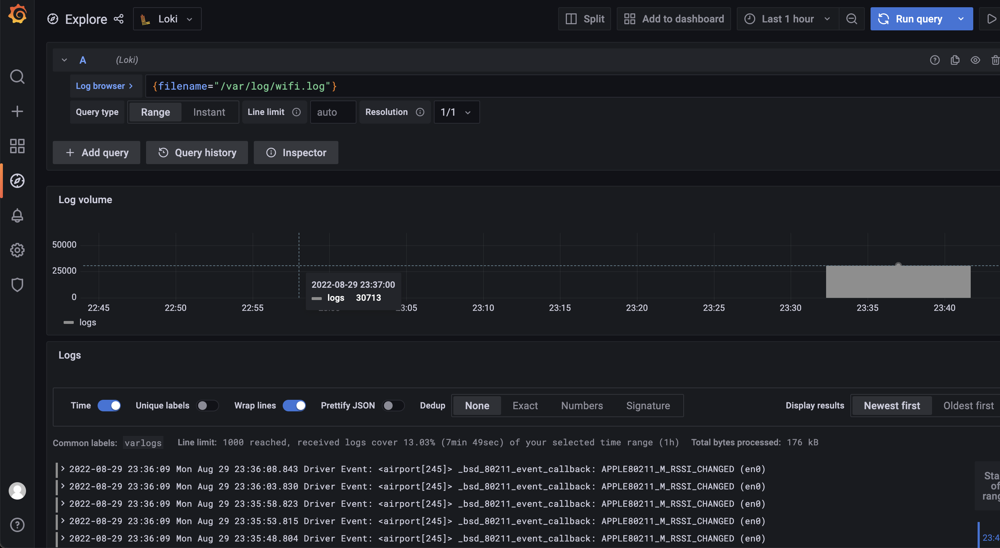

lgp日志系统搭建



docker-stack编排文件

```yaml
version: "3"

networks:
  logcenter:

volumes:
  logcenter:

services:
  loki:
    image: grafana/loki:2.6.0
    networks:
      - logcenter
    ports:
      - "3100:3100"
    volumes:
      - ./loki.example.yml:/mnt/config/loki-config.yaml
    command: -config.file=/mnt/config/loki-config.yaml
    
  promtail:
    image: grafana/promtail:2.6.0
    networks:
      - logcenter
    volumes:
      - /var/log:/var/log
      - ./promtail.example.yml:/mnt/config/promtail-config.yaml
    command: -config.file=/mnt/config/promtail-config.yaml
  
  grafana:
    image: grafana/grafana-oss:8.5.6
    networks:
      - logcenter
    environment:
      - TZ=Asia/Shanghai
    ports:
      - "3000:3000"
```

## 测试go程序

```bash
docker build -t hellolog .
```

将程序的日志与promtail的收集目录挂载到一起即可

## grafana

`docker stack deploy -c stack.yaml logcenter`

grafana默认账号密码是admin/admin

在grafana中添加数据源，url: `http://loki:3100`


## loki

不对日志进行全文索引。通过存储压缩非结构化日志和仅索引元数据，Loki 操作起来会更简单，更省成本。

通过使用与 Prometheus 相同的标签记录流对日志进行索引和分组，这使得日志的扩展和操作效率更高。

特别适合储存 Kubernetes Pod 日志; 诸如 Pod 标签之类的元数据会被自动删除和编入索引。

受 Grafana 原生支持。

Grafana Loki supports the following official clients for sending logs:

- Promtail
- Docker Driver
- Fluentd
- Fluent Bit
- Logstash
- Lambda Promtail


配置文件如下

```yaml
auth_enabled: false

server:
  http_listen_port: 3100
  grpc_listen_port: 9096

common:
  path_prefix: /tmp/loki
  storage:
    filesystem:
      chunks_directory: /tmp/loki/chunks
      rules_directory: /tmp/loki/rules
  replication_factor: 1
  ring:
    instance_addr: 127.0.0.1
    kvstore:
      store: inmemory

schema_config:
  configs:
    - from: 2020-10-24
      store: boltdb-shipper
      object_store: filesystem
      schema: v11
      index:
        prefix: index_
        period: 24h

ruler:
  alertmanager_url: http://localhost:9093
```
## promtail

将应用中的日志上报给loki

Promtail is the client of choice when you’re running Kubernetes, as you can configure it to automatically scrape logs from pods running on the same node that Promtail runs on. Promtail and Prometheus running together in Kubernetes enables powerful debugging: if Prometheus and Promtail use the same labels, users can use tools like Grafana to switch between metrics and logs based on the label set.

Promtail is also the client of choice on bare-metal since it can be configured to tail logs from all files given a host path. It is the easiest way to send logs to Loki from plain-text files (e.g., things that log to /var/log/*.log).

Lastly, Promtail works well if you want to extract metrics from logs such as counting the occurrences of a particular message.

支持应用程序push日志上来

配置文件如下

```yaml
server:
  http_listen_port: 9080
  grpc_listen_port: 0

positions:
  filename: /tmp/positions.yaml

clients:
  - url: http://loki:3100/loki/api/v1/push

scrape_configs:
- job_name: system
  static_configs:
  - targets:
      - localhost
    labels:
      job: varlogs
      __path__: /var/log/*log
```

