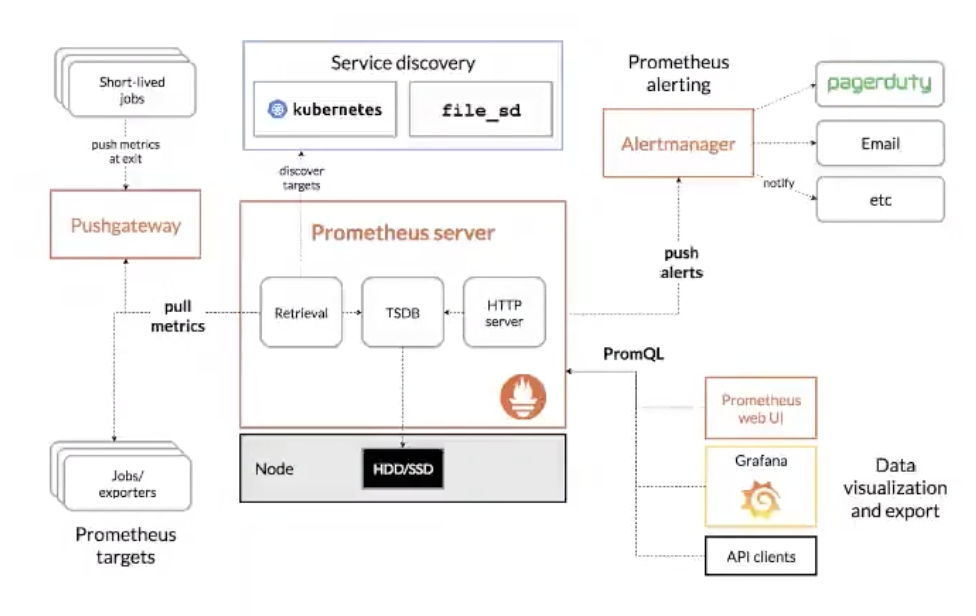

数据展示依旧依靠grafana

数据源则通过prometheus


prometheus + http中间件的实现方式

这里以golang语言为例，Prometheus提供了golang的客户端，简化了代码，主要就是定义好各类数据源类型

然后在中间件中计算并用sdk的方法记录下来，便于Prometheus抓取

也可以搭建pushgateway服务，自己主动上报(这是用来处理Prometheus无法抓取到内网服务)

> 具体例子参考: https://github.com/wwqdrh/logger/tree/main/plugins/prometheusx


# 简介

> [参考](https://hulining.gitbook.io/prometheus/)



以指标名称和键值对唯一标识的基于时间序列的多维数据模型

支持多维灵活查询的PromQL

与存储系统解耦

基于HTTP协议的Pull模式进行时间序列指标采集

中间网关支持Push模式

基于静态配置或服务发现的目标发现机制

灵活的图像化展示

## 数据模型

指标名与标签(MetricsName, Labels), 指标名例如CPU等统一的维度，具体业务用Label标识

采样点(Samples), 每次指标收集到的采样数据由两部分组成: Timestamp、Value

指标表示方式

- OpenTSDB: `[metric name]{[label name]=[label value], ...}`

> 例如api_http_requests_total{method="POST",handler="messages"}

## 指标类型

Prometheus 基本上将所有数据存储为时间序列：属于同一数据指标和同一组标注维度的带有时间戳的数据流。除了存储的时间序列之外，Prometheus 可能会生成临时派生的时间序列作为查询的结果。

Prometheus支持4中数据类型, Counter、Gauge、HISTOGRAM和SUMMARY.

Counter

counter是一个累计类型的数据指标，它代表单调递增的计数器，其值只能在重新启动时增加或重置为 0。例如，您可以使用计数器来表示已响应的请求数，已完成或出错的任务数。
不要使用计数器来显示可以减小的值。例如，请不要使用计数器表示当前正在运行的进程数；使用 gauge 代替。

Gauge

gauge 是可以任意上下波动数值的指标类型。
Gauge 通常用于测量值，例如温度或当前的内存使用量，还可用于可能上下波动的"计数"，例如请求并发数。

HISTOGRAM

观测值(通常是请求持续时间或响应大小之类的数据)进行采样，并将其计数在可配置的数值区间中。它也提供了所有数据的总和。

SUMMARY

summary 会采样观察结果(通常是请求持续时间和响应大小之类的数据)。它不仅提供了观测值的总数和所有观测值的总和，还可以计算滑动时间窗口内的可配置分位数。
基本数据指标名称为<basename>的 summary 类型数据指标，在数据采集期间会显示多个时间序列


这两个数据类型非常相似, 都非常适合用于统计持续一定时间的统计, 比如最常用的就是接口响应时间

## swarm文件

```yaml
version: "3"

networks:
  basic:

volumes:
  basic:

services:
  prometheus:
    image: bitnami/prometheus:2.36.1
    networks:
      - basic
    environment:
      - TZ=Asia/Shanghai
    volumes:
      - ./prometheus.yml:/opt/bitnami/prometheus/conf/prometheus.yml  # 将 prometheus 配置文件挂载到容器里
    ports:
      - "9090:9090"                     # 设置容器9090端口映射指定宿主机端口，用于宿主机访问可视化web
    deploy:
      replicas: 1
      restart_policy:
        condition: on-failure
```

## Prometheus

Prometheus Server: 普罗米修斯的主服务器,端口号9090

NodeEXporter: 负责收集Host硬件信息和操作系统信息，端口号9100

cAdvisor:负责收集Host上运行的容器信息,端口号占用8080

Grafana：负责展示普罗米修斯监控界面，端口号3000

altermanager：等待接收prometheus发过来的告警信息，altermanager再发送给定义的收件人

### 最基本的配置

> 添加的时候记得加到同一个网络下，否则grafana获取不到Prometheus的地址
> docker service update --network-add autosite_dev_autosite basic_prometheus
> 我这里有效的配置是`http://basic_prometheus:9090`


prometheus.yaml

```yaml
global:
  scrape_interval:     15s # By default, scrape targets every 15 seconds.

  # Attach these labels to any time series or alerts when communicating with
  # external systems (federation, remote storage, Alertmanager).
  external_labels:
    monitor: 'codelab-monitor'

# A scrape configuration containing exactly one endpoint to scrape:
# Here it's Prometheus itself.
scrape_configs:
  # The job name is added as a label `job=<job_name>` to any timeseries scraped from this config.
  - job_name: 'prometheus'

    # Override the global default and scrape targets from this job every 5 seconds.
    scrape_interval: 5s

    static_configs:
      - targets: ['localhost:9090']
```

如果有需要监控的node, 在scrape中对其进行配置

```yaml
scrape_configs:
  - job_name:       'node'

    # Override the global default and scrape targets from this job every 5 seconds.
    scrape_interval: 5s

    static_configs:
      - targets: ['localhost:8080', 'localhost:8081']
        labels:
          group: 'production'

      - targets: ['localhost:8082']
        labels:
          group: 'canary'
```

由于这里是将Prometheus运行在docker环境中，所以如果需要监控宿主机上的资源，通过cAdvisor进行资源上报

## NodeEXporter

> 详细配置参考: https://github.com/prometheus/node_exporter

各种与硬件和内核相关的指标

需要在主机环境而不是容器下运行

```bash
wget https://github.com/prometheus/node_exporter/releases/download/v*/node_exporter-*.*-amd64.tar.gz
tar xvfz node_exporter-*.*-amd64.tar.gz
cd node_exporter-*.*-amd64
./node_exporter
```

配置Prometheus数据源策略

```yaml
scrape_configs:
- job_name: 'node'
  static_configs:
  - targets: ['localhost:9100']
```

各类指标表达式

## cAdvisor

用于检查容器信息

> 各类指标表达式列表: https://github.com/google/cadvisor/blob/master/docs/storage/prometheus.md

服务编排文件

```yaml

...

cadvisor:
    image: google/cadvisor:latest
    container_name: cadvisor
    ports:
    - 8080:8080
    volumes:
    - /:/rootfs:ro
    - /var/run:/var/run:rw
    - /sys:/sys:ro
    - /var/lib/docker/:/var/lib/docker:ro

...

```

prometheus配置文件, 添加对cadvisor数据获取的配置

```yaml
scrape_configs:
- job_name: cadvisor
  scrape_interval: 5s
  static_configs:
  - targets:
    - cadvisor:8080
```


## 服务状态

检查容器服务的状态

示例配置

```yaml
  - job_name: 'mall'
    static_configs:
      # 目标的采集地址
      - targets: ['golang:9080']
        labels:
          # 自定义标签
          app: 'user-api'
          env: 'test'

      - targets: ['golang:9090']
        labels:
          app: 'user-rpc'
          env: 'test'
```

> [监测qps](https://github.com/wufeiqun/blog/blob/master/prometheus/2.%E4%BD%BF%E7%94%A8Prometheus%E7%9B%91%E6%8E%A7%E6%8E%A5%E5%8F%A3%E7%9A%84%E5%93%8D%E5%BA%94%E6%97%B6%E9%97%B4.md)