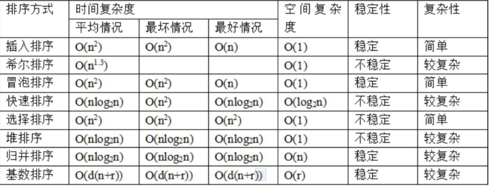

# 基础排序



稳定排序：假定在待排序的序列中存在多个具有相同值的元素，若经过排序，这些元素的相对次序保持不变

## 插入排序

每一步将元素插入到前面已经有序的数列中

```Go
func InsertionSort(nums []int) []int {
    for i := 1; i < len(nums); i++ {
        cur := nums[i]
        j := i - 1
        for ; j >= 0 && nums[j] > cur; j-- {
            nums[j+1] = nums[j] // 往后移一位，为cur腾位置
        }
        nums[j+1] = cur
    }
    return nums
}
```

## 计数排序

```Go
func max(nums ...int) int {
    maxVal := -1 << 31
    for _, item := range nums {
        if item > maxVal {
            maxVal = item
        }
    }
    return maxVal
}

// 计数排序
func countSort(nums []int) []int {
    maxVal := max(nums...)
    bucket := make([]int, maxVal+1)
    for _, num := range nums {
        bucket[num]++
    }
    
    res := []int{}
    for i, cnt := range bucket {
        for ; cnt > 0; cnt-- {
            res = append(res, i)
        }
    }
    return res
}
```

## 快速排序

```Go
func quickSort(nums []int, left, right int) {
    if left >= right {
        return
    }
    
    idx := rand.RandIntn() % (right - left + 1) + start // 基准idx
    nums[left], nums[idx] = nums[idx], nums[left]
    
    pivot := nums[left]
    i, j := left, right
    for i < j {
        for i < j && nums[j] > pivot {
            j--
        }
        for i < j && nums[i] <= pivot {
            i++
        }
        if i < j {
            nums[i], nums[j] = nums[j], nums[i]
        }
    }
    nums[left], nums[i] = nums[i], nums[left]
    
    quickSort(nums, left, i - 1);
    quickSort(nums, i + 1, right)
}
```

## 冒泡排序

```Go
func bubbleSort(nums []int) []int {
    nums := nums[:]
    length := len(nums)
    for i := 0; i < length; i++ {
        for j := 0; j < length-i-1; j++ {
            if nums[j] > nums[j+1] {
                nums[j], nums[j+1] = nums[j+1], nums[j]
            }
        }
    }
    return nums
}
```

## 堆排序

一种选择排序，第一个非叶子节点: len/2-1，将无序序列构建一个堆，根据升序降序需求选择大顶堆或小顶堆；将堆顶元素与末尾元素交换，将最大元素沉到数组末端；重新调整结构使其满足堆定义，重复前面的步骤。

```Go
func heapSort(nums []int) []int {
    arrLen := len(nums)
    // 构造大顶堆，最后i==0的时候，是最大的值
    for i := arrLen / 2; i >= 0; i-- {
        heapify(nums, i, arrLen)
    }
    
    // 固定最后的位置，然后重新构造前面的元素，最终变成一个有序的
    for i := arrLen - 1; i >= 0; i-- {
        nums[0], nums[i] = nums[i], nums[0]
        heapify(nums, 0, i)
    }
    return nums
}

// 堆结构的重新构造
// 大顶堆，递归往下比较，需要让最初的i的位置是最大的
func heapify(nums []int, i, arrLen int) {
    left, right := i*2 + 1, i*2 + 2
    cur := i
    if left < arrLen && nums[left] > nums[cur] {
        cur = left
    }
    if right < arrLen && nums[right] > nums[cur] {
        cur = right
    }
    
    if cur != i {
        nums[i], nums[cur] = nums[cur], nums[i]
        heapify(nums, cur, arrLen) // 继续往下进行比较
    }
}
```

## 归并排序

n路，一般将一个待排序的数组，划分为多个分组，然后分别在goroutine中进行排序，当每个任务都完成后进行合并

> 对16M内存的整型数组进行排序，完整的代码参考: https://github.com/heteddy/talent-plan/tree/master/tidb/mergesort

```go
// n路归并道理是一样的
func merge(left []int, right []int) []int {
	var result []int
	leftIdx, rightIdx := 0, 0
	for (leftIdx < len(left)) && (rightIdx < len(right)) {
		if left[leftIdx] <= right[rightIdx] {
			result = append(result, left[leftIdx])
			leftIdx++
		} else {
			result = append(result, right[rightIdx])
			rightIdx++
		}
	}
	if leftIdx < len(left) {
		result = append(result, left[leftIdx:]...)
	}
	if rightIdx < len(right) {
		result = append(result, right[rightIdx:]...)
	}
	return result
}
```

# 多维度排序

## 两个维度排序

假设角色有两个属性：攻击和防御，如果一个角色的攻击和防御都严格高于另外一个角色，那么另外一个角色就是弱角色，寻找弱角色的数量

先按攻击值从大到小排序，然后在遍历过程中记录当前的最大的防御值，如果比最大的防御值小，那么就说明是弱角色

```go
func numberOfWeakCharacters(properties [][]int) (ans int) {
	sort.Slice(properties, func(i, j int) bool {
		p, q := properties[i], properties[j]
		return p[0] > q[0] || p[0] == q[0] && p[1] < q[1]
		// 如果p[0] == q[0], 说明p当不了q强角色了，为了在之后遍历时不让其比较那么直接把防御弱的加在前面
	})
	
	maxDef := 0
	for _, p := range properties {
		if p[1] < maxDef {
			ans++
		} else {
			maxDef = p[1]
		}
	}
	return
}
```
# 自定义排序

## 字典序

数字日志: `dig1 8 1 5 1`
字母日志: `let1 art can`

- 所有 字母日志 都排在 数字日志 之前。
- 字母日志 在内容不同时，忽略标识符后，按内容字母顺序排序；在内容相同时，按标识符排序。
- 数字日志 应该保留原来的相对顺序。

```go
func reorderLogFiles(logs []string) []string {
	sort.SliceStable(logs, func(i, j int) bool {
		s, t := logs[i], logs[j]
		s1 := strings.SplitN(s, " ", 2)[1]
		s2 := strings.SplitN(t, " ", 2)[1]
		isDigit1 := unicode.IsDigit(rune(s1[0]))
		isDigit2 := unicode.IsDigit(rune(s2[0]))
		if isDigit && isDigit2 {
			return false // 保持原来的顺序
		}
		if !isDigit1 && !isDigit2 {
			// 按字典序排序 如果两个相等则加上标识符按字典序排序
			return s1 < s2 || s1 == s2 && s < t
		}
		return !isDigit1
	})
	return logs
}
```
## 摆动排序

设数组长度为n

*基本原则*

`nums[0] < nums[1] > nums[2] < nums[3]...`这种是满足规则的

*推论*

1、偶数下标的元素是数组中(假设有序)前半部分，奇数下标是后半部分

2、在构造数据的时候，后半部分也选择相对较小的才能保证后半部分大于前半部分

3、如果数组中相同的元素数目超过了x(`(n+1)/2`)个，那么无论怎么排序都一定会存在相邻的相等元素

4、由3可推出，排序数组中`num[i]`≠`num[i+x]`, 即`nums[0]<nums[x], nums[1]<nums[1+x], ...nums[i] < nums[i+x]`

```go
func wiggleSort(nums []int) {
	n := len(nums)
	arr := append([]int{}, nums...)
	sort.Ints(arr)
	
	x := (n + 1) / 2
	for i, j, k := 0, x-1, n-1; i < n; i += 2 {
		// j指向比较小的数 k指向比较大的数
		nums[i] = arr[j]
		if i + 1 < n {
			nums[i+1] = arr[k]
		}
		j--
		k--
	}
}
```