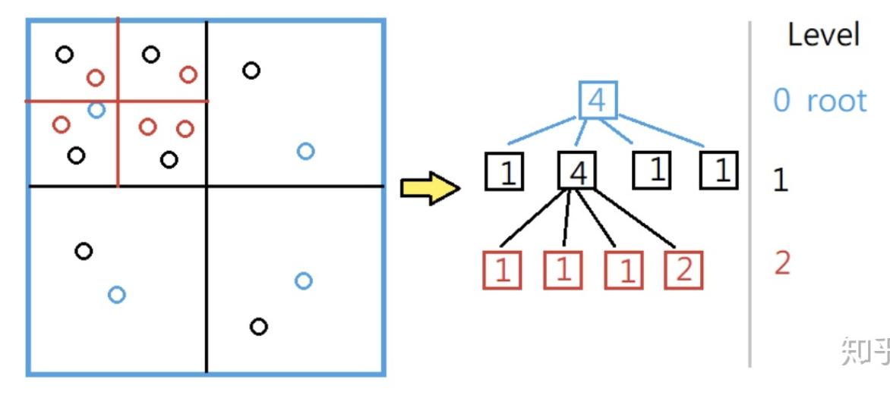

# 最小高度树
给定一个无向图的节点的连接关系，寻找一个节点使得这个节点作为根的树高度是最小的

#树形DP

```go

var (
	adj [][]int // 邻接表
	down1 []int  // 存储节点i往下的最大高度
	down2 []int  // 存储节点i往下的次大高度
	up []int // 往上的最大高度
	p []int  // 记录往下的最大高度由哪个孩子节点转移
)

// n 节点个数，edges无向无权图的邻接矩阵关系
func findMinHeightTrees(n int, edges [][]int) []int {
	down1 = make([]int, n)
	down2 = make([]int, n)
	up = make([]int, n)
	p = make([]int, n)
	
	// 构建邻接表
	adj = make([][]int, n)
	for i := 0; i < n; i++ {
		adj[i] = []int{}
	}
	for _, e := range edges {
		// 无向图，所以两边都要加
		adj[e[0]] = append(adj[e[0]], e[1])
		adj[e[1]] = append(adj[e[1]], e[0])
	}
	
	// 状态初始化
	for i := 0; i < n; i++ {
		p[i] = -1
	}
	dfs1(0, -1)
	dfs2(0, -1)
	
	// 结果
	res := []int{}
	min := n + 1 // 最小高度
	for i := 0; i < n; i++ {
		// 考虑以i为根节点的高度
		h := max(down1[i], up[i])
		if h < min {
			min = h
			res = res[:0]
			res = append(res, i)
		} else if h == min {
			res = append(res, i)
		}
	}
	return res
}

func max(a, b int) int {
	if a >= b {
		return a
	}
	return b
}

// 搜索cur往下的最大高度
// cur当前节点 fa父节点
func dfs1(cur, fa int) int {
	for _, ne := range adj[cur] {
		if ne == fa {
			continue
		}
		sub := dfs1(ne, cur) + 1 // 孩子节点的最大高度+1
		if sub > down1[cur] {
			down2[cur] = down1[cur]
			down1[cur] = sub
			p[cur] = ne
		} else if sub > down2[cur] {
			down2[cur] = sub
		}
	}
	return down1[cur]
}

// 搜索cur往上的最大高度
func dfs2(cur, fa int) {
	for _, ne := range adj[cur] {
		if ne == fa {
			continue
		}
		if p[cur] == ne {
			// 刚好是往下的最大高度经过的子节点，那么就是走父节点的次高
			up[ne] = max(up[ne], down2[cur] + 1)
		} else {
			up[ne] = max(up[ne], down1[cur] + 1)
		}
		
		// 考虑up[ne]从up[cur]转移过来
		up[ne] = max(up[ne], up[cur] + 1)
		dfs2(ne, cur)
	}
}
```

# n叉数

## 二叉树

中序遍历

```go
func inorder(root *TreeNode) (res []int) {
	cur := root
	stack := []*TreeNode{}
	for cur != nil && len(stack) > 0 {
		for cur != nil {
			stack = append(stack, cur)
			cur = cur.Left
		}
		cur = stack[len(stack)-1]
		stack = stack[:len(stack)-1]
		res = append(res, cur.Val)
		cur = cur.Right
	}
	return
}
```

### 判断树是否平衡

```go
func isBalanced(root *TreeNode) bool {
    var dfs func(node *TreeNode) int
    dfs = func(node *TreeNode) int {
        if node == nil {
            return 0
        }

        left, right := dfs(node.Left), dfs(node.Right)
        if left == -1 || right == -1 || abs(left - right) > 1 {
            return -1
        }

        if left > right {
            return left + 1
        } else {
            return right + 1
        }
    }

    return dfs(root) != -1
}

func abs(num int) int {
    if num < 0 {
        num = -num
    }
    return num
}
```

## 四叉树

### 构造四叉树

在平面坐标中划分区域快速查找的算法，可以用于碰撞检测、稀疏数据、空间索引等

> 在一维 的世界里面可以用二分查找，把一堆数据分一半，再分一半直到找这个东西，在二维的世界，我们就用四分查找，把屏幕化为四份，在里面找，找不到，我再分为四分，同样在3维世界，我们就用八分查找

设定四叉树每个节点的最大容量，当新加元素使得节点数超过了，那么就分裂节点然后继续添加



1、构造四叉树，给定一个`n*n`二维数组，值为0或者1，如果所有的值全部相同那么就是子节点，否则是非叶子节点(递归的时候就是将其分裂成四个子节点)

```go
type Node struct {
	Val bool
	IsLeaf bool
	TopLeft *Node
	TopRight *Node
	BottomLeft *Node
	BottomRight *Node
}

func construct(grid [][]int) *Node {
	var dfs func([][]int, int, int) *Node
	dfs = func(rows [][]int, c0, c1 int) *Node {
		for _, row := range rows {
			for _, v := range row[c0:c1] {
				if v != rows[0][c0] {
					// 存在不同值，不是叶子节点
					rMid, cMid := len(rows)>>1, (c0+c1)>>1
					return &Node{
						true,
						false,
						dfs(rows[:rMid], c0, cMid),
						dfs(rows[:rMid], cMid, c1),
						dfs(rows[rMid:], c0, cMid),
						dfs(rows[rMid:], cMid, c1)
					}
				}
			}
		}
		// 是叶子节点
		return &Node{Val: rows[0][c0] == 1, IsLeaf: true}
	}
	return dfs(grid, 0, len(grid))
}
```


### 四叉树交集

给定两个四叉树，结构体定义如上所示，每个四叉树都表示一个`n*n`的矩阵

```go
func intersect(quadTree1, quadTree2 *Node) *Node {
	if quadTree1.IsLeaf {
		if quadTree1.Val {
			return &Node{Val: true, IsLeaf: true}
		}
		return quadTree2
	}
	if quadTree2.IsLeaf {
		return intersect(quadTree2, quadTree1)
	}
	o1 := intersect(quadTree1.TopLeft, quadTree2.TopLeft)
	o2 := intersect(quadTree1.TopRight, quadTree2.TopRight)
	o3 := intersect(quadTree1.BottomLeft, quadTree2.BottomLeft)
	o4 := intersect(quadTree1. BottomRight, quadTree2.BottomRight)
	if o1.IsLeaf && o2.IsLeaf && o3.IsLeaf && o4.IsLeaf && o1.Val == o2.Val && o1.Val == o3.Val && o1.Val == o4.Val {
		return &Node{Val: o1.Val, IsLeaf: true}
	}
	return &Node{false, false, o1, o2, o3, o4}
}
```

## 层序遍历

```GO
func levelOrder(root *Node) (ans [][]int) {
	if root == nil {
		return
	}
	q := []*Node{root}
	for q != nil {
		level := []int{} // 当前层的结果
		tmp := q
		q = nil // 将上一层的清空
		for _, node := range tmp {
			level = append(level, node.Val)
			q = append(q, node.Children...)
		}
		ans = append(ans, level)
	}
	return
}
```

## 前序遍历

```go
func preorder(root *Node) (ans []int) {
	if root == nil {
		return
	}
	st := []*Node{root}
	for len(st) > 0 {
		node := st[len(st)-1]
		st = st[:len(st)-1]
		ans = append(ans, node.Val)
		for i := len(node.Children) - 1; i >= 0; i-- {
			st = append(st, node.Children[i])
		}
	}
	return
}
```

## 后序遍历

利用改版的前序遍历(中右左)反转

```go
func postorder(root *Node) (ans []int) {
	if root == nil {
		return
	}
	st := []*Node{root}
	for len(st) > 0 {
		node := st[len(st)-1]
		st = st[:len(st)-1]
		ans = append(ans, node.Val)
		st = append(st, node.Children...)
	}
	// 反转
	for i, n := 0, len(ans); i < n/2; i++ {
		ans[i], ans[n-i-1] = ans[n-i-1], ans[i]
	}
	return
}
```

## 删除节点后剩下的部分节点数乘积最大值

#深度优先搜索

```go
func countHighestScoreNodes(parents []int) (ans int) {
	n := len(parents)
	children := make([][]int, n)
	for node := 1; node < n; node++ {
		p := parents[node] // 当前节点的父节点
		children[p] = append(children[p], node)
	}
	
	maxScore := 0
	var dfs func(int) int // 寻找节点的子节点个数
	dfs = func(node int) int {
		score, size := 1, n-1
		for _, ch := range children[node] {
			sz := dfs(ch)
			score *= sz
			size -= sz
		}
		if node > 0 {
			// 不是根节点
			score *= size // 乘以剩下的第三部分
		}
		
		if score == maxScore {
			ans++
		} else if score > maxScore {
			maxScore = score
			ans = 1
		}
		return n - size
	}
	dfs(0)
	return
}
```


# 二叉搜索树
## 序列化与反序列化

只需要一个前序或者后序遍历，经过排序之后是中序遍历，有两个顺序即可进行恢复

后序遍历得到的数组中，根结点的值位于数组末尾，左子树的节点均小于根节点的值，右子树的节点均大于根节点的值，可以根据这些性质设计递归函数恢复二叉搜索树。

```go
type Codec struct{}

func Constructor() (_ Codec) { return }

func (Codec) serialize(root *TreeNode) string {
    arr := []string{}
    var postOrder func(*TreeNode)
    postOrder = func(node *TreeNode) {
        if node == nil {
            return
        }
        postOrder(node.Left)
        postOrder(node.Right)
        arr = append(arr, strconv.Itoa(node.Val))
    }
    postOrder(root)
    return strings.Join(arr, " ")
}

func (Codec) deserialize(data string) *TreeNode {
    if data == "" {
        return nil
    }
    arr := strings.Split(data, " ")
    var construct func(int, int) *TreeNode
    construct = func(lower, upper int) *TreeNode {
        if len(arr) == 0 {
            return nil
        }
        val, _ := strconv.Atoi(arr[len(arr)-1])
        if val < lower || val > upper {
            return nil
        }
        arr = arr[:len(arr)-1]
        return &TreeNode{Val: val, Right: construct(val, upper), Left: construct(lower, val)}
    }
    return construct(math.MinInt32, math.MaxInt32)
}
```

## 序列化为字符串

#迭代

使用括号把一起的子树结构括起来

- 如果当前节点有两个孩子，那么我们先将右孩子入栈，再将左孩子入栈，从而保证前序遍历的顺序；
- 如果当前节点没有孩子，我们什么都不做；
- 如果当前节点只有左孩子，那么我们将左孩子入栈；
- 如果当前节点只有右孩子，那么需要在答案末尾添加一对 `{}` 表示空的左孩子，再将右孩子入栈。

```go
func tree2str(root *TreeNode) string {
	ans := &strings.Builder{}
	
	// 栈迭代
	st := []*TreeNode{root}
	vis := map[*TreeNode]bool{}
	for len(st) > 0 {
		node := st[len(st)-1]
		if vis[node] {
			if (node != root) {
				ans.WriteByte(')')
			}
			st = st[:len(st)-1]
		} else {
			vis[node] = true
			if (node != root) {
				ans.WriteByte('(')
			}
			ans.WriteString(strconv.Itoa(node.Val))
			if node.Left == nil && node.Right != nil {
				ans.WriteString("()")
			}
			if node.Right != nil {
				st = append(st, node.Right)
			}
			if node.Left != nil {
				st = append(st, node.Left)
			}
		}
	}
	return ans.String()
}
```


## 中序遍历

二叉搜索树的中序遍历结果为一个有序数组

```Go
func inorder(root *TreeNode) (res []int) {
    var dfs func(*TreeNode)
    dfs = func(node *TreeNode) {
        if node == nil {
            return
        }
        dfs(node.left)
        res = append(res, node.Val)
        dfs(node.right)
    }
    dfs(root)
    return
}
```

迭代版本

模拟递归，将left的都加到调用栈中，然后将栈顶的作为节点加入到结果中，并进入到right部分进行处理

```go
func inorderTraversal(root *TreeNode) (res []int) {
	stack := []*TreeNode{}
	for root != nil || len(stack) > 0 {
		for root != nil {
			stack = append(stack, root)
			root = root.Left
		}
		root = stack[len(stack)-1]
		stack = stack[:len(stack)-1]
		res = append(res, root.Val)
		root = root.Right
	}
	return
}
```

## 合并二叉树

将两个二叉搜索树归并成一个有序数组

#归并排序

```Go
func inorder(root *TreeNode) (res []int) {
    var dfs func(*TreeNode)
    dfs = func(node *TreeNode) {
        if node == nil {
            return
        }
        dfs(node.left)
        res = append(res, node.Val)
        dfs(node.right)
    }
    dfs(root)
    return
}

func Merge(root1, root2 *TreeNode) []int {
    nums1, nums2 := inorder(root1), inorder(root2)
    
    // 双路归并
    p1, n1 := 0, len(nums1)
    p2, n2 := 0, len(nums2)
    merged := make([]int, 0, n1+n2)
    for {
        if p1 == n1 {
            merged = append(merged, nums2[p2:]...)
			break
        }
        if p2 == n2 {
            merged = append(merged, nums1[p1:]...)
			break
        }
		
        if nums1[p1] < nums2[p2] {
            merged = append(merged, nums1[p1])
            p1++
        } else {
            merged = append(merged, nums2[p2])
            p2++
        }
    }
    return merge
}
```

## 后继节点

利用二叉搜索树的性质可以不做中序遍历找到p的后续节点：如果节点p的右子树不为空，则后续节点在右子树中的最左边的节点；如果节点的右子树为空，那么就需要从root开始遍历寻找节点p的祖先节点。

```Go
func inorderSuccessor(root, p *TreeNode) *TreeNode {
    var successor *TreeNode
    if p.Right != nil {
        successor = p.Right
        for successor.Left != nil {
            successor = successor.Left
        }
        return successor
    }
    
    node := root
    for node != nil {
        if p.Val < node.Val {
            successor = node // 有可能当前就是大于p的第一个节点
            node = node.Left
        } else {
            node = node.Right
        }
    }
    return successor
}
```


## 删除元素

二叉搜索树，删除元素，需要满足删除后的树依旧满足二叉搜索树性质

- 当左右子树只有一个不为空，那么就让其补当前元素的位置
- 如果左右子树都存在，让右子树的最小节点来补位置

```go
func deleteNode(root *TreeNode, key int) *TreeNode {
	switch {
	case root == nil:
		return nil
	case root.Val > key:
		root.Left = deleteNode(root.Left, key)
	case root.Val < Key:
		root.Right = deleteNode(root.Right, key)
	case root.Left == nil || root.Right == nil:
		if root.Left != nil {
			return root.Left
		}
		return root.Right
	default:
		successor := root.Right
		for successor.Left != nil {
			successor = successor.Left
		}
		successor.Right = deleteNode(root.Right, successor.Val) // 这个节点没有左子树，不会进入到default分支导致无限递归
		successor.Left = root.Left
		return successor
	}
	return root // 只有第2、3分支会进入这里
}
```

## 判断二叉树是否是镜像对称的

```go
func isSymmetric(root *TreeNode) bool {
    return check(root, root)
}

func check(p, q *TreeNode) bool {
    if p == nil && q == nil {
        return true
    }
    if p == nil || q == nil {
        return false
    }
    return p.Val == q.Val && check(p.Left, q.Right) && check(p.Right, q.Left) 
}
```

或者修改为迭代，即自己使用栈来模拟递归调用的栈

```go
func isSymmetric(root *TreeNode) bool {
    u, v := root, root
    q := []*TreeNode{}
    q = append(q, u, v)
    for len(q) > 0 {
        u, v = q[0], q[1]
        q = q[2:]
        if u == nil && v == nil {
            continue
        }
        if u == nil || v == nil {
            return false
        }
        if u.Val != v.Val {
            return false
        }
        q = append(q, u.Left, v.Right)

        q = append(q, u.Right, v.Left)
    }
    return true
}
```

# 树状数组

核心在于通过 `index&-index` 找到树结构中相连接的节点

- 构造函数
- update
- sumRange

**应用场景**

- 多次修改单个值，求区间

``` Go
type NumArray struct {
    // tree中存储区间值比如tree[1]->nums[0], tree[2]->nums[0]+nums[1] ...
    nums, tree []int
}

func Constructor(nums []int) NumArray {
    tree := make([]int, len(nums)+1)
    na := NumArray{
        nums, tree,
    }
    // 初始修改
    for i, num := range nums {
        na.add(i+1, num)
    }
    return na
}

// 爬树修改
func (t *NumArray) add(index, val int) {
    // lowbit index & -index, 求出最低位的1的位置
    // 说明index管理着index&-index这些元素的区间
    for ; index < len(t.tree); index += index&-index {
        t.tree[index] += val
    }
}

// 求解前缀和
func (t *NumArray) prefixSum(index int) (sum int) {
    //for ; index > 0; index &= index - 1 {
	for; index > 0; index -= index & -index {
        sum += t.tree[index]
    }
    return
}

// 修改树状数组中的单个值
func (t *NumArray) Update(index, val int) {
    t.add(index+1, val-t.nums[index])
    t.nums[index] = val
}

// 求区间和
func (t *NumArray) SumRange(left, right int) int {
    return t.prefixSum(right+1) - t.prefixSum(left)
}
```

# 线段树

区间树，长度不变的平衡树结构。使用线段树时，不考虑添加元素，一般采用4n的静态空间即可。

**应用场景**

- 区间统计，区间染色这类区间不变问题
- 维护区间信息，在O(logn)时间复杂度内实现单点修改，区间修改，区间查询（区间求和，求区间最大值，求区间最小值等）

``` Go
// SegmentTree 使用数组实现线段树结构
// 如果有n个元素，如果n=2^k, 只需要2n空间，如果n=2^k+1, 需要有4*n个节点
type SegmentTree struct {
	tree   []int                // 线段树
	data   []int                // 数组数据
	merger func(v1, v2 int) int // 线段树功能函数，求和求余等等
}

func NewSegmentTree(arrs []int, merger func(i1, i2 int) int) *SegmentTree {
	length := len(arrs)
	tree := &SegmentTree{
		tree:   make([]int, length*4),
		data:   arrs,
		merger: merger,
	}
	tree.buildSegmentTree(0, 0, length-1)
	return tree
}

func (SegmentTree) leftChild(i int) int {
	return 2*i + 1
}

func (tree *SegmentTree) buildSegmentTree(index, l, r int) int {
	if l == r {
		tree.tree[index] = tree.data[l]
		return tree.data[l]
	}
	leftI := tree.leftChild(index)
	rightI := leftI + 1
	mid := l + (r-l)/2
	leftResp := tree.buildSegmentTree(leftI, l, mid)
	rightResp := tree.buildSegmentTree(rightI, mid+1, r)

	tree.tree[index] = tree.merger(leftResp, rightResp)
	return tree.tree[index]
}

// Query 查询数据
func (tree *SegmentTree) Query(queryL, queryR int) (int, error) {
	length := len(tree.data)
	if queryL < 0 || queryL > queryR || queryR >= length {
		return 0, errors.New("index is illegal")
	}
	return tree.queryRange(0, 0, length-1, queryL, queryR), nil
}

// queryRange 具体的查询逻辑
func (tree *SegmentTree) queryRange(index, l, r, queryL, queryR int) int {
	if l == queryL && r == queryR {
		return tree.tree[index]
	}

	leftI := tree.leftChild(index)
	rightI := leftI + 1
	mid := l + (r-l)/2
	if queryL > mid {
		return tree.queryRange(rightI, mid+1, r, queryL, queryR)
	}
	if queryR <= mid {
		return tree.queryRange(leftI, l, mid, queryL, queryR)
	}

	leftResp := tree.queryRange(leftI, l, mid, queryL, mid)
	rightResp := tree.queryRange(rightI, mid+1, r, mid+1, queryR)
	return tree.merger(leftResp, rightResp)
}

func (tree *SegmentTree) Update(k, v int) {
	length := len(tree.data)
	if k < 0 || k >= length {
		return
	}
	tree.set(0, 0, length-1, k, v)
}

func (tree *SegmentTree) set(treeIndex, l, r, k, v int) {
	if l == r {
		tree.tree[treeIndex] = v
		return
	}

	leftI := tree.leftChild(treeIndex)
	rightI := leftI + 1
	midI := l + (r-l)/2
	if k > midI {
		tree.set(rightI, midI+1, r, k, v)
	} else {
		tree.set(leftI, l, midI, k, v)
	}
	tree.tree[treeIndex] = tree.merger(tree.tree[leftI], tree.tree[rightI])
}
```

## 动态开点线段树

动态线段树，懒标记区间`[l,r]`进行累加的次数，tree 记录区间`[l,r]` 的最大值，最终返回区间 `[0,10^9]`中的最大元素即可

由于值域过大，我们无法直接使用空间大小固定为4×n 的常规线段树，而要采用「动态开点」的方式，其中动态开点的方式有两种 :「需要进行估点的数组实现」和「无须估点的动态指针」。

强制在线的话，无法进行离散化

```go
type RangeModule struct {
	root *Node
}

type Node struct {
	ls, rs *Node
	sum, add int
}

var N = int(1e9) + 10

func Constructor() RangeModule {
	return RangeModule{
		root: new(Node),
	}
}

// 动态开点线段树模板
func (this *RangeModule) update(node *Node, lc, rc, l, r, v int) {
	length := rc - lc + 1
	if lc >= l && rc <= r {
		if v == 1 {
			node.sum = length
		} else {
			node.sum = 0
		}
		node.add = v
		return	
	}
	this.pushdown(node, length)
	mid := (lc + rc) >> 1
	if l <= mid {
		this.update(node.ls, lc, mid, l, r, v)
	}
	if r > mid {
		this.update(node.rs, mid+1, rc, l, r, v)
	}
	this.pushup(node)
}

func (this *RangeModule) pushup(node *Node) {
	node.sum = node.ls.sum + node.rs.sum
}

func (this *RangeModule) pushdown(node *Node, length int) {
	if node.ls == nil {
		node.ls = new(Node)
	}
	if node.rs == nil {
		node.rs = new(Node)
	}
	if node.add == 0 {
		return
	}
	
	add := node.add
	if add == -1 {
		node.ls.sum = 0
		node.rs.sum = 0
	} else {
		node.ls.sum = length - length/2
		node.rs.sum = length/2
	}
	node.ls.add = add
	node.rs.add = add
	node.add = 0
}

func (this *RangeModule) query(node *Node, lc, rc, l, r int) int {
	if lc >= l && rc <= r {
		return node.sum
	}
	this.pushdown(node, rc - lc + 1)
	
	mid := lc + rc >> 1
	ans := 0
	if l <= mid {
		ans = this.query(node.ls, lc, mid, l, r)
	}
	if r > mid {
		ans += this.query(node.rs, mid+1, rc, l, r)
	}
	return ans
}
// <<动态开点线段树模板

func (this *RangeModule) AddRange(left int, right int) {
	this.update(this.root, 1, N-1, left, right-1, 1)
}

func (this *RangeModule) QueryRange(left int, right int) bool {
	return this.query(this.root, 1, N-1, left, right-1) == right - left
}

func (this *RangeModule) RemoveRange(left int, right int) {
	this.update(this.root, 1, N-1, left, right-1, -1)
}
```

### 动态给定区间加一的数据，查询最大值

> 还可以使用差分数组

```go
type pair struct {
	num	 int
	lazy int // 标记区间进行累加的次数
}

type MyCalendarThree map[int]pair

func Constructor() MyCalendarThree {
	return MyCalendarThree{}
}

// 更新动态线段树中的区间信息
// start, end: 需要更新的区间
// l, r: 线段树范围的最小最大值
// idx: 第几个节点,左子节点idx*2, 右子节点idx*2+1
func (t MyCalendarThree) Book(start, end int) int {
	t.update(start, end-1, 0, 1e9, 1)
	return t[1].num // 返回第一个节点的num值(根节点1号 最大值)
}

func (t MyCalendarThree) update(start, end, l, r, idx int) {
	if start > r || end < l {
		return
	}
	
	if start <= l && end >= r {
		p := t[idx]
		p.num++
		p.lazy++
		t[idx] = p
	} else {
		// 发生重叠
		mid := (l + r) / 2
		t.update(start, end, l, mid, idx*2)
		t.update(start, end, mid+1, r, idx*2+1)
		
		p := t[idx]
		p.num = p.lazy + max(t[idx*2].num, t[idx*2+1].num)
	}
}

func max(a, b int) int {
	if b > a {
		return b
	}
	return a
}
```

## 权值线段树

使用线段树维护一个桶，可以在`O(logv)`地查询出区间范围的值；可以在`O(logv)`地求得第k大的数

> 权值线段树需要按值域开空间，当值域过大时需要离散化或者动态开点


# 字典树

```Go
type TrieTree struct {
    children sync.Map
    isWord bool
}

func NewTrieTree(word string) *TrieTree {
    tree := &TrieTree{
        children: sync.Map{},
        isWord: false,
    }
    tree.Insert(word)
    return tree
}

func (trie *TrieTree) Insert(word string) {
    cur := trie
    for _, w := range word {
        if _, ok := cur.children.Load(w); !ok {
            node := &TrieTree{
                children: sync.Map{}
            }
            cur.children.Store(w, node)
        }
        val, _ := cur.children.Load(w)
        cur = val.(*TrieTree)
    }
    cur.isWord = true
}

func (trie *TrieTree) Search(word string) bool {
    cur := trie
    for _, w := range word {
        if val, ok := cur.children.Load(w); !ok {
            return false
        } else {
            cur = val.(*TrieTree)
        }
    }
    return cur.isWord
}

func (trie *TrieTree) Delete(word string) {
    cur := trie
    for _, w := range word {
        if val, ok := cur.children.Load(w); !ok {
            return
        } else {
            cur = val.(*TrieTree)
        }
    }
    cur.isWord = false
}
```

# 并查集

并查集不支持集合的分离，但是并查集在经过修改后可以支持集合中单个元素的删除操作。使用动态开点线段树还可以实现可持久化并查集。

```Go
type unionFind struct {
    parent, rank []int
}

func NewUnionFind(n int) *unionFind {
    parent := make([]int, n)
    rank := make([]int, n)
    
}

func (u *unionFind) find(x int) int {
    if uf.parent[x] != x {
        uf.parent[x] = uf.find(uf.parent[x])
    }
    return uf.parent[x]
}

func (u *unionFind) union(x, y int) bool {
    fx, fy := u.find(x), u.find(y)
    if fx == fy {
        return false
    }
    if uf.rank[fx] < uf.rank[fy] {
        fx, fy = fy, fx
    }
    uf.rank[fx] += uf.rank[fy]
    uf.parent[fy] = fx
    return true
}
```

# 霍夫曼树

求解树的带权路径长度，WPL 最小的二叉树 称为 霍夫曼树（Huffman Tree）。

霍夫曼树可用于构造最短的前缀编码，即霍夫曼编码。

```Go
type HuffmanTree struct {
	key          string
	value        float64
	ltree, rtree *HuffmanTree
}

type minHeap []*HuffmanTree

func (h *minHeap) Len() int             { return len((*h)) }
func (h *minHeap) Less(i, j int) bool   { return (*h)[i].value < (*h)[j].value }
func (h *minHeap) Swap(i, j int)        { (*h)[i], (*h)[j] = (*h)[j], (*h)[i] }
func (h *minHeap) Push(val interface{}) { *h = append(*h, val.(*HuffmanTree)) }
func (h *minHeap) Pop() interface{} {
	t := *h
	res := t[len(t)-1]
	*h = t[:len(t)-1]
	return res
}

func NewHuffmanTree(keys []string, value []float64) (tree *HuffmanTree, err error) {
	if len(keys) != len(value) {
		return nil, errors.New("keys与对应的value数量不一致")
	}

	n := len(keys)
	forsets := new(minHeap)
	for i := 0; i < n; i++ {
		heap.Push(forsets, &HuffmanTree{
			key:   keys[i],
			value: value[i],
		})
	}

	// 迭代n-1次构造huffman树
	var root *HuffmanTree
	for i := 1; i < n; i++ {
		// 获取堆中的最小以及第二小节点 使用堆(插入与删除O(logn))比直接遍历找最小的两个(O(n^2))时间复杂度低
		minn := heap.Pop(forsets).(*HuffmanTree)
		minnSub := heap.Pop(forsets).(*HuffmanTree)
		root = &HuffmanTree{
			key:   minn.key + minnSub.key,
			value: minn.value + minnSub.value,
			ltree: minn,
			rtree: minnSub,
		}
		heap.Push(forsets, root)
	}
	return root, nil
}

func (t *HuffmanTree) WPLValue(idx int) float64 {
	if t == nil {
		return 0
	}

	if t.ltree == nil && t.rtree == nil {
		return t.value * float64(idx)
	} else {
		left := t.ltree.WPLValue(idx + 1)
		right := t.rtree.WPLValue(idx + 1)
		return left + right
	}
}

```