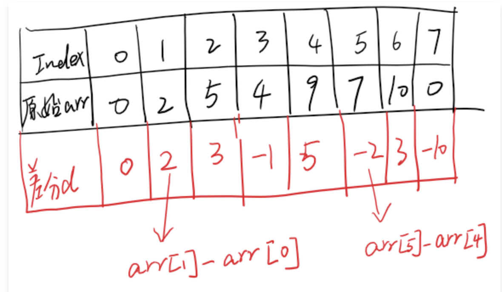

# 链表

## 反转链表

```go
// 迭代版本
func reverseList1(head *ListNode) *ListNode {
    var prev *ListNode
    curr := head
    for curr != nil {
        next := curr.Next
        curr.Next = prev
        prev = curr
        curr = next
    }
    return prev
}

// 递归版本
func reverseList2(head *ListNode) *ListNode {
    if head == nil || head.Next == nil {
        return head
    }
    newHead := reverseList(head.Next)
    head.Next.Next = head
    head.Next = nil
    return newHead
}
```


# 区间问题

- 数组不变，求区间和: 前缀和
- 数组不变，求区间中最大最小值: ST表、线段树
- 多次修改某个数(单点)，多次求区间和: 树状数组
- 多次修改某个区间，输出最终结果(只计算一次): 差分
- 多次修改某个区间，多次求区间和: 线段树(代码最多，只在这种不得不使用的场景使用)
- 多次修改某个区间变成同一个数, 多次求区间和: 树状数组

## 修改数组中的单点值并多次查询区间

#树状数组

```go
type NumArray struct {
	nums, tree []int
}

func Constructor(nums []int) NumArray {
	tree := make([]int, len(nums)+1)
	na := NumArray{nums, tree}
	for i, num := range nums {
		na.add(i+1, num)
	}
	return na
}

func (na *NumArray) add(index, val int) {
	for ; index < len(na.tree); index += index & -index {
		na.tree[index] += val
	}
}

func (na *NumArray) prefixSum(index int) (sum int) {
	//for ; index > 0; index &= index - 1 {
	for; index > 0; index -= index & -index {
		sum += na.tree[index]
	}
	return
}

func (na *NumArray) Update(index, val int) {
	na.add(index+1, val-na.nums[index])
	na.nums[index] = val
}

func (na *NumArray) SumRange(left, right int) int {
	return na.prefixSum(right+1) - na.prefixSum(left)
}
```

## 矩阵多次查询

- 矩阵中有灯，能够照亮同一行、列以及两条对角线上的灯
- 每次查询过后，如果当前位置是灯,那么当前以及相邻的8个位置就需要关闭(会影响到其他位置是否亮，因此其他位置是否亮应该动态计算)

使用x、y、x - y、x + y来唯一确定行、列、对角线、反对角线

```go
// lamps: 灯的坐标
func gridIllumination(n int, lamps, queries [][]int) []int {
	type pair struct{ x, y int }
	points := map[pair]bool{} // 用来lamps去重
	
	row := map[int]int{} // 行
	col := map[int]int{} // 列
	diagonal := map[int]int{} // 对角线
	antiDiagonal := map[int]int{} // 反对角线
	for _, lamp := range lamps {
		r, c := lamp[0], lamp[1]
		p := pair{r, c}
		if points[p] {
			continue
		}
		points[p] = true
		row[r]++
		col[c]++
		diagonal[r-c]++
		antiDiagonal[r+c]++
	}
	ans := make([]int, len(queries))
	for i, query := range queries {
		r, c := query[0], query[1]
		if row[r] > 0 || col[c] > 0 || diagonal[r-c] > 0 || antiDiagonal[r+c] > 0 {
			ans[i] = 1 // 说明当前是会被照亮的
		}
		
		for x := r-1; x <= r+1; x++ {
			for y := c-1; y <= c+1; y++ {
				if x < 0 || y < 0 || x >= n || y >= n || !points[pair{x,y}] {
					continue
				}
				
				delete(points, pair{x, y})
				row[x]--
				col[y]--
				diagonal[x-y]--
				antiDiagonal[x+y]--
			}
		}
	}
	return ans
}
```
## 2055蜡烛之间的盘子

由 `* |` 组成的字符串，查询一个区间里蜡烛之间的盘子数量

#前缀和

```go
func platesBetweenCandles(s string, queries [][]int) []int {
	n := len(s)
	preSum := make([]int, n) // 0...i中盘子的数量
	left := make([]int, n) // 离i最近的蜡烛下标
	
	sum, l := 0, -1
	for i, ch := range s {
		if ch == '*' {
			sum++
		} else {
			l = i
		}
		preSum[i] = sum
		left[i] = l
	}
	
	right := make([]int, n) // i右边最近的蜡烛下标
	for i, r := n-1, -1; i >= 0; i-- {
		if s[i] == '|' {
			r = i
		}
		right[i] = r
	}
	
	ans := make([]int, len(queries))
	for i, q := range queries {
		x, y := right[q[0]], left[q[1]]
		if x >= 0 && y >= 0 && x < y {
			ans[i] = preSum[y] - preSum[x]
		}
	}
	return ans
}
```
# 递增序列

## 递增的三元子序列

贪心，遍历过程中维护a, b两个值(满足a<b)，并且要让其尽可能小，这样后面的值c才能更有机会与a、b组成`a<b<c`

```go
func increasingTriplet(nums []int) bool {
	n := len(nums)
	if n < 3 {
		return false
	}
	first, second := nums[0], math.MaxInt32
	for i := 1; i < n; i++ {
		num := nums[i]
		if num > second {
			return true
		} else if num > first {
			second = num
		} else {
			first = num
		}
	}
	return false
}
```

# 差分数组

求解区间问题，有些场景下与动态开点线段树作用类似，不过差分数组时间复杂度是`O(n^2)`

可以用差分数组求出数列前缀和，能够快速处理区间加减操作,用于区间频繁修改，询问区间和问题。



## 1109. 航班预订统计

n个航班，一个数组数据，包含了i到j这个区间的航班预定了位置的数量

```go
func corpFlightBookings(bookings [][]int, n int) []int {
  nums := make([]int, n)

  for _, book := range bookings {
    nums[book[0]-1] += book[2]
    if book[1] < n {
      nums[book[1]] -= book[2]
    }
  }

  for i := 1; i < n; i++ {
    nums[i] += nums[i-1]
  }
  return nums
}
```
# 链表

## 循环有序链表插入值

如果node为nil，直接构造新的node返回，如果node.Next为本身，说明链表中只有这一个元素，在链表后添加

使用cur，next两个指针表示当前的遍历情况

1、当val在cur，next值之间，进行插入
2、当cur.val > next.val(说明是循环节点),如果val>cur.val，或者val<next.val那么在这之间进行插入

其他情况cur与next都往后移

如果遍历完都没有找到合适的位置那么说明链表中所有的元素值是相同的

```go
func insert(head *Node, insertVal int) *Node {
	node := &Node{Val: insertVal}
	if head == nil {
		node.Next = node
		return node
	}
	if head.Next == head {
		head.Next = node
		node.Next = head
		return head
	}
	
	curr, next := head, head.Next
	for next != head {
		if insertVal >= curr.Val && insertVal <= next.Val {
			break
		}
		if curr.Val > next.Val {
			if insertVal > curr.Val || insertVal < next.Val {
				break
			}
		}
		curr = curr.Next
		next = next.Next
	}
	curr.Next = node
	node.Next = next
	return head
}
```
# 栈模拟
## 表示文件结构的字符串寻找最长的绝对路径

`dir\n\tsubdir1\n\t\tfile1.ext\n\t\tsubsubdir1\n\tsubdir2\n\t\tsubsubdir2\n\t\t\tfile2.ext` 。`\n` 和 `\t` 分别是换行符和制表符。

如果是文件的话会有`.`

```go
func lengthLongestPath(input string) (ans int) {
    st := []int{}
    for i, n := 0, len(input); i < n; {
        // 检测当前文件的深度
        depth := 1
        for ; i < n && input[i] == '\t'; i++ {
            depth++
        }

        // 统计当前文件名的长度
        length, isFile := 0, false
        for ; i < n && input[i] != '\n'; i++ {
            if input[i] == '.' {
                isFile = true
            }
            length++
        }
        i++ // 跳过换行符
		
		if depth <= len(st) {
			st = st[:len(st)-(len(st) - depth + 1)]
		}
        if len(st) > 0 {
            length += st[len(st)-1] + 1
        }
        if isFile {
            ans = max(ans, length)
        } else {
            st = append(st, length)
        }
    }
    return
}

func max(a, b int) int {
    if b > a {
        return b
    }
    return a
}
```